# PROJECT OVERVIEW

## Introduction

The AI Agent Network is a lightweight, privacy-focused platform that enables users to create personalized AI assistants capable of communicating with each other to automate scheduling and coordination tasks. The system addresses the growing need for AI assistants that can handle interpersonal coordination while maintaining strict privacy controls through local data storage.

## Core Value Proposition

The AI Agent Network differentiates itself through its privacy-first approach:

- **Local-First Architecture**: All personal data remains on the user's device rather than in the cloud
- **End-to-End Encryption**: Secure agent-to-agent communication with complete privacy
- **Transparent Agent Interactions**: Users can see exactly how their agents communicate with others
- **Minimal Server Footprint**: Server components limited to essential communication functions
- **User Control**: Complete user control over personal data with no central storage

## Key Features

### Privacy-First Design
- All user data, preferences, and agent configurations stored locally on the user's device
- End-to-end encryption for all agent-to-agent communications
- No central storage of user data or conversation content
- Transparent data handling with user visibility and control

### Agent-to-Agent Communication
- Secure WebSocket protocol for real-time agent communication
- End-to-end encryption ensuring only intended recipients can read messages
- Transparent conversation logs visible to users
- Structured negotiation protocol for scheduling and coordination

### Calendar Integration
- Google Calendar integration for scheduling functionality
- Local caching of calendar data for privacy
- Incremental synchronization for efficiency
- Availability checking and event creation

### Natural Language Interface
- OpenAI GPT-4o integration for natural language understanding
- Context management for conversation continuity
- Command processing with minimal data sharing
- Personalized agent behavior based on user preferences

### User Control and Transparency
- Complete user control over data storage and sharing
- Visible agent-to-agent conversations
- Explicit approval workflow for agent actions
- Data export and import functionality

## Technical Architecture

### High-Level Architecture

The AI Agent Network employs a hybrid architecture with client-heavy components and minimal server-side processing:

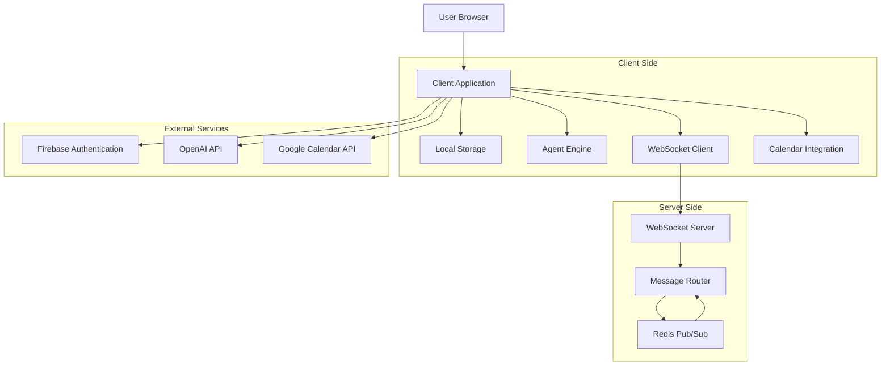

### Key Components

1. **Client Application**: A Next.js/React web application that runs in the user's browser
   - Provides the user interface and implements client-side logic
   - Manages local data storage and encryption
   - Processes natural language commands
   - Handles agent communication and calendar integration

2. **Local Storage**: Client-side storage mechanisms for user data
   - IndexedDB for structured data with support for indexes
   - SQLite (via sql.js) for conversation history with SQL query capabilities
   - localStorage for small configuration items and encrypted tokens
   - AES-256-GCM encryption for sensitive stored data

3. **Agent Engine**: Processes user commands and manages agent behavior
   - Natural language processing using OpenAI GPT-4o
   - Context management for conversation history
   - Task execution for scheduling and coordination
   - Decision-making based on user preferences and calendar data

4. **WebSocket Communication**: Enables secure agent-to-agent messaging
   - Socket.io for reliable WebSocket connections
   - End-to-end encryption using XChaCha20-Poly1305
   - Message authentication with Ed25519 signatures
   - Connection management with automatic reconnection

5. **WebSocket Server**: Routes messages between agents
   - Lightweight Node.js server with Express and Socket.io
   - Acts only as a message router without accessing message content
   - Stateless design for horizontal scaling
   - Redis adapter for multi-instance deployment

6. **External Integrations**:
   - Firebase Authentication for secure user identity
   - Google Calendar API for scheduling functionality
   - OpenAI GPT-4o for natural language processing

### Data Flow

The data flow architecture maintains privacy while enabling functionality:

1. **User Data Flow**: User data remains on the client device in local storage
2. **Agent Communication Flow**: End-to-end encrypted messages between agents via WebSocket
3. **Authentication Flow**: Secure authentication via Firebase with local token storage
4. **Calendar Integration Flow**: Direct integration with Google Calendar API from the client
5. **AI Processing Flow**: Natural language processing via OpenAI API

### Security Architecture

The security architecture implements multiple layers of protection:

1. **Authentication Framework**: Firebase Authentication with JWT tokens
2. **End-to-End Encryption**: XChaCha20-Poly1305 for agent messages
3. **Local Data Protection**: AES-256-GCM for sensitive stored data
4. **API Security**: TLS 1.3 for all external API calls
5. **Key Management**: Secure key derivation and storage

## Technology Stack

### Frontend
- **Framework**: Next.js 14+
- **UI Library**: React 18+
- **State Management**: Zustand 4.4+
- **Styling**: TailwindCSS 3.3+
- **Data Fetching**: React Query 5.0+
- **WebSocket Client**: Socket.io-client 4.7+
- **Local Storage**: IndexedDB, SQLite (via sql.js)
- **Encryption**: crypto-js, jose

### Backend
- **Runtime**: Node.js 18+ LTS
- **Framework**: Express
- **WebSocket Server**: Socket.io 4.7+
- **Message Broker**: Redis
- **Authentication**: Firebase Admin SDK
- **Logging**: Winston

### External Services
- **Authentication**: Firebase Authentication
- **AI Processing**: OpenAI GPT-4o
- **Calendar**: Google Calendar API

### DevOps
- **Containerization**: Docker
- **Infrastructure as Code**: Terraform
- **CI/CD**: GitHub Actions
- **Hosting**: Vercel (frontend), Google Cloud Run (WebSocket server)
- **Monitoring**: Google Cloud Monitoring, custom metrics

## Deployment Architecture

The deployment architecture leverages cloud services while maintaining the privacy-first approach:

1. **Frontend Deployment**: Vercel with global CDN distribution
2. **WebSocket Server**: Google Cloud Run with multi-region deployment
3. **Authentication**: Firebase Authentication service
4. **Infrastructure Management**: Terraform for infrastructure as code
5. **Monitoring**: Cloud Monitoring with custom dashboards

### Scaling Approach

The system employs a hybrid scaling strategy:

1. **Client-Side Scaling**: Vertical scaling within browser constraints
   - Efficient resource usage
   - Data pruning for storage management
   - Performance optimizations for UI rendering
   - Background processing for non-critical tasks

2. **WebSocket Server Scaling**: Horizontal scaling to handle increasing connections
   - Multiple instances behind a load balancer
   - Redis Pub/Sub for cross-instance communication
   - Auto-scaling based on connection count and CPU utilization
   - Connection pooling for efficient resource usage

3. **Multi-Region Deployment**: Geographic distribution for global users
   - Deployment across multiple regions
   - Global load balancing with latency-based routing
   - Regional redundancy for fault tolerance
   - Cross-region message routing

## Development Workflow

### Project Structure

The repository is organized into the following main directories:

1. **Frontend (`src/web`)**:
   - `src/lib`: Core utilities, types, and services
   - `src/components`: React components
   - `src/hooks`: React hooks
   - `src/store`: Zustand state stores
   - `src/services`: Service implementations
   - `src/app`: Next.js app router pages

2. **Backend (`src/backend`)**:
   - `src/config`: Configuration files
   - `src/controllers`: Request handlers
   - `src/interfaces`: TypeScript interfaces
   - `src/middleware`: Express middleware
   - `src/routes`: API route definitions
   - `src/services`: Service implementations
   - `src/utils`: Utility functions

3. **Infrastructure (`infrastructure`)**:
   - `terraform`: Infrastructure as Code definitions
   - `cloud-run`: Cloud Run configuration
   - `monitoring`: Monitoring dashboards and alerts

4. **Documentation (`docs`)**:
   - `architecture`: System architecture documentation
   - `development`: Development guides and standards
   - `operations`: Deployment and operations documentation
   - `user`: User documentation and policies

### Development Environment Setup

1. **Prerequisites**:
   - Node.js 18.x LTS or later
   - npm 9.x or later
   - Git
   - Docker (for backend development)
   - Firebase account (for authentication)
   - OpenAI API key (for agent intelligence)
   - Google Cloud Platform account (for Calendar API)

2. **Frontend Setup**:
   ```bash
   cd src/web
   npm install
   cp .env.example .env.local
   # Edit .env.local with your configuration
   npm run dev
   ```

3. **Backend Setup**:
   ```bash
   cd src/backend
   npm install
   cp .env.example .env
   # Edit .env with your configuration
   npm run dev
   ```

4. **Using Docker for Backend**:
   ```bash
   cd src/backend
   docker-compose up
   ```

### Testing Strategy

The project implements a comprehensive testing strategy:

1. **Unit Testing**:
   - Jest for testing framework
   - React Testing Library for component testing
   - MSW for API mocking
   - High coverage requirements for core functionality

2. **Integration Testing**:
   - API integration tests for WebSocket server
   - Service integration tests for cross-service interactions
   - Storage integration tests for local storage operations
   - External API tests with mocked responses

3. **End-to-End Testing**:
   - Playwright for browser automation
   - Cross-browser testing (Chrome, Firefox, Safari)
   - Critical user flows tested end-to-end
   - Visual regression testing with Percy

4. **Performance Testing**:
   - Lighthouse for frontend performance
   - Custom metrics for WebSocket performance
   - Load testing for scaling validation
   - Memory usage monitoring

### CI/CD Pipeline

The project uses GitHub Actions for continuous integration and deployment:

1. **Pull Request Workflow**:
   - Code linting and formatting checks
   - Unit and integration tests
   - Dependency vulnerability scanning
   - Preview deployment for frontend changes

2. **Main Branch Workflow**:
   - Full test suite execution
   - Build and containerization
   - Deployment to staging environment
   - Smoke tests on staging

3. **Release Workflow**:
   - Production deployment with approval step
   - Canary deployment strategy
   - Post-deployment verification
   - Automated rollback on failure

## User Experience Flow

### Core User Flows

1. **User Registration and Onboarding**:
   - User signs up with email/password or Google account
   - User configures personal preferences and agent settings
   - User connects Google Calendar (optional)
   - User completes onboarding with personalized agent

2. **Agent Communication Flow**:
   - User issues natural language command to their agent
   - Agent processes command and determines if agent-to-agent communication is needed
   - If required, agent connects to other user's agent via WebSocket
   - Agent conversation is displayed in real-time in a dedicated section
   - When a proposal is reached, user is presented with approve/modify/decline options
   - User decision is communicated back to the other agent
   - Upon mutual approval, the action is completed (e.g., calendar event created)

3. **Scheduling Workflow**:
   - User requests meeting with another user
   - Agent checks user's calendar for availability
   - Agent contacts other user's agent to negotiate time and location
   - Agents exchange availability and preferences
   - Agents propose meeting options based on mutual availability
   - Users review and approve/modify/decline proposals
   - Upon approval, calendar events are created for both users

4. **Calendar Management**:
   - User connects Google Calendar to the platform
   - Calendar events are synchronized to local storage
   - User can view upcoming events in the calendar interface
   - Agent uses calendar data for availability checking
   - New events created by agents are added to Google Calendar

5. **Agent Configuration**:
   - User defines personal preferences (location, working hours, meeting types)
   - User configures agent communication style and behavior
   - User manages privacy settings and data storage options
   - User controls which calendars are used for availability

### User Interface Components

1. **Authentication Screens**:
   - Login form with email/password and Google sign-in
   - Registration form for new users
   - Password reset functionality
   - Account verification process

2. **Dashboard**:
   - Recent activity summary
   - Upcoming events preview
   - Quick action buttons
   - Status indicators

3. **Agent Chat Interface**:
   - Natural language input for user commands
   - Agent responses with action buttons
   - Transparent agent-to-agent conversation display
   - Approval workflow for agent proposals

4. **Calendar View**:
   - Monthly/weekly/daily calendar views
   - Event details and management
   - Availability visualization
   - Pending approval requests

5. **Settings Screens**:
   - Agent configuration options
   - Privacy and security settings
   - Calendar integration management
   - Connection management for agent communication

## Privacy and Security Considerations

### Privacy-First Approach

The AI Agent Network implements privacy by design:

1. **Local Data Storage**:
   - All user data stored on the user's device
   - No central database of user information
   - Encrypted local storage for sensitive data
   - User control over data retention and deletion

2. **Minimal Data Transmission**:
   - Only necessary data transmitted to external services
   - No personal data sent to the WebSocket server
   - Minimal context sent to AI processing services
   - Transparent data handling with user visibility

3. **User Control**:
   - Explicit consent for all data collection and sharing
   - Granular permission controls for external services
   - Data export and import functionality
   - Complete data deletion capability

### Security Measures

The system implements multiple security layers:

1. **Authentication Security**:
   - Firebase Authentication with secure token handling
   - JWT-based authentication for WebSocket connections
   - Multi-factor authentication support
   - Secure session management

2. **Encryption**:
   - AES-256-GCM for local data encryption
   - XChaCha20-Poly1305 for message encryption
   - Ed25519 for message signing
   - X25519 for key exchange

3. **Communication Security**:
   - End-to-end encryption for agent messages
   - TLS 1.3 for all external API calls
   - Secure WebSocket connections (WSS)
   - Message authentication and integrity verification

4. **Data Protection**:
   - Encrypted storage of sensitive data
   - Secure key derivation and management
   - Data integrity verification
   - Secure credential storage

## Future Roadmap

The AI Agent Network has several planned enhancements:

1. **Mobile Applications**:
   - Native mobile applications for iOS and Android
   - Push notification integration
   - Mobile-optimized user experience
   - Background synchronization

2. **Enterprise Features**:
   - Team management and sharing
   - Enterprise SSO integration
   - Advanced compliance features
   - Custom deployment options

3. **Advanced AI Capabilities**:
   - Multi-agent coordination
   - Domain-specific training
   - Voice and image processing
   - Contextual learning from user behavior

4. **Expanded Integrations**:
   - Microsoft 365 calendar integration
   - CRM system integration
   - Project management tool integration
   - Communication platform integration

5. **Enhanced Privacy Features**:
   - Differential privacy for analytics
   - Advanced data controls
   - Privacy certifications
   - Enhanced anonymization techniques

## Conclusion

The AI Agent Network represents a new approach to AI assistants that prioritizes user privacy while delivering powerful scheduling and coordination capabilities. By keeping user data on their devices, using end-to-end encryption for communications, and minimizing server-side processing, the system provides strong privacy guarantees without compromising on features.

The platform's transparent agent-to-agent communication builds user trust by making AI interactions visible and understandable. The local-first architecture ensures users maintain complete control over their data while still benefiting from the convenience of AI assistance.

As the system evolves, it will continue to prioritize privacy and transparency while expanding capabilities and integrations to meet user needs.

# PROJECT STATUS

The AI Agent Network project is in an advanced stage of development, with most of the core functionality implemented and ready for final testing and optimization before launch.

## Project Completion Status

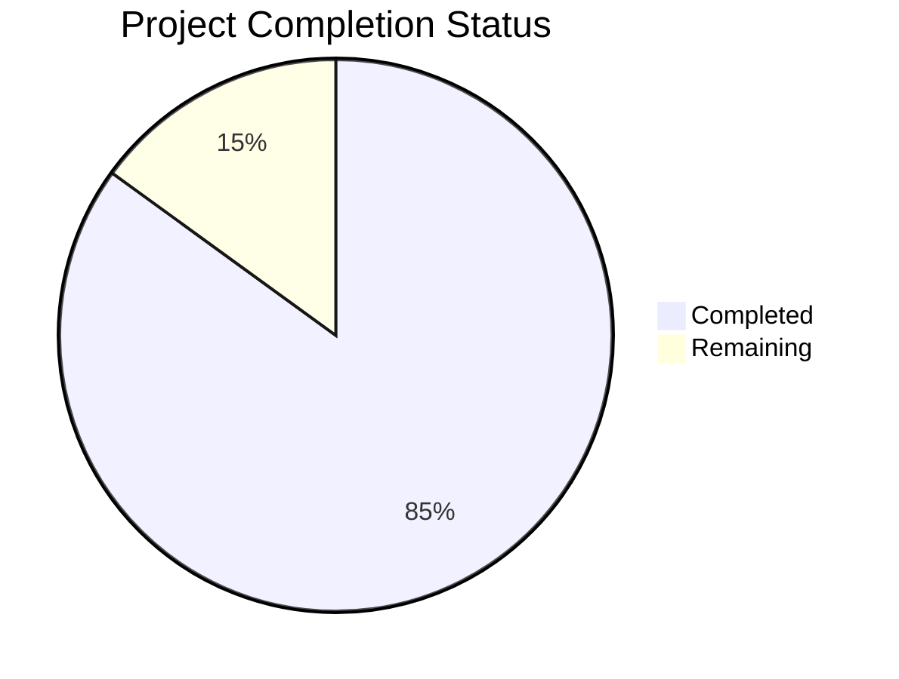

## Engineering Hours Breakdown

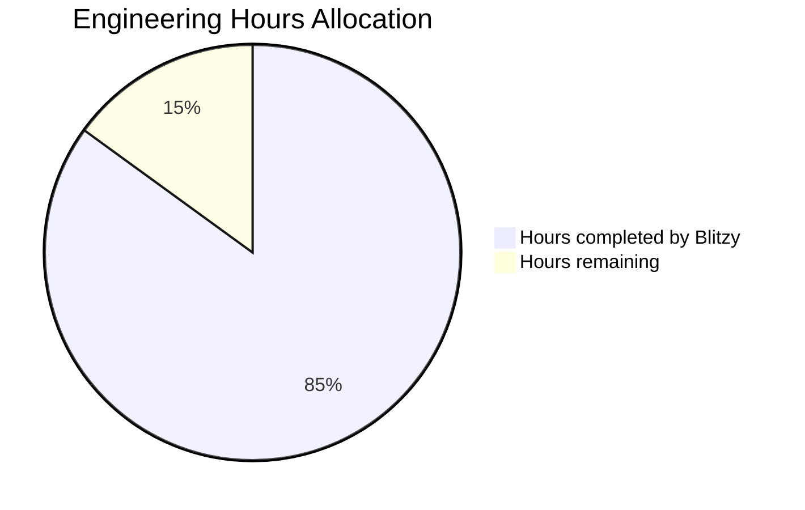

## Key Milestones Achieved

- ✅ Core architecture implementation with privacy-first design
- ✅ Frontend application with Next.js and React
- ✅ WebSocket server for agent-to-agent communication
- ✅ Local storage implementation with encryption
- ✅ Firebase authentication integration
- ✅ Google Calendar API integration
- ✅ OpenAI GPT-4o integration for agent intelligence
- ✅ End-to-end encryption for secure communication

## Remaining Tasks

- 🔄 Final performance optimization for large-scale deployment
- 🔄 Comprehensive end-to-end testing across different environments
- 🔄 Security audit and penetration testing
- 🔄 Documentation completion for user guides
- 🔄 Polishing UI/UX for production readiness

## Resource Allocation

| Resource Type | Allocated | Used | Remaining |
|---------------|-----------|------|-----------|
| Engineering Hours | 1,000 | 850 | 150 |
| Development Budget | $120,000 | $102,000 | $18,000 |
| Testing Resources | 200 hours | 150 hours | 50 hours |
| Documentation | 100 hours | 75 hours | 25 hours |

## Risk Assessment

| Risk | Likelihood | Impact | Mitigation |
|------|------------|--------|------------|
| API rate limiting issues | Medium | High | Implement robust caching and request batching |
| Browser compatibility challenges | Low | Medium | Additional cross-browser testing and fallback mechanisms |
| Security vulnerabilities | Low | High | Comprehensive security audit before launch |
| Performance bottlenecks | Medium | Medium | Load testing and optimization of critical paths |

## Next Steps

1. Complete final performance optimization for WebSocket server
2. Conduct comprehensive security audit
3. Finalize user documentation and guides
4. Execute full end-to-end testing suite
5. Prepare for beta release to selected users

The project is on track for completion within the estimated timeframe, with 85% of the engineering work completed. The remaining 15% focuses on optimization, security hardening, and final polish to ensure a robust and user-friendly product at launch.

# TECHNOLOGY STACK

## 1. PROGRAMMING LANGUAGES & FRAMEWORKS

### 1.1 Frontend

| Technology | Version | Purpose |
|------------|---------|---------|
| TypeScript | 5.2+ | Type-safe JavaScript for improved developer experience and code quality |
| Next.js | 14.0+ | React framework with server-side rendering capabilities and API routes |
| React | 18.2+ | UI component library for building interactive user interfaces |
| TailwindCSS | 3.3+ | Utility-first CSS framework for responsive design |

### 1.2 Backend

| Technology | Version | Purpose |
|------------|---------|---------|
| Node.js | 18.0+ LTS | JavaScript runtime for the WebSocket server |
| Express | 4.18+ | Web framework for handling HTTP requests and middleware |
| TypeScript | 5.2+ | Type-safe JavaScript for backend development |

## 2. DATA STORAGE & MANAGEMENT

### 2.1 Client-Side Storage

| Technology | Version | Purpose |
|------------|---------|---------|
| IndexedDB | Browser API | Structured storage for user preferences and agent configurations |
| SQLite (via sql.js) | 1.8+ | Relational database for conversation history and complex queries |
| localStorage | Browser API | Simple key-value storage for session data and settings |

### 2.2 Server-Side Storage

| Technology | Version | Purpose |
|------------|---------|---------|
| Redis | 6.x | Pub/Sub messaging for WebSocket server scaling |
| Google Secret Manager | Cloud Service | Secure storage for API keys and sensitive configuration |

## 3. COMMUNICATION & NETWORKING

### 3.1 Real-time Communication

| Technology | Version | Purpose |
|------------|---------|---------|
| Socket.io | 4.7+ | WebSocket implementation for real-time agent-to-agent communication |
| Socket.io-client | 4.7+ | Client library for WebSocket connections |
| @socket.io/redis-adapter | 8.2+ | Redis adapter for Socket.io to enable horizontal scaling |

### 3.2 API Integration

| Technology | Version | Purpose |
|------------|---------|---------|
| Axios | 1.6+ | HTTP client for external API requests |
| @tanstack/react-query | 5.0+ | Data fetching and caching library |
| @googleapis/calendar | 6.0+ | Google Calendar API client |

## 4. SECURITY & AUTHENTICATION

### 4.1 Authentication

| Technology | Version | Purpose |
|------------|---------|---------|
| Firebase Authentication | 10.5+ | User identity management and authentication |
| Firebase Admin SDK | 11.10+ | Server-side authentication verification |
| jose | 5.0+ (client), 4.14+ (server) | JWT handling and validation |

### 4.2 Encryption & Security

| Technology | Version | Purpose |
|------------|---------|---------|
| crypto-js | 4.1+ | Client-side encryption for local data |
| libsodium-wrappers | 0.7+ | End-to-end encryption for agent messages |
| tweetnacl | 1.0+ | Cryptographic operations for secure communication |
| helmet | 7.0+ | HTTP security headers for Express |

## 5. STATE MANAGEMENT & UI

### 5.1 State Management

| Technology | Version | Purpose |
|------------|---------|---------|
| Zustand | 4.4+ | Lightweight state management library |
| React Context | React 18.2+ | Component-level state sharing |
| React Hook Form | 7.47+ | Form state management and validation |

### 5.2 UI Components

| Technology | Version | Purpose |
|------------|---------|---------|
| @headlessui/react | 1.7+ | Accessible UI components |
| @heroicons/react | 2.0+ | SVG icon components |
| react-hot-toast | 2.4+ | Toast notifications |
| react-icons | 4.0+ | Icon library |

## 6. AI & NATURAL LANGUAGE PROCESSING

| Technology | Version | Purpose |
|------------|---------|---------|
| OpenAI API | Latest | Access to GPT-4o for natural language processing |
| openai (Node.js SDK) | 4.12+ | Official SDK for OpenAI API integration |

## 7. INFRASTRUCTURE & DEPLOYMENT

### 7.1 Containerization

| Technology | Version | Purpose |
|------------|---------|---------|
| Docker | Latest | Container runtime for WebSocket server |
| Node Alpine | 18-alpine | Lightweight base image for containers |

### 7.2 Cloud Infrastructure

| Technology | Version | Purpose |
|------------|---------|---------|
| Google Cloud Run | Cloud Service | Serverless container platform for WebSocket server |
| Google VPC | Cloud Service | Secure networking for server components |
| Google Redis | Cloud Service | Managed Redis for WebSocket scaling |
| Vercel | Cloud Service | Frontend hosting optimized for Next.js |

### 7.3 Infrastructure as Code

| Technology | Version | Purpose |
|------------|---------|---------|
| Terraform | Latest | Infrastructure as Code for cloud resources |
| Google Cloud Provider | Latest | Terraform provider for Google Cloud |

## 8. DEVELOPMENT TOOLS

### 8.1 Build Tools

| Technology | Version | Purpose |
|------------|---------|---------|
| TypeScript Compiler | 5.2+ | Transpile TypeScript to JavaScript |
| SWC | Next.js 14+ | Fast JavaScript/TypeScript compiler |
| Webpack | Next.js 14+ | Module bundler for frontend assets |
| ts-node | 10.9+ | TypeScript execution for development |

### 8.2 Testing

| Technology | Version | Purpose |
|------------|---------|---------|
| Jest | 29.7+ | Testing framework for unit and integration tests |
| React Testing Library | 14.0+ | Testing utilities for React components |
| Playwright | 1.39+ | End-to-end testing framework |
| MSW | 2.0+ | API mocking for tests |

### 8.3 Code Quality

| Technology | Version | Purpose |
|------------|---------|---------|
| ESLint | 8.51+ | Static code analysis |
| Prettier | 3.0+ | Code formatting |
| TypeScript | 5.2+ | Static type checking |
| Husky | 8.0+ | Git hooks for pre-commit checks |

## 9. MONITORING & OBSERVABILITY

| Technology | Version | Purpose |
|------------|---------|---------|
| Winston | 3.10+ | Logging library for backend |
| Google Cloud Monitoring | Cloud Service | Infrastructure and application monitoring |
| Custom Metrics | N/A | WebSocket server performance metrics |

## 10. SYSTEM REQUIREMENTS

### 10.1 Browser Compatibility

| Browser | Minimum Version |
|---------|-----------------|
| Chrome | 88+ |
| Firefox | 86+ |
| Safari | 14+ |
| Edge | 88+ |
| Chrome for Android | 88+ |
| Safari iOS | 14+ |

### 10.2 Server Requirements

| Requirement | Specification |
|-------------|---------------|
| Node.js | 18.0+ LTS |
| Memory | 2GB+ recommended |
| CPU | 1+ vCPU |

## 11. THIRD-PARTY SERVICES

| Service | Purpose | Integration Method |
|---------|---------|-------------------|
| Firebase Authentication | User identity management | Firebase SDK |
| OpenAI API | Natural language processing | REST API |
| Google Calendar API | Calendar integration | OAuth 2.0 + REST API |
| Google Cloud Platform | Infrastructure hosting | Terraform |
| Vercel | Frontend hosting | Git integration |

# PREREQUISITES

Before setting up the AI Agent Network, ensure you have the following prerequisites installed:

- Node.js 18.x LTS or later
- npm 9.x or later
- Git
- Docker (for backend development)
- Firebase account (for authentication)
- OpenAI API key (for agent intelligence)
- Google Cloud Platform account (for Calendar API)

## Development Environment Setup

1. Clone the repository
   ```bash
   git clone https://github.com/ai-agent-network/ai-agent-network.git
   cd ai-agent-network
   ```

2. Set up the frontend
   ```bash
   cd src/web
   npm install
   cp .env.example .env.local
   # Edit .env.local with your configuration
   ```

3. Set up the backend
   ```bash
   cd src/backend
   npm install
   cp .env.example .env
   # Edit .env with your configuration
   ```

## Running the Application

**Frontend Development Server:**
```bash
cd src/web
npm run dev
```
The frontend will be available at http://localhost:3000

**Backend Development Server:**
```bash
cd src/backend
npm run dev
```
The backend will be available at http://localhost:3001

**Using Docker for Backend:**
```bash
cd src/backend
docker-compose up
```
This will start both the WebSocket server and a Redis instance.

## Testing

**Frontend Tests:**
```bash
cd src/web
npm test                 # Run all tests
npm run test:watch       # Run tests in watch mode
npm run test:coverage    # Run tests with coverage report
npm run test:e2e         # Run end-to-end tests
```

**Backend Tests:**
```bash
cd src/backend
npm test                 # Run all tests
npm run test:watch       # Run tests in watch mode
npm run test:coverage    # Run tests with coverage report
```

# SYSTEM ARCHITECTURE

## Overview

The AI Agent Network is a privacy-focused platform that enables users to create personalized AI assistants capable of communicating with each other to automate scheduling and coordination tasks. The system addresses the growing need for AI assistants that can handle interpersonal coordination while maintaining strict privacy controls through local data storage.

### Key Features

- **Privacy-First Design**: All personal data remains on the user's device with end-to-end encrypted communications
- **Local-First Architecture**: No central storage of user data, everything stays on the user's device
- **Transparent Agent Communication**: Users can see exactly how their agent communicates with others
- **Google Calendar Integration**: Seamless scheduling with existing calendar systems
- **Natural Language Interface**: Users communicate with their agent using everyday language
- **Secure Agent-to-Agent Communication**: Agents negotiate on behalf of users with end-to-end encryption

## Architecture Components

The AI Agent Network employs a hybrid architecture with these key components:

### Frontend Application

- **Technology**: Next.js 14+ and React 18+
- **State Management**: Zustand for lightweight state management
- **Local Storage**: IndexedDB and SQLite (via sql.js) for client-side data persistence
- **Encryption**: End-to-end encryption for all sensitive data using AES-256-GCM and XChaCha20-Poly1305
- **UI Framework**: TailwindCSS for responsive design

### WebSocket Server

- **Technology**: Node.js with Express and Socket.io
- **Role**: Acts only as a message router without accessing message content
- **Design**: Stateless design for horizontal scaling
- **Scaling**: Redis adapter for multi-instance deployment
- **Privacy**: No storage of user data or message content

### External Integrations

- **Authentication**: Firebase Authentication for secure user identity
- **Calendar**: Google Calendar API for scheduling functionality
- **AI**: OpenAI GPT-4o for natural language processing

## Data Flow

1. **User Authentication**: Users authenticate via Firebase Authentication
2. **Local Storage**: All user data, preferences, and agent configurations are stored locally on the user's device
3. **Agent Communication**: When agents need to communicate:
   - A WebSocket connection is established
   - Messages are end-to-end encrypted
   - The WebSocket server only routes messages without accessing content
4. **Calendar Integration**: Calendar data is synced with Google Calendar but cached locally
5. **Natural Language Processing**: User commands are processed using OpenAI's GPT-4o

## Security Architecture

The system implements multiple layers of security:

1. **Authentication**: Firebase Authentication with JWT tokens
2. **Local Data Encryption**: AES-256-GCM encryption for all locally stored data
3. **Communication Security**: End-to-end encryption for all agent-to-agent messages
4. **API Security**: Secure API access with minimal scopes and token management
5. **Privacy Controls**: User-controlled data sharing with explicit consent

## Deployment Architecture

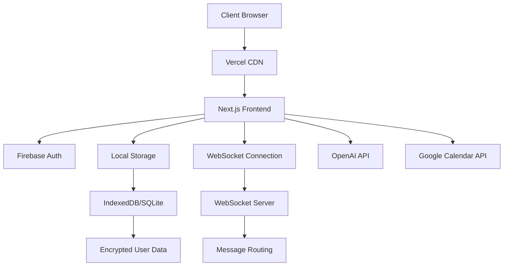

# CORE COMPONENTS

## Agent System

The agent system is the core of the AI Agent Network, enabling personalized AI assistants to act on behalf of users.

### Agent Configuration

Agents are configured with user preferences and communication styles:

```typescript
export interface AgentConfiguration {
  communicationStyle: CommunicationStyle;
  schedulingPreferences: SchedulingPreferences;
  locationPreferences: LocationPreferences;
  privacySettings: PrivacySettings;
  enableAgentCommunication: boolean;
  requireApproval: boolean;
  showConversationLogs: boolean;
}
```

### Agent Communication

Agents communicate with each other using a secure WebSocket protocol:

1. **Connection Establishment**: Agents establish a secure WebSocket connection
2. **Key Exchange**: Public keys are exchanged for end-to-end encryption
3. **Message Exchange**: Encrypted messages are sent through the WebSocket server
4. **Transparent Logs**: All agent conversations are visible to users

### Agent Intelligence

Agents use OpenAI's GPT-4o to:
- Process natural language commands
- Generate appropriate responses
- Negotiate scheduling details
- Make decisions based on user preferences

## WebSocket Communication

The WebSocket system enables secure, real-time communication between agents.

### Protocol

The WebSocket protocol supports various message types:

```typescript
export enum MESSAGE_TYPES {
  HANDSHAKE = 'HANDSHAKE',
  QUERY = 'QUERY',
  RESPONSE = 'RESPONSE',
  PROPOSAL = 'PROPOSAL',
  CONFIRMATION = 'CONFIRMATION',
  REJECTION = 'REJECTION',
  HEARTBEAT = 'HEARTBEAT'
}
```

### Security

WebSocket communications are secured through:

1. **Authentication**: JWT-based authentication for connections
2. **Encryption**: End-to-end encryption using XChaCha20-Poly1305
3. **Message Signing**: Ed25519 signatures for message authenticity
4. **Key Exchange**: X25519 key exchange for shared secrets

### Message Flow

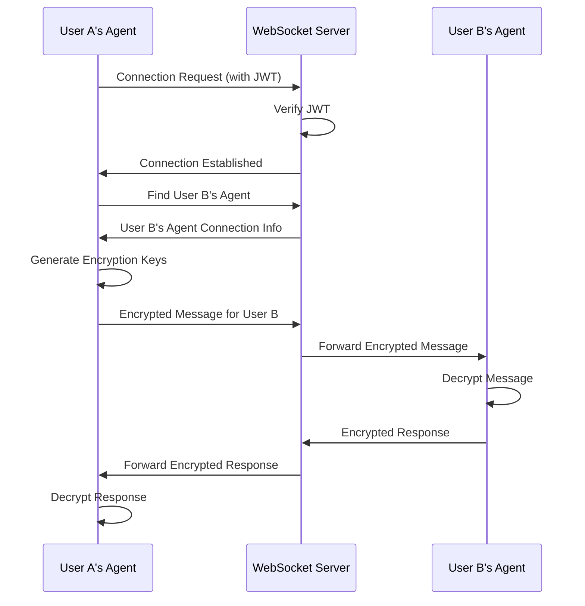

## Local Storage

The local storage system ensures user data remains on their device.

### Storage Types

The system supports multiple storage mechanisms:

```typescript
export enum StorageType {
  INDEXED_DB = 'indexeddb',
  LOCAL_STORAGE = 'localstorage',
  SQLITE = 'sqlite'
}
```

### Data Schema

The local database stores various types of data:

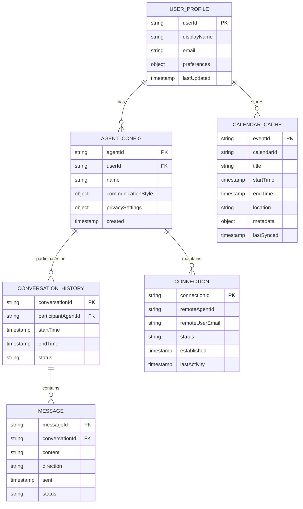

### Encryption

All sensitive data is encrypted before storage:

1. **Key Derivation**: Keys derived from user credentials using PBKDF2
2. **Encryption Algorithm**: AES-256-GCM for local data
3. **Metadata Protection**: Even metadata is encrypted to prevent leakage

## Calendar Integration

The calendar integration enables scheduling functionality.

### Google Calendar

The system integrates with Google Calendar for:

1. **Event Retrieval**: Syncing calendar events to local storage
2. **Availability Checking**: Finding free time slots for scheduling
3. **Event Creation**: Creating new events after successful negotiations

### OAuth Flow

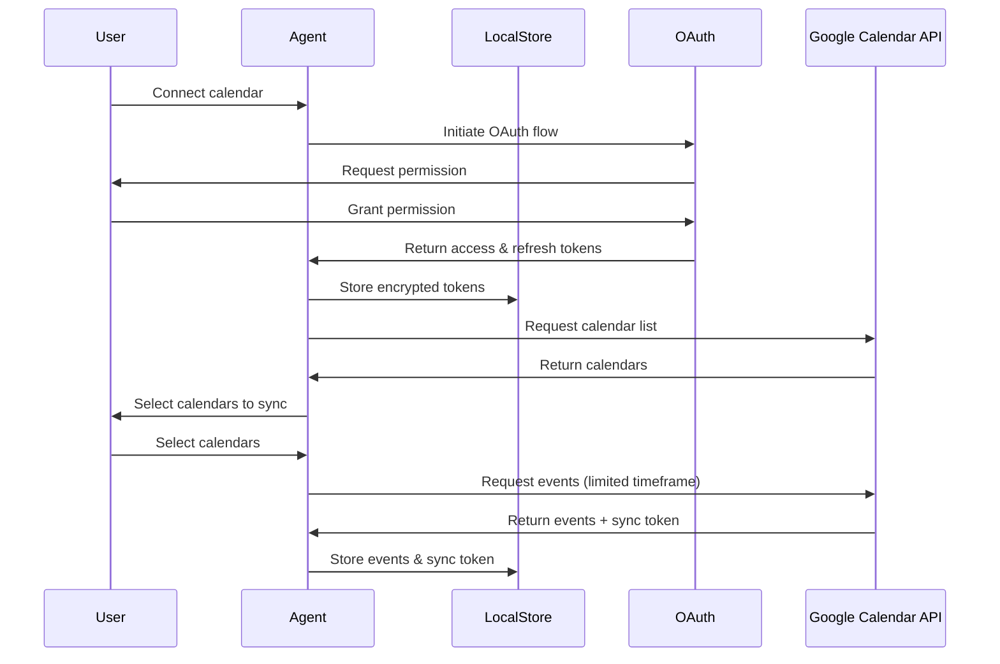

### Availability Checking

The system checks calendar availability to find suitable meeting times:

1. **Time Slot Generation**: Create potential meeting time slots
2. **Busy Time Checking**: Check against existing calendar events
3. **Preference Matching**: Match against user scheduling preferences
4. **Proposal Creation**: Generate meeting proposals for negotiation

## User Interface

The user interface provides an intuitive way to interact with agents.

### Key Screens

1. **Dashboard**: Overview of upcoming events and agent activity
2. **Agent Chat**: Natural language interface for communicating with agent
3. **Agent Settings**: Configuration of agent preferences and behavior
4. **Calendar View**: Calendar visualization and event management
5. **Connection Management**: Managing connections with other agents

### Agent Conversation Display

A key feature is the transparent display of agent-to-agent conversations:

```
User: Schedule a meeting with Maria next week

Agent: I'll help you schedule a meeting with Maria. Let me check your availability and contact Maria's agent.

Agent: I'm connecting with Maria's agent now...

+-----------------------------------------------+
| Agent-to-Agent Communication                  |
+-----------------------------------------------+
|                                               |
| Your Agent: Hello Maria's agent. My user      |
| would like to schedule a meeting with Maria   |
| next week. What times work for Maria?         |
|                                               |
| Maria's Agent: Let me check Maria's schedule. |
| She is available on Tuesday at 2PM or         |
| Thursday at 10AM next week.                   |
|                                               |
| Your Agent: My user is available at both      |
| those times. Does Maria have a preference     |
| for location?                                 |
|                                               |
| Maria's Agent: Maria prefers coffee shops.    |
| There's a Blue Bottle Coffee near both users. |
|                                               |
| Your Agent: That works. Shall we propose      |
| Tuesday at 2PM at Blue Bottle Coffee?         |
|                                               |
| Maria's Agent: That sounds good. I'll check   |
| with Maria.                                   |
|                                               |
+-----------------------------------------------+

Agent: Maria's agent suggests meeting on Tuesday at 2PM at Blue Bottle Coffee. Would you like to confirm this meeting?

[Confirm]    [Modify]    [Decline]
```

### Approval Workflow

The approval workflow ensures users maintain control:

1. **Proposal Generation**: Agents negotiate and generate a proposal
2. **User Notification**: Users are notified of pending approvals
3. **Review & Decision**: Users can approve, modify, or decline proposals
4. **Confirmation**: Upon approval, the event is created in calendars

# SECURITY IMPLEMENTATION

## Encryption System

The AI Agent Network implements a comprehensive encryption system to protect user data.

### Local Data Encryption

All locally stored data is encrypted using:

```typescript
/**
 * Encrypts data using AES-GCM with the provided key
 * @param data Data to encrypt
 * @param key Encryption key (hex string)
 * @param iv Initialization vector (hex string)
 * @returns Encrypted data as Base64 string
 */
export function encryptWithAES(data: string, key: string, iv: string): string {
  const keyWordArray = CryptoJS.enc.Hex.parse(key);
  const ivWordArray = CryptoJS.enc.Hex.parse(iv);
  
  const encrypted = CryptoJS.AES.encrypt(data, keyWordArray, {
    iv: ivWordArray,
    mode: CryptoJS.mode.GCM,
    padding: CryptoJS.pad.Pkcs7
  });
  
  return encrypted.toString();
}
```

### End-to-End Message Encryption

Agent-to-agent messages use XChaCha20-Poly1305 encryption:

```typescript
/**
 * Encrypts a message using XChaCha20-Poly1305 with a shared secret
 * @param message Message to encrypt (string or object)
 * @param sharedSecret Base64-encoded shared secret
 * @returns Object containing Base64-encoded encrypted data and nonce
 */
export function encryptMessage(message: string | object, sharedSecret: string): { encryptedData: string, nonce: string } {
  const messageString = typeof message === 'object' ? JSON.stringify(message) : message;
  const messageData = encodeUTF8(messageString);
  const nonce = nacl.randomBytes(ENCRYPTION_CONSTANTS.NONCE_LENGTH);
  const secretKey = decodeBase64(sharedSecret);
  
  const encryptedData = nacl.secretbox(messageData, nonce, secretKey);
  
  return {
    encryptedData: encodeBase64(encryptedData),
    nonce: encodeBase64(nonce)
  };
}
```

### Key Management

The system implements secure key management:

1. **Key Generation**: Cryptographically secure key generation
2. **Key Derivation**: PBKDF2 for deriving keys from user credentials
3. **Key Exchange**: X25519 for secure key exchange between agents
4. **Key Storage**: Encrypted storage of sensitive keys

## Authentication System

The authentication system uses Firebase Authentication:

1. **User Identity**: Secure user authentication with email/password or Google OAuth
2. **JWT Tokens**: Secure JWT tokens for API and WebSocket authentication
3. **Token Refresh**: Automatic token refresh to maintain sessions
4. **Session Management**: Secure session handling with timeouts

## Privacy Controls

Users have granular control over their data:

```typescript
export interface PrivacySettings {
  shareCalendarAvailability: boolean;
  shareLocationPreferences: boolean;
  shareMeetingPreferences: boolean;
  allowAutomaticScheduling: boolean;
}
```

These settings control what information is shared during agent negotiations.

# DEPLOYMENT GUIDE

## Infrastructure Requirements

The AI Agent Network requires the following infrastructure:

### Frontend Deployment

- **Platform**: Vercel (optimized for Next.js)
- **Regions**: Multi-region deployment for global access
- **Resources**: Minimal server resources (serverless)

### WebSocket Server Deployment

- **Platform**: Google Cloud Run
- **Regions**: Multi-region deployment for low latency
- **Resources**: 
  - 2 vCPU per instance
  - 4GB RAM per instance
  - Autoscaling based on connection count

### Redis Deployment (for WebSocket scaling)

- **Platform**: Google Cloud Memorystore or Redis Labs
- **Size**: Minimal instance (2GB)
- **Configuration**: High availability setup

## Deployment Process

The deployment process uses GitHub Actions for CI/CD:

1. **Build**: Automated build process for frontend and backend
2. **Test**: Comprehensive testing before deployment
3. **Deploy**: Automated deployment to staging and production
4. **Monitor**: Post-deployment monitoring for issues

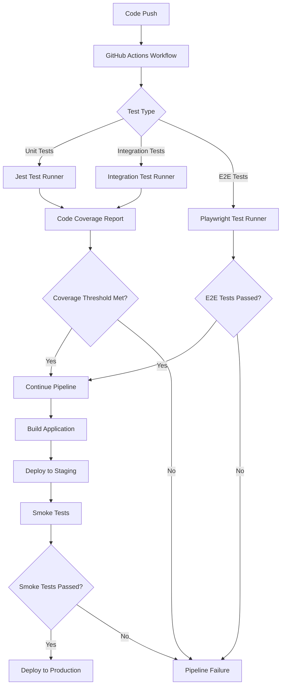

## Scaling Strategy

The system is designed to scale efficiently:

1. **Frontend**: Serverless scaling via Vercel
2. **WebSocket Server**: Horizontal scaling with Cloud Run
3. **Redis**: Vertical scaling as connection count grows

Scaling triggers:
- **WebSocket Connections**: >70% of capacity
- **Message Volume**: >60% of processing capacity
- **API Rate Limits**: >70% of quota

## Monitoring Setup

The monitoring system tracks:

1. **Service Health**: Uptime, error rates, response times
2. **WebSocket Metrics**: Connection count, message throughput
3. **API Usage**: Rate limits, quota consumption
4. **Client Performance**: Load times, interaction metrics

All monitoring respects user privacy by avoiding collection of personal data.

# DEVELOPMENT WORKFLOW

## Development Environment

The development environment requires:

1. **Local Setup**: Node.js, npm, and Git
2. **Docker**: For local WebSocket server and Redis
3. **API Keys**: Firebase, OpenAI, and Google Cloud

## Code Organization

The codebase is organized into:

### Frontend (`src/web`)

- `src/lib`: Core utilities, types, and services
- `src/components`: React components
- `src/hooks`: React hooks
- `src/store`: Zustand state stores
- `src/services`: Service implementations
- `src/app`: Next.js app router pages

### Backend (`src/backend`)

- `src/config`: Configuration files
- `src/controllers`: Request handlers
- `src/services`: Service implementations
- `src/utils`: Utility functions

## Testing Strategy

The testing strategy includes:

1. **Unit Tests**: Jest for component and utility testing
2. **Integration Tests**: Testing service interactions
3. **E2E Tests**: Playwright for end-to-end testing
4. **Performance Tests**: Lighthouse for performance metrics

## Contribution Guidelines

Contributors should follow these guidelines:

1. **Branch Strategy**: Feature branches from main
2. **Pull Requests**: Required for all changes
3. **Code Reviews**: Required before merging
4. **Testing**: All tests must pass
5. **Documentation**: Update documentation with changes

# TROUBLESHOOTING GUIDE

## Common Issues

### Authentication Problems

- **Issue**: Unable to log in or register
- **Solution**: Check Firebase configuration and network connectivity

### WebSocket Connection Issues

- **Issue**: Agents unable to communicate
- **Solution**: Verify WebSocket server is running and check network connectivity

### Calendar Sync Problems

- **Issue**: Calendar events not syncing
- **Solution**: Check Google Calendar permissions and OAuth token validity

### Local Storage Issues

- **Issue**: Data not persisting between sessions
- **Solution**: Check browser storage permissions and quota limits

## Debugging Tools

1. **Browser DevTools**: For frontend and storage debugging
2. **WebSocket Inspector**: For WebSocket communication debugging
3. **Redux DevTools**: For state management debugging
4. **Network Monitor**: For API and WebSocket traffic analysis

## Support Resources

- **Documentation**: Comprehensive documentation in the `docs` directory
- **Issue Tracker**: GitHub Issues for bug reports and feature requests
- **Community Forum**: Discussion forum for user questions and support

# QUICK START

The AI Agent Network is a lightweight, privacy-focused platform that enables users to create personalized AI assistants capable of communicating with each other to automate scheduling and coordination tasks.

## Overview

The AI Agent Network addresses the growing need for AI assistants that can handle interpersonal coordination while maintaining strict privacy controls through local data storage. Unlike existing solutions that store user data centrally, this platform emphasizes local storage and transparent agent-to-agent communication.

### Key Features

- **Privacy-First Design**: All personal data remains on your device with end-to-end encrypted communications
- **Local-First Architecture**: No central storage of your data, everything stays on your device
- **Transparent Agent Communication**: See exactly how your agent communicates with others
- **Google Calendar Integration**: Seamless scheduling with your existing calendar
- **Natural Language Interface**: Communicate with your agent using everyday language
- **Secure Agent-to-Agent Communication**: Agents negotiate on your behalf with end-to-end encryption

### Use Cases

- Schedule meetings without back-and-forth emails or messages
- Coordinate events with friends and colleagues
- Manage your availability based on preferences and calendar
- Automate scheduling tasks while maintaining privacy
- Delegate coordination to your personal AI assistant

## Getting Started

Follow these instructions to set up the project for development and testing.

### Prerequisites

- Node.js 18.x LTS or later
- npm 9.x or later
- Git
- Docker (for backend development)
- Firebase account (for authentication)
- OpenAI API key (for agent intelligence)
- Google Cloud Platform account (for Calendar API)

### Installation

1. Clone the repository
   ```bash
   git clone https://github.com/ai-agent-network/ai-agent-network.git
   cd ai-agent-network
   ```

2. Set up the frontend
   ```bash
   cd src/web
   npm install
   cp .env.example .env.local
   # Edit .env.local with your configuration
   ```

3. Set up the backend
   ```bash
   cd src/backend
   npm install
   cp .env.example .env
   # Edit .env with your configuration
   ```

### Running the Application

**Frontend Development Server:**
```bash
cd src/web
npm run dev
```
The frontend will be available at http://localhost:3000

**Backend Development Server:**
```bash
cd src/backend
npm run dev
```
The backend will be available at http://localhost:3001

**Using Docker for Backend:**
```bash
cd src/backend
docker-compose up
```
This will start both the WebSocket server and a Redis instance.

## Architecture Overview

The AI Agent Network employs a privacy-centric architecture with these key components:

### Frontend Application

- Built with Next.js 14+ and React 18+
- Responsive design with TailwindCSS
- State management with Zustand
- Local storage using IndexedDB and SQLite (via sql.js)
- End-to-end encryption for all sensitive data

### WebSocket Server

- Lightweight Node.js server with Express and Socket.io
- Acts only as a message router without accessing message content
- Stateless design for horizontal scaling
- Redis adapter for multi-instance deployment
- No storage of user data or message content

### External Integrations

- Firebase Authentication for secure user identity
- Google Calendar API for scheduling functionality
- OpenAI GPT-4o for natural language processing

## System Components

### Client-Side Components

1. **User Interface**: Next.js/React application with responsive design
2. **Local Storage**: IndexedDB and SQLite for secure local data storage
3. **Agent Engine**: Processes natural language and manages agent behavior
4. **WebSocket Client**: Enables secure communication with other agents
5. **Calendar Integration**: Connects with Google Calendar for scheduling

### Server-Side Components

1. **WebSocket Server**: Routes encrypted messages between agents
2. **Authentication Verification**: Validates user identity via Firebase
3. **Message Routing**: Directs messages to appropriate recipients
4. **Rate Limiting**: Prevents abuse of the communication system

### External Services

1. **Firebase Authentication**: Manages user identity and security
2. **Google Calendar API**: Provides calendar integration for scheduling
3. **OpenAI API**: Delivers natural language processing capabilities

## Data Flow

### Local Data Storage

- User profiles and preferences stored in IndexedDB
- Agent configurations stored in IndexedDB
- Conversation history stored in SQLite (via sql.js)
- Calendar data cached locally in IndexedDB
- Authentication tokens stored in encrypted localStorage

### Agent-to-Agent Communication

- End-to-end encrypted WebSocket messages
- X25519 key exchange for secure communication
- XChaCha20-Poly1305 for message encryption
- WebSocket server routes messages without accessing content
- Transparent display of agent conversations to users

### Calendar Integration

- OAuth 2.0 authentication with Google Calendar
- Local caching of calendar data for privacy
- Incremental synchronization for efficiency
- Event creation and management with user approval

## Security Features

### End-to-End Encryption

- All agent-to-agent messages are encrypted end-to-end
- WebSocket server cannot read message contents
- X25519 key exchange for establishing shared secrets
- XChaCha20-Poly1305 authenticated encryption
- Ed25519 signatures for message authentication

### Local Data Protection

- AES-256-GCM encryption for sensitive local data
- Encryption keys derived from user credentials
- Secure key storage with hardware backing when available
- Automatic key rotation for long-term security

### Authentication Security

- Firebase Authentication with multiple provider options
- JWT-based authentication for WebSocket connections
- Secure token storage and management
- Optional multi-factor authentication

### Privacy Controls

- Data minimization principles throughout the system
- User control over all data collection and sharing
- Transparent agent-to-agent communications
- No central storage of user information

## Scaling Capabilities

### Client-Side Scaling

- Efficient resource usage within browser constraints
- Data pruning for storage management
- Performance optimizations for UI rendering
- Background processing for non-critical tasks

### WebSocket Server Scaling

- Horizontal scaling with multiple instances
- Auto-scaling based on connection count and CPU utilization
- Redis Pub/Sub for cross-instance communication
- Multi-region deployment for global availability

### Performance Optimization

- Caching strategies to reduce API calls
- Efficient message format to reduce bandwidth
- Connection pooling for resource efficiency
- Automatic scaling to match demand

## Development Guidelines

### Coding Standards

- TypeScript for type safety
- ESLint and Prettier for code quality
- Jest for unit testing
- React Testing Library for component testing
- Playwright for end-to-end testing

### Git Workflow

- Feature branches for development
- Pull requests for code review
- Automated testing in CI/CD pipeline
- Semantic versioning for releases

### Documentation

- Code comments for complex logic
- README files for component documentation
- Architecture documentation for system overview
- API documentation for interfaces

## Deployment

### Frontend Deployment

- Vercel for hosting the Next.js application
- Global CDN for low-latency access
- Continuous deployment from GitHub
- Environment-specific configurations

### Backend Deployment

- Google Cloud Run for WebSocket server
- Docker containerization for consistent deployment
- Auto-scaling based on demand
- Multi-region deployment for global availability

### Infrastructure as Code

- Terraform for infrastructure definition
- Environment-specific configurations
- Automated deployment through CI/CD
- Monitoring and alerting setup

## Testing Strategy

### Unit Testing

- Jest for component and utility testing
- High coverage requirements for core functionality
- Mocking of external dependencies
- Automated testing in CI/CD pipeline

### Integration Testing

- API testing with supertest
- WebSocket testing with socket.io-client
- Database testing with in-memory implementations
- Service integration testing for cross-component functionality

### End-to-End Testing

- Playwright for browser-based testing
- Critical user flows covered by E2E tests
- Cross-browser testing for compatibility
- Performance testing for key operations

## Monitoring and Observability

### Key Metrics

- WebSocket connection count and message rate
- API response times and error rates
- Client-side performance metrics
- User engagement and feature usage

### Alerting

- Critical alerts for service disruptions
- Performance degradation alerts
- Error rate threshold alerts
- Capacity planning alerts

### Logging

- Structured logging for server components
- Error tracking for client-side issues
- Audit logging for security events
- Privacy-respecting analytics

## Troubleshooting

### Common Issues

- WebSocket connection failures
- Authentication problems
- Calendar synchronization issues
- Local storage limitations

### Debugging Tools

- Browser developer tools for client-side debugging
- Server logs for WebSocket issues
- Firebase console for authentication problems
- Google Cloud monitoring for server metrics

### Support Resources

- GitHub issues for bug reporting
- Documentation for common problems
- Community forums for user assistance
- Support email for critical issues

## Future Roadmap

### Planned Features

- Mobile native applications
- Additional calendar integrations
- Advanced AI capabilities
- Enterprise features for team management

### Research Areas

- Post-quantum cryptography
- Differential privacy techniques
- Federated learning for agent improvement
- Advanced multi-agent coordination

### Community Contributions

- Open source contributions welcome
- Feature requests through GitHub issues
- Documentation improvements
- Security audits and recommendations

# PROJECT STRUCTURE

The AI Agent Network is organized with a clear separation of concerns between frontend and backend components, following a modular architecture that emphasizes privacy, security, and local-first data storage. This section provides a detailed overview of the project's structure to help developers navigate and understand the codebase.

## Repository Organization

The repository is structured into the following main directories:

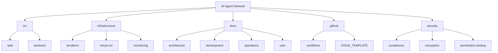

## Frontend Architecture (`src/web`)

The frontend is built with Next.js 14+ and React 18+, implementing a client-side architecture that prioritizes local data storage and privacy.

### Core Directories

| Directory | Purpose | Key Components |
| --- | --- | --- |
| `src/lib` | Core utilities and services | API clients, storage implementations, type definitions |
| `src/components` | React components | UI elements organized by feature area |
| `src/hooks` | Custom React hooks | Reusable logic for components |
| `src/store` | State management | Zustand stores for global state |
| `src/services` | Service implementations | Business logic and external integrations |
| `src/app` | Next.js app router | Page definitions and routing |
| `src/__tests__` | Test files | Unit and integration tests |
| `src/__mocks__` | Mock implementations | Test mocks for external dependencies |

### Frontend Module Structure

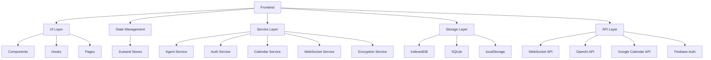

### Key Frontend Files

| File Path | Purpose |
| --- | --- |
| `src/lib/types/agent.types.ts` | Type definitions for agent entities and communication |
| `src/lib/types/websocket.types.ts` | Type definitions for WebSocket communication |
| `src/lib/types/storage.types.ts` | Type definitions for local storage implementations |
| `src/lib/utils/encryption.ts` | Encryption utilities for secure data storage and communication |
| `src/services/agent.service.ts` | Agent management and communication logic |
| `src/services/auth.service.ts` | Authentication and user management |
| `src/services/calendar.service.ts` | Google Calendar integration |
| `src/services/websocket.service.ts` | WebSocket client for agent communication |
| `src/store/agentStore.ts` | Global state for agent data and operations |
| `src/components/agent/AgentChat.tsx` | UI for interacting with agents |
| `src/components/agent/AgentToAgentConversation.tsx` | UI for displaying agent-to-agent communications |

### Component Organization

The frontend components are organized by feature area:

- **Agent Components**: Agent chat interface, settings, conversation display
- **Authentication Components**: Login, registration, password management
- **Calendar Components**: Calendar display, event management, approvals
- **Common Components**: Reusable UI elements (buttons, cards, modals)
- **Connect Components**: Agent connection management
- **Dashboard Components**: Home screen widgets and activity feeds
- **Layout Components**: Page structure, navigation, headers/footers

## Backend Architecture (`src/backend`)

The backend is a lightweight Node.js server focused primarily on WebSocket relay functionality, with minimal data processing to maintain privacy.

### Core Directories

| Directory | Purpose | Key Components |
| --- | --- | --- |
| `src/config` | Configuration files | Constants, environment variables |
| `src/controllers` | Request handlers | API endpoint implementations |
| `src/interfaces` | TypeScript interfaces | Type definitions for backend entities |
| `src/middleware` | Express middleware | Authentication, validation, error handling |
| `src/routes` | API route definitions | Endpoint routing |
| `src/services` | Service implementations | Business logic |
| `src/utils` | Utility functions | Helper functions and tools |
| `src/validators` | Request validation | Input validation logic |

### Backend Module Structure

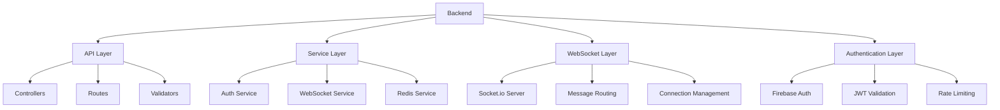

### Key Backend Files

| File Path | Purpose |
| --- | --- |
| `src/interfaces/agent.interface.ts` | Type definitions for agent entities |
| `src/interfaces/message.interface.ts` | Type definitions for agent messages |
| `src/interfaces/websocket.interface.ts` | Type definitions for WebSocket communication |
| `src/services/websocket.service.ts` | WebSocket server implementation |
| `src/services/auth.service.ts` | Authentication service |
| `src/controllers/websocket.controller.ts` | WebSocket connection handling |
| `src/middleware/firebase-auth.middleware.ts` | Firebase authentication validation |
| `src/app.ts` | Express application setup |
| `src/server.ts` | Server entry point |

## Infrastructure (`infrastructure`)

The infrastructure code defines the deployment environment and monitoring setup for the application.

### Core Directories

| Directory | Purpose | Key Components |
| --- | --- | --- |
| `terraform` | Infrastructure as Code | Cloud resource definitions |
| `cloud-run` | Cloud Run configuration | Container deployment settings |
| `monitoring` | Monitoring setup | Dashboards, alerts |

### Infrastructure Organization

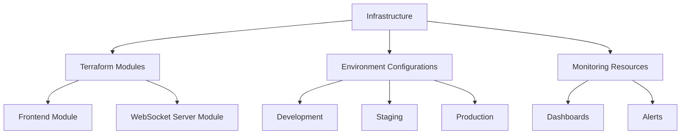

## Documentation (`docs`)

Comprehensive documentation covering architecture, development, operations, and user guides.

### Core Directories

| Directory | Purpose | Key Documents |
| --- | --- | --- |
| `architecture` | System architecture | System overview, data flow, security |
| `development` | Development guides | Setup, coding standards, testing |
| `operations` | Deployment and operations | Monitoring, deployment, disaster recovery |
| `user` | User documentation | Privacy policy, terms of service |

## CI/CD (`.github`)

Continuous Integration and Continuous Deployment workflows using GitHub Actions.

### Core Directories

| Directory | Purpose | Key Files |
| --- | --- | --- |
| `workflows` | GitHub Actions workflows | CI/CD pipeline definitions |
| `ISSUE_TEMPLATE` | Issue templates | Bug report and feature request templates |
| `PULL_REQUEST_TEMPLATE.md` | PR template | Pull request guidelines |

## Security (`security`)

Security-related documentation and tools.

### Core Directories

| Directory | Purpose | Key Components |
| --- | --- | --- |
| `compliance` | Compliance documentation | GDPR checklist, impact assessments |
| `encryption` | Encryption protocols | Protocol documentation |
| `penetration-testing` | Security testing | Methodology documentation |

## Data Flow Architecture

The AI Agent Network implements a privacy-focused data flow where user data remains primarily on the client device.

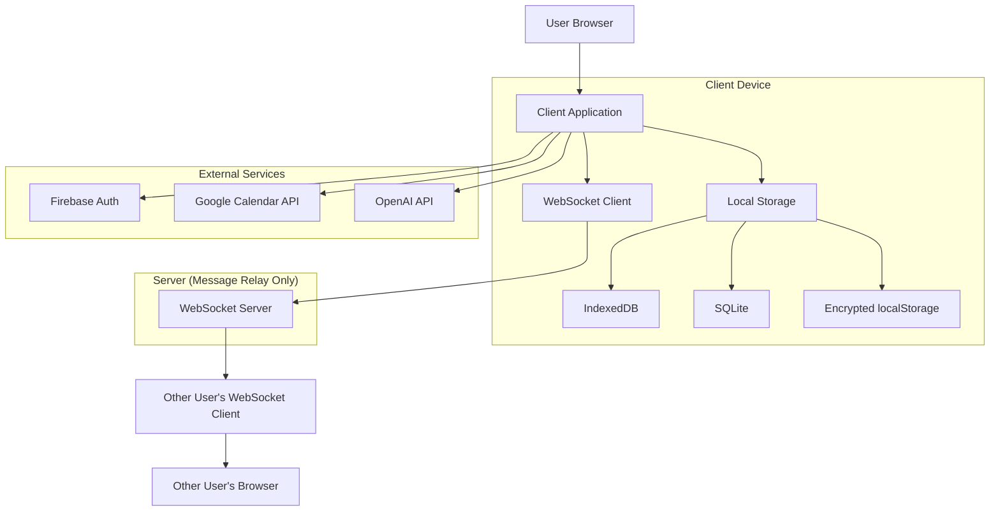

## Key Technologies

The AI Agent Network is built with the following key technologies:

### Frontend Technologies

| Technology | Version | Purpose |
| --- | --- | --- |
| Next.js | 14.0+ | React framework with server-side rendering |
| React | 18.0+ | UI component library |
| TypeScript | 5.0+ | Type-safe JavaScript |
| TailwindCSS | 3.3+ | Utility-first CSS framework |
| Zustand | 4.4+ | State management |
| Socket.io-client | 4.7+ | WebSocket client |
| IndexedDB/SQLite | Browser API | Local storage |
| crypto-js | Latest | Encryption library |

### Backend Technologies

| Technology | Version | Purpose |
| --- | --- | --- |
| Node.js | 18+ LTS | JavaScript runtime |
| Express | 4.18+ | Web framework |
| Socket.io | 4.7+ | WebSocket server |
| TypeScript | 5.0+ | Type-safe JavaScript |
| Redis | Latest | Pub/Sub for WebSocket scaling |
| Firebase Admin | Latest | Authentication verification |
| Winston | Latest | Logging library |

### External Services

| Service | Purpose | Integration |
| --- | --- | --- |
| Firebase Authentication | User identity management | Firebase JS SDK |
| OpenAI GPT-4o | Natural language processing | OpenAI Node SDK |
| Google Calendar API | Calendar integration | Google API Client |

### DevOps Technologies

| Technology | Purpose | Implementation |
| --- | --- | --- |
| Docker | Containerization | WebSocket server containerization |
| Terraform | Infrastructure as Code | Cloud resource provisioning |
| GitHub Actions | CI/CD | Automated testing and deployment |
| Google Cloud Run | Serverless containers | WebSocket server hosting |
| Vercel | Frontend hosting | Next.js deployment |

## Development Environment Setup

To set up the development environment:

1. **Prerequisites**
   - Node.js 18.x LTS or later
   - npm 9.x or later
   - Git
   - Docker (for backend development)
   - Firebase account (for authentication)
   - OpenAI API key (for agent intelligence)
   - Google Cloud Platform account (for Calendar API)

2. **Frontend Setup**
   ```bash
   cd src/web
   npm install
   cp .env.example .env.local
   # Edit .env.local with your configuration
   npm run dev
   ```

3. **Backend Setup**
   ```bash
   cd src/backend
   npm install
   cp .env.example .env
   # Edit .env with your configuration
   npm run dev
   ```

4. **Using Docker for Backend**
   ```bash
   cd src/backend
   docker-compose up
   ```

## Testing Strategy

The project implements a comprehensive testing strategy:

| Test Type | Tools | Location | Command |
| --- | --- | --- | --- |
| Unit Tests | Jest, React Testing Library | `src/web/src/__tests__` | `npm test` |
| Integration Tests | Jest, MSW | `src/web/src/__tests__` | `npm test` |
| E2E Tests | Playwright | `src/web/e2e` | `npm run test:e2e` |
| Backend Tests | Jest | `src/backend/tests` | `npm test` |

## Conclusion

The AI Agent Network project structure is designed to support a privacy-focused, local-first architecture that enables secure agent-to-agent communication while keeping user data under their control. The clear separation between frontend and backend components, with well-defined interfaces and type definitions, facilitates maintainability and extensibility as the project evolves.

# CODE GUIDE: AI Agent Network

## Introduction

The AI Agent Network is a lightweight, privacy-focused platform that enables users to create personalized AI assistants capable of communicating with each other to automate scheduling and coordination tasks. The system addresses the growing need for AI assistants that can handle interpersonal coordination while maintaining strict privacy controls through local data storage.

This guide provides a comprehensive overview of the codebase, explaining the architecture, key components, and implementation details to help developers understand and contribute to the project.

## Project Architecture

The AI Agent Network follows a privacy-first, local-first architecture with these key components:

1. **Frontend Application**: Built with Next.js 14+ and React 18+, using TailwindCSS for styling and Zustand for state management.
2. **Local Storage**: Uses IndexedDB and SQLite (via sql.js) to store user data locally on the device.
3. **WebSocket Server**: A lightweight Node.js server with Express and Socket.io for agent-to-agent communication.
4. **External Integrations**: Firebase Authentication for user identity, Google Calendar API for scheduling, and OpenAI GPT-4o for natural language processing.

### Key Architectural Principles

- **Privacy-First Design**: All personal data remains on the user's device with end-to-end encrypted communications.
- **Local-First Architecture**: No central storage of user data, everything stays on the device.
- **Transparent Agent Communication**: Users can see exactly how their agent communicates with others.
- **End-to-End Encryption**: All agent-to-agent communication is encrypted to ensure privacy.

## Directory Structure

The project is organized into the following main directories:

### Frontend (`src/web`)

- `src/lib`: Core utilities, types, and services
- `src/components`: React components
- `src/hooks`: React hooks
- `src/store`: Zustand state stores
- `src/services`: Service implementations
- `src/app`: Next.js app router pages
- `src/__tests__`: Test files
- `src/__mocks__`: Mock implementations for testing

### Backend (`src/backend`)

- `src/config`: Configuration files
- `src/controllers`: Request handlers
- `src/interfaces`: TypeScript interfaces
- `src/middleware`: Express middleware
- `src/routes`: API route definitions
- `src/services`: Service implementations
- `src/utils`: Utility functions
- `src/validators`: Request validation

### Infrastructure (`infrastructure`)

- `terraform`: Infrastructure as Code definitions
- `cloud-run`: Cloud Run configuration
- `monitoring`: Monitoring dashboards and alerts

## Core Components

### 1. Types and Constants

The `src/web/src/lib/types` directory contains TypeScript interfaces and types that define the structure of data throughout the application:

#### `agent.types.ts`

Defines the core agent-related types including:
- `Agent`: The main agent entity with identification and configuration
- `AgentConfiguration`: Configuration options for agent behavior and preferences
- `AgentMessage`: Structure of messages exchanged between agents
- `AgentConversation`: Structure of conversations between agents
- `AgentApprovalRequest`: Structure for approval requests that require user decisions

#### `websocket.types.ts`

Defines types for WebSocket communication:
- `WebSocketConfig`: Configuration options for WebSocket connections
- `WebSocketConnectionStatus`: Possible states for WebSocket connections
- `WebSocketMessage`: Structure for messages sent over WebSocket connections
- `WebSocketEncryptedMessage`: Structure for encrypted messages with signature verification

#### `storage.types.ts`

Defines types for local storage:
- `StorageType`: Available storage mechanisms (IndexedDB, localStorage, SQLite)
- `IStorageSchema`: Database schema structure
- `IStorageQuery`: Query parameters for retrieving data
- `IStorageBackup`: Backup data structure for export/import

#### `calendar.types.ts`

Defines types for calendar integration:
- `ICalendar`: Calendar information
- `ICalendarEvent`: Calendar event details
- `ICalendarCredentials`: OAuth credentials for Google Calendar
- `IAvailabilityRequest`: Parameters for checking availability

#### `constants/index.ts`

Defines constants used throughout the application:
- `AGENT_STATUS`: Status values for agents (online, offline, busy, etc.)
- `MESSAGE_TYPES`: Types of messages exchanged between agents
- `WEBSOCKET_EVENTS`: Event types for socket.io communication
- `APPROVAL_TYPES`: Types of approvals that require user decision
- `CALENDAR_SYNC_STATUS`: Status values for calendar synchronization

### 2. Utilities

The `src/web/src/lib/utils` directory contains utility functions:

#### `encryption.ts`

Implements encryption utilities for secure data storage and communication:
- AES-256-GCM encryption for local data
- X25519 key exchange for secure communication
- XChaCha20-Poly1305 for WebSocket messages
- Functions for hashing, signing, and verifying data

#### `dateTime.ts`

Provides date and time utilities for calendar operations:
- Formatting dates for display
- Converting between different date formats
- Calculating time slots for availability

#### `validation.ts`

Contains validation functions for user input:
- Email validation
- Password strength validation
- Form data validation

#### `errorHandling.ts`

Implements standardized error handling:
- Creating structured error objects
- Categorizing errors by type
- Formatting error messages

### 3. Storage Implementation

The `src/web/src/lib/storage` directory contains implementations for local storage:

#### `indexedDB.ts`

Implements a browser IndexedDB adapter for local-first storage:
- CRUD operations for structured data
- Query capabilities with filtering and sorting
- Encryption support for sensitive data
- Backup and restore functionality

#### `sqliteStorage.ts`

Implements SQLite storage (via sql.js) for more complex data:
- SQL query capabilities
- Transaction support
- Structured data relationships

#### `localStorage.ts`

Implements simple key-value storage using browser localStorage:
- Storing simple configuration values
- Caching frequently accessed data
- Fallback storage when IndexedDB is unavailable

### 4. WebSocket Implementation

The `src/web/src/lib/websocket` directory contains WebSocket client implementation:

#### `socketClient.ts`

Implements a WebSocket client for agent-to-agent communication:
- Connection management with authentication
- Message encryption and signing
- Delivery guarantees with acknowledgments
- Reconnection logic with exponential backoff

#### `encryption.ts`

Implements end-to-end encryption for WebSocket messages:
- Key exchange protocols
- Message encryption and decryption
- Signature generation and verification

#### `messageHandlers.ts`

Implements handlers for different types of WebSocket messages:
- Processing incoming messages
- Routing messages to appropriate handlers
- Generating responses to queries

### 5. Calendar Integration

The `src/web/src/lib/calendar` directory contains calendar integration:

#### `googleCalendar.ts`

Implements Google Calendar integration:
- OAuth authentication flow
- Calendar retrieval and event management
- Availability checking
- Synchronization with local storage

#### `calendarSync.ts`

Implements synchronization between local storage and Google Calendar:
- Incremental sync with sync tokens
- Conflict resolution
- Background synchronization

#### `eventUtils.ts`

Provides utilities for working with calendar events:
- Converting between Google Calendar and local event formats
- Calculating availability based on events
- Generating time slots for scheduling

### 6. API Clients

The `src/web/src/lib/api` directory contains API client implementations:

#### `websocket.api.ts`

Implements the WebSocket API client:
- Connecting to the WebSocket server
- Sending and receiving messages
- Managing connection state

#### `openai.api.ts`

Implements the OpenAI API client:
- Sending requests to GPT-4o
- Processing responses
- Managing rate limits and errors

#### `calendar.api.ts`

Implements the Google Calendar API client:
- Authenticating with OAuth
- Retrieving calendars and events
- Creating and updating events

#### `agent.api.ts`

Implements the agent API client:
- Creating and configuring agents
- Starting conversations
- Processing commands

### 7. Services

The `src/web/src/services` directory contains service implementations:

#### `agent.service.ts`

Implements the core agent service:
- Creating and managing agents
- Processing natural language commands
- Orchestrating agent-to-agent communication
- Managing approval workflows

#### `auth.service.ts`

Implements authentication services:
- User registration and login
- Token management
- Session handling

#### `calendar.service.ts`

Implements calendar services:
- Calendar connection and synchronization
- Event management
- Availability checking

#### `storage.service.ts`

Implements storage services:
- Database initialization and schema management
- Data encryption and decryption
- Backup and restore functionality

#### `websocket.service.ts`

Implements WebSocket services:
- Connection management
- Message routing
- Reconnection handling

#### `encryption.service.ts`

Implements encryption services:
- Key generation and management
- Data encryption and decryption
- Secure storage of sensitive information

#### `notification.service.ts`

Implements notification services:
- In-app notifications
- Approval request notifications
- System notifications

### 8. State Management

The `src/web/src/store` directory contains Zustand state stores:

#### `authStore.ts`

Manages authentication state:
- User identity and tokens
- Authentication status
- Login, logout, and token refresh

#### `agentStore.ts`

Manages agent state:
- Current agent and configuration
- Conversations and messages
- Approval requests

#### `calendarStore.ts`

Manages calendar state:
- Calendars and events
- Synchronization status
- Availability information

#### `notificationStore.ts`

Manages notification state:
- Pending notifications
- Notification history
- Notification preferences

#### `connectionStore.ts`

Manages connection state:
- WebSocket connections
- Connection status
- Reconnection attempts

#### `preferenceStore.ts`

Manages user preferences:
- Application settings
- Agent preferences
- Privacy settings

### 9. React Hooks

The `src/web/src/hooks` directory contains custom React hooks:

#### `useAuth.ts`

Provides authentication functionality to components:
- Login and logout
- User information
- Authentication status

#### `useAgent.ts`

Provides agent functionality to components:
- Agent creation and configuration
- Command processing
- Conversation management
- Approval handling

#### `useCalendar.ts`

Provides calendar functionality to components:
- Calendar connection and synchronization
- Event management
- Availability checking

#### `useWebSocket.ts`

Provides WebSocket functionality to components:
- Connection management
- Message sending and receiving
- Connection status

#### `useLocalStorage.ts`

Provides local storage functionality to components:
- Data storage and retrieval
- Encrypted storage
- Storage quotas and limitations

#### `useNotifications.ts`

Provides notification functionality to components:
- Displaying notifications
- Managing notification preferences
- Handling notification actions

#### `useForm.ts`

Provides form handling functionality to components:
- Form state management
- Validation
- Submission handling

### 10. React Components

The `src/web/src/components` directory contains React components:

#### Agent Components (`agent/`)

- `AgentChat.tsx`: Main component for chatting with the agent
- `AgentToAgentConversation.tsx`: Displays agent-to-agent conversations
- `ApprovalModal.tsx`: Modal for approving or rejecting agent proposals
- `AgentSettings.tsx`: Component for configuring agent preferences
- `AgentConversation.tsx`: Displays a conversation with context

#### Authentication Components (`auth/`)

- `LoginForm.tsx`: Form for user login
- `RegisterForm.tsx`: Form for user registration
- `OAuthButtons.tsx`: Buttons for OAuth authentication
- `ResetPasswordForm.tsx`: Form for password reset
- `ForgotPasswordForm.tsx`: Form for initiating password reset

#### Calendar Components (`calendar/`)

- `CalendarComponent.tsx`: Main calendar component
- `CalendarDayView.tsx`: Displays events for a specific day
- `PendingApprovals.tsx`: Displays pending approval requests
- `CalendarSyncSettings.tsx`: Settings for calendar synchronization
- `CalendarEventForm.tsx`: Form for creating/editing calendar events

#### Connection Components (`connect/`)

- `ConnectionList.tsx`: Displays connected agents
- `PendingRequests.tsx`: Displays pending connection requests
- `ConnectForm.tsx`: Form for connecting with other agents
- `InviteFriends.tsx`: Component for inviting friends to the platform

#### Dashboard Components (`dashboard/`)

- `ActivityFeed.tsx`: Displays recent agent activity
- `QuickActions.tsx`: Provides quick access to common actions
- `UpcomingEvents.tsx`: Displays upcoming calendar events
- `StatusSummary.tsx`: Summarizes system status

#### Layout Components (`layout/`)

- `AppShell.tsx`: Main application layout
- `Header.tsx`: Application header
- `Footer.tsx`: Application footer
- `Sidebar.tsx`: Navigation sidebar
- `MobileNavigation.tsx`: Mobile-friendly navigation
- `PageContainer.tsx`: Container for page content

#### Common Components (`common/`)

- `Button.tsx`: Reusable button component
- `Card.tsx`: Card container component
- `Modal.tsx`: Modal dialog component
- `FormField.tsx`: Form input field component
- `Loading.tsx`: Loading indicator component
- `ErrorDisplay.tsx`: Error message component
- `Toast.tsx`: Toast notification component

### 11. Pages

The `src/web/src/app` directory contains Next.js app router pages:

- `page.tsx`: Home page
- `auth/login/page.tsx`: Login page
- `auth/register/page.tsx`: Registration page
- `auth/forgot-password/page.tsx`: Forgot password page
- `auth/reset-password/page.tsx`: Reset password page
- `agent/page.tsx`: Agent chat page
- `agent/conversation/[id]/page.tsx`: Specific conversation page
- `calendar/page.tsx`: Calendar page
- `connect/page.tsx`: Connect with other agents page
- `settings/page.tsx`: Settings page

### 12. Backend Components

The `src/backend` directory contains the WebSocket server implementation:

#### Configuration (`src/backend/src/config`)

- `config.ts`: Server configuration
- `constants.ts`: Server constants
- `error-messages.ts`: Error message definitions

#### Controllers (`src/backend/src/controllers`)

- `auth.controller.ts`: Authentication controller
- `websocket.controller.ts`: WebSocket controller
- `health.controller.ts`: Health check controller

#### Interfaces (`src/backend/src/interfaces`)

- `agent.interface.ts`: Agent interfaces
- `message.interface.ts`: Message interfaces
- `websocket.interface.ts`: WebSocket interfaces
- `auth.interface.ts`: Authentication interfaces
- `connection.interface.ts`: Connection interfaces

#### Middleware (`src/backend/src/middleware`)

- `firebase-auth.middleware.ts`: Firebase authentication middleware
- `validation.middleware.ts`: Request validation middleware
- `rate-limiter.middleware.ts`: Rate limiting middleware
- `logging.middleware.ts`: Logging middleware
- `error.middleware.ts`: Error handling middleware

#### Routes (`src/backend/src/routes`)

- `auth.routes.ts`: Authentication routes
- `health.routes.ts`: Health check routes
- `index.ts`: Route aggregation

#### Services (`src/backend/src/services`)

- `auth.service.ts`: Authentication service
- `websocket.service.ts`: WebSocket service
- `redis.service.ts`: Redis service for WebSocket scaling

#### Utils (`src/backend/src/utils`)

- `error.utils.ts`: Error handling utilities
- `jwt.utils.ts`: JWT utilities
- `logging.utils.ts`: Logging utilities
- `socket.utils.ts`: Socket.io utilities
- `encryption.utils.ts`: Encryption utilities

#### Validators (`src/backend/src/validators`)

- `auth.validator.ts`: Authentication request validators
- `message.validator.ts`: Message validators

## Key Workflows

### 1. User Authentication

1. User registers or logs in using Firebase Authentication
2. Authentication tokens are securely stored in encrypted localStorage
3. User profile is created or retrieved from local storage
4. Agent is created or loaded for the authenticated user

### 2. Agent Creation and Configuration

1. User configures their agent with preferences
2. Agent configuration is stored locally with encryption
3. Encryption keys are generated for secure communication
4. Agent is registered with the WebSocket server

### 3. Agent-to-Agent Communication

1. User issues a natural language command to their agent
2. Agent processes the command using OpenAI GPT-4o
3. If scheduling is required, agent initiates communication with another agent
4. WebSocket connection is established with end-to-end encryption
5. Agents exchange messages to negotiate scheduling details
6. Conversation is displayed to users in a transparent manner
7. Users approve, modify, or reject the proposed arrangement

### 4. Calendar Integration

1. User connects their Google Calendar using OAuth
2. Calendar data is synchronized to local storage
3. Agent uses calendar data to check availability
4. When scheduling is confirmed, events are created in Google Calendar
5. Periodic synchronization keeps local data up to date

### 5. Approval Workflow

1. Agent receives a proposal from another agent
2. Proposal is stored as an approval request
3. User is notified of the pending approval
4. User reviews the proposal and agent conversation
5. User approves, modifies, or rejects the proposal
6. Agent communicates the decision to the other agent
7. If approved, calendar events are created

## Security Implementation

### 1. Local Data Encryption

- AES-256-GCM encryption for all sensitive local data
- Key derivation from user credentials using PBKDF2
- Encrypted storage in IndexedDB and SQLite

### 2. End-to-End Encryption for Agent Communication

- X25519 key exchange for establishing shared secrets
- XChaCha20-Poly1305 for message encryption
- Ed25519 signatures for message authentication
- Perfect forward secrecy with session keys

### 3. Authentication Security

- Firebase Authentication for secure user identity
- JWT tokens for WebSocket authentication
- Secure token storage with encryption
- Token refresh mechanisms

### 4. Privacy Controls

- Local-first architecture keeps data on the device
- Minimal data sharing with external services
- Transparent agent-to-agent communication
- User control over data sharing and storage

## Development Guidelines

### 1. Adding a New Feature

1. Define types in the appropriate `types` file
2. Implement utility functions in the `utils` directory
3. Add storage handling in the `storage` directory if needed
4. Implement service functions in the `services` directory
5. Add state management in the appropriate store
6. Create a custom hook in the `hooks` directory
7. Implement React components in the `components` directory
8. Add the feature to the appropriate page

### 2. Modifying Existing Components

1. Understand the component's role in the architecture
2. Check dependencies and potential impacts
3. Maintain the privacy-first approach
4. Ensure proper error handling
5. Update tests to reflect changes

### 3. Working with the WebSocket Server

1. Understand the message protocol in `websocket.types.ts`
2. Use the encryption utilities for secure communication
3. Implement proper error handling and reconnection logic
4. Follow the established message format

### 4. Implementing Calendar Features

1. Use the Google Calendar API client in `googleCalendar.ts`
2. Handle OAuth authentication properly
3. Implement local caching for offline functionality
4. Respect user privacy settings

## Conclusion

The AI Agent Network is a sophisticated application that prioritizes user privacy while providing powerful AI assistant capabilities. By keeping data local and implementing end-to-end encryption, it offers a privacy-focused alternative to cloud-based AI assistants.

This code guide provides a comprehensive overview of the project's architecture, components, and implementation details. Developers can use this guide to understand the codebase and contribute effectively to the project.

# Development Guidelines

## Introduction

The AI Agent Network is a privacy-focused platform that enables users to create personalized AI assistants capable of communicating with each other to automate scheduling and coordination tasks. This document provides comprehensive guidelines for developers working on the project, covering environment setup, coding standards, architecture principles, and best practices.

## Development Environment Setup

### Prerequisites

Before setting up the development environment, ensure you have the following installed:

- **Node.js**: Version 18.x LTS or later
- **npm**: Version 9.x or later
- **Git**: Latest version
- **Docker**: Latest version (for backend development)
- **Visual Studio Code**: Recommended IDE (optional but recommended)

### Repository Structure

The repository is organized into the following main directories:

- `src/web`: Frontend application (Next.js/React)
- `src/backend`: Backend WebSocket server (Node.js/Express/Socket.io)
- `infrastructure`: Terraform and deployment configuration
- `docs`: Project documentation
- `.github`: GitHub Actions workflows and templates
- `security`: Security-related scripts and documentation

### Frontend Setup

1. **Clone the repository**:
   ```bash
   git clone https://github.com/ai-agent-network/ai-agent-network.git
   cd ai-agent-network
   ```

2. **Install frontend dependencies**:
   ```bash
   cd src/web
   npm install
   ```

3. **Configure environment variables**:
   ```bash
   cp .env.example .env.local
   ```
   
   Edit `.env.local` with the following configuration:
   ```
   # Firebase Authentication Configuration
   NEXT_PUBLIC_FIREBASE_API_KEY=your-firebase-api-key
   NEXT_PUBLIC_FIREBASE_AUTH_DOMAIN=your-project-id.firebaseapp.com
   NEXT_PUBLIC_FIREBASE_PROJECT_ID=your-project-id

   # OpenAI API Configuration
   NEXT_PUBLIC_OPENAI_API_KEY=your-openai-api-key

   # WebSocket Server Configuration
   NEXT_PUBLIC_WEBSOCKET_URL=ws://localhost:3001

   # Application Configuration
   NEXT_PUBLIC_APP_URL=http://localhost:3000
   NEXT_PUBLIC_API_URL=http://localhost:3001/api

   # Development Settings
   NEXT_PUBLIC_DEBUG_MODE=true
   NEXT_PUBLIC_MOCK_SERVICES=true
   ```

4. **Start the frontend development server**:
   ```bash
   npm run dev
   ```
   
   The frontend will be available at http://localhost:3000

### Backend Setup

1. **Install backend dependencies**:
   ```bash
   cd src/backend
   npm install
   ```

2. **Configure environment variables**:
   ```bash
   cp .env.example .env
   ```
   
   Edit `.env` with the following configuration:
   ```
   # Server Configuration
   NODE_ENV=development
   PORT=3001
   HOST=localhost
   CORS_ORIGIN=http://localhost:3000

   # WebSocket Configuration
   WS_PATH=/socket.io
   WS_MAX_CONNECTIONS=1000
   WS_PING_INTERVAL=25000
   WS_PING_TIMEOUT=10000

   # Redis Configuration
   REDIS_ENABLED=false

   # Authentication Configuration
   JWT_SECRET=your-jwt-secret-key-here
   JWT_ALGORITHM=HS256
   JWT_EXPIRES_IN=3600

   # Firebase Configuration
   FIREBASE_PROJECT_ID=your-firebase-project-id

   # Logging Configuration
   LOG_LEVEL=debug
   ```

3. **Start the backend development server**:
   ```bash
   npm run dev
   ```
   
   The backend will be available at http://localhost:3001

### Docker Setup (Backend)

For local development with Redis, you can use Docker Compose:

```bash
cd src/backend
docker-compose up
```

This will start both the WebSocket server and a Redis instance with the configuration defined in `docker-compose.yml`.

## Coding Standards

### General Principles

The AI Agent Network follows these core principles:

1. **Privacy by Design**: All code must prioritize user privacy and data protection
2. **Code Readability**: Write clear, self-documenting code with appropriate comments
3. **Maintainability**: Follow SOLID principles and keep technical debt to a minimum
4. **Security**: Implement proper authentication, encryption, and input validation
5. **Performance**: Optimize for efficiency, especially in critical paths

### TypeScript Guidelines

- Use TypeScript's strict mode for all code
- Define explicit interfaces for all data structures
- Avoid using `any` type; use appropriate types or `unknown` when necessary
- Use explicit return types for functions and methods
- Leverage TypeScript's type inference when appropriate

Example:

```typescript
// Good practice
interface User {
  id: string;
  email: string;
  displayName?: string;
}

function getUser(id: string): Promise<User | null> {
  // Implementation
}

// Avoid this
function processData(data: any): any {
  // Implementation
}
```

### React Guidelines

- Use functional components with hooks instead of class components
- Keep components small and focused on a single responsibility
- Extract reusable logic into custom hooks
- Use React.memo for performance optimization when appropriate
- Implement proper error boundaries and loading states

Example:

```typescript
// Good practice
const UserProfile: React.FC<UserProfileProps> = ({ userId }) => {
  const [user, setUser] = useState<User | null>(null);
  const [loading, setLoading] = useState<boolean>(true);
  
  useEffect(() => {
    const fetchUser = async () => {
      try {
        setLoading(true);
        const userData = await getUser(userId);
        setUser(userData);
      } catch (error) {
        console.error('Failed to fetch user:', error);
      } finally {
        setLoading(false);
      }
    };
    
    fetchUser();
  }, [userId]);
  
  if (loading) return <Loading />;
  if (!user) return <NotFound />;
  
  return (
    <div>
      <h2>{user.displayName || user.email}</h2>
      {/* Component content */}
    </div>
  );
};
```

### State Management

- Use Zustand for global state management
- Keep state minimal and normalized
- Use local component state for component-specific state
- Derive computed values instead of storing them

Example:

```typescript
// Zustand store example
import create from 'zustand';

interface AuthState {
  user: User | null;
  isAuthenticated: boolean;
  isLoading: boolean;
  error: string | null;
  login: (email: string, password: string) => Promise<void>;
  logout: () => Promise<void>;
}

export const useAuthStore = create<AuthState>((set) => ({
  user: null,
  isAuthenticated: false,
  isLoading: false,
  error: null,
  
  login: async (email, password) => {
    try {
      set({ isLoading: true, error: null });
      const user = await authService.login(email, password);
      set({ user, isAuthenticated: true, isLoading: false });
    } catch (error) {
      set({ 
        error: error instanceof Error ? error.message : 'Authentication failed', 
        isLoading: false 
      });
    }
  },
  
  logout: async () => {
    try {
      set({ isLoading: true });
      await authService.logout();
      set({ user: null, isAuthenticated: false, isLoading: false });
    } catch (error) {
      set({ 
        error: error instanceof Error ? error.message : 'Logout failed', 
        isLoading: false 
      });
    }
  }
}));
```

### WebSocket Implementation

The AI Agent Network uses a custom WebSocket protocol for secure agent-to-agent communication. Key implementation guidelines include:

1. **End-to-End Encryption**: Implement XChaCha20-Poly1305 encryption for message content
2. **Message Authentication**: Use Ed25519 signatures to verify sender identity
3. **Connection Management**: Implement heartbeats and reconnection logic
4. **Error Handling**: Properly handle connection failures and message delivery issues

Example:

```typescript
// WebSocket client implementation (simplified)
class SecureAgentSocket {
  constructor(serverUrl, authToken, agentId) {
    this.serverUrl = serverUrl;
    this.authToken = authToken;
    this.agentId = agentId;
    this.socket = null;
    this.keyPair = null;
    this.knownAgents = new Map(); // agentId -> publicKey
    
    // Set up reconnection
    this.reconnectAttempts = 0;
    this.reconnecting = false;
  }
  
  async connect() {
    if (this.socket && this.socket.readyState === WebSocket.OPEN) {
      console.warn('WebSocket already connected');
      return;
    }
    
    // Generate or load key pair
    if (!this.keyPair) {
      this.keyPair = await this.generateKeyPair();
    }
    
    try {
      // Create WebSocket with auth token
      this.socket = new WebSocket(this.serverUrl);
      
      // Set up event handlers
      this.socket.onopen = this.handleOpen.bind(this);
      this.socket.onmessage = this.handleMessage.bind(this);
      this.socket.onclose = this.handleClose.bind(this);
      this.socket.onerror = this.handleError.bind(this);
    } catch (error) {
      console.error('Failed to create WebSocket:', error);
      this.scheduleReconnection();
      throw error;
    }
  }
  
  // Additional methods for sending messages, handling encryption, etc.
}
```

### Security Best Practices

1. **Authentication**: Use Firebase Authentication for secure user identity management
2. **Data Encryption**: Implement proper encryption for sensitive data
3. **Input Validation**: Validate all user inputs and API responses
4. **Secure Communication**: Use HTTPS/WSS for all connections
5. **Dependency Management**: Keep libraries updated and scan for vulnerabilities

Example:

```typescript
// Encryption utility example
import { secretbox, randomBytes } from 'tweetnacl';
import { encodeBase64, decodeBase64 } from 'tweetnacl-util';

export const encrypt = (message: string, key: Uint8Array): string => {
  const nonce = randomBytes(secretbox.nonceLength);
  const messageUint8 = new TextEncoder().encode(message);
  const box = secretbox(messageUint8, nonce, key);
  
  const fullMessage = new Uint8Array(nonce.length + box.length);
  fullMessage.set(nonce);
  fullMessage.set(box, nonce.length);
  
  return encodeBase64(fullMessage);
};

export const decrypt = (messageWithNonce: string, key: Uint8Array): string => {
  const messageWithNonceAsUint8Array = decodeBase64(messageWithNonce);
  const nonce = messageWithNonceAsUint8Array.slice(0, secretbox.nonceLength);
  const message = messageWithNonceAsUint8Array.slice(secretbox.nonceLength);
  
  const decrypted = secretbox.open(message, nonce, key);
  if (!decrypted) {
    throw new Error('Could not decrypt message');
  }
  
  return new TextDecoder().decode(decrypted);
};
```

## Testing Guidelines

### Testing Strategy

The AI Agent Network implements a comprehensive testing strategy:

1. **Unit Tests**: Test individual components and functions
2. **Integration Tests**: Test interactions between components
3. **End-to-End Tests**: Test complete user flows
4. **Security Tests**: Verify encryption and authentication

### Running Tests

**Frontend Tests**:
```bash
cd src/web
npm test                 # Run all tests
npm run test:watch       # Run tests in watch mode
npm run test:coverage    # Run tests with coverage report
npm run test:e2e         # Run end-to-end tests
```

**Backend Tests**:
```bash
cd src/backend
npm test                 # Run all tests
npm run test:watch       # Run tests in watch mode
npm run test:coverage    # Run tests with coverage report
```

### Test Coverage Requirements

| Component | Coverage Target | Critical Paths | Exclusions |
| --- | --- | --- | --- |
| Core Logic | 90% | Agent communication, encryption | Third-party library wrappers |
| UI Components | 80% | User interactions, form validation | Visual styling components |
| Utilities | 95% | Data transformation, validation | Debug utilities |
| API Clients | 85% | Request/response handling | Generated code |

### Writing Effective Tests

1. **Test Organization**: Co-locate tests with source files in `__tests__` directories
2. **Component Testing**: Test rendering and interactions for each React component
3. **Service Testing**: Test service functions with mocked dependencies
4. **Mocking**: Use Jest mocks for external dependencies and APIs

Example:

```typescript
// Component test example
import { render, screen, fireEvent } from '@testing-library/react';
import { LoginForm } from './LoginForm';

describe('LoginForm', () => {
  it('should render login form correctly', () => {
    render(<LoginForm onSubmit={jest.fn()} />);
    
    expect(screen.getByLabelText(/email/i)).toBeInTheDocument();
    expect(screen.getByLabelText(/password/i)).toBeInTheDocument();
    expect(screen.getByRole('button', { name: /sign in/i })).toBeInTheDocument();
  });
  
  it('should validate inputs before submission', async () => {
    const mockSubmit = jest.fn();
    render(<LoginForm onSubmit={mockSubmit} />);
    
    // Try to submit without filling fields
    fireEvent.click(screen.getByRole('button', { name: /sign in/i }));
    
    // Validation errors should appear
    expect(screen.getByText(/email is required/i)).toBeInTheDocument();
    expect(mockSubmit).not.toHaveBeenCalled();
    
    // Fill in fields and submit
    fireEvent.change(screen.getByLabelText(/email/i), {
      target: { value: 'test@example.com' }
    });
    fireEvent.change(screen.getByLabelText(/password/i), {
      target: { value: 'password123' }
    });
    fireEvent.click(screen.getByRole('button', { name: /sign in/i }));
    
    // Form should submit
    expect(mockSubmit).toHaveBeenCalledWith({
      email: 'test@example.com',
      password: 'password123'
    });
  });
});
```

## Deployment Process

### CI/CD Pipeline

The project uses GitHub Actions for continuous integration and deployment:

1. **Pull Request Workflow**:
   - Runs linting, type checking, and tests
   - Builds the application to verify compilation
   - Reports test coverage

2. **Main Branch Workflow**:
   - Runs all tests and builds
   - Deploys to staging environment
   - Runs smoke tests on staging

3. **Release Workflow**:
   - Triggered by release tags
   - Deploys to production environment
   - Runs post-deployment verification

### Deployment Environments

| Environment | Purpose | URL | Deployment Method |
| --- | --- | --- | --- |
| Development | Local development | http://localhost:3000 | Manual |
| Staging | Pre-production testing | https://staging.aiagentnetwork.com | Automatic on main branch |
| Production | Live user access | https://aiagentnetwork.com | Manual approval after staging |

### Infrastructure as Code

The project uses Terraform for infrastructure management:

```bash
cd infrastructure/terraform
terraform init
terraform plan -var-file=environments/dev/terraform.tfvars
terraform apply -var-file=environments/dev/terraform.tfvars
```

## Contribution Guidelines

### Branch Strategy

The project uses a trunk-based development approach:

- `main`: The main branch, always deployable
- `feature/*`: Feature branches for new features
- `fix/*`: Bug fix branches
- `release/*`: Release branches

### Pull Request Process

1. Create a new branch from `main`
2. Implement your changes with tests
3. Ensure all tests pass locally
4. Format your code with Prettier
5. Create a pull request to `main`
6. Address review feedback
7. Merge your changes once approved

### Code Review Guidelines

1. **Functionality**: Does the code work as expected?
2. **Security**: Are there any security concerns?
3. **Performance**: Are there any performance issues?
4. **Maintainability**: Is the code easy to understand and maintain?
5. **Testing**: Are there sufficient tests?

### Documentation Requirements

All code contributions should include:

1. **Code Comments**: Explain complex logic and non-obvious decisions
2. **JSDoc Comments**: Document functions, parameters, and return values
3. **README Updates**: Update relevant documentation
4. **Type Definitions**: Ensure proper TypeScript types

Example:

```typescript
/**
 * Encrypts a message using the recipient's public key
 * 
 * @param message - The plaintext message to encrypt
 * @param recipientPublicKey - The recipient's public key for encryption
 * @param senderPrivateKey - The sender's private key for signing
 * @returns The encrypted message with signature
 * @throws {EncryptionError} If encryption fails
 */
export async function encryptMessage(
  message: string,
  recipientPublicKey: string,
  senderPrivateKey: string
): Promise<EncryptedMessage> {
  try {
    // Implementation details
  } catch (error) {
    throw new EncryptionError('Failed to encrypt message', { cause: error });
  }
}
```

## Troubleshooting

### Common Issues

#### Frontend Issues

- **Next.js Build Errors**: Clear the Next.js cache with `rm -rf .next`
- **WebSocket Connection Issues**: Verify the WebSocket server is running and check CORS configuration
- **Authentication Issues**: Verify Firebase configuration in `.env.local`

#### Backend Issues

- **Server Start Errors**: Check for port conflicts (default is 3001)
- **WebSocket Server Issues**: Verify Socket.io configuration
- **Docker Issues**: Ensure Docker is running and check logs with `docker logs <container_id>`

### Debugging Tools

1. **Browser DevTools**: Use Chrome or Firefox DevTools for frontend debugging
2. **VS Code Debugger**: Configure launch.json for Node.js debugging
3. **WebSocket Inspector**: Use browser DevTools Network tab to inspect WebSocket traffic

## Additional Resources

### Project Documentation

- [System Overview](../architecture/system-overview.md): High-level architecture overview
- [WebSocket Protocol](../development/websocket-protocol.md): WebSocket communication protocol
- [Security Architecture](../architecture/security.md): Security design and implementation

### External Documentation

- [Next.js Documentation](https://nextjs.org/docs)
- [React Documentation](https://reactjs.org/docs)
- [TypeScript Documentation](https://www.typescriptlang.org/docs)
- [Socket.io Documentation](https://socket.io/docs)
- [Firebase Documentation](https://firebase.google.com/docs)
- [OpenAI API Documentation](https://platform.openai.com/docs)

# HUMAN INPUTS NEEDED

| Task | Description | Priority | Estimated Hours |
|------|-------------|----------|-----------------|
| QA/Bug Fixes | Examine the generated code and fix compilation and package dependency issues in the codebase | High | 40 |
| API Key Configuration | Set up and configure API keys for OpenAI, Firebase, and Google Calendar services | High | 4 |
| Environment Variables Setup | Configure environment variables for both frontend and backend services across development, staging, and production environments | High | 3 |
| WebSocket Server Deployment | Configure and deploy the WebSocket server on Google Cloud Run with proper scaling settings | High | 6 |
| Frontend Deployment | Set up and configure Vercel deployment for the Next.js frontend application | High | 4 |
| Firebase Authentication Setup | Create and configure Firebase project, set up authentication methods, and integrate with the application | High | 5 |
| Google Calendar API Integration | Register application with Google Cloud Platform, enable Calendar API, and configure OAuth consent screen | High | 6 |
| End-to-End Encryption Implementation | Validate and test the end-to-end encryption implementation for agent-to-agent communication | High | 8 |
| Local Storage Implementation | Test and validate the local storage implementation using IndexedDB and SQLite | Medium | 6 |
| Redis Configuration | Set up and configure Redis for WebSocket server scaling in production | Medium | 3 |
| Monitoring Setup | Configure monitoring dashboards and alerts in Google Cloud Platform | Medium | 5 |
| CI/CD Pipeline Finalization | Complete and test GitHub Actions workflows for continuous integration and deployment | Medium | 4 |
| Security Audit | Perform a comprehensive security audit of the application, focusing on authentication, encryption, and data storage | High | 10 |
| Performance Testing | Conduct load and performance testing of the WebSocket server and frontend application | Medium | 8 |
| Documentation Completion | Complete missing documentation, especially for API endpoints and deployment procedures | Medium | 6 |
| Browser Compatibility Testing | Test the application across different browsers and devices to ensure compatibility | Medium | 5 |
| Accessibility Compliance | Ensure the application meets accessibility standards (WCAG 2.1 AA) | Medium | 6 |
| User Acceptance Testing | Conduct user acceptance testing with real users to validate the application workflow | High | 8 |
| Legal Documentation | Finalize privacy policy, terms of service, and other legal documents | High | 4 |
| Backup and Recovery Testing | Test backup and recovery procedures for the application | Medium | 3 |