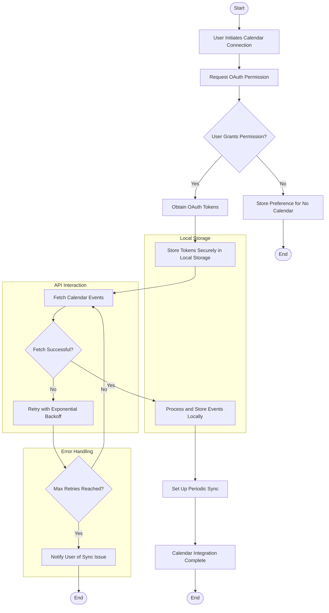
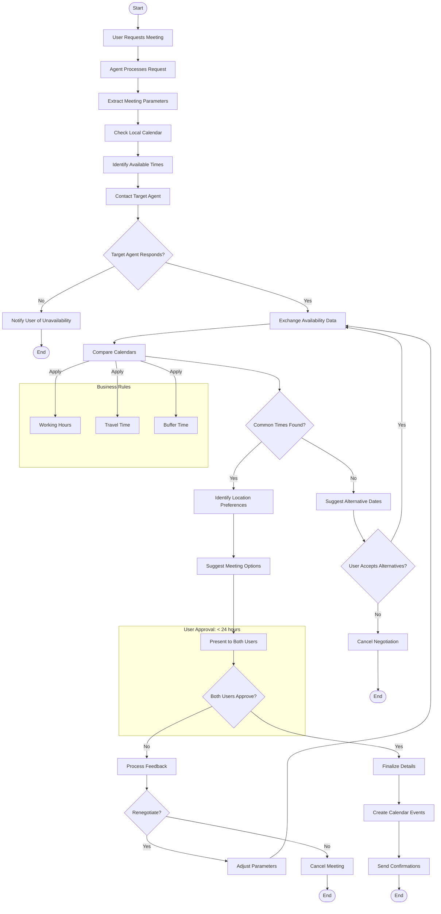

# Technical Specifications

## 1. INTRODUCTION

### 1.1 EXECUTIVE SUMMARY

The AI Agent Network for Seamless Scheduling and Communication is a lightweight, privacy-focused platform that enables users to create personalized AI assistants capable of communicating with each other to automate scheduling and coordination tasks. The system addresses the growing need for AI assistants that can handle interpersonal coordination while maintaining strict privacy controls through local data storage.

| Business Problem | Solution Approach | Value Proposition |
| --- | --- | --- |
| Scheduling coordination is time-consuming and often requires multiple back-and-forth communications | AI agents that can negotiate on behalf of users based on preferences and availability | Save time and reduce friction in coordinating meetings and events |
| Privacy concerns with existing AI assistants that store user data in the cloud | Local-first architecture with end-to-end encrypted communications | Complete user control over personal data with no central storage |
| Complex AI systems with steep learning curves | Simple, natural language interface with transparent agent-to-agent communication | Intuitive user experience with visible negotiation processes |

**Key Stakeholders:**
- End users seeking efficient scheduling assistance
- Privacy-conscious individuals concerned about data security
- Organizations requiring secure communication channels for scheduling

### 1.2 SYSTEM OVERVIEW

#### 1.2.1 Project Context

The AI Agent Network positions itself as a privacy-first alternative to cloud-based AI assistants, focusing specifically on the scheduling and coordination domain. Unlike existing solutions that store user data centrally, this platform emphasizes local storage and transparent agent-to-agent communication.

| Market Positioning | Current Limitations | Enterprise Integration |
| --- | --- | --- |
| Privacy-focused alternative to mainstream AI assistants | Existing solutions store sensitive user data in the cloud | Designed to integrate with standard calendar systems (Google Calendar) |
| Specialized for interpersonal scheduling and coordination | Current AI assistants lack transparent agent-to-agent communication | WebSocket-based communication protocol allows for future enterprise adaptations |
| Local-first architecture for maximum data control | Limited user control over data storage and processing | Firebase authentication enables enterprise SSO integration |

#### 1.2.2 High-Level Description

The AI Agent Network is a web-based platform built on Next.js and React, utilizing local storage for user data and WebSockets for agent-to-agent communication. The system employs OpenAI's GPT-4o for natural language processing and integrates with Google Calendar for scheduling functionality.

Key architectural decisions include:
- Local-first data storage using IndexedDB or SQLite
- WebSocket-based communication protocol for agent interactions
- Firebase authentication for secure user identity management
- End-to-end encryption for all agent communications
- Transparent, human-readable agent conversations

Major system components:
1. User authentication and profile management
2. Local data storage and encryption
3. AI agent configuration and personalization
4. WebSocket communication infrastructure
5. Calendar integration and scheduling logic
6. User approval workflow

#### 1.2.3 Success Criteria

| Objective | Success Factors | Key Performance Indicators |
| --- | --- | --- |
| Provide seamless scheduling assistance | Accurate preference matching and calendar coordination | Reduction in scheduling time by 50% |
| Ensure complete data privacy | All personal data remains local to user devices | Zero data breaches or privacy violations |
| Enable transparent agent communication | Human-readable agent conversations | 90% user comprehension of agent negotiations |
| Minimize system complexity | Simple, intuitive user interface | User onboarding completed in under 5 minutes |

### 1.3 SCOPE

#### 1.3.1 In-Scope

**Core Features and Functionalities:**
- User authentication via Firebase
- Local storage of user preferences and data
- AI agent creation and personalization
- WebSocket-based agent-to-agent communication
- Google Calendar integration
- Natural language command processing
- Transparent agent negotiation logs
- User approval workflow for scheduling decisions

**Implementation Boundaries:**
- Web-based platform (desktop and mobile browsers)
- Individual user accounts (non-enterprise)
- English language support
- Google Calendar as primary calendar integration
- Text-based agent communication (no voice/video)

#### 1.3.2 Out-of-Scope

- Voice or video-based agent interactions
- Multi-language support (initial release)
- Enterprise account management
- Integration with non-Google calendar systems
- Complex multi-party scheduling (more than two users)
- Agent capabilities beyond scheduling and basic information exchange
- Mobile native applications (initial release)
- Offline functionality
- Custom AI model training

## 2. PRODUCT REQUIREMENTS

### 2.1 FEATURE CATALOG

#### 2.1.1 User Authentication & Profile Management

| Feature Metadata | Details |
| --- | --- |
| ID | F-001 |
| Feature Name | User Authentication System |
| Feature Category | Security & Access Control |
| Priority Level | Critical |
| Status | Proposed |

**Description:**
- **Overview:** Firebase-based authentication system allowing users to securely access the platform.
- **Business Value:** Ensures secure access to the platform while maintaining user privacy.
- **User Benefits:** Simple sign-up process with multiple authentication options.
- **Technical Context:** Serves as the foundation for user identity and secure agent communication.

**Dependencies:**
- **Prerequisite Features:** None
- **System Dependencies:** Firebase Authentication Service
- **External Dependencies:** Google Authentication API (for Google sign-in)
- **Integration Requirements:** Must integrate with local storage system for user profile data

| Feature Metadata | Details |
| --- | --- |
| ID | F-002 |
| Feature Name | User Profile Management |
| Feature Category | User Data Management |
| Priority Level | High |
| Status | Proposed |

**Description:**
- **Overview:** System for users to create and manage their personal preferences and profile information.
- **Business Value:** Enables personalized agent behavior based on user preferences.
- **User Benefits:** Centralized management of personal information and preferences.
- **Technical Context:** Data stored locally for privacy with encryption.

**Dependencies:**
- **Prerequisite Features:** F-001 (User Authentication System)
- **System Dependencies:** Local storage system
- **External Dependencies:** None
- **Integration Requirements:** Must integrate with agent personalization system

#### 2.1.2 Agent Creation & Management

| Feature Metadata | Details |
| --- | --- |
| ID | F-003 |
| Feature Name | AI Agent Creation & Configuration |
| Feature Category | Core Functionality |
| Priority Level | Critical |
| Status | Proposed |

**Description:**
- **Overview:** System for users to create and configure their personal AI agents.
- **Business Value:** Core platform functionality enabling personalized agent assistance.
- **User Benefits:** Customizable AI assistant that reflects user preferences and needs.
- **Technical Context:** Utilizes OpenAI GPT-4o for natural language processing with local data storage.

**Dependencies:**
- **Prerequisite Features:** F-001, F-002
- **System Dependencies:** OpenAI API, Local storage system
- **External Dependencies:** OpenAI GPT-4o
- **Integration Requirements:** Must integrate with WebSocket communication system

| Feature Metadata | Details |
| --- | --- |
| ID | F-004 |
| Feature Name | Local Data Storage & Privacy |
| Feature Category | Data Management & Security |
| Priority Level | Critical |
| Status | Proposed |

**Description:**
- **Overview:** System for storing all user data and agent information locally on the user's device.
- **Business Value:** Privacy-focused approach differentiates from cloud-based competitors.
- **User Benefits:** Complete control over personal data with enhanced privacy.
- **Technical Context:** Uses IndexedDB or SQLite with encryption for secure local storage.

**Dependencies:**
- **Prerequisite Features:** F-001
- **System Dependencies:** Browser storage APIs
- **External Dependencies:** None
- **Integration Requirements:** Must integrate with all data-generating features

#### 2.1.3 Agent Communication

| Feature Metadata | Details |
| --- | --- |
| ID | F-005 |
| Feature Name | WebSocket Communication Protocol |
| Feature Category | Communication Infrastructure |
| Priority Level | Critical |
| Status | Proposed |

**Description:**
- **Overview:** Real-time communication system enabling agents to exchange messages securely.
- **Business Value:** Enables the core agent-to-agent interaction functionality.
- **User Benefits:** Seamless coordination between users via their agents.
- **Technical Context:** WebSocket-based system with end-to-end encryption for secure message exchange.

**Dependencies:**
- **Prerequisite Features:** F-001, F-003
- **System Dependencies:** WebSocket server infrastructure
- **External Dependencies:** None
- **Integration Requirements:** Must integrate with agent processing logic and user interface

| Feature Metadata | Details |
| --- | --- |
| ID | F-006 |
| Feature Name | Transparent Agent Conversation Log |
| Feature Category | User Interface |
| Priority Level | High |
| Status | Proposed |

**Description:**
- **Overview:** System for displaying agent-to-agent conversations in human-readable format.
- **Business Value:** Builds user trust through transparency in agent operations.
- **User Benefits:** Visibility into agent negotiations and decision-making process.
- **Technical Context:** Real-time display of structured agent conversations with formatting for readability.

**Dependencies:**
- **Prerequisite Features:** F-005
- **System Dependencies:** Frontend UI components
- **External Dependencies:** None
- **Integration Requirements:** Must integrate with WebSocket communication system

#### 2.1.4 Calendar & Scheduling

| Feature Metadata | Details |
| --- | --- |
| ID | F-007 |
| Feature Name | Google Calendar Integration |
| Feature Category | External Integration |
| Priority Level | High |
| Status | Proposed |

**Description:**
- **Overview:** System for connecting to and managing Google Calendar events.
- **Business Value:** Enables practical scheduling functionality with minimal development effort.
- **User Benefits:** Seamless scheduling with existing calendar system.
- **Technical Context:** Uses Google Calendar API for reading availability and creating events.

**Dependencies:**
- **Prerequisite Features:** F-001, F-003
- **System Dependencies:** None
- **External Dependencies:** Google Calendar API
- **Integration Requirements:** Must integrate with agent scheduling logic

| Feature Metadata | Details |
| --- | --- |
| ID | F-008 |
| Feature Name | Scheduling Negotiation System |
| Feature Category | Core Functionality |
| Priority Level | Critical |
| Status | Proposed |

**Description:**
- **Overview:** Logic system enabling agents to negotiate suitable meeting times and locations.
- **Business Value:** Core functionality that delivers the primary user benefit.
- **User Benefits:** Automated scheduling coordination without manual back-and-forth.
- **Technical Context:** Combines calendar data, user preferences, and agent communication.

**Dependencies:**
- **Prerequisite Features:** F-003, F-005, F-007
- **System Dependencies:** Agent processing logic
- **External Dependencies:** OpenAI GPT-4o
- **Integration Requirements:** Must integrate with calendar system and user approval workflow

#### 2.1.5 User Interaction & Approval

| Feature Metadata | Details |
| --- | --- |
| ID | F-009 |
| Feature Name | Natural Language Command Processing |
| Feature Category | User Interface |
| Priority Level | High |
| Status | Proposed |

**Description:**
- **Overview:** System for interpreting natural language user commands for agent tasks.
- **Business Value:** Provides intuitive user experience with minimal learning curve.
- **User Benefits:** Simple, conversational interaction with AI agents.
- **Technical Context:** Utilizes OpenAI GPT-4o for natural language understanding and intent extraction.

**Dependencies:**
- **Prerequisite Features:** F-003
- **System Dependencies:** None
- **External Dependencies:** OpenAI GPT-4o
- **Integration Requirements:** Must integrate with agent processing logic

| Feature Metadata | Details |
| --- | --- |
| ID | F-010 |
| Feature Name | User Approval Workflow |
| Feature Category | User Interface |
| Priority Level | Critical |
| Status | Proposed |

**Description:**
- **Overview:** System for obtaining user confirmation before finalizing agent-negotiated arrangements.
- **Business Value:** Ensures user control while maintaining automation benefits.
- **User Benefits:** Final decision authority with simplified approval process.
- **Technical Context:** Notification and approval UI with integration to scheduling system.

**Dependencies:**
- **Prerequisite Features:** F-006, F-008
- **System Dependencies:** Frontend UI components
- **External Dependencies:** None
- **Integration Requirements:** Must integrate with scheduling system and calendar integration

### 2.2 FUNCTIONAL REQUIREMENTS TABLE

#### 2.2.1 User Authentication & Profile Management

| Requirement Details | Specifications |
| --- | --- |
| ID | F-001-RQ-001 |
| Description | System must provide Firebase-based user authentication with email/password and Google sign-in options |
| Acceptance Criteria | Users can successfully register and log in using both authentication methods |
| Priority | Must-Have |
| Complexity | Medium |

**Technical Specifications:**
- **Input Parameters:** Email, password, or Google authentication token
- **Output/Response:** Authentication token and user profile access
- **Performance Criteria:** Authentication process completes in <3 seconds
- **Data Requirements:** User credentials, authentication tokens

**Validation Rules:**
- **Business Rules:** Email verification required for new accounts
- **Data Validation:** Email format validation, password strength requirements
- **Security Requirements:** Secure token storage, session management
- **Compliance Requirements:** GDPR compliance for EU users

| Requirement Details | Specifications |
| --- | --- |
| ID | F-002-RQ-001 |
| Description | System must provide interface for users to define and update personal preferences |
| Acceptance Criteria | Users can set and modify preferences for scheduling, location, and personal information |
| Priority | Must-Have |
| Complexity | Medium |

**Technical Specifications:**
- **Input Parameters:** User preferences (location, availability, interests)
- **Output/Response:** Updated user profile in local storage
- **Performance Criteria:** Profile updates save in <1 second
- **Data Requirements:** User preference schema, local storage access

**Validation Rules:**
- **Business Rules:** Required fields must be completed before agent activation
- **Data Validation:** Format validation for location, time preferences
- **Security Requirements:** Encrypted local storage of personal data
- **Compliance Requirements:** GDPR compliance for data storage

#### 2.2.2 Agent Creation & Management

| Requirement Details | Specifications |
| --- | --- |
| ID | F-003-RQ-001 |
| Description | System must enable creation of personalized AI agents with user-defined parameters |
| Acceptance Criteria | Users can create agents that reflect their preferences and communication style |
| Priority | Must-Have |
| Complexity | High |

**Technical Specifications:**
- **Input Parameters:** Agent name, preferences, communication style
- **Output/Response:** Configured agent ready for communication
- **Performance Criteria:** Agent creation process completes in <5 seconds
- **Data Requirements:** Agent configuration schema, user preferences

**Validation Rules:**
- **Business Rules:** One active agent per user account
- **Data Validation:** Required agent parameters must be provided
- **Security Requirements:** Agent credentials securely stored locally
- **Compliance Requirements:** Transparency in AI usage

| Requirement Details | Specifications |
| --- | --- |
| ID | F-004-RQ-001 |
| Description | System must store all user data locally with encryption |
| Acceptance Criteria | No user data transmitted to cloud except for essential API calls |
| Priority | Must-Have |
| Complexity | High |

**Technical Specifications:**
- **Input Parameters:** User data, preferences, agent configurations
- **Output/Response:** Encrypted local data storage
- **Performance Criteria:** Data retrieval in <100ms
- **Data Requirements:** Encryption keys, data schemas

**Validation Rules:**
- **Business Rules:** Data remains on device unless explicitly shared
- **Data Validation:** Data integrity checks on read/write
- **Security Requirements:** AES-256 encryption for sensitive data
- **Compliance Requirements:** GDPR compliance for data storage

#### 2.2.3 Agent Communication

| Requirement Details | Specifications |
| --- | --- |
| ID | F-005-RQ-001 |
| Description | System must enable secure WebSocket communication between agents |
| Acceptance Criteria | Agents can exchange messages in real-time with end-to-end encryption |
| Priority | Must-Have |
| Complexity | High |

**Technical Specifications:**
- **Input Parameters:** Agent messages, recipient identifiers
- **Output/Response:** Delivered messages with delivery confirmation
- **Performance Criteria:** Message delivery in <500ms
- **Data Requirements:** Message schema, encryption keys

**Validation Rules:**
- **Business Rules:** Communication only between approved agents
- **Data Validation:** Message format validation
- **Security Requirements:** End-to-end encryption for all messages
- **Compliance Requirements:** Secure communication standards

| Requirement Details | Specifications |
| --- | --- |
| ID | F-006-RQ-001 |
| Description | System must display agent conversations in human-readable format |
| Acceptance Criteria | Users can view and understand agent-to-agent negotiations |
| Priority | Must-Have |
| Complexity | Medium |

**Technical Specifications:**
- **Input Parameters:** Agent conversation data
- **Output/Response:** Formatted conversation display
- **Performance Criteria:** Real-time updates with <100ms delay
- **Data Requirements:** Conversation history, formatting rules

**Validation Rules:**
- **Business Rules:** All agent communications must be visible to users
- **Data Validation:** Message display format validation
- **Security Requirements:** No sensitive data in plain text
- **Compliance Requirements:** Accessibility standards for text display

#### 2.2.4 Calendar & Scheduling

| Requirement Details | Specifications |
| --- | --- |
| ID | F-007-RQ-001 |
| Description | System must integrate with Google Calendar for availability checking and event creation |
| Acceptance Criteria | Agents can access calendar data and create events with user approval |
| Priority | Must-Have |
| Complexity | High |

**Technical Specifications:**
- **Input Parameters:** Calendar access credentials, event details
- **Output/Response:** Calendar availability data, event creation confirmation
- **Performance Criteria:** Calendar operations complete in <3 seconds
- **Data Requirements:** Google Calendar API schema, OAuth tokens

**Validation Rules:**
- **Business Rules:** Calendar access requires explicit user permission
- **Data Validation:** Event format validation
- **Security Requirements:** Secure OAuth token storage
- **Compliance Requirements:** Google API usage policies

| Requirement Details | Specifications |
| --- | --- |
| ID | F-008-RQ-001 |
| Description | System must enable agents to negotiate meeting times and locations based on user preferences |
| Acceptance Criteria | Agents successfully propose mutually acceptable meeting arrangements |
| Priority | Must-Have |
| Complexity | High |

**Technical Specifications:**
- **Input Parameters:** User availability, preferences, location data
- **Output/Response:** Meeting proposals with time and location
- **Performance Criteria:** Negotiation completes in <10 seconds
- **Data Requirements:** Availability data, preference data, location data

**Validation Rules:**
- **Business Rules:** Proposals must respect user availability and preferences
- **Data Validation:** Time and location format validation
- **Security Requirements:** Secure handling of availability data
- **Compliance Requirements:** Privacy standards for location data

#### 2.2.5 User Interaction & Approval

| Requirement Details | Specifications |
| --- | --- |
| ID | F-009-RQ-001 |
| Description | System must process natural language commands for agent tasks |
| Acceptance Criteria | Agents correctly interpret user intent from conversational instructions |
| Priority | Must-Have |
| Complexity | High |

**Technical Specifications:**
- **Input Parameters:** Natural language text input
- **Output/Response:** Structured task instructions for agent
- **Performance Criteria:** Command processing in <2 seconds
- **Data Requirements:** NLP model access, command templates

**Validation Rules:**
- **Business Rules:** Commands limited to scheduling and coordination tasks
- **Data Validation:** Intent verification for ambiguous commands
- **Security Requirements:** No sensitive data in API calls
- **Compliance Requirements:** AI transparency standards

| Requirement Details | Specifications |
| --- | --- |
| ID | F-010-RQ-001 |
| Description | System must require user approval before finalizing scheduling arrangements |
| Acceptance Criteria | Users can review, approve, reject, or modify proposed arrangements |
| Priority | Must-Have |
| Complexity | Medium |

**Technical Specifications:**
- **Input Parameters:** Meeting proposal details, user response
- **Output/Response:** Approval status, modified proposal if applicable
- **Performance Criteria:** Approval process UI renders in <1 second
- **Data Requirements:** Proposal data, user response data

**Validation Rules:**
- **Business Rules:** No calendar events created without explicit approval
- **Data Validation:** Approval response validation
- **Security Requirements:** Secure handling of approval responses
- **Compliance Requirements:** Clear user consent tracking

### 2.3 FEATURE RELATIONSHIPS

#### 2.3.1 Feature Dependencies Map


#### 2.3.2 Integration Points

| Primary Feature | Integrates With | Integration Type | Purpose |
| --- | --- | --- | --- |
| F-001: User Authentication | Firebase Auth | External API | User identity management |
| F-003: AI Agent Creation | OpenAI GPT-4o | External API | Natural language processing |
| F-005: WebSocket Communication | Node.js Server | Internal Service | Agent message routing |
| F-007: Google Calendar | Google Calendar API | External API | Calendar access and management |

#### 2.3.3 Shared Components

| Component | Used By Features | Purpose |
| --- | --- | --- |
| Local Storage Manager | F-002, F-003, F-004 | Unified interface for local data storage |
| User Preference Engine | F-002, F-003, F-008 | Consistent preference management |
| Message Encryption Service | F-004, F-005 | Secure data handling |
| UI Component Library | F-006, F-009, F-010 | Consistent user interface |

#### 2.3.4 Common Services

| Service | Used By Features | Purpose |
| --- | --- | --- |
| Authentication Service | All Features | User identity and access control |
| Local Database Service | F-002, F-003, F-004, F-008 | Data persistence and retrieval |
| WebSocket Service | F-005, F-006, F-008 | Agent communication |
| Natural Language Service | F-003, F-009 | Command processing and agent responses |

### 2.4 IMPLEMENTATION CONSIDERATIONS

#### 2.4.1 Technical Constraints

| Feature | Constraints | Mitigation Strategy |
| --- | --- | --- |
| F-004: Local Data Storage | Browser storage limitations | Implement data pruning for older conversations |
| F-005: WebSocket Communication | Network reliability issues | Implement reconnection logic and message queuing |
| F-007: Google Calendar Integration | API rate limits | Implement caching and request batching |
| F-009: Natural Language Processing | API cost considerations | Optimize prompt design and implement request throttling |

#### 2.4.2 Performance Requirements

| Feature | Performance Metric | Target Value |
| --- | --- | --- |
| F-001: User Authentication | Authentication time | <3 seconds |
| F-004: Local Data Storage | Data retrieval time | <100ms |
| F-005: WebSocket Communication | Message delivery time | <500ms |
| F-008: Scheduling Negotiation | Negotiation completion time | <10 seconds |

#### 2.4.3 Scalability Considerations

| Feature | Scalability Concern | Approach |
| --- | --- | --- |
| F-005: WebSocket Communication | Connection scaling | WebSocket server with horizontal scaling capability |
| F-007: Google Calendar Integration | API usage growth | Implement request pooling and caching |
| F-008: Scheduling Negotiation | Complex multi-party scheduling | Initial limitation to two-party scheduling |
| F-009: Natural Language Processing | API cost scaling | Implement tiered usage limits based on user activity |

#### 2.4.4 Security Implications

| Feature | Security Concern | Mitigation |
| --- | --- | --- |
| F-001: User Authentication | Credential theft | Secure token storage, session timeouts |
| F-004: Local Data Storage | Data exposure | AES-256 encryption for sensitive data |
| F-005: WebSocket Communication | Message interception | End-to-end encryption for all communications |
| F-007: Google Calendar Integration | OAuth token security | Secure token storage with refresh mechanism |

#### 2.4.5 Maintenance Requirements

| Feature | Maintenance Need | Approach |
| --- | --- | --- |
| F-003: AI Agent Creation | Model updates | Modular design for easy model replacement |
| F-005: WebSocket Communication | Protocol updates | Versioned communication protocol |
| F-007: Google Calendar Integration | API changes | Abstraction layer for API interactions |
| F-009: Natural Language Processing | Prompt optimization | Configurable prompt templates |

## 3. TECHNOLOGY STACK

### 3.1 PROGRAMMING LANGUAGES

| Component | Language | Version | Justification |
| --- | --- | --- | --- |
| Frontend | JavaScript/TypeScript | TypeScript 5.0+ | Type safety for complex state management and improved developer experience |
| Backend | JavaScript/Node.js | Node.js 18+ LTS | Consistent language across stack, excellent WebSocket support, and async capabilities |
| Database Interactions | JavaScript/TypeScript | TypeScript 5.0+ | Type-safe database schema definitions and query operations |
| Build Scripts | JavaScript | ES2022+ | Native support in Next.js build pipeline |

**Selection Criteria:**
- JavaScript ecosystem provides a unified language environment across the entire application stack
- TypeScript adds type safety for critical components, reducing runtime errors
- Node.js offers excellent performance for WebSocket connections and real-time communication
- Widespread adoption ensures availability of libraries and community support for all required functionality

### 3.2 FRAMEWORKS & LIBRARIES

#### 3.2.1 Core Frameworks

| Framework | Version | Purpose | Justification |
| --- | --- | --- | --- |
| Next.js | 14.0+ | Frontend framework | Server-side rendering capabilities, built-in API routes, excellent React integration |
| React | 18.0+ | UI library | Component-based architecture, efficient rendering with hooks, widespread adoption |
| Express.js | 4.18+ | WebSocket server | Lightweight HTTP server for WebSocket connections, easy integration with Socket.io |
| Socket.io | 4.7+ | WebSocket implementation | Reliable WebSocket connections with fallback options, room-based communication |

#### 3.2.2 Supporting Libraries

| Library | Version | Purpose | Justification |
| --- | --- | --- | --- |
| Firebase JS SDK | 10.0+ | Authentication | Secure user management, OAuth integration, cross-platform support |
| OpenAI Node SDK | Latest | AI integration | Official SDK for GPT-4o access with proper rate limiting and error handling |
| Google API Client | Latest | Calendar integration | Official SDK for Google Calendar API access |
| TailwindCSS | 3.3+ | UI styling | Utility-first CSS framework for rapid development and consistent design |
| Zustand | 4.4+ | State management | Lightweight alternative to Redux, simpler API for global state |
| React Query | 5.0+ | Data fetching | Efficient data fetching with caching and background updates |
| jose | Latest | JWT handling | Standards-compliant JWT implementation for secure token management |
| crypto-js | Latest | Encryption | Client-side encryption for sensitive data |

**Compatibility Requirements:**
- All libraries must support modern browsers (Chrome, Firefox, Safari, Edge)
- Mobile browser compatibility required for responsive design
- Libraries must support ESM for tree-shaking and optimized bundle sizes

### 3.3 DATABASES & STORAGE

| Database/Storage | Version | Purpose | Justification |
| --- | --- | --- | --- |
| IndexedDB | Browser native | Primary local storage | Browser-native database for client-side data persistence |
| SQLite (via sql.js) | Latest | Alternative local storage | Structured query capabilities for complex data relationships |
| localStorage | Browser native | Configuration storage | Simple key-value storage for user preferences and settings |
| Firebase Firestore | Latest | WebSocket message routing | Temporary storage for in-transit messages between agents |

**Data Persistence Strategy:**
- All user data stored locally in IndexedDB or SQLite
- AES-256 encryption for sensitive data before storage
- Periodic data pruning for conversation history to manage storage limits
- Optional export/import functionality for data backup

**Caching Strategy:**
- Calendar data cached locally with configurable TTL (Time To Live)
- AI responses cached to reduce API calls for similar requests
- Service Worker implementation for offline capabilities and resource caching

### 3.4 THIRD-PARTY SERVICES

| Service | Purpose | Integration Method | Justification |
| --- | --- | --- | --- |
| Firebase Authentication | User identity | Firebase JS SDK | Secure, scalable authentication with multiple provider options |
| OpenAI GPT-4o | Natural language processing | REST API | State-of-the-art language model for agent intelligence |
| Google Calendar API | Calendar integration | REST API | Industry standard for calendar management |
| Firebase Cloud Messaging | Push notifications | Firebase JS SDK | Cross-browser notification support |
| Google Maps API | Location services | JavaScript SDK | Location suggestions and distance calculations |

**API Rate Limiting & Optimization:**
- OpenAI API calls optimized with caching and request batching
- Google Calendar API requests minimized through efficient scheduling algorithms
- Firebase usage optimized to stay within free tier limits for most users

**Authentication Flow:**
- Firebase Authentication for user identity
- JWT tokens for secure WebSocket connections
- OAuth 2.0 for Google Calendar access

### 3.5 DEVELOPMENT & DEPLOYMENT

#### 3.5.1 Development Tools

| Tool | Version | Purpose | Justification |
| --- | --- | --- | --- |
| Visual Studio Code | Latest | Primary IDE | Excellent TypeScript support, debugging capabilities |
| ESLint | 8.0+ | Code quality | Enforce coding standards and catch potential issues |
| Prettier | 3.0+ | Code formatting | Consistent code style across the codebase |
| Jest | 29.0+ | Unit testing | Comprehensive testing framework with React support |
| Cypress | 13.0+ | E2E testing | Browser-based testing for critical user flows |
| Storybook | 7.0+ | Component development | Isolated component development and documentation |

#### 3.5.2 Build & Deployment

| Tool/Service | Version | Purpose | Justification |
| --- | --- | --- | --- |
| Vercel | Latest | Frontend hosting | Optimized for Next.js, global CDN, serverless functions |
| Node.js | 18+ LTS | WebSocket server runtime | Stable LTS version with long-term support |
| Docker | Latest | Container runtime | Consistent environment for WebSocket server |
| GitHub Actions | Latest | CI/CD pipeline | Automated testing and deployment workflows |
| webpack | 5.0+ (via Next.js) | Module bundling | Efficient code splitting and tree shaking |

**Deployment Architecture:**
- Frontend deployed on Vercel with serverless functions for API routes
- WebSocket server deployed as containerized application
- Static assets served via CDN for optimal performance
- Environment-based configuration for development, staging, and production


### 3.6 SECURITY CONSIDERATIONS

| Component | Security Measure | Implementation |
| --- | --- | --- |
| User Data | Local encryption | AES-256 encryption for all sensitive data |
| Authentication | Secure tokens | JWT with appropriate expiration and refresh mechanism |
| API Communication | HTTPS | TLS 1.3 for all external API calls |
| WebSocket | Secure WebSockets | WSS protocol with message authentication |
| Third-party Access | OAuth scopes | Minimal permission scopes for Google Calendar |

**Data Protection Strategy:**
- No sensitive user data transmitted to servers except when required for API calls
- End-to-end encryption for all agent-to-agent communication
- Transparent data usage with clear user consent for all operations
- Regular security audits and dependency updates

## 4. PROCESS FLOWCHART

### 4.1 SYSTEM WORKFLOWS

#### 4.1.1 Core Business Processes

##### User Registration and Agent Setup


##### Agent Communication and Scheduling


##### User Approval Workflow


#### 4.1.2 Integration Workflows

##### Google Calendar Integration



##### WebSocket Communication Protocol


### 4.2 FLOWCHART REQUIREMENTS

#### 4.2.1 User Authentication Flow


#### 4.2.2 Agent Creation and Configuration


#### 4.2.3 Scheduling Negotiation Process



### 4.3 TECHNICAL IMPLEMENTATION

#### 4.3.1 State Management


#### 4.3.2 Error Handling


### 4.4 INTEGRATION SEQUENCE DIAGRAMS

#### 4.4.1 Agent-to-Agent Communication


#### 4.4.2 Google Calendar Integration


### 4.5 HIGH-LEVEL SYSTEM WORKFLOW


## 5. SYSTEM ARCHITECTURE

### 5.1 HIGH-LEVEL ARCHITECTURE

#### 5.1.1 System Overview

The AI Agent Network employs a **local-first, privacy-centric architecture** with a distributed communication model. The system follows these key architectural principles:

- **Local-First Data Storage**: All user data, preferences, and agent configurations are stored locally on the user's device using IndexedDB or SQLite with encryption, ensuring maximum privacy.

- **Peer-to-Peer Communication**: Agents communicate directly with each other via WebSockets, with a lightweight server acting only as a message router without storing conversation content.

- **Event-Driven Architecture**: The system uses an event-driven approach for real-time updates and notifications between components.

- **Microservices for External Integrations**: External services like calendar integration and authentication are implemented as loosely coupled microservices.

- **Privacy by Design**: End-to-end encryption for all agent communications, with no central storage of user data or conversations.

The system boundaries are clearly defined with the frontend application running in the user's browser, communicating with a minimal backend that handles only WebSocket routing and authentication verification. External integrations are limited to authentication (Firebase) and calendar services (Google Calendar).

#### 5.1.2 Core Components Table

| Component Name | Primary Responsibility | Key Dependencies | Critical Considerations |
| --- | --- | --- | --- |
| User Interface | Provide intuitive interface for agent interaction and configuration | React, Next.js, TailwindCSS | Responsive design, accessibility, transparent agent communication display |
| Local Storage Manager | Securely store and retrieve user data and preferences | IndexedDB/SQLite, Encryption Library | Data privacy, encryption, storage limitations |
| Agent Engine | Process natural language, manage agent state, execute tasks | OpenAI GPT-4o, Local Storage | AI model performance, prompt engineering, context management |
| WebSocket Communication | Enable secure agent-to-agent messaging | Socket.io, Encryption Library | Connection reliability, message delivery guarantees, security |
| Calendar Integration | Sync with Google Calendar for scheduling | Google Calendar API, OAuth | Permission scopes, sync frequency, conflict resolution |
| Authentication Service | Manage user identity and security | Firebase Authentication | Token management, session security, permission validation |

#### 5.1.3 Data Flow Description

The system's data flow begins with user authentication via Firebase, which establishes a secure session. User preferences, calendar data, and agent configurations are stored locally in the browser using IndexedDB or SQLite with encryption. When a user issues a natural language command, the Agent Engine processes it using OpenAI's GPT-4o, determining if agent-to-agent communication is required.

For scheduling tasks, the agent retrieves calendar data from local storage (previously synced with Google Calendar) to determine availability. When communicating with another user's agent, a WebSocket connection is established through the WebSocket Server, which acts only as a message router. All messages are end-to-end encrypted, ensuring the server cannot read message contents.

Agents exchange structured JSON messages containing scheduling proposals, preferences, and availability information. These exchanges are displayed to users in a human-readable format. Once both users approve a scheduling proposal, the agents create calendar events locally and then sync them to Google Calendar.

The system maintains a clear separation between local data (stored on device) and transit data (encrypted during WebSocket communication), with no persistent storage of user data or conversations on the server.

#### 5.1.4 External Integration Points

| System Name | Integration Type | Data Exchange Pattern | Protocol/Format | SLA Requirements |
| --- | --- | --- | --- | --- |
| Firebase Authentication | Authentication Service | Request/Response | HTTPS/REST | Auth response <3s, 99.9% uptime |
| OpenAI GPT-4o | AI Processing | Request/Response | HTTPS/REST | Response time <2s, 99% availability |
| Google Calendar API | Calendar Integration | Sync/Webhook | HTTPS/REST | Calendar operations <3s, 99.5% uptime |
| WebSocket Server | Communication | Bidirectional Streaming | WebSocket/WSS | Message delivery <500ms, 99.9% uptime |

### 5.2 COMPONENT DETAILS

#### 5.2.1 User Interface Component

**Purpose and Responsibilities:**
- Provide intuitive interface for users to interact with their agents
- Display agent-to-agent conversations in human-readable format
- Enable agent configuration and preference management
- Present scheduling proposals for user approval
- Visualize calendar and availability information

**Technologies and Frameworks:**
- Next.js 14+ for server-side rendering and API routes
- React 18+ for component-based UI development
- TailwindCSS for responsive styling
- Zustand for state management
- React Query for data fetching and caching

**Key Interfaces and APIs:**
- Agent Command Interface: Natural language input processing
- Conversation Display: Real-time rendering of agent communications
- Preference Management: UI for configuring agent behavior
- Approval Workflow: Interface for reviewing and approving agent proposals

**Data Persistence Requirements:**
- UI state persistence using localStorage for session continuity
- Form data caching for improved user experience
- No sensitive data stored in browser session/local storage without encryption

**Scaling Considerations:**
- Component-based architecture for maintainability
- Progressive enhancement for varying device capabilities
- Responsive design for mobile and desktop interfaces

#### 5.2.2 Local Storage Manager

**Purpose and Responsibilities:**
- Securely store user preferences, calendar data, and agent configurations
- Implement encryption for sensitive information
- Manage data schema and migrations
- Handle storage limitations and cleanup

**Technologies and Frameworks:**
- IndexedDB for structured data storage
- SQLite (via sql.js) as alternative storage option
- crypto-js for client-side encryption
- Structured schema with versioning

**Key Interfaces and APIs:**
- Data Storage API: CRUD operations for user data
- Encryption Service: Secure data storage and retrieval
- Schema Management: Data structure definition and migration
- Storage Metrics: Monitor usage and limitations

**Data Persistence Requirements:**
- All user data stored locally with AES-256 encryption
- Periodic data pruning for conversation history
- Export/import functionality for data backup
- Storage quota management

**Scaling Considerations:**
- Efficient indexing for performance with large datasets
- Chunking of large data objects
- Background synchronization for performance

#### 5.2.3 Agent Engine

**Purpose and Responsibilities:**
- Process natural language commands from users
- Maintain agent state and context
- Execute scheduling and coordination tasks
- Generate human-like responses
- Manage agent-to-agent communication logic

**Technologies and Frameworks:**
- OpenAI GPT-4o for natural language processing
- Custom prompt engineering for agent personality
- Context management system for conversation history
- Task execution framework for scheduling logic

**Key Interfaces and APIs:**
- Command Processing: Natural language understanding
- Task Execution: Scheduling and coordination logic
- Agent Communication: Structured message generation
- Calendar Operations: Availability checking and event creation

**Data Persistence Requirements:**
- Conversation context stored locally
- Agent state persistence between sessions
- Task history for reference and continuity

**Scaling Considerations:**
- Token optimization for AI model usage
- Context window management for long conversations
- Batching of similar operations for efficiency


#### 5.2.4 WebSocket Communication

**Purpose and Responsibilities:**
- Enable secure real-time communication between agents
- Manage connection establishment and maintenance
- Implement end-to-end encryption for messages
- Handle reconnection and message delivery guarantees

**Technologies and Frameworks:**
- Socket.io for WebSocket implementation
- Custom protocol for agent message exchange
- jose for JWT authentication of connections
- End-to-end encryption using public/private keys

**Key Interfaces and APIs:**
- Connection Management: Establish and maintain WebSocket connections
- Message Exchange: Send and receive encrypted messages
- Presence Detection: Determine if target agent is available
- Error Handling: Manage connection failures and retries

**Data Persistence Requirements:**
- Temporary message queue for offline delivery
- No persistent storage of message content on server
- Connection state management for reliability

**Scaling Considerations:**
- Horizontal scaling of WebSocket servers
- Connection pooling for efficiency
- Heartbeat mechanism for connection health


#### 5.2.5 Calendar Integration

**Purpose and Responsibilities:**
- Integrate with Google Calendar for availability checking
- Sync calendar events to local storage
- Create and update calendar events
- Manage OAuth authentication for calendar access

**Technologies and Frameworks:**
- Google Calendar API
- OAuth 2.0 for authentication
- Local caching of calendar data
- Conflict resolution algorithms

**Key Interfaces and APIs:**
- Calendar Authentication: Manage OAuth flow
- Event Retrieval: Sync calendar events to local storage
- Availability Checking: Determine free/busy times
- Event Creation: Add new events to calendar

**Data Persistence Requirements:**
- OAuth tokens stored securely with encryption
- Calendar events cached locally with TTL
- Sync status tracking for incremental updates

**Scaling Considerations:**
- Batched API requests to minimize quota usage
- Incremental sync for efficiency
- Conflict detection and resolution


#### 5.2.6 Authentication Service

**Purpose and Responsibilities:**
- Manage user identity and authentication
- Secure access to WebSocket connections
- Generate and validate authentication tokens
- Integrate with Firebase Authentication

**Technologies and Frameworks:**
- Firebase Authentication
- JWT for secure tokens
- Secure storage for authentication state
- Session management

**Key Interfaces and APIs:**
- User Authentication: Sign-up, login, and logout
- Token Management: Generate and validate JWTs
- Session Control: Manage user sessions
- Permission Verification: Validate access rights

**Data Persistence Requirements:**
- Secure storage of authentication tokens
- No persistent credentials on client
- Session state management

**Scaling Considerations:**
- Token-based authentication for stateless scaling
- Caching of authentication state
- Distributed session management

### 5.3 TECHNICAL DECISIONS

#### 5.3.1 Architecture Style Decisions

| Decision Area | Selected Approach | Alternatives Considered | Rationale |
| --- | --- | --- | --- |
| Overall Architecture | Local-First with P2P Communication | Cloud-Based, Hybrid | Maximizes privacy by keeping user data local; reduces server costs; aligns with privacy-focused value proposition |
| Frontend Framework | Next.js with React | Angular, Vue.js | Server-side rendering capabilities; excellent React ecosystem; built-in API routes for WebSocket handling |
| State Management | Zustand | Redux, Context API | Lightweight with simple API; reduces boilerplate; good performance characteristics |
| Communication Pattern | WebSocket with Message Router | REST API, GraphQL | Real-time bidirectional communication needed for agent interactions; minimal server involvement maintains privacy |

#### 5.3.2 Data Storage Solution Rationale

| Storage Need | Selected Solution | Alternatives Considered | Rationale |
| --- | --- | --- | --- |
| User Preferences | IndexedDB | localStorage, Cloud Storage | Structured storage with indexing capabilities; larger storage limits than localStorage; keeps data on client device |
| Agent Configurations | IndexedDB | Cloud Database, localStorage | Complex structured data requires query capabilities; privacy requirements mandate local storage |
| Conversation History | SQLite (via sql.js) | IndexedDB, Cloud Database | Efficient querying for conversation history; familiar SQL syntax; completely local operation |
| Authentication Tokens | Secure localStorage | Cookies, Session Storage | Persistent across sessions; can be encrypted; accessible for WebSocket authentication |

#### 5.3.3 Communication Pattern Choices

| Communication Need | Selected Pattern | Alternatives Considered | Rationale |
| --- | --- | --- | --- |
| Agent-to-Agent | WebSocket with E2E Encryption | REST API, Server Relay | Real-time bidirectional communication; end-to-end encryption ensures privacy; server cannot read messages |
| Calendar Integration | REST API with OAuth | Webhooks, Server Proxy | Standard approach for Google Calendar; OAuth provides secure delegated access; well-documented API |
| AI Model Integration | REST API with Caching | gRPC, WebSocket | Standard interface for OpenAI; request/response pattern fits usage; caching reduces API calls |
| User Authentication | JWT with Firebase | Session Cookies, Custom Auth | Stateless authentication; integrates well with WebSocket; leverages Firebase security |


#### 5.3.4 Caching Strategy Justification

| Cache Type | Implementation | Purpose | Invalidation Strategy |
| --- | --- | --- | --- |
| Calendar Data | IndexedDB with TTL | Reduce API calls to Google Calendar | Time-based (15 min) + explicit on changes |
| AI Responses | In-memory + IndexedDB | Reduce OpenAI API costs for similar queries | LRU cache with size limits + context changes |
| User Preferences | IndexedDB | Fast access to frequently used data | Explicit invalidation on updates |
| Agent State | IndexedDB | Maintain agent context between sessions | Session-based + explicit on major changes |

#### 5.3.5 Security Mechanism Selection

| Security Concern | Selected Mechanism | Alternatives Considered | Rationale |
| --- | --- | --- | --- |
| Data Privacy | Local Storage with Encryption | Cloud Storage, Hybrid | Keeps user data on device; no server access to personal information; aligns with privacy focus |
| Communication Security | End-to-End Encryption | TLS Only, Server Encryption | Server cannot read message content; protects against man-in-the-middle attacks |
| Authentication | Firebase + JWT | Custom Auth, Session Cookies | Leverages Firebase security; stateless authentication for scaling; industry standard |
| Data Encryption | AES-256 | RSA, ChaCha20 | Strong symmetric encryption for local data; widely implemented; good performance |

### 5.4 CROSS-CUTTING CONCERNS

#### 5.4.1 Monitoring and Observability Approach

The system implements a privacy-respecting monitoring approach that focuses on service health rather than user data:

- **WebSocket Server Monitoring**: Connection counts, message throughput, error rates
- **Client-Side Performance Metrics**: UI rendering times, API response times (anonymized)
- **Error Tracking**: Aggregated error reports without personal data
- **Usage Analytics**: Opt-in anonymous usage statistics

All monitoring respects user privacy by avoiding collection of personal data or conversation content. Metrics are aggregated and anonymized before transmission to monitoring systems.

#### 5.4.2 Logging and Tracing Strategy

| Log Type | Implementation | Retention | Privacy Considerations |
| --- | --- | --- | --- |
| Application Logs | Client-side only | User-controlled | Stored locally, not transmitted |
| Error Logs | Anonymized reports | 30 days | No personal data or conversation content |
| Performance Traces | Sampling-based | 7 days | Aggregated metrics only |
| Security Events | Server-side audit log | 90 days | Authentication events only, no content |

The logging strategy emphasizes privacy by keeping detailed logs on the client device and only sending anonymized error reports when explicitly approved by users. Server-side logs are limited to connection metadata without message content.

#### 5.4.3 Error Handling Patterns

The system implements a comprehensive error handling strategy with graceful degradation:

- **Network Errors**: Automatic reconnection with exponential backoff
- **API Failures**: Fallback to cached data with clear user notification
- **Storage Limitations**: Proactive warnings and data pruning options
- **Authentication Issues**: Automatic token refresh with graceful re-authentication

All errors are presented to users with clear explanations and actionable recovery steps. Critical errors that prevent core functionality trigger specific recovery workflows.


#### 5.4.4 Authentication and Authorization Framework

The system uses a multi-layered authentication and authorization approach:

- **User Authentication**: Firebase Authentication with multiple provider options
- **Service Authentication**: OAuth 2.0 for Google Calendar with minimal scopes
- **Agent Communication**: JWT-based authentication for WebSocket connections
- **Local Data Access**: Encryption keys derived from authentication credentials

Authorization is managed through explicit user consent for all operations, with clear permission requests and the ability to revoke access at any time.

#### 5.4.5 Performance Requirements and SLAs

| Component | Metric | Target | Critical Threshold |
| --- | --- | --- | --- |
| User Interface | Initial Load Time | < 2 seconds | < 5 seconds |
| Agent Response | Command Processing | < 3 seconds | < 8 seconds |
| WebSocket | Message Delivery | < 500ms | < 2 seconds |
| Calendar Operations | Event Creation | < 3 seconds | < 10 seconds |
| Local Storage | Data Retrieval | < 100ms | < 500ms |

The system is designed to operate effectively even under suboptimal conditions, with graceful degradation when performance targets cannot be met. Users are notified of performance issues with clear status indicators.

#### 5.4.6 Disaster Recovery Procedures

The system implements several disaster recovery mechanisms:

- **Local Data Backup**: Optional encrypted export of user data
- **Connection Recovery**: Automatic reconnection with session resumption
- **Data Integrity Checks**: Validation of local storage on startup
- **Conflict Resolution**: Automatic handling of calendar conflicts

In case of catastrophic failure, the system provides clear recovery paths with minimal data loss due to the local-first architecture. The WebSocket server implements redundancy to ensure communication availability.

## 6. SYSTEM COMPONENTS DESIGN

### 6.1 FRONTEND COMPONENTS

#### 6.1.1 User Interface Components

| Component | Purpose | Key Features | Technical Implementation |
| --- | --- | --- | --- |
| Authentication UI | User login and registration | Email/password and Google sign-in options | React components with Firebase Auth integration |
| Dashboard | Central hub for user activity | Recent agent activity, quick access to preferences | Next.js page with responsive layout |
| Agent Chat Interface | Primary interaction with agent | Natural language input, command history | React component with real-time updates |
| Agent-to-Agent Conversation Log | Display agent negotiations | Human-readable conversation format, status indicators | React component with WebSocket subscription |
| Preference Management | Configure user preferences | Calendar settings, location preferences, interests | Form components with local storage integration |
| Calendar View | Display and manage schedule | Upcoming events, availability visualization | React component with Google Calendar integration |
| Approval Interface | Review and approve agent proposals | Accept/reject/modify options, proposal details | Modal component with action buttons |
| Settings Panel | Configure system settings | Privacy controls, notification settings | Form components with local storage persistence |

**Component Hierarchy:**

```mermaid
graph TD
    A[App Container] --> B[Authentication Container]
    A --> C[Main Application]
    C --> D[Navigation Component]
    C --> E[Dashboard Page]
    C --> F[Chat Page]
    C --> G[Settings Page]
    C --> H[Calendar Page]
    
    E --> E1[Activity Feed]
    E --> E2[Quick Actions]
    E --> E3[Status Summary]
    
    F --> F1[Chat Input]
    F --> F2[Message History]
    F --> F3[Agent Conversation Log]
    F --> F4[Approval Widget]
    
    G --> G1[User Preferences]
    G --> G2[Privacy Settings]
    G --> G3[Calendar Integration]
    G --> G4[Agent Configuration]
    
    H --> H1[Calendar View]
    H --> H2[Event Details]
    H --> H3[Availability Editor]
```

#### 6.1.2 State Management

| State Category | Management Approach | Key State Elements | Update Pattern |
| --- | --- | --- | --- |
| Authentication State | Zustand store | User credentials, authentication status | Firebase auth listeners |
| User Preferences | Zustand store + local storage | Personal preferences, settings | Direct updates with persistence |
| Agent State | Zustand store | Current tasks, conversation context | Event-based updates |
| Conversation History | Zustand store + IndexedDB | Message history, agent conversations | Append-only with pagination |
| Calendar Data | React Query + local cache | Events, availability, sync status | Periodic sync with Google Calendar |
| UI State | Local component state | Modal visibility, form values | Component-level updates |

**State Flow Diagram:**

```mermaid
flowchart TD
    A[User Action] --> B[Component Handler]
    B --> C{State Type}
    
    C -->|Authentication| D[Auth Store]
    C -->|Preferences| E[Preference Store]
    C -->|Agent| F[Agent Store]
    C -->|UI| G[Component State]
    
    D --> H[Firebase Auth]
    E --> I[Local Storage]
    F --> J[Agent Engine]
    J --> K[WebSocket Service]
    
    D -.->|Updates| L[Auth-dependent Components]
    E -.->|Updates| M[Preference-dependent Components]
    F -.->|Updates| N[Agent-dependent Components]
    G -.->|Updates| O[UI Components]
    
    H -.->|Auth Events| D
    I -.->|Load on Init| E
    K -.->|Messages| F
```

#### 6.1.3 Responsive Design Strategy

The UI implements a mobile-first responsive design approach with the following breakpoints:

| Breakpoint | Screen Width | Layout Adjustments | Component Behavior |
| --- | --- | --- | --- |
| Mobile | < 640px | Single column, stacked components | Simplified views, collapsible sections |
| Tablet | 640px - 1024px | Two-column layout for main content | Expanded views, side panels |
| Desktop | > 1024px | Multi-column layout with sidebar | Full feature set, persistent panels |

**Key Responsive Design Principles:**
- Fluid typography using relative units (rem/em)
- Flexbox and CSS Grid for adaptive layouts
- Component-specific breakpoints for optimal display
- Touch-friendly UI elements with appropriate sizing
- Progressive enhancement for feature availability

#### 6.1.4 Accessibility Considerations

| Accessibility Feature | Implementation Approach | Standards Compliance |
| --- | --- | --- |
| Keyboard Navigation | Focus management, keyboard shortcuts | WCAG 2.1 AA |
| Screen Reader Support | ARIA attributes, semantic HTML | WCAG 2.1 AA |
| Color Contrast | Minimum 4.5:1 ratio for text | WCAG 2.1 AA |
| Text Resizing | Relative units for typography | WCAG 2.1 AA |
| Focus Indicators | Visible focus states for all interactive elements | WCAG 2.1 AA |
| Error Messaging | Clear error states with instructions | WCAG 2.1 AA |

**Accessibility Testing Strategy:**
- Automated testing with axe-core during development
- Manual keyboard navigation testing
- Screen reader testing with NVDA and VoiceOver
- Color contrast verification with WebAIM tools

### 6.2 BACKEND COMPONENTS

#### 6.2.1 WebSocket Server

| Component Aspect | Implementation Details |
| --- | --- |
| Primary Responsibility | Route messages between agents without storing content |
| Technology Stack | Node.js, Socket.io, Express |
| Authentication Mechanism | JWT verification for connection establishment |
| Scaling Approach | Horizontal scaling with Redis adapter for Socket.io |
| Message Handling | Binary message format with metadata headers |
| Connection Management | Heartbeat mechanism, reconnection logic |

**WebSocket Server Architecture:**

```mermaid
graph TD
    A[Client WebSocket] --> B[Load Balancer]
    B --> C[WebSocket Server Instance 1]
    B --> D[WebSocket Server Instance 2]
    B --> E[WebSocket Server Instance N]
    
    C --> F[Authentication Middleware]
    D --> F
    E --> F
    
    F --> G[Connection Manager]
    G --> H[Room Manager]
    G --> I[Message Router]
    
    I --> J[Message Queue]
    J --> K[Message Delivery Service]
    
    L[Redis Adapter] --- C
    L --- D
    L --- E
    
    M[Monitoring Service] --> C
    M --> D
    M --> E
```

**WebSocket Protocol Specification:**

| Message Type | Purpose | Payload Structure | Handling Priority |
| --- | --- | --- | --- |
| CONNECT | Establish agent connection | `{agentId, publicKey}` | High |
| DISCONNECT | Graceful connection closure | `{agentId, reason}` | Medium |
| MESSAGE | Agent-to-agent communication | `{senderId, recipientId, encryptedContent}` | High |
| PRESENCE | Agent availability updates | `{agentId, status}` | Low |
| TYPING | Real-time typing indicators | `{agentId, conversationId}` | Low |
| ACK | Message delivery confirmation | `{messageId, status}` | Medium |

#### 6.2.2 Authentication Service

| Component Aspect | Implementation Details |
| --- | --- |
| Primary Responsibility | Manage user identity and secure access |
| Technology Stack | Firebase Authentication, JWT |
| Authentication Methods | Email/password, Google OAuth |
| Token Management | Short-lived access tokens, refresh token rotation |
| Security Features | Rate limiting, suspicious activity detection |
| Integration Points | WebSocket server, frontend application |

**Authentication Flow:**

```mermaid
sequenceDiagram
    participant User
    participant Frontend
    participant Firebase
    participant WebSocket
    
    User->>Frontend: Enter credentials
    Frontend->>Firebase: Authentication request
    Firebase->>Firebase: Validate credentials
    Firebase->>Frontend: Return auth tokens
    Frontend->>Frontend: Store tokens securely
    
    Frontend->>WebSocket: Connect with auth token
    WebSocket->>WebSocket: Verify token
    WebSocket->>Frontend: Connection established
    
    Note over Frontend,WebSocket: Periodic token refresh
    Frontend->>Firebase: Request token refresh
    Firebase->>Frontend: New access token
    Frontend->>WebSocket: Update connection auth
```

#### 6.2.3 Calendar Integration Service

| Component Aspect | Implementation Details |
| --- | --- |
| Primary Responsibility | Interface with Google Calendar API |
| Technology Stack | Node.js, Google API Client |
| Authentication Mechanism | OAuth 2.0 with limited scopes |
| Data Handling | Local caching with incremental sync |
| Key Operations | Read availability, create/update events |
| Error Handling | Retry logic, conflict resolution |

**Calendar Integration Flow:**

```mermaid
sequenceDiagram
    participant User
    participant Agent
    participant LocalStorage
    participant GoogleAPI
    
    User->>Agent: Connect calendar
    Agent->>GoogleAPI: OAuth authorization request
    GoogleAPI->>User: Permission prompt
    User->>GoogleAPI: Grant permission
    GoogleAPI->>Agent: Return OAuth tokens
    Agent->>LocalStorage: Store encrypted tokens
    
    Agent->>GoogleAPI: Request calendar list
    GoogleAPI->>Agent: Return calendars
    Agent->>User: Select calendars to sync
    User->>Agent: Calendar selection
    
    Agent->>GoogleAPI: Request events (date range)
    GoogleAPI->>Agent: Return calendar events
    Agent->>LocalStorage: Store events locally
    
    Note over Agent,LocalStorage: Periodic sync
    Agent->>GoogleAPI: Request changes since last sync
    GoogleAPI->>Agent: Return changed events
    Agent->>LocalStorage: Update local events
    
    Note over Agent,GoogleAPI: Creating events
    Agent->>LocalStorage: Retrieve OAuth tokens
    Agent->>GoogleAPI: Create calendar event
    GoogleAPI->>Agent: Confirm creation
    Agent->>LocalStorage: Update local cache
```

### 6.3 DATA COMPONENTS

#### 6.3.1 Local Storage Design

| Storage Component | Implementation | Purpose | Data Structure |
| --- | --- | --- | --- |
| User Preferences | IndexedDB | Store user settings and preferences | Key-value with JSON objects |
| Agent Configuration | IndexedDB | Store agent personality and behavior settings | Structured document |
| Conversation History | SQLite (via sql.js) | Store and query message history | Relational tables with indexes |
| Calendar Cache | IndexedDB | Store synced calendar events | Structured documents with time indexes |
| Authentication Tokens | Encrypted localStorage | Store auth and refresh tokens | Encrypted string values |
| Application State | localStorage | Store UI state and session information | JSON objects |

**Database Schema:**

```mermaid
erDiagram
    USER {
        string userId PK
        string displayName
        string email
        object preferences
        timestamp lastLogin
    }
    
    AGENT {
        string agentId PK
        string userId FK
        string name
        object configuration
        timestamp created
        timestamp lastModified
    }
    
    CONVERSATION {
        string conversationId PK
        string participantA FK
        string participantB FK
        timestamp created
        timestamp lastMessage
        string status
    }
    
    MESSAGE {
        string messageId PK
        string conversationId FK
        string senderId FK
        string content
        timestamp sent
        string status
    }
    
    CALENDAR_EVENT {
        string eventId PK
        string userId FK
        string title
        timestamp startTime
        timestamp endTime
        string location
        object metadata
        timestamp lastSynced
    }
    
    OAUTH_TOKEN {
        string service PK
        string userId FK
        string accessToken
        string refreshToken
        timestamp expiry
    }
    
    USER ||--o{ AGENT : "has"
    USER ||--o{ CALENDAR_EVENT : "has"
    USER ||--o{ OAUTH_TOKEN : "has"
    AGENT ||--o{ CONVERSATION : "participates"
    CONVERSATION ||--o{ MESSAGE : "contains"
```

#### 6.3.2 Data Encryption Strategy

| Data Category | Encryption Method | Key Management | Implementation |
| --- | --- | --- | --- |
| User Preferences | AES-256-GCM | Derived from user credentials | crypto-js with secure key derivation |
| Agent Configuration | AES-256-GCM | Derived from user credentials | crypto-js with secure key derivation |
| Conversation History | AES-256-GCM | Derived from user credentials | crypto-js with secure key derivation |
| Authentication Tokens | AES-256-GCM | Hardware-bound when available | WebCrypto API with secure storage |
| Agent Messages | End-to-end encryption | Public/private key pairs | libsodium.js for asymmetric encryption |

**Encryption Process Flow:**

```mermaid
flowchart TD
    A[User Authentication] --> B[Generate Master Key]
    B --> C{Key Derivation}
    
    C -->|Preferences Key| D[Encrypt User Preferences]
    C -->|Agent Key| E[Encrypt Agent Configuration]
    C -->|History Key| F[Encrypt Conversation History]
    C -->|Token Key| G[Encrypt Auth Tokens]
    
    H[Agent Communication] --> I[Generate Key Pair]
    I --> J[Exchange Public Keys]
    J --> K[Encrypt Message with Recipient's Public Key]
    K --> L[Transmit Encrypted Message]
    L --> M[Decrypt with Private Key]
    
    N[Store Data] --> O{Data Type}
    O -->|Sensitive| P[Encrypt Before Storage]
    O -->|Non-sensitive| Q[Store Directly]
    P --> R[Store in IndexedDB/SQLite]
    Q --> R
```

#### 6.3.3 Data Synchronization

| Sync Category | Approach | Frequency | Conflict Resolution |
| --- | --- | --- | --- |
| Calendar Events | Incremental sync with Google Calendar | Every 15 minutes + on demand | Last-write-wins with user notification |
| User Preferences | Local-only with export/import | On user request | Manual merge with visual diff |
| Conversation History | Local-only with optional backup | On user request | Not applicable (local only) |
| Agent Configuration | Local-only with export/import | On user request | Not applicable (local only) |

**Calendar Sync Process:**

```mermaid
sequenceDiagram
    participant LocalDB
    participant SyncEngine
    participant GoogleAPI
    
    Note over SyncEngine: Sync triggered (scheduled or manual)
    SyncEngine->>LocalDB: Get sync token and last sync time
    SyncEngine->>GoogleAPI: Request changes since last sync
    GoogleAPI->>SyncEngine: Return changed events + sync token
    
    SyncEngine->>SyncEngine: Process changes
    
    loop For each changed event
        SyncEngine->>LocalDB: Check for local changes
        alt Local changes exist
            SyncEngine->>SyncEngine: Apply conflict resolution
            alt Keep remote changes
                SyncEngine->>LocalDB: Update with remote version
            else Keep local changes
                SyncEngine->>GoogleAPI: Push local version
            end
        else No local changes
            SyncEngine->>LocalDB: Update with remote version
        end
    end
    
    SyncEngine->>LocalDB: Store new sync token
    SyncEngine->>LocalDB: Update last sync time
```

### 6.4 INTEGRATION COMPONENTS

#### 6.4.1 OpenAI Integration

| Component Aspect | Implementation Details |
| --- | --- |
| Primary Responsibility | Interface with OpenAI GPT-4o for agent intelligence |
| Technology Stack | OpenAI Node.js SDK |
| Request Optimization | Prompt templating, context management, caching |
| Error Handling | Retry logic, fallback responses, rate limit management |
| Security Considerations | Minimal data sharing, prompt sanitization |

**OpenAI Integration Flow:**

```mermaid
sequenceDiagram
    participant User
    participant Agent
    participant PromptEngine
    participant Cache
    participant OpenAI
    
    User->>Agent: Natural language command
    Agent->>PromptEngine: Process command
    PromptEngine->>PromptEngine: Generate context
    PromptEngine->>Cache: Check for similar requests
    
    alt Cache hit
        Cache->>Agent: Return cached response
    else Cache miss
        PromptEngine->>OpenAI: Send prompt with context
        OpenAI->>PromptEngine: Return completion
        PromptEngine->>Cache: Store response
        PromptEngine->>Agent: Process completion
    end
    
    Agent->>User: Present response or action
```

**Prompt Template Structure:**

| Template Component | Purpose | Example |
| --- | --- | --- |
| System Instructions | Define agent role and constraints | "You are a helpful assistant that helps with scheduling..." |
| User Context | Provide relevant user preferences | "User prefers coffee shops, available weekday afternoons..." |
| Conversation History | Maintain context continuity | "Previous messages: [truncated history]" |
| Current Request | User's immediate request | "Schedule a meeting with Maria next week" |
| Output Format | Structure for response parsing | "Respond in JSON format with the following fields: intent, entities, actions" |

#### 6.4.2 Google Calendar Integration

| Component Aspect | Implementation Details |
| --- | --- |
| Primary Responsibility | Sync calendar events and manage availability |
| Technology Stack | Google API Client Library |
| Authentication | OAuth 2.0 with minimal scopes |
| Data Handling | Incremental sync with local caching |
| Key Operations | Read events, check availability, create/update events |

**Calendar Permission Scopes:**

| Scope | Purpose | User Consent Required |
| --- | --- | --- |
| `calendar.readonly` | Read calendar events for availability checking | Yes |
| `calendar.events` | Create and update calendar events | Yes |
| `calendar.settings.readonly` | Access user calendar settings | Yes |

**Calendar Integration Components:**

```mermaid
graph TD
    A[Calendar Integration Service] --> B[OAuth Manager]
    A --> C[Event Sync Engine]
    A --> D[Availability Calculator]
    A --> E[Event Creator]
    
    B --> F[Token Storage]
    B --> G[Permission Handler]
    
    C --> H[Incremental Sync]
    C --> I[Conflict Resolution]
    
    D --> J[Free/Busy Calculator]
    D --> K[Preference Matcher]
    
    E --> L[Event Formatter]
    E --> M[Notification Handler]
    
    N[Google Calendar API] --- B
    N --- C
    N --- D
    N --- E
```

#### 6.4.3 Firebase Integration

| Component Aspect | Implementation Details |
| --- | --- |
| Primary Responsibility | User authentication and identity management |
| Technology Stack | Firebase Authentication SDK |
| Authentication Methods | Email/password, Google OAuth |
| Security Features | Multi-factor authentication (optional), account recovery |
| Integration Points | Frontend authentication, WebSocket authentication |

**Firebase Authentication Flow:**

```mermaid
sequenceDiagram
    participant User
    participant Frontend
    participant FirebaseAuth
    participant LocalStorage
    
    User->>Frontend: Initiate sign-up/login
    
    alt New User
        Frontend->>FirebaseAuth: Create account
        FirebaseAuth->>User: Verification email (optional)
        User->>FirebaseAuth: Verify email
        FirebaseAuth->>Frontend: Account verified
    else Existing User
        Frontend->>FirebaseAuth: Sign in
    end
    
    FirebaseAuth->>Frontend: Return user credentials
    Frontend->>LocalStorage: Store auth state securely
    Frontend->>Frontend: Initialize application
    
    Note over Frontend,LocalStorage: Token refresh cycle
    loop Every 50 minutes
        Frontend->>FirebaseAuth: Refresh token
        FirebaseAuth->>Frontend: New token
        Frontend->>LocalStorage: Update stored token
    end
```

### 6.5 SECURITY COMPONENTS

#### 6.5.1 End-to-End Encryption System

| Component Aspect | Implementation Details |
| --- | --- |
| Primary Responsibility | Secure agent-to-agent communication |
| Technology Stack | libsodium.js, WebCrypto API |
| Encryption Method | X25519 key exchange, XChaCha20-Poly1305 for messages |
| Key Management | Client-side key generation, secure key storage |
| Perfect Forward Secrecy | Key rotation for conversation sessions |

**Encryption Process:**

```mermaid
sequenceDiagram
    participant AgentA
    participant Server
    participant AgentB
    
    Note over AgentA,AgentB: Key Generation Phase
    AgentA->>AgentA: Generate key pair
    AgentB->>AgentB: Generate key pair
    
    Note over AgentA,AgentB: Key Exchange Phase
    AgentA->>Server: Send public key (encrypted with server key)
    Server->>AgentB: Forward AgentA's public key
    AgentB->>Server: Send public key (encrypted with server key)
    Server->>AgentA: Forward AgentB's public key
    
    Note over AgentA,AgentB: Shared Secret Derivation
    AgentA->>AgentA: Derive shared secret using B's public key
    AgentB->>AgentB: Derive shared secret using A's public key
    
    Note over AgentA,AgentB: Message Exchange
    AgentA->>AgentA: Encrypt message with shared secret
    AgentA->>Server: Send encrypted message
    Server->>AgentB: Forward encrypted message
    AgentB->>AgentB: Decrypt message with shared secret
    
    AgentB->>AgentB: Encrypt response with shared secret
    AgentB->>Server: Send encrypted response
    Server->>AgentA: Forward encrypted response
    AgentA->>AgentA: Decrypt response with shared secret
```

#### 6.5.2 Local Data Protection

| Component Aspect | Implementation Details |
| --- | --- |
| Primary Responsibility | Secure local storage of sensitive data |
| Technology Stack | crypto-js, WebCrypto API |
| Encryption Method | AES-256-GCM for stored data |
| Key Derivation | PBKDF2 with high iteration count |
| Data Isolation | Separate encryption contexts for different data types |

**Data Protection Layers:**

```mermaid
graph TD
    A[User Authentication] --> B[Master Key Derivation]
    B --> C[Encryption Key Hierarchy]
    
    C --> D[Preferences Encryption Key]
    C --> E[Agent Data Encryption Key]
    C --> F[Conversation Encryption Key]
    C --> G[Token Encryption Key]
    
    D --> H[Encrypted Preferences]
    E --> I[Encrypted Agent Data]
    F --> J[Encrypted Conversations]
    G --> K[Encrypted Tokens]
    
    H --> L[IndexedDB Storage]
    I --> L
    J --> M[SQLite Storage]
    K --> N[Secure localStorage]
    
    O[Application Access] --> P{Authentication Check}
    P -->|Authenticated| Q[Key Retrieval]
    P -->|Not Authenticated| R[Access Denied]
    
    Q --> S[Data Decryption]
    S --> T[Memory-Only Decrypted Data]
    T --> U[Application Usage]
    U --> V[Re-encryption for Storage]
```

#### 6.5.3 Authentication Security

| Component Aspect | Implementation Details |
| --- | --- |
| Primary Responsibility | Secure user identity and access control |
| Technology Stack | Firebase Authentication, JWT |
| Security Features | Rate limiting, suspicious activity detection, session management |
| Token Handling | Secure storage, automatic refresh, revocation capability |
| Multi-factor Authentication | Optional SMS or authenticator app verification |

**Authentication Security Measures:**

| Security Measure | Implementation | Purpose |
| --- | --- | --- |
| Credential Validation | Firebase Auth rules | Prevent weak passwords, verify email formats |
| Rate Limiting | Firebase Auth settings | Prevent brute force attacks |
| Token Refresh | Automatic refresh before expiry | Maintain session security |
| Secure Token Storage | Encrypted localStorage | Prevent token theft |
| Session Timeout | Configurable idle timeout | Automatic logout for inactive sessions |
| Device Tracking | Optional device fingerprinting | Alert on new device logins |

### 6.6 AGENT COMPONENTS

#### 6.6.1 Agent Engine

| Component Aspect | Implementation Details |
| --- | --- |
| Primary Responsibility | Process user commands and manage agent behavior |
| Technology Stack | OpenAI GPT-4o, custom prompt engineering |
| Key Capabilities | Natural language understanding, task execution, scheduling logic |
| Context Management | Conversation history with summarization for token efficiency |
| Personalization | User preference integration, adaptive responses |

**Agent Processing Pipeline:**

```mermaid
flowchart TD
    A[User Input] --> B[Input Preprocessing]
    B --> C[Intent Classification]
    
    C --> D{Intent Type}
    D -->|Scheduling| E[Scheduling Handler]
    D -->|Information| F[Information Handler]
    D -->|Preference| G[Preference Handler]
    D -->|Other| H[General Handler]
    
    E --> I[Calendar Availability Check]
    I --> J[Agent Communication]
    J --> K[Proposal Generation]
    
    F --> L[Information Retrieval]
    G --> M[Preference Management]
    H --> N[General Response]
    
    K --> O[User Approval Request]
    L --> P[Information Response]
    M --> Q[Preference Confirmation]
    N --> R[General Response]
    
    O --> S[Response Generation]
    P --> S
    Q --> S
    R --> S
    
    S --> T[Output Formatting]
    T --> U[User Presentation]
```

#### 6.6.2 Agent Communication Protocol

| Component Aspect | Implementation Details |
| --- | --- |
| Primary Responsibility | Enable structured communication between agents |
| Message Format | JSON with defined schema |
| Communication Patterns | Request-response, negotiation, confirmation |
| Error Handling | Retry logic, timeout management, fallback options |
| Transparency | Human-readable conversation logs |

**Agent Message Schema:**

| Field | Type | Purpose | Example |
| --- | --- | --- | --- |
| messageId | string | Unique message identifier | "msg_1234567890" |
| conversationId | string | Conversation thread identifier | "conv_abcdefg" |
| senderId | string | Identifier of sending agent | "agent_alice" |
| recipientId | string | Identifier of receiving agent | "agent_bob" |
| messageType | string | Type of message | "PROPOSAL", "QUERY", "RESPONSE" |
| content | object | Message payload | `{type: "MEETING_PROPOSAL", time: "2023-06-01T15:00:00Z"}` |
| timestamp | number | Message creation time | 1622548800000 |
| metadata | object | Additional context | `{priority: "HIGH", expiresAt: 1622635200000}` |

**Negotiation Protocol Flow:**

```mermaid
sequenceDiagram
    participant AgentA
    participant AgentB
    
    AgentA->>AgentB: INITIATE {task: "schedule_meeting"}
    AgentB->>AgentA: ACKNOWLEDGE {status: "processing"}
    
    AgentB->>AgentA: QUERY {availabilityRequest: {timeRange: "next_week"}}
    AgentA->>AgentB: RESPONSE {availability: ["2023-06-01T15:00", "2023-06-02T14:00"]}
    
    AgentB->>AgentA: QUERY {locationPreference: {type: "coffee_shop"}}
    AgentA->>AgentB: RESPONSE {preferences: {location: "near_downtown"}}
    
    AgentB->>AgentA: PROPOSAL {meeting: {time: "2023-06-01T15:00", location: "Blue Bottle Coffee"}}
    AgentA->>AgentB: COUNTER_PROPOSAL {meeting: {time: "2023-06-01T15:30", location: "Blue Bottle Coffee"}}
    
    AgentB->>AgentA: ACCEPT {proposal: "latest"}
    
    AgentA->>AgentA: REQUEST_USER_APPROVAL
    AgentB->>AgentB: REQUEST_USER_APPROVAL
    
    AgentA->>AgentB: USER_APPROVED {status: "approved"}
    AgentB->>AgentA: USER_APPROVED {status: "approved"}
    
    AgentA->>AgentB: FINALIZE {meeting: {confirmed: true, calendarEventId: "evt_123"}}
    AgentB->>AgentA: FINALIZE_ACK {status: "confirmed", calendarEventId: "evt_456"}
```

#### 6.6.3 Agent Personalization System

| Component Aspect | Implementation Details |
| --- | --- |
| Primary Responsibility | Customize agent behavior based on user preferences |
| Storage Mechanism | Local encrypted storage of preference profiles |
| Preference Categories | Communication style, scheduling preferences, location preferences |
| Learning Capability | Preference refinement based on user feedback |
| Privacy Controls | User-controlled sharing of preference data |

**Preference Schema:**

| Preference Category | Properties | Example Values | Usage Context |
| --- | --- | --- | --- |
| Communication Style | Formality, verbosity, tone | Formal/casual, brief/detailed, professional/friendly | Agent response generation |
| Scheduling Preferences | Preferred times, buffer duration, advance notice | Mornings, 30min buffers, 2 days notice | Meeting negotiation |
| Location Preferences | Favorite places, location types, travel radius | Coffee shops, downtown area, 5 miles | Meeting location suggestions |
| Time Preferences | Working hours, personal time, timezone | 9am-5pm, evenings reserved, EST | Availability calculation |
| Contact Preferences | Preferred contacts, relationship context | Close friends, colleagues, family | Prioritization in scheduling |

**Personalization Flow:**

```mermaid
flowchart TD
    A[User Setup] --> B[Initial Preference Collection]
    B --> C[Preference Storage]
    C --> D[Agent Configuration]
    
    E[User Interaction] --> F[Feedback Collection]
    F --> G[Preference Refinement]
    G --> C
    
    H[Agent Task] --> I{Task Type}
    I -->|Scheduling| J[Apply Schedule Preferences]
    I -->|Communication| K[Apply Communication Style]
    I -->|Location| L[Apply Location Preferences]
    
    J --> M[Task Execution]
    K --> M
    L --> M
    
    M --> N[User Feedback]
    N --> O{Feedback Type}
    O -->|Explicit| P[Direct Preference Update]
    O -->|Implicit| Q[Inferred Preference Update]
    
    P --> C
    Q --> C
```

### 6.7 NOTIFICATION COMPONENTS

#### 6.7.1 In-App Notification System

| Component Aspect | Implementation Details |
| --- | --- |
| Primary Responsibility | Alert users to agent activities and required actions |
| UI Implementation | Toast notifications, badge counters, notification center |
| Priority Levels | Urgent (approval needed), Important (status updates), Informational |
| User Controls | Notification preferences, muting options, do-not-disturb settings |
| Persistence | Local storage of notification history |

**Notification Types:**

| Notification Type | Priority | User Action Required | Persistence |
| --- | --- | --- | --- |
| Approval Request | Urgent | Yes - Approve/Reject/Modify | Until actioned |
| Meeting Confirmation | Important | No | 24 hours |
| Agent Communication | Normal | No | 7 days |
| System Update | Informational | No | Until read |
| Error Alert | Important | Varies | Until resolved |

**Notification Flow:**

```mermaid
flowchart TD
    A[Event Trigger] --> B{Notification Type}
    
    B -->|Approval Request| C[Generate Urgent Notification]
    B -->|Status Update| D[Generate Important Notification]
    B -->|Information| E[Generate Normal Notification]
    
    C --> F{User Online?}
    D --> F
    E --> F
    
    F -->|Yes| G[Display Immediate Notification]
    F -->|No| H[Store for Later Delivery]
    
    G --> I[User Interaction]
    H --> J[Deliver on Next Session]
    J --> I
    
    I --> K{Action Required?}
    K -->|Yes| L[Await User Action]
    K -->|No| M[Mark as Read]
    
    L --> N{Action Taken?}
    N -->|Yes| O[Process Action]
    N -->|No| P[Send Reminder]
    P --> L
    
    O --> Q[Update Notification Status]
    M --> Q
    
    Q --> R[Archive Notification]
```

#### 6.7.2 Push Notification System

| Component Aspect | Implementation Details |
| --- | --- |
| Primary Responsibility | Deliver notifications when app is not active |
| Technology Stack | Firebase Cloud Messaging, Service Workers |
| Notification Types | Approval requests, meeting confirmations, reminders |
| User Controls | Opt-in permissions, notification preferences |
| Privacy Considerations | Minimal data in notification content |

**Push Notification Implementation:**

```mermaid
sequenceDiagram
    participant User
    participant Browser
    participant ServiceWorker
    participant FCM
    participant App
    
    Note over App: Generate notification
    App->>FCM: Send notification payload
    FCM->>ServiceWorker: Deliver notification
    
    alt Browser Active
        ServiceWorker->>App: Forward notification
        App->>Browser: Display in-app notification
    else Browser Inactive
        ServiceWorker->>Browser: Display push notification
        Browser->>User: Show system notification
        User->>Browser: Click notification
        Browser->>App: Open application
        App->>App: Handle notification action
    end
```

**Notification Content Security:**

| Notification Type | Included Content | Excluded Content | Security Measure |
| --- | --- | --- | --- |
| Approval Request | "Approval needed for meeting" | Specific meeting details | Generic text with action only |
| Meeting Confirmation | "Meeting confirmed" | Location details | Minimal information in notification |
| Agent Communication | "New message from [Agent]" | Message content | No sensitive content in notification |
| System Alert | "Action required in app" | Error details | Generic alert without specifics |

### 6.8 ERROR HANDLING COMPONENTS

#### 6.8.1 Error Detection and Reporting

| Component Aspect | Implementation Details |
| --- | --- |
| Primary Responsibility | Detect, categorize, and report system errors |
| Error Categories | Network, API, Storage, Authentication, User Input |
| Reporting Mechanism | Client-side logging with opt-in anonymous reporting |
| User Feedback | Clear error messages with recovery suggestions |
| Developer Tools | Detailed logging in development environment |

**Error Categorization:**

| Error Category | Detection Method | Example Scenarios | Severity Levels |
| --- | --- | --- | --- |
| Network Errors | Request timeouts, status codes | WebSocket disconnection, API timeout | Warning, Error, Critical |
| API Errors | Response status, error codes | Rate limiting, invalid requests | Warning, Error, Critical |
| Storage Errors | Exception handling, quota checks | Storage full, data corruption | Warning, Error, Critical |
| Authentication Errors | Status codes, token validation | Expired tokens, invalid credentials | Warning, Error, Critical |
| User Input Errors | Validation failures | Invalid form data, unsupported commands | Info, Warning |

**Error Handling Flow:**

```mermaid
flowchart TD
    A[Error Detected] --> B[Error Classification]
    B --> C{Error Category}
    
    C -->|Network| D[Network Error Handler]
    C -->|API| E[API Error Handler]
    C -->|Storage| F[Storage Error Handler]
    C -->|Authentication| G[Auth Error Handler]
    C -->|Input| H[Input Error Handler]
    
    D --> I{Severity}
    E --> I
    F --> I
    G --> I
    H --> I
    
    I -->|Critical| J[Show Blocking Error UI]
    I -->|Error| K[Show Error Notification]
    I -->|Warning| L[Show Warning Message]
    I -->|Info| M[Show Info Message]
    
    J --> N[Attempt Recovery]
    K --> N
    L --> O[Continue with Degraded Function]
    M --> P[Continue Normal Operation]
    
    N --> Q{Recovery Successful?}
    Q -->|Yes| R[Resume Operation]
    Q -->|No| S[Fallback Mode]
    
    J --> T[Log Error Details]
    K --> T
    L --> T
    M --> T
    
    T --> U{User Opted In?}
    U -->|Yes| V[Send Anonymous Report]
    U -->|No| W[Store Locally Only]
```

#### 6.8.2 Recovery Mechanisms

| Component Aspect | Implementation Details |
| --- | --- |
| Primary Responsibility | Recover from errors with minimal user impact |
| Recovery Strategies | Automatic retry, graceful degradation, data recovery |
| Fallback Options | Cached data, offline mode, simplified functionality |
| User Communication | Clear status updates during recovery process |
| Prevention Measures | Proactive monitoring, predictive error detection |

**Recovery Strategies by Error Type:**

| Error Type | Primary Recovery | Fallback Strategy | User Experience |
| --- | --- | --- | --- |
| WebSocket Disconnection | Automatic reconnection with backoff | Message queuing for later delivery | Transparent reconnection with status indicator |
| API Rate Limiting | Request throttling with prioritization | Cached responses for non-critical data | Slight delay with progress indicator |
| Storage Quota Exceeded | Data pruning of non-essential history | Export oldest data to user download | Warning with cleanup options |
| Authentication Failure | Token refresh attempt | Re-authentication prompt | Session continuation after re-auth |
| Data Corruption | Restore from backup | Initialize with defaults | Data recovery notification |

**WebSocket Recovery Process:**

```mermaid
stateDiagram-v2
    [*] --> Connected
    Connected --> Disconnected: Connection Lost
    Disconnected --> Reconnecting: Automatic Retry
    Reconnecting --> Connected: Successful Reconnection
    Reconnecting --> BackoffRetry: Reconnection Failed
    BackoffRetry --> Reconnecting: Retry After Delay
    BackoffRetry --> FailedState: Max Retries Exceeded
    FailedState --> UserPrompted: Show Recovery UI
    UserPrompted --> Reconnecting: User Initiated Retry
    UserPrompted --> OfflineMode: User Selects Offline
    OfflineMode --> QueueingMessages: User Creates Tasks
    QueueingMessages --> Connected: Connection Restored
    Connected --> [*]
```

## 6.1 CORE SERVICES ARCHITECTURE

While this system does not implement a full microservices architecture, it does employ a service-oriented approach with distinct components that communicate with each other. The architecture follows a local-first design with minimal server-side components to maximize privacy and data control.

### 6.1.1 SERVICE COMPONENTS

#### Service Boundaries and Responsibilities

| Service | Primary Responsibility | Key Interfaces | Data Ownership |
| --- | --- | --- | --- |
| Authentication Service | User identity management | Firebase Auth API | Firebase (external) |
| WebSocket Relay Service | Agent message routing | Socket.io | None (transit only) |
| Local Storage Service | User data persistence | IndexedDB/SQLite API | User device |
| Agent Engine | Natural language processing | OpenAI API | Local with API calls |
| Calendar Integration | Schedule management | Google Calendar API | Local cache, Google |

The system architecture emphasizes clear separation of concerns with well-defined boundaries:

- **Authentication Service**: Handles user identity but stores minimal user data
- **WebSocket Relay**: Acts only as a message router without persisting conversation content
- **Local Storage**: Maintains all user preferences and agent configurations locally
- **Agent Engine**: Processes commands locally, making external API calls only when needed
- **Calendar Integration**: Syncs with external calendar while maintaining local cache

#### Inter-service Communication Patterns

| Communication Path | Pattern | Protocol | Data Format |
| --- | --- | --- | --- |
| Client  Authentication | Request/Response | HTTPS | JSON/JWT |
| Agent  Agent | Publish/Subscribe | WebSocket | Encrypted JSON |
| Client  Local Storage | Direct API | Browser API | Structured Objects |
| Agent  OpenAI | Request/Response | HTTPS | JSON |
| Client  Calendar | Request/Response | HTTPS/OAuth | JSON |

```mermaid
flowchart TD
    A[Client Application] --> B[Authentication Service]
    A --> C[Local Storage Service]
    A --> D[Agent Engine]
    A --> E[WebSocket Relay Service]
    D --> F[OpenAI API]
    D --> G[Calendar Integration]
    G --> H[Google Calendar API]
    E --> I[Other User Agents]
    
    subgraph "Client Device"
        A
        C
        D
    end
    
    subgraph "Server Components"
        E
        B
    end
    
    subgraph "External Services"
        F
        H
    end
```

#### Service Discovery and Load Balancing

Given the lightweight nature of the system, service discovery is simplified:

| Service | Discovery Mechanism | Load Balancing Strategy |
| --- | --- | --- |
| WebSocket Relay | DNS with static endpoints | Round-robin DNS |
| Authentication | Firebase configuration | Managed by Firebase |
| OpenAI API | Static configuration | Managed by OpenAI |
| Calendar API | OAuth discovery | Managed by Google |

The WebSocket Relay Service is the primary component requiring load balancing, implemented through:
- Stateless design allowing any server to handle any message
- Socket.io's built-in Redis adapter for session sharing across instances
- Round-robin DNS for initial connection distribution

#### Circuit Breaker and Resilience Patterns

| Service | Circuit Breaker Implementation | Retry Strategy |
| --- | --- | --- |
| WebSocket Relay | Connection health monitoring | Exponential backoff |
| OpenAI API | Request timeout with fallback | Limited retries (3) |
| Calendar API | Error rate monitoring | Incremental backoff |
| Local Storage | Storage health checks | Alternative storage fallback |

```mermaid
stateDiagram-v2
    [*] --> Closed
    Closed --> Open: Error threshold exceeded
    Open --> HalfOpen: Timeout period elapsed
    HalfOpen --> Closed: Success threshold met
    HalfOpen --> Open: Errors continue
    Open --> [*]
    
    note right of Closed
        Normal operation
        Tracking error rate
    end note
    
    note right of Open
        Requests fail fast
        No external calls
        Using fallback responses
    end note
    
    note right of HalfOpen
        Limited test requests
        Monitoring success rate
    end note
```

### 6.1.2 SCALABILITY DESIGN

#### Scaling Approach

The system employs a hybrid scaling strategy:

| Component | Scaling Approach | Scaling Triggers | Resource Allocation |
| --- | --- | --- | --- |
| WebSocket Relay | Horizontal | Connection count, message rate | Container instances |
| Client Application | Vertical (browser) | N/A (client-side) | Progressive enhancement |
| Local Storage | Vertical | Data volume | Storage quota management |
| Agent Engine | Optimized usage | Token count, request frequency | Request batching |

The primary scalable component is the WebSocket Relay Service, which follows these principles:
- Stateless design allowing horizontal scaling
- Connection sharing via Redis adapter
- Container-based deployment for rapid scaling

```mermaid
graph TD
    A[Load Balancer] --> B[WebSocket Relay 1]
    A --> C[WebSocket Relay 2]
    A --> D[WebSocket Relay 3]
    
    B --> E[Redis Adapter]
    C --> E
    D --> E
    
    F[Client 1] --> A
    G[Client 2] --> A
    H[Client 3] --> A
    I[Client 4] --> A
    
    subgraph "Auto-scaling Group"
        B
        C
        D
    end
```

#### Auto-scaling Configuration

| Component | Scale-Out Trigger | Scale-In Trigger | Scaling Limits |
| --- | --- | --- | --- |
| WebSocket Relay | >70% CPU or >1000 connections per instance | <30% CPU for 10 minutes | Min: 2, Max: 10 |

#### Performance Optimization Techniques

| Component | Optimization Technique | Expected Improvement |
| --- | --- | --- |
| Client Application | Code splitting and lazy loading | 40% reduction in initial load time |
| WebSocket Messages | Binary message format | 30% reduction in message size |
| Agent Engine | Prompt optimization and caching | 50% reduction in API tokens |
| Local Storage | Indexed queries and data pruning | 60% faster data retrieval |

#### Capacity Planning Guidelines

The system is designed to handle:
- Up to 10,000 concurrent users per WebSocket Relay cluster
- Average message size of 2KB with compression
- Peak traffic of 100 messages per second per instance
- Local storage requirements of ~50MB per user

Resource allocation follows these guidelines:
- 1 WebSocket Relay instance per 1,000 concurrent users
- Memory allocation of 512MB per WebSocket Relay instance
- CPU allocation of 0.5 cores per WebSocket Relay instance
- Network bandwidth of 10Mbps per 1,000 concurrent users

### 6.1.3 RESILIENCE PATTERNS

#### Fault Tolerance Mechanisms

| Component | Fault Tolerance Approach | Recovery Mechanism |
| --- | --- | --- |
| WebSocket Relay | Multi-instance redundancy | Automatic reconnection |
| Local Storage | Data integrity validation | Backup restoration |
| Agent Engine | Graceful degradation | Simplified operation modes |
| Calendar Integration | Offline capability | Local cache with sync |

The system implements several fault tolerance patterns:
- No single point of failure in server components
- Graceful degradation when external services are unavailable
- Local-first design ensures core functionality without connectivity

#### Disaster Recovery Procedures

| Scenario | Recovery Procedure | Recovery Time Objective |
| --- | --- | --- |
| WebSocket Service Failure | Automatic failover to backup instances | < 30 seconds |
| Data Corruption | Restore from local backup | < 5 minutes |
| API Service Unavailable | Switch to offline mode with limited functionality | < 10 seconds |
| Complete System Failure | Rebuild from infrastructure templates | < 30 minutes |

```mermaid
flowchart TD
    A[Failure Detected] --> B{Failure Type}
    
    B -->|WebSocket| C[Connection Failure Recovery]
    B -->|Storage| D[Data Recovery]
    B -->|API| E[Service Unavailable Recovery]
    
    C --> F[Attempt Reconnection]
    F --> G{Reconnection Successful?}
    G -->|Yes| H[Resume Normal Operation]
    G -->|No| I[Switch to Backup Instance]
    I --> J[Restore Connection State]
    J --> H
    
    D --> K[Validate Local Data]
    K --> L{Data Valid?}
    L -->|Yes| M[Continue Operation]
    L -->|No| N[Restore from Backup]
    N --> O[Validate Restored Data]
    O --> P{Restoration Successful?}
    P -->|Yes| M
    P -->|No| Q[Initialize with Defaults]
    Q --> M
    
    E --> R[Check Service Status]
    R --> S{Service Available?}
    S -->|Yes| T[Retry Operation]
    S -->|No| U[Switch to Offline Mode]
    U --> V[Use Cached Data]
    V --> W[Queue Operations for Later]
    W --> X[Periodically Check Service]
    X --> Y{Service Restored?}
    Y -->|Yes| Z[Sync Queued Operations]
    Y -->|No| X
    Z --> H
```

#### Data Redundancy Approach

The system employs a multi-layered data redundancy strategy:

| Data Type | Primary Storage | Backup Mechanism | Sync Frequency |
| --- | --- | --- | --- |
| User Preferences | IndexedDB | Exportable JSON | On significant changes |
| Agent Configuration | IndexedDB | Exportable JSON | On configuration changes |
| Conversation History | SQLite | Pruned with age | Real-time |
| Calendar Data | Local Cache | Google Calendar | Every 15 minutes |

#### Service Degradation Policies

When facing resource constraints or service failures, the system implements progressive degradation:

| Degradation Level | Triggered By | Available Functionality | User Experience |
| --- | --- | --- | --- |
| Level 1 (Minor) | External API latency | All features with delays | Slower responses with indicators |
| Level 2 (Moderate) | WebSocket instability | Local features, delayed sync | Notification of connection issues |
| Level 3 (Significant) | API service unavailable | Local-only features | Offline mode indicator |
| Level 4 (Severe) | Local storage issues | Read-only emergency mode | Critical functionality only |

The system communicates degradation clearly to users with:
- Status indicators in the UI
- Explicit notifications for significant degradation
- Clear recovery steps when user action is required

```mermaid
graph TD
    A[System Monitoring] --> B{Service Status}
    
    B -->|All Services Operational| C[Full Functionality]
    B -->|External API Degraded| D[Level 1 Degradation]
    B -->|WebSocket Unstable| E[Level 2 Degradation]
    B -->|API Unavailable| F[Level 3 Degradation]
    B -->|Storage Issues| G[Level 4 Degradation]
    
    D --> H[Show Performance Warning]
    E --> I[Enable Offline Mode]
    F --> J[Disable External Features]
    G --> K[Emergency Read-Only Mode]
    
    H --> L[Attempt Service Recovery]
    I --> L
    J --> L
    K --> L
    
    L --> M{Recovery Successful?}
    M -->|Yes| N[Restore Service Level]
    M -->|No| O[Maintain Degraded State]
    
    N --> P[Notify User of Restoration]
    O --> Q[Provide Manual Recovery Steps]
```

## 6.2 DATABASE DESIGN

The AI Agent Network employs a local-first architecture with a focus on privacy and data ownership. Rather than using traditional server-side databases, the system primarily utilizes client-side storage mechanisms to keep user data on their devices.

### 6.2.1 SCHEMA DESIGN

#### Entity Relationships

```mermaid
erDiagram
    USER {
        string userId PK
        string displayName
        string email
        object preferences
        timestamp lastLogin
    }
    
    AGENT {
        string agentId PK
        string userId FK
        string name
        object configuration
        timestamp created
        timestamp lastModified
    }
    
    CONVERSATION {
        string conversationId PK
        string initiatorAgentId FK
        string recipientAgentId FK
        timestamp created
        timestamp lastActivity
        string status
    }
    
    MESSAGE {
        string messageId PK
        string conversationId FK
        string senderAgentId FK
        string content
        timestamp sent
        string status
    }
    
    CALENDAR_EVENT {
        string eventId PK
        string userId FK
        string title
        timestamp startTime
        timestamp endTime
        string location
        object metadata
        timestamp lastSynced
    }
    
    USER_PREFERENCE {
        string preferenceId PK
        string userId FK
        string category
        string key
        string value
        timestamp lastModified
    }
    
    OAUTH_TOKEN {
        string tokenId PK
        string userId FK
        string service
        string accessToken
        string refreshToken
        timestamp expiry
    }
    
    USER ||--o| AGENT : "has"
    USER ||--o{ USER_PREFERENCE : "has"
    USER ||--o{ CALENDAR_EVENT : "has"
    USER ||--o{ OAUTH_TOKEN : "has"
    AGENT ||--o{ CONVERSATION : "initiates"
    AGENT ||--o{ CONVERSATION : "receives"
    CONVERSATION ||--o{ MESSAGE : "contains"
```

#### Data Models and Structures

| Entity | Storage Mechanism | Purpose | Key Fields |
| --- | --- | --- | --- |
| User | IndexedDB | Store user identity and profile | userId, email, preferences |
| Agent | IndexedDB | Store agent configuration | agentId, userId, configuration |
| Conversation | IndexedDB | Track agent-to-agent communications | conversationId, participants, status |
| Message | IndexedDB/SQLite | Store conversation messages | messageId, conversationId, content |
| Calendar Event | IndexedDB | Cache calendar events | eventId, startTime, endTime, metadata |
| User Preference | IndexedDB | Store user preferences | userId, category, key, value |
| OAuth Token | Encrypted localStorage | Store authentication tokens | service, accessToken, refreshToken |

#### Indexing Strategy

| Entity | Index Name | Fields | Purpose |
| --- | --- | --- | --- |
| User | idx_user_email | email | Fast lookup by email |
| Agent | idx_agent_user | userId | Find agent by user |
| Conversation | idx_conv_agents | initiatorAgentId, recipientAgentId | Find conversations between agents |
| Conversation | idx_conv_status | status | Filter by conversation status |
| Message | idx_msg_conversation | conversationId | Group messages by conversation |
| Message | idx_msg_timestamp | sent | Chronological message sorting |
| Calendar Event | idx_event_time | startTime, endTime | Time-based event queries |
| Calendar Event | idx_event_user | userId | User's events |
| User Preference | idx_pref_category | userId, category | Group preferences by category |

#### Local Storage Architecture

```mermaid
graph TD
    A[Client Application] --> B[Storage Manager]
    
    B --> C[IndexedDB]
    B --> D[SQLite via sql.js]
    B --> E[Encrypted localStorage]
    
    C --> F[User Store]
    C --> G[Agent Store]
    C --> H[Conversation Store]
    C --> I[Calendar Store]
    C --> J[Preference Store]
    
    D --> K[Message Store]
    D --> L[Query Engine]
    
    E --> M[Token Store]
    E --> N[Session Store]
    
    O[Encryption Layer] --- C
    O --- D
    O --- E
    
    P[Backup Manager] --> Q[Export/Import]
    Q --> R[JSON Export]
    Q --> S[Encrypted Backup]
```

#### Backup Architecture

| Backup Type | Mechanism | Frequency | Retention |
| --- | --- | --- | --- |
| User-initiated | JSON export | On demand | User-controlled |
| Automatic | Encrypted local backup | Daily | Last 7 days |
| Selective | Preference-only backup | On significant changes | Last 3 versions |
| Recovery | Snapshot restoration | On corruption detection | Last valid state |

### 6.2.2 DATA MANAGEMENT

#### Migration Procedures

| Migration Type | Approach | Validation Steps |
| --- | --- | --- |
| Schema Upgrade | Version-based migrations | Schema integrity check |
| Data Transformation | Field-by-field mapping | Data validation rules |
| Index Rebuilding | Background processing | Completion verification |
| Storage Engine Change | Dual-write during transition | Data consistency check |

**Migration Process Flow:**

```mermaid
flowchart TD
    A[Application Update] --> B[Check Current Schema Version]
    B --> C{Migration Required?}
    C -->|No| D[Continue Normal Operation]
    C -->|Yes| E[Begin Migration Process]
    
    E --> F[Create Backup of Current Data]
    F --> G[Apply Schema Changes]
    G --> H[Transform Data to New Format]
    H --> I[Rebuild Indexes]
    I --> J[Validate Migration Success]
    
    J --> K{Validation Passed?}
    K -->|Yes| L[Update Schema Version]
    K -->|No| M[Restore from Backup]
    
    L --> N[Resume Application]
    M --> O[Notify User of Issue]
    O --> P[Offer Manual Recovery Options]
```

#### Versioning Strategy

| Version Component | Format | Purpose | Example |
| --- | --- | --- | --- |
| Schema Version | Major.Minor | Track database structure | 2.3 |
| Data Format Version | Semantic versioning | Track data serialization | 1.4.2 |
| Migration Scripts | Sequential numbering | Ordered execution | 008_add_preferences.js |
| Backup Format | Date + Schema Version | Identify backup compatibility | 20230615_v2.3_backup |

#### Archival Policies

| Data Type | Archival Trigger | Storage Method | Retention Period |
| --- | --- | --- | --- |
| Conversations | Age > 90 days | Compressed archive | 1 year |
| Calendar Events | Past events > 30 days | Summarized storage | 6 months |
| Agent Logs | Size > 10MB | Compressed logs | 3 months |
| System Backups | Version change | Encrypted archive | Previous 3 versions |

#### Data Storage and Retrieval Mechanisms

| Operation | Implementation | Optimization |
| --- | --- | --- |
| Create | Atomic transactions | Batch inserts for bulk operations |
| Read | Indexed queries | Projection to limit field retrieval |
| Update | Partial updates | Dirty checking to minimize writes |
| Delete | Soft deletion | Batch cleanup for performance |
| Query | Cursor-based pagination | Result limiting and filtering |

#### Caching Policies

| Cache Type | Implementation | Invalidation Strategy | Size Limit |
| --- | --- | --- | --- |
| Query Results | In-memory LRU cache | Time-based (30s) + explicit | 5MB |
| Frequently Accessed Data | In-memory store | On update + time-based (5m) | 2MB |
| UI State | localStorage | On session end | 1MB |
| API Responses | IndexedDB | TTL-based + explicit | 10MB |

### 6.2.3 COMPLIANCE CONSIDERATIONS

#### Data Retention Rules

| Data Category | Retention Period | Deletion Method | Exceptions |
| --- | --- | --- | --- |
| User Profile | Until account deletion | Complete erasure | None |
| Conversations | 1 year (configurable) | Secure deletion | User-marked important |
| Calendar Data | 6 months for past events | Summarization then deletion | Recurring events |
| Authentication Logs | 30 days | Secure deletion | Security incidents |

#### Backup and Fault Tolerance Policies

| Aspect | Implementation | Recovery Time Objective | Recovery Point Objective |
| --- | --- | --- | --- |
| Data Corruption | Integrity checks with repair | < 1 minute | Last valid state |
| Storage Failure | Automatic fallback storage | < 30 seconds | Last sync point |
| Version Conflict | Conflict resolution with merge | < 2 minutes | Manual resolution |
| Quota Exceeded | Data pruning with priority | < 1 minute | Prioritized retention |

#### Privacy Controls

| Control Type | Implementation | User Configuration | Default Setting |
| --- | --- | --- | --- |
| Data Encryption | AES-256-GCM | Key strength selection | High (256-bit) |
| Data Sharing | Explicit consent model | Per-category toggles | Off (no sharing) |
| Data Export | Comprehensive export tool | Format selection | Encrypted JSON |
| Data Deletion | Secure erasure | Retention options | Complete deletion |

#### Audit Mechanisms

| Audit Type | Tracked Information | Storage Period | Access Control |
| --- | --- | --- | --- |
| Authentication Events | Timestamp, device, success/failure | 30 days | User only |
| Data Access | Resource type, operation, timestamp | 7 days | User only |
| Permission Changes | Previous/new settings, timestamp | 90 days | User only |
| System Operations | Operation type, status, timestamp | 14 days | User only |

#### Access Controls

| Access Level | Permissions | Implementation | Verification |
| --- | --- | --- | --- |
| Owner | Full access | User authentication | JWT validation |
| Agent | Delegated access | Agent configuration | Permission check |
| External Service | Limited scope | OAuth tokens | Scope validation |
| System | Maintenance only | Encryption boundaries | Integrity check |

### 6.2.4 PERFORMANCE OPTIMIZATION

#### Query Optimization Patterns

| Pattern | Implementation | Use Cases | Performance Impact |
| --- | --- | --- | --- |
| Compound Indexes | Multi-field indexes | Filtered sorting queries | 50-80% faster lookups |
| Covering Indexes | Include frequently accessed fields | Common projections | 30-60% faster reads |
| Query Limiting | Result size restrictions | Pagination, previews | 70-90% reduced load time |
| Field Projection | Select only needed fields | Detail views, lists | 40-60% bandwidth reduction |

#### Caching Strategy

```mermaid
flowchart TD
    A[Data Request] --> B{Cache Check}
    B -->|Hit| C[Return Cached Data]
    B -->|Miss| D[Fetch from Storage]
    
    D --> E[Process Data]
    E --> F[Cache Result]
    F --> G[Return Data]
    
    H[Data Update] --> I[Update Storage]
    I --> J[Invalidate Cache]
    
    K[Periodic Job] --> L[Clean Expired Cache]
    
    subgraph "Memory Cache"
        M[Hot Data - 30s TTL]
        N[UI State - Session]
    end
    
    subgraph "Persistent Cache"
        O[Query Results - 5m TTL]
        P[API Responses - 15m TTL]
    end
    
    C --> Q[Client]
    G --> Q
```

#### Connection Pooling

For the WebSocket server component, connection pooling is implemented to manage agent-to-agent communications efficiently:

| Pool Type | Size | Idle Timeout | Reconnection Strategy |
| --- | --- | --- | --- |
| WebSocket Connections | Dynamic (max 1000/instance) | 5 minutes | Exponential backoff |
| Database Connections | 5-10 per client | 2 minutes | Immediate retry (3x) |
| API Connections | 3-5 per service | 30 seconds | Exponential backoff |

#### Read/Write Optimization

| Technique | Implementation | Benefit | Trade-off |
| --- | --- | --- | --- |
| Write Batching | Group writes in transactions | Reduced I/O operations | Slightly delayed persistence |
| Read Caching | Multi-level cache hierarchy | Faster repeated access | Memory usage |
| Lazy Loading | On-demand data retrieval | Reduced initial load time | Potential UI delays |
| Prefetching | Anticipatory data loading | Smoother user experience | Increased data usage |

#### Batch Processing Approach

| Process Type | Batch Size | Scheduling | Priority |
| --- | --- | --- | --- |
| Message Syncing | 50 messages | On reconnection | High |
| Calendar Updates | 20 events | Every 15 minutes | Medium |
| Data Cleanup | 100 records | Daily | Low |
| Index Rebuilding | Full rebuild | Weekly | Background |

### 6.2.5 DATA FLOW ARCHITECTURE

```mermaid
flowchart TD
    A[User Interface] --> B[Application Logic]
    B --> C[Storage Manager]
    
    C --> D{Storage Type}
    D -->|User Data| E[IndexedDB]
    D -->|Messages| F[SQLite]
    D -->|Tokens| G[Encrypted localStorage]
    
    E --> H[Encryption Layer]
    F --> H
    G --> H
    
    H --> I[Physical Storage]
    
    B --> J[WebSocket Client]
    J --> K[WebSocket Server]
    K --> L[Other User's Agent]
    
    B --> M[External API Client]
    M --> N[Google Calendar API]
    M --> O[OpenAI API]
    
    P[Sync Manager] --> E
    P --> N
    
    Q[Backup Manager] --> E
    Q --> F
    Q --> R[Export Files]
    
    subgraph "Client Device"
        A
        B
        C
        D
        E
        F
        G
        H
        I
        J
        M
        P
        Q
    end
    
    subgraph "External Services"
        K
        L
        N
        O
        R
    end
```

### 6.2.6 REPLICATION AND SYNCHRONIZATION

While the system primarily uses a local-first approach, limited synchronization is implemented for specific use cases:

```mermaid
flowchart TD
    A[Local Storage] --> B{Sync Required?}
    B -->|No| C[Local Operation Only]
    B -->|Yes| D[Sync Manager]
    
    D --> E{Sync Type}
    E -->|Calendar| F[Calendar Sync]
    E -->|Preferences| G[Preference Sync]
    E -->|Backup| H[Backup Sync]
    
    F --> I[Google Calendar API]
    I --> J[Remote Calendar]
    F --> K[Local Calendar Cache]
    
    G --> L[Export Preferences]
    L --> M[User's Cloud Storage]
    M --> N[Import on New Device]
    N --> O[Local Preferences]
    
    H --> P[Create Encrypted Backup]
    P --> Q[User's Cloud Storage]
    Q --> R[Restore from Backup]
    R --> S[Local Storage]
    
    subgraph "Client Device"
        A
        B
        C
        D
        E
        F
        G
        H
        K
        L
        N
        O
        P
        R
        S
    end
    
    subgraph "External Services"
        I
        J
        M
        Q
    end
```

## 6.3 INTEGRATION ARCHITECTURE

The AI Agent Network relies on several key integrations to provide its core functionality while maintaining its privacy-first approach. This section outlines the architecture for integrating with external systems and services, focusing on secure, efficient communication patterns that preserve user privacy.

### 6.3.1 API DESIGN

#### Protocol Specifications

| Protocol | Usage | Implementation | Security Measures |
| --- | --- | --- | --- |
| REST | External API communication | JSON over HTTPS | TLS 1.3, request signing |
| WebSocket | Agent-to-agent communication | Socket.io with custom protocol | End-to-end encryption, JWT auth |
| OAuth 2.0 | Third-party authorization | Standard flow with PKCE | Minimal scopes, token encryption |
| GraphQL | Not used (REST preferred) | N/A | N/A |

The system prioritizes standard, well-established protocols with proven security models:

- **REST APIs** for all external service communication (OpenAI, Google Calendar)
- **WebSockets** for real-time agent-to-agent communication
- **OAuth 2.0** for secure delegation of access to third-party services

```mermaid
graph TD
    A[Client Application] --> B[API Gateway Layer]
    B --> C[Authentication Handler]
    B --> D[Request Validator]
    B --> E[Rate Limiter]
    
    C --> F[JWT Processor]
    C --> G[OAuth Handler]
    
    B --> H{API Type}
    H -->|External| I[External API Client]
    H -->|WebSocket| J[WebSocket Manager]
    
    I --> K[OpenAI API]
    I --> L[Google Calendar API]
    
    J --> M[Socket.io Server]
    M --> N[Agent Message Router]
    
    subgraph "Security Layer"
        C
        D
        E
        F
        G
    end
    
    subgraph "External Services"
        K
        L
    end
```

#### Authentication Methods

| Auth Method | Used For | Token Lifetime | Refresh Mechanism |
| --- | --- | --- | --- |
| Firebase Auth | User authentication | 1 hour | Refresh token (14 days) |
| JWT | WebSocket connections | 1 hour | Re-authentication |
| OAuth 2.0 | Google Calendar access | 1 hour | Refresh token (until revoked) |
| API Keys | OpenAI API access | N/A | Rotation schedule |

Authentication implementation follows these principles:

- **User identity** managed through Firebase Authentication
- **Service-to-service** authentication using short-lived tokens
- **Third-party access** delegated through OAuth with minimal scopes
- **All tokens** stored locally with encryption

#### Authorization Framework

| Resource Type | Authorization Model | Permission Levels | Implementation |
| --- | --- | --- | --- |
| User Data | Owner-only | Read/Write | Firebase Auth claims |
| Agent Communication | Explicit consent | Connect/Disconnect | Approved agent list |
| Calendar Access | Delegated | Read/Write/Free-busy | OAuth scopes |
| AI Model Access | Service-level | Query only | API key restrictions |

The authorization framework implements:

- **Principle of least privilege** for all integrations
- **Explicit user consent** required for all data access
- **Granular permissions** for external service access
- **Revocable access** for all authorization grants

#### Rate Limiting Strategy

| Integration Point | Rate Limit | Handling Strategy | Backoff Algorithm |
| --- | --- | --- | --- |
| OpenAI API | Varies by tier | Token bucket with queuing | Exponential with jitter |
| Google Calendar API | 10,000/day | Leaky bucket with caching | Exponential with max cap |
| WebSocket Messages | 10/second per connection | Fixed window counter | Linear with retry limit |
| Firebase Auth | 100/hour per IP | IP-based throttling | Exponential with user notification |

Rate limiting implementation includes:

- **Client-side rate limiting** to prevent quota exhaustion
- **Intelligent retry logic** with appropriate backoff
- **Request prioritization** for critical operations
- **Graceful degradation** when limits are reached

```mermaid
sequenceDiagram
    participant Client
    participant RateLimiter
    participant API
    
    Client->>RateLimiter: Request
    RateLimiter->>RateLimiter: Check quota
    
    alt Quota available
        RateLimiter->>API: Forward request
        API->>RateLimiter: Response
        RateLimiter->>Client: Return response
    else Quota exceeded
        RateLimiter->>RateLimiter: Calculate backoff
        RateLimiter->>Client: Retry-After header
        Note over Client,RateLimiter: Client waits
        Client->>RateLimiter: Retry request
        RateLimiter->>RateLimiter: Check quota
        RateLimiter->>API: Forward request
        API->>RateLimiter: Response
        RateLimiter->>Client: Return response
    end
```

#### Versioning Approach

| Component | Versioning Strategy | Compatibility Policy | Deprecation Process |
| --- | --- | --- | --- |
| WebSocket Protocol | Semantic (major.minor) | Backward compatible within major | 6-month notice before breaking |
| External API Clients | Explicit version header | Support latest 2 versions | Deprecation warnings in logs |
| Data Schemas | Schema version field | Migration scripts for upgrades | Automatic migration on load |
| OAuth Integration | Standard version support | Follow provider guidelines | Monitor deprecation notices |

The versioning strategy ensures:

- **Clear communication** of breaking vs. non-breaking changes
- **Graceful degradation** for outdated clients
- **Automatic updates** where possible
- **Explicit version negotiation** for critical interfaces

#### Documentation Standards

| Documentation Type | Format | Audience | Update Frequency |
| --- | --- | --- | --- |
| API Specifications | OpenAPI 3.0 | Developers | With each release |
| Integration Guides | Markdown | Implementers | With feature changes |
| Authentication Flows | Sequence diagrams | Security team | With auth changes |
| Error Catalogs | Structured JSON | Support team | With error additions |

Documentation is maintained with:

- **Machine-readable formats** (OpenAPI) for tooling support
- **Human-readable guides** for implementation reference
- **Visual diagrams** for complex flows
- **Comprehensive examples** for common scenarios

### 6.3.2 MESSAGE PROCESSING

#### Event Processing Patterns

| Event Type | Processing Pattern | Delivery Guarantee | Idempotency Handling |
| --- | --- | --- | --- |
| Agent Messages | Publish-Subscribe | At-least-once | Message ID deduplication |
| Calendar Updates | Event Sourcing | At-least-once | Timestamp-based resolution |
| User Commands | Command Pattern | Exactly-once | Command ID tracking |
| System Notifications | Observer Pattern | Best-effort | Notification ID tracking |

The system implements these event processing patterns:

- **Publish-Subscribe** for agent-to-agent communication
- **Event Sourcing** for tracking calendar changes
- **Command Pattern** for user-initiated actions
- **Observer Pattern** for system notifications

```mermaid
graph TD
    A[Event Source] --> B[Event Classifier]
    
    B --> C{Event Type}
    C -->|Agent Message| D[Agent Message Handler]
    C -->|Calendar Update| E[Calendar Sync Handler]
    C -->|User Command| F[Command Processor]
    C -->|System Notification| G[Notification Dispatcher]
    
    D --> H[Message Router]
    H --> I[Target Agent]
    
    E --> J[Calendar Reconciliation]
    J --> K[Local Calendar Store]
    
    F --> L[Command Validator]
    L --> M[Command Executor]
    M --> N[Result Processor]
    
    G --> O[Notification Manager]
    O --> P[User Interface]
    
    subgraph "Event Processing Pipeline"
        B
        C
        D
        E
        F
        G
    end
    
    subgraph "Delivery Mechanisms"
        H
        J
        M
        O
    end
```

#### Message Queue Architecture

The system uses a lightweight message queue architecture for agent communication:

| Queue Type | Implementation | Purpose | Persistence |
| --- | --- | --- | --- |
| Agent Message Queue | In-memory with local backup | Agent-to-agent communication | Temporary (session) |
| Command Queue | IndexedDB-backed | User command processing | Until processed |
| Notification Queue | In-memory with local backup | User notifications | 7 days |
| Sync Queue | IndexedDB-backed | Calendar synchronization | Until synced |

Key characteristics of the message queue implementation:

- **Local-first design** with minimal server-side queuing
- **Prioritization** of time-sensitive messages
- **Delivery guarantees** appropriate to message type
- **Offline support** with local queuing

#### Stream Processing Design

| Stream Type | Processing Model | State Management | Scaling Approach |
| --- | --- | --- | --- |
| Agent Conversations | Stateful processing | Conversation context in IndexedDB | Single-client, no scaling needed |
| Calendar Updates | Incremental processing | Sync tokens and timestamps | Client-side only |
| User Activity | Event-driven | Session state in memory | N/A (client-side) |
| System Metrics | Windowed aggregation | Rolling windows in memory | N/A (client-side) |

Stream processing is primarily implemented client-side with:

- **Conversation tracking** for agent-to-agent communication
- **Incremental synchronization** for calendar updates
- **Activity monitoring** for user experience optimization
- **Performance metrics** for system health

#### Batch Processing Flows

| Batch Process | Trigger | Processing Strategy | Error Recovery |
| --- | --- | --- | --- |
| Calendar Sync | Scheduled (15 min) | Incremental with sync token | Resume from last successful sync |
| Message Cleanup | Size threshold | Age-based pruning | Skip failed items |
| Data Backup | Scheduled (daily) | Differential backup | Retain previous backup |
| Index Optimization | Performance threshold | Background processing | Rebuild on failure |

Batch processing is designed to:

- **Minimize resource usage** during active user sessions
- **Operate in the background** when possible
- **Handle interruptions gracefully** with resumable operations
- **Prioritize user experience** over background tasks

```mermaid
sequenceDiagram
    participant User
    participant App
    participant BatchProcessor
    participant CalendarAPI
    participant LocalStorage
    
    Note over BatchProcessor: Scheduled trigger (15 min)
    BatchProcessor->>LocalStorage: Get last sync token
    BatchProcessor->>CalendarAPI: Request changes since token
    
    alt Successful API call
        CalendarAPI->>BatchProcessor: Return changes + new token
        BatchProcessor->>BatchProcessor: Process changes
        BatchProcessor->>LocalStorage: Update calendar data
        BatchProcessor->>LocalStorage: Store new sync token
    else API Error
        CalendarAPI->>BatchProcessor: Error response
        BatchProcessor->>BatchProcessor: Implement backoff
        Note over BatchProcessor: Retry later
    end
    
    alt User active
        User->>App: Interact with calendar
        App->>LocalStorage: Read calendar data
        LocalStorage->>App: Return processed data
        App->>User: Display calendar
    end
```

#### Error Handling Strategy

| Error Type | Detection Method | Recovery Approach | User Impact Mitigation |
| --- | --- | --- | --- |
| Network Failures | Timeout/Error codes | Retry with exponential backoff | Show cached data, offline indicator |
| API Errors | Status codes/Exceptions | Fallback to alternative flow | Graceful degradation, clear messaging |
| Data Inconsistency | Validation checks | Reconciliation algorithms | Transparent resolution options |
| Rate Limiting | 429 responses | Throttling with prioritization | Background processing, progress indicators |

The error handling strategy implements:

- **Proactive detection** of potential failures
- **Graceful degradation** when services are unavailable
- **Clear communication** to users about system status
- **Automatic recovery** where possible
- **Manual intervention options** for critical errors

```mermaid
flowchart TD
    A[Error Detected] --> B{Error Type}
    
    B -->|Network| C[Network Error Handler]
    B -->|API| D[API Error Handler]
    B -->|Data| E[Data Error Handler]
    B -->|Rate Limit| F[Rate Limit Handler]
    
    C --> G{Connectivity}
    G -->|Temporary| H[Implement Backoff]
    G -->|Extended| I[Switch to Offline Mode]
    
    D --> J{API Error Type}
    J -->|Authentication| K[Refresh Credentials]
    J -->|Server Error| L[Retry with Backoff]
    J -->|Client Error| M[Log and Notify User]
    
    E --> N[Validate Local Data]
    N --> O{Reconcilable?}
    O -->|Yes| P[Auto-reconcile]
    O -->|No| Q[Present Options to User]
    
    F --> R[Calculate Backoff]
    R --> S[Queue Request]
    S --> T[Process by Priority]
    
    H --> U[Retry Operation]
    I --> V[Use Cached Data]
    K --> U
    L --> U
    P --> W[Resume Operation]
    Q --> X[User Decision]
    T --> Y[Retry When Available]
    
    U --> Z[Operation Result]
    V --> Z
    W --> Z
    X --> Z
    Y --> Z
```

### 6.3.3 EXTERNAL SYSTEMS

#### Third-party Integration Patterns

| Integration | Pattern | Implementation | Data Exchange |
| --- | --- | --- | --- |
| OpenAI GPT-4o | Request-Response | REST API client | JSON payloads |
| Google Calendar | Synchronization | OAuth + REST API | JSON with sync tokens |
| Firebase Auth | Delegated Authentication | Firebase SDK | JWT tokens |
| WebSocket Server | Publish-Subscribe | Socket.io client | Binary messages |

The system implements these integration patterns:

- **Request-Response** for stateless API calls
- **Synchronization** for data consistency
- **Delegated Authentication** for secure identity
- **Publish-Subscribe** for real-time communication

#### Legacy System Interfaces

The system does not integrate with legacy systems in its initial implementation. All integrations use modern APIs with standard protocols.

#### API Gateway Configuration

| Gateway Aspect | Implementation | Purpose | Configuration |
| --- | --- | --- | --- |
| Client-side Gateway | Custom API client layer | Unified interface to external services | Service-specific adapters |
| Request Transformation | Request interceptors | Format standardization | Per-service transformers |
| Response Normalization | Response interceptors | Consistent data structure | Schema mappers |
| Circuit Breaking | Health monitoring | Prevent cascading failures | Per-service thresholds |

The API gateway layer:

- **Abstracts external service details** from application logic
- **Standardizes error handling** across different services
- **Implements resilience patterns** for all external calls
- **Manages authentication** for each service

```mermaid
graph TD
    A[Application] --> B[API Gateway Layer]
    
    B --> C{Service Type}
    C -->|AI| D[OpenAI Client]
    C -->|Calendar| E[Google Calendar Client]
    C -->|Auth| F[Firebase Auth Client]
    C -->|WebSocket| G[Socket.io Client]
    
    D --> H[Request Transformer]
    E --> I[Request Transformer]
    F --> J[Request Transformer]
    G --> K[Message Formatter]
    
    H --> L[OpenAI API]
    I --> M[Google Calendar API]
    J --> N[Firebase Auth API]
    K --> O[WebSocket Server]
    
    L --> P[Response Handler]
    M --> Q[Response Handler]
    N --> R[Response Handler]
    O --> S[Message Handler]
    
    P --> T[Response Normalizer]
    Q --> T
    R --> T
    S --> T
    
    T --> U[Application Data Model]
    
    subgraph "Client Application"
        A
        B
        C
        D
        E
        F
        G
        H
        I
        J
        K
        P
        Q
        R
        S
        T
        U
    end
    
    subgraph "External Services"
        L
        M
        N
        O
    end
```

#### External Service Contracts

| Service | Contract Type | Version | Critical Dependencies |
| --- | --- | --- | --- |
| OpenAI API | REST API | v1 | GPT-4o model availability |
| Google Calendar API | REST API | v3 | OAuth 2.0 authentication |
| Firebase Authentication | SDK + REST | v9+ | JWT validation |
| Socket.io | WebSocket | v4.x | Bi-directional communication |

Service contract management includes:

- **Regular monitoring** of API changes and deprecations
- **Abstraction layers** to isolate the application from external changes
- **Fallback mechanisms** for critical service disruptions
- **Comprehensive testing** against service interfaces

### 6.3.4 INTEGRATION FLOWS

#### Agent-to-Agent Communication Flow

```mermaid
sequenceDiagram
    participant UserA as User A
    participant AgentA as Agent A
    participant WSServer as WebSocket Server
    participant AgentB as Agent B
    participant UserB as User B
    
    UserA->>AgentA: Request meeting with User B
    AgentA->>AgentA: Process request
    AgentA->>WSServer: Establish secure connection
    WSServer->>AgentB: Connection request
    
    AgentB->>AgentB: Verify connection
    AgentB->>WSServer: Accept connection
    WSServer->>AgentA: Connection established
    
    AgentA->>AgentA: Generate encryption keys
    AgentB->>AgentB: Generate encryption keys
    AgentA->>WSServer: Send public key
    WSServer->>AgentB: Forward public key
    AgentB->>WSServer: Send public key
    WSServer->>AgentA: Forward public key
    
    Note over AgentA,AgentB: End-to-end encrypted channel established
    
    AgentA->>WSServer: Send meeting request (encrypted)
    WSServer->>AgentB: Forward encrypted message
    AgentB->>AgentB: Decrypt and process request
    AgentB->>AgentB: Check calendar availability
    
    alt User B approval needed
        AgentB->>UserB: Request approval
        UserB->>AgentB: Provide input
    end
    
    AgentB->>WSServer: Send availability (encrypted)
    WSServer->>AgentA: Forward encrypted message
    AgentA->>AgentA: Decrypt and process response
    AgentA->>AgentA: Compare with User A calendar
    
    AgentA->>UserA: Present meeting options
    UserA->>AgentA: Select preferred option
    
    AgentA->>WSServer: Send selected option (encrypted)
    WSServer->>AgentB: Forward encrypted message
    AgentB->>AgentB: Decrypt and process selection
    
    alt Final approval needed
        AgentB->>UserB: Request final approval
        UserB->>AgentB: Confirm meeting
    end
    
    AgentB->>WSServer: Send confirmation (encrypted)
    WSServer->>AgentA: Forward encrypted message
    
    AgentA->>AgentA: Create calendar event
    AgentB->>AgentB: Create calendar event
    
    AgentA->>UserA: Notify meeting confirmed
    AgentB->>UserB: Notify meeting confirmed
```

#### Google Calendar Integration Flow

```mermaid
sequenceDiagram
    participant User
    participant Agent
    participant LocalStore
    participant OAuth
    participant GCalAPI as Google Calendar API
    
    User->>Agent: Connect calendar
    Agent->>OAuth: Initiate OAuth flow
    OAuth->>User: Request permission
    User->>OAuth: Grant permission
    OAuth->>Agent: Return access & refresh tokens
    
    Agent->>LocalStore: Store encrypted tokens
    
    Agent->>GCalAPI: Request calendar list
    GCalAPI->>Agent: Return calendars
    Agent->>User: Select calendars to sync
    User->>Agent: Select calendars
    
    Agent->>GCalAPI: Request events (limited timeframe)
    GCalAPI->>Agent: Return events + sync token
    Agent->>LocalStore: Store events & sync token
    
    Note over Agent,GCalAPI: Periodic sync process
    loop Every 15 minutes
        Agent->>LocalStore: Get sync token
        Agent->>GCalAPI: Request changes since token
        GCalAPI->>Agent: Return changes + new token
        Agent->>LocalStore: Update events & token
    end
    
    Note over Agent,GCalAPI: Creating new event
    Agent->>LocalStore: Retrieve tokens
    Agent->>GCalAPI: Create calendar event
    GCalAPI->>Agent: Return event details
    Agent->>LocalStore: Store event locally
    Agent->>User: Confirm event creation
    
    Note over Agent,GCalAPI: Token refresh process
    Agent->>LocalStore: Detect expired token
    Agent->>GCalAPI: Request token refresh
    GCalAPI->>Agent: Return new tokens
    Agent->>LocalStore: Update stored tokens
```

#### OpenAI Integration Flow

```mermaid
sequenceDiagram
    participant User
    participant Agent
    participant PromptEngine
    participant Cache
    participant OpenAI
    
    User->>Agent: Natural language command
    Agent->>PromptEngine: Process command
    
    PromptEngine->>Cache: Check for similar requests
    
    alt Cache hit
        Cache->>Agent: Return cached response
    else Cache miss
        PromptEngine->>PromptEngine: Generate context
        PromptEngine->>PromptEngine: Apply prompt template
        
        PromptEngine->>OpenAI: Send API request
        
        alt API Success
            OpenAI->>PromptEngine: Return completion
            PromptEngine->>Cache: Store response
            PromptEngine->>Agent: Process completion
        else API Error
            OpenAI->>PromptEngine: Error response
            PromptEngine->>PromptEngine: Apply error handling
            PromptEngine->>Agent: Return fallback response
        end
    end
    
    Agent->>User: Present response or action
```

### 6.3.5 INTEGRATION SECURITY

```mermaid
graph TD
    A[Integration Security] --> B[Authentication]
    A --> C[Authorization]
    A --> D[Data Protection]
    A --> E[Communication Security]
    
    B --> B1[Firebase JWT]
    B --> B2[OAuth 2.0 Tokens]
    B --> B3[API Keys]
    
    C --> C1[Scope Limitation]
    C --> C2[Permission Verification]
    C --> C3[Token Validation]
    
    D --> D1[End-to-End Encryption]
    D --> D2[Data Minimization]
    D --> D3[Local Storage Priority]
    
    E --> E1[TLS 1.3]
    E --> E2[Certificate Pinning]
    E --> E3[Message Signing]
    
    subgraph "Authentication Methods"
        B1
        B2
        B3
    end
    
    subgraph "Authorization Controls"
        C1
        C2
        C3
    end
    
    subgraph "Data Protection Measures"
        D1
        D2
        D3
    end
    
    subgraph "Communication Security"
        E1
        E2
        E3
    end
```

The integration security architecture implements multiple layers of protection:

1. **Authentication** ensures the identity of all parties in the integration
2. **Authorization** controls what actions can be performed by each party
3. **Data Protection** safeguards sensitive information throughout its lifecycle
4. **Communication Security** protects data in transit between systems

This multi-layered approach ensures that integrations maintain the system's privacy-first principles while enabling necessary functionality.

## 6.4 SECURITY ARCHITECTURE

The AI Agent Network implements a comprehensive security architecture that prioritizes user privacy, data protection, and secure communication while maintaining a local-first approach. This section outlines the security mechanisms employed throughout the system.

### 6.4.1 AUTHENTICATION FRAMEWORK

#### Identity Management

| Component | Implementation | Purpose | Security Controls |
| --- | --- | --- | --- |
| User Identity | Firebase Authentication | Secure user identification | Email verification, account lockout |
| Agent Identity | Derived from user identity | Secure agent communication | Cryptographic binding to user |
| Device Registration | Browser fingerprinting | Suspicious login detection | New device notifications |
| Identity Federation | Google OAuth | Simplified authentication | Scope-limited authorization |

The system implements a user-centric identity model where:
- Each user has a unique identity managed through Firebase Authentication
- Each agent is cryptographically bound to its user's identity
- Agent identities are used for secure WebSocket communication
- Device registration helps detect unauthorized access attempts

#### Multi-factor Authentication

| MFA Method | Implementation | User Experience | Fallback Mechanism |
| --- | --- | --- | --- |
| Email Verification | Firebase Auth | One-time verification code | Account recovery process |
| Google Authentication | OAuth 2.0 | Single sign-on | Email/password fallback |
| Optional SMS | Firebase Phone Auth | Verification code | Recovery email |
| Recovery Options | Backup codes | One-time use codes | Support contact |

Multi-factor authentication is:
- Required for initial account setup (email verification)
- Optional but recommended for ongoing authentication
- Configurable based on user security preferences
- Balanced with usability considerations

#### Session Management

```mermaid
stateDiagram-v2
    [*] --> Unauthenticated
    Unauthenticated --> Authenticating: Login Attempt
    Authenticating --> Authenticated: Successful Auth
    Authenticating --> Unauthenticated: Failed Auth
    Authenticated --> Active: User Activity
    Active --> Idle: Inactivity Timeout (15 min)
    Idle --> Active: User Returns
    Idle --> Expired: Extended Inactivity (1 hour)
    Expired --> Unauthenticated: Session Terminated
    Authenticated --> Unauthenticated: Explicit Logout
    
    note right of Active
        Full system access
        WebSocket connections active
    end note
    
    note right of Idle
        Limited background operations
        WebSocket connections maintained
    end note
    
    note right of Expired
        No operations permitted
        WebSocket connections closed
        Requires re-authentication
    end note
```

Session management includes:
- Configurable session timeouts (default: 1 hour of inactivity)
- Automatic session termination on suspicious activity
- Secure session storage using encrypted localStorage
- Clear session boundaries with explicit user feedback

#### Token Handling

| Token Type | Storage Location | Lifetime | Refresh Mechanism |
| --- | --- | --- | --- |
| Authentication Token | Encrypted localStorage | 1 hour | Automatic refresh |
| WebSocket Token | Memory only | Connection duration | Re-authentication |
| OAuth Tokens | Encrypted IndexedDB | Service-dependent | Refresh token flow |
| API Tokens | Memory only | Request duration | None (single use) |

Token security measures include:
- Short-lived tokens to minimize exposure
- Encryption of all persistent tokens
- Memory-only storage for sensitive tokens
- Automatic token refresh before expiration
- Token revocation on logout or suspicious activity

#### Password Policies

| Policy Element | Requirement | Enforcement Point | User Guidance |
| --- | --- | --- | --- |
| Minimum Length | 10 characters | Registration form | Visual strength meter |
| Complexity | 3 of 4 character types | Registration validation | Real-time feedback |
| Common Passwords | Prohibited | Firebase Auth rules | Suggestion of alternatives |
| Password Reuse | Discouraged | Client-side hashing | Change reminder |

Password security is enhanced with:
- Client-side strength validation before submission
- Server-side enforcement of password policies
- Secure password reset workflows
- No storage of plaintext passwords

### 6.4.2 AUTHORIZATION SYSTEM

#### Role-based Access Control

| Role | Description | Permissions | Assignment Method |
| --- | --- | --- | --- |
| User | Standard platform user | Manage own agent and data | Default for authenticated users |
| Agent | User's AI assistant | Act on behalf of user | Created by user |
| System | Platform services | Limited operational access | System-assigned |

The authorization model is simplified due to the local-first architecture:
- Each user has full control over their own data
- Agents have delegated authority from their users
- System services have minimal access to user data
- No administrative roles with cross-user access

#### Permission Management

```mermaid
graph TD
    A[User Authentication] --> B[Identity Verification]
    B --> C[Permission Resolution]
    
    C --> D{Permission Type}
    D -->|Data Access| E[Local Data Permissions]
    D -->|Agent Communication| F[Communication Permissions]
    D -->|External Services| G[Integration Permissions]
    
    E --> H[User's Own Data]
    E --> I[Shared Data]
    
    F --> J[Approved Agents]
    F --> K[Pending Requests]
    
    G --> L[Calendar Access]
    G --> M[Location Services]
    
    H --> N{Access Decision}
    I --> N
    J --> N
    K --> N
    L --> N
    M --> N
    
    N -->|Granted| O[Permitted Operation]
    N -->|Denied| P[Access Denied]
    
    subgraph "Local Authorization"
        E
        H
        I
    end
    
    subgraph "Communication Authorization"
        F
        J
        K
    end
    
    subgraph "Integration Authorization"
        G
        L
        M
    end
```

Permission management includes:
- Explicit user consent for all data access
- Granular permissions for external service integrations
- Agent communication permissions based on user approval
- Clear permission boundaries with user visibility

#### Resource Authorization

| Resource Type | Access Control | Authorization Check | Default Policy |
| --- | --- | --- | --- |
| User Profile | Owner-only | Identity verification | Deny all except owner |
| Agent Configuration | Owner-only | Identity verification | Deny all except owner |
| Calendar Data | Owner + delegated | OAuth scope | Minimal necessary access |
| Agent Messages | Sender + recipient | Agent verification | Explicit approval required |

Resource authorization implements:
- Principle of least privilege for all resources
- Default-deny access policy
- Explicit authorization for all resource access
- Separation of authentication from authorization

#### Policy Enforcement Points

| Enforcement Point | Protected Resources | Enforcement Mechanism | Failure Handling |
| --- | --- | --- | --- |
| Client Application | Local data, UI access | Client-side checks | Graceful UI blocking |
| WebSocket Server | Agent communication | Token validation | Connection termination |
| External APIs | Third-party services | OAuth validation | API error handling |
| Local Storage | Encrypted data | Encryption keys | Access denial |

Policy enforcement occurs at multiple layers:
- Client-side enforcement for UI and local resources
- Server-side enforcement for communication channels
- Service-side enforcement for external integrations
- Encryption-based enforcement for stored data

#### Audit Logging

| Log Type | Content | Storage Location | Retention Period |
| --- | --- | --- | --- |
| Authentication Events | Login attempts, device info | Local + Firebase | 30 days |
| Authorization Decisions | Resource, action, result | Local only | 14 days |
| Data Access | Resource type, operation | Local only | 7 days |
| Agent Communication | Connection events only | Local only | 30 days |

Audit logging follows privacy-first principles:
- Minimal logging of sensitive information
- Local storage of most audit logs
- User control over log retention
- No centralized collection of user activity

### 6.4.3 DATA PROTECTION

#### Encryption Standards

| Data Category | Encryption Standard | Key Length | Implementation |
| --- | --- | --- | --- |
| User Preferences | AES-256-GCM | 256-bit | crypto-js library |
| Agent Configuration | AES-256-GCM | 256-bit | crypto-js library |
| Agent Messages | XChaCha20-Poly1305 | 256-bit | libsodium.js |
| Authentication Tokens | AES-256-GCM | 256-bit | WebCrypto API |

The system implements strong encryption throughout:
- Industry-standard encryption algorithms
- Appropriate key lengths for each data category
- Authenticated encryption modes for data integrity
- Modern cryptographic libraries with security audits

#### Key Management

```mermaid
flowchart TD
    A[User Authentication] --> B[Master Key Derivation]
    B --> C[Key Hierarchy Generation]
    
    C --> D[Data Encryption Key]
    C --> E[Message Encryption Key]
    C --> F[Token Encryption Key]
    
    D --> G[Encrypt User Data]
    E --> H[Encrypt Agent Messages]
    F --> I[Encrypt Auth Tokens]
    
    J[Agent Communication] --> K[Key Exchange]
    K --> L[Session Key Establishment]
    L --> M[Perfect Forward Secrecy]
    
    N[Key Rotation] --> O{Rotation Trigger}
    O -->|Time-based| P[Periodic Rotation]
    O -->|Event-based| Q[On Security Event]
    
    P --> R[Generate New Keys]
    Q --> R
    R --> S[Re-encrypt Sensitive Data]
    
    subgraph "Key Derivation"
        B
        C
        D
        E
        F
    end
    
    subgraph "Encryption Operations"
        G
        H
        I
    end
    
    subgraph "Communication Security"
        J
        K
        L
        M
    end
    
    subgraph "Key Lifecycle"
        N
        O
        P
        Q
        R
        S
    end
```

Key management includes:
- Secure key derivation from user credentials
- Hierarchical key structure for compartmentalization
- Secure key storage with hardware backing when available
- Key rotation policies for long-term security
- Perfect forward secrecy for communication

#### Data Masking Rules

| Data Type | Masking Rule | Display Format | Implementation |
| --- | --- | --- | --- |
| Email Addresses | Partial masking | user***@domain.com | Client-side rendering |
| Calendar Details | Context-based | "Busy" for private events | Data transformation |
| Location Data | Precision reduction | Neighborhood vs. exact address | Data transformation |
| Personal Preferences | Need-to-know basis | Shared only when relevant | Agent logic |

Data masking is implemented to:
- Protect sensitive information in shared contexts
- Provide appropriate levels of detail based on need
- Give users control over information sharing
- Maintain privacy while enabling functionality

#### Secure Communication

| Communication Channel | Security Mechanism | Protocol | Additional Protection |
| --- | --- | --- | --- |
| User-Agent | Local only | N/A | Memory isolation |
| Agent-Agent | End-to-end encryption | WebSocket (WSS) | Message signing |
| Agent-Calendar | OAuth + TLS | HTTPS | Certificate pinning |
| Agent-OpenAI | TLS + API key | HTTPS | Request minimization |

Secure communication is ensured through:
- End-to-end encryption for all agent-to-agent communication
- TLS 1.3 for all external API communication
- Local-only processing for sensitive operations
- Minimal data transmission to external services

#### Compliance Controls

| Compliance Area | Implementation | Verification Method | Documentation |
| --- | --- | --- | --- |
| Data Privacy | Local-first architecture | Design review | Privacy policy |
| Data Portability | Export/import functionality | User testing | User guide |
| Consent Management | Explicit permission model | UX review | Consent records |
| Retention Limits | Configurable data pruning | Code review | Data policy |

The system is designed for compliance with:
- GDPR principles (privacy by design)
- CCPA requirements (user control over data)
- Industry best practices for security
- Transparent data handling policies

### 6.4.4 SECURITY ZONES

```mermaid
graph TD
    A[User Browser] --> B[Client Application Zone]
    
    subgraph "Client Security Zone"
        B --> C[UI Components]
        B --> D[Local Storage]
        B --> E[Agent Engine]
        
        D --> D1[Encrypted IndexedDB]
        D --> D2[Encrypted localStorage]
        
        E --> E1[Command Processor]
        E --> E2[Natural Language Engine]
    end
    
    B --> F[Communication Zone]
    
    subgraph "Communication Security Zone"
        F --> F1[WebSocket Client]
        F --> F2[API Clients]
        
        F1 --> F1a[E2E Encryption]
        F1 --> F1b[Message Authentication]
        
        F2 --> F2a[TLS Security]
        F2 --> F2b[API Authentication]
    end
    
    F1 --> G[WebSocket Server Zone]
    
    subgraph "Server Security Zone"
        G --> G1[Authentication Verification]
        G --> G2[Message Routing]
        G --> G3[Rate Limiting]
    end
    
    F2 --> H[External Services Zone]
    
    subgraph "External Security Zone"
        H --> H1[Firebase Authentication]
        H --> H2[Google Calendar API]
        H --> H3[OpenAI API]
    end
    
    I[Security Controls] --> I1[Authentication Controls]
    I --> I2[Authorization Controls]
    I --> I3[Encryption Controls]
    I --> I4[Audit Controls]
    
    I1 --> B
    I1 --> G
    I2 --> B
    I2 --> G
    I3 --> B
    I3 --> F
    I4 --> B
    I4 --> G
```

The security architecture defines distinct security zones:

1. **Client Security Zone**
   - Contains user data and agent processing
   - Implements local encryption and access controls
   - Maintains strict data boundaries

2. **Communication Security Zone**
   - Manages all external communications
   - Implements end-to-end encryption
   - Ensures secure authentication for all channels

3. **Server Security Zone**
   - Limited to message routing functionality
   - No access to message content (encrypted)
   - Implements rate limiting and abuse prevention

4. **External Services Zone**
   - Controlled through limited OAuth scopes
   - Minimal data sharing with explicit consent
   - Secure API communication

### 6.4.5 SECURITY CONTROL MATRIX

| Security Control | Client Application | WebSocket Server | External Services | Implementation Priority |
| --- | --- | --- | --- | --- |
| Authentication |  |  |  | Critical |
| Authorization |  |  |  | Critical |
| Data Encryption |  |  |  | Critical |
| Input Validation |  |  | - | High |
| Output Encoding |  | - | - | High |
| Session Management |  |  | - | Critical |
| Error Handling |  |  | - | Medium |
| Logging & Monitoring |  |  | - | Medium |
| Rate Limiting |  |  | - | High |
| Secure Configuration |  |  | - | High |

### 6.4.6 THREAT MITIGATION STRATEGIES

| Threat Category | Mitigation Approach | Implementation | Verification Method |
| --- | --- | --- | --- |
| Data Breach | Local-first architecture | Encrypted storage | Security testing |
| Man-in-the-Middle | End-to-end encryption | Message signing | Penetration testing |
| Authentication Bypass | Multi-layer verification | Token validation | Security review |
| Denial of Service | Rate limiting | Request throttling | Load testing |
| Data Leakage | Minimal data sharing | Data masking | Privacy review |

The system implements a defense-in-depth approach with:
- Multiple security layers for critical functions
- Principle of least privilege throughout
- Privacy-by-design architecture
- Regular security testing and validation

### 6.4.7 AUTHENTICATION FLOW

```mermaid
sequenceDiagram
    participant User
    participant Client
    participant Firebase
    participant WebSocket
    
    User->>Client: Initiate login
    
    alt New User Registration
        Client->>Firebase: Create account
        Firebase->>Client: Account created
        Client->>Client: Generate encryption keys
    else Existing User Login
        Client->>Firebase: Authentication request
        Firebase->>Client: Authentication response
        Client->>Client: Derive encryption keys
    end
    
    Client->>Client: Store auth token securely
    
    Client->>WebSocket: Connect with auth token
    WebSocket->>Firebase: Verify token
    Firebase->>WebSocket: Token verification result
    
    alt Token Valid
        WebSocket->>Client: Connection established
        Client->>Client: Enable agent communication
    else Token Invalid
        WebSocket->>Client: Connection rejected
        Client->>User: Authentication error
    end
    
    Note over Client,Firebase: Token refresh cycle
    loop Every 50 minutes
        Client->>Firebase: Refresh token
        Firebase->>Client: New token
        Client->>Client: Update stored token
        Client->>WebSocket: Update connection auth
    end
```

### 6.4.8 AUTHORIZATION FLOW

```mermaid
sequenceDiagram
    participant User
    participant Agent
    participant AuthManager
    participant ResourceManager
    
    User->>Agent: Request operation
    Agent->>AuthManager: Check permission
    
    AuthManager->>AuthManager: Identify user
    AuthManager->>AuthManager: Resolve permissions
    
    alt User's Own Resource
        AuthManager->>ResourceManager: Authorize access
        ResourceManager->>Agent: Access granted
        Agent->>User: Operation permitted
    else Another User's Resource
        AuthManager->>AuthManager: Check explicit consent
        
        alt Consent Granted
            AuthManager->>ResourceManager: Limited access
            ResourceManager->>Agent: Restricted access
            Agent->>User: Limited operation
        else No Consent
            AuthManager->>Agent: Access denied
            Agent->>User: Permission error
        end
    end
    
    alt External Service Resource
        AuthManager->>AuthManager: Check OAuth scope
        
        alt Scope Sufficient
            AuthManager->>ResourceManager: Authorized API access
            ResourceManager->>Agent: API access granted
            Agent->>User: Operation permitted
        else Insufficient Scope
            AuthManager->>User: Request additional permissions
            User->>AuthManager: Grant/deny permission
            
            alt Permission Granted
                AuthManager->>ResourceManager: Update access
                ResourceManager->>Agent: Access granted
                Agent->>User: Operation permitted
            else Permission Denied
                Agent->>User: Cannot complete operation
            end
        end
    end
```

## 6.5 MONITORING AND OBSERVABILITY

### 6.5.1 MONITORING INFRASTRUCTURE

The AI Agent Network implements a lightweight, privacy-focused monitoring infrastructure that balances system observability with the privacy-first principles of the application. The monitoring approach emphasizes client-side telemetry with anonymized data collection and minimal server-side monitoring limited to the WebSocket relay service.

#### Metrics Collection

| Metric Type | Collection Method | Storage Location | Retention Period |
| --- | --- | --- | --- |
| Client Performance | Browser Performance API | Local with opt-in sharing | 30 days |
| WebSocket Server | Prometheus | Time-series database | 90 days |
| API Usage | Request counters | Aggregated logs | 30 days |
| Error Rates | Client and server logging | Anonymized error store | 60 days |

The metrics collection system follows these principles:
- No collection of personal data or conversation content
- Anonymization of all client-side metrics before transmission
- Explicit user consent for any telemetry sharing
- Aggregation of metrics to prevent individual user identification

#### Log Aggregation

| Log Source | Aggregation Method | Privacy Controls | Access Control |
| --- | --- | --- | --- |
| Client Application | Local storage with opt-in sharing | Data minimization, anonymization | User-controlled |
| WebSocket Server | ELK Stack (Elasticsearch, Logstash, Kibana) | No message content, connection metadata only | Role-based access |
| Authentication Service | Firebase Logging | Minimal PII, authentication events only | Admin access only |
| External API Calls | Request/response metadata only | No request content | Admin access only |

Log aggregation implements:
- Structured logging with consistent formats
- Privacy filters to remove sensitive information
- Retention policies aligned with data minimization
- Secure transmission of any shared logs

#### Distributed Tracing

Given the privacy-focused nature of the application, distributed tracing is implemented in a limited fashion:

| Trace Component | Implementation | Privacy Safeguards | Use Cases |
| --- | --- | --- | --- |
| WebSocket Communication | Correlation IDs | No message content | Connection troubleshooting |
| API Request Chains | OpenTelemetry (server-side only) | Anonymized request data | Performance optimization |
| User Flows | Client-side only with opt-in | Aggregated flow data | UX improvement |

The distributed tracing approach:
- Maintains user privacy as the highest priority
- Focuses on system health rather than user behavior
- Implements minimal correlation for troubleshooting
- Keeps detailed traces local to the client device

#### Alert Management

| Alert Category | Trigger Conditions | Notification Channels | Priority Levels |
| --- | --- | --- | --- |
| Service Availability | WebSocket server downtime | Email, SMS, Dashboard | Critical |
| Error Rate Spikes | >5% error rate over 5 minutes | Email, Dashboard | High |
| API Quota Warnings | 80% of quota reached | Email, Dashboard | Medium |
| Performance Degradation | Response time >2x baseline | Dashboard | Low |

Alert management is designed to:
- Focus on service availability and system health
- Provide early warning of potential issues
- Enable rapid response to critical problems
- Minimize alert fatigue through proper prioritization

```mermaid
graph TD
    A[Monitoring Sources] --> B{Data Type}
    B -->|Metrics| C[Metrics Pipeline]
    B -->|Logs| D[Log Pipeline]
    B -->|Traces| E[Trace Pipeline]
    
    C --> F[Prometheus]
    F --> G[Grafana Dashboards]
    
    D --> H[Log Processor]
    H --> I[Elasticsearch]
    I --> J[Kibana Dashboards]
    
    E --> K[Trace Collector]
    K --> L[Trace Storage]
    L --> M[Trace Visualization]
    
    G --> N[Alert Manager]
    J --> N
    M --> N
    
    N --> O{Alert Severity}
    O -->|Critical| P[Pager Duty]
    O -->|High| Q[Email + SMS]
    O -->|Medium| R[Email]
    O -->|Low| S[Dashboard]
    
    subgraph "Client-Side Monitoring"
        T[Performance Metrics]
        U[Error Logging]
        V[User Flow Analytics]
    end
    
    subgraph "Server-Side Monitoring"
        W[WebSocket Metrics]
        X[Server Logs]
        Y[API Usage]
    end
    
    T --> A
    U --> A
    V --> A
    W --> A
    X --> A
    Y --> A
```

#### Dashboard Design

| Dashboard | Primary Audience | Key Metrics | Refresh Rate |
| --- | --- | --- | --- |
| System Health | Operations Team | Service availability, error rates, API quotas | 1 minute |
| Performance | Development Team | Response times, resource usage, client performance | 5 minutes |
| Usage Analytics | Product Team | Active users, feature usage, conversion rates | 1 hour |
| Error Tracking | Support Team | Error types, frequency, impact | 15 minutes |

Dashboard implementation follows these principles:
- Clear visualization of system health at a glance
- Drill-down capabilities for troubleshooting
- Privacy-preserving aggregation of user metrics
- Role-based access to different dashboard views

### 6.5.2 OBSERVABILITY PATTERNS

#### Health Checks

| Component | Health Check Method | Frequency | Failure Threshold |
| --- | --- | --- | --- |
| WebSocket Server | HTTP endpoint + connection test | 30 seconds | 3 consecutive failures |
| Authentication Service | Firebase status API | 1 minute | 2 consecutive failures |
| OpenAI API | Ping request with timeout | 2 minutes | 3 consecutive failures |
| Google Calendar API | OAuth validation | 5 minutes | 2 consecutive failures |

Health checks are implemented to:
- Verify end-to-end functionality of critical components
- Detect service degradation before user impact
- Trigger automated recovery procedures when possible
- Provide clear status indicators for operations teams

#### Performance Metrics

| Metric | Definition | Target | Critical Threshold |
| --- | --- | --- | --- |
| WebSocket Message Latency | Time from send to delivery | <200ms | >1000ms |
| API Response Time | Time from request to response | <1s | >3s |
| Client Rendering Time | Time to interactive | <2s | >5s |
| Agent Processing Time | Time from command to response | <3s | >8s |

Performance monitoring includes:
- Real-time tracking of key performance indicators
- Baseline comparison to detect degradation
- Correlation of metrics to identify bottlenecks
- User-centric performance measurement

#### Business Metrics

| Metric | Definition | Target | Tracking Method |
| --- | --- | --- | --- |
| Active Users | Users with activity in last 7 days | Growth >5% monthly | Anonymous counters |
| Task Completion Rate | Successfully completed agent tasks | >90% | Aggregated results |
| User Retention | Return rate after 30 days | >70% | Cohort analysis |
| Feature Adoption | Usage of key features | >50% of users | Feature flags |

Business metrics are tracked with:
- Privacy-preserving aggregation methods
- Focus on system effectiveness rather than individual behavior
- Clear correlation to product goals
- Actionable insights for product improvement

#### SLA Monitoring

| Service | SLA Target | Measurement Method | Reporting Frequency |
| --- | --- | --- | --- |
| WebSocket Availability | 99.9% uptime | Synthetic probes | Daily |
| Authentication Service | 99.95% success rate | Firebase metrics | Weekly |
| End-to-End Message Delivery | 99.5% success | Client acknowledgments | Daily |
| Calendar Integration | 99% availability | API health checks | Weekly |

SLA monitoring implements:
- Continuous measurement of service levels
- Automated alerting for SLA breaches
- Historical tracking for trend analysis
- Regular reporting to stakeholders

#### Capacity Tracking

| Resource | Capacity Metric | Warning Threshold | Critical Threshold |
| --- | --- | --- | --- |
| WebSocket Connections | Active connections per instance | 70% of max | 90% of max |
| API Rate Limits | Quota usage percentage | 70% | 90% |
| Client Storage | IndexedDB usage | 70% of quota | 90% of quota |
| Message Throughput | Messages per second | 70% of capacity | 90% of capacity |

Capacity tracking ensures:
- Proactive scaling before resource exhaustion
- Early warning of potential capacity issues
- Trend analysis for capacity planning
- Efficient resource utilization

```mermaid
graph TD
    A[Observability Data Sources] --> B[Health Metrics]
    A --> C[Performance Metrics]
    A --> D[Business Metrics]
    A --> E[SLA Metrics]
    A --> F[Capacity Metrics]
    
    B --> G[Health Dashboard]
    C --> H[Performance Dashboard]
    D --> I[Business Dashboard]
    E --> J[SLA Dashboard]
    F --> K[Capacity Dashboard]
    
    G --> L{Health Status}
    L -->|Healthy| M[Normal Operations]
    L -->|Degraded| N[Investigation Trigger]
    L -->|Critical| O[Incident Response]
    
    H --> P{Performance Status}
    P -->|Normal| Q[Performance Monitoring]
    P -->|Degraded| R[Performance Analysis]
    P -->|Poor| S[Optimization Required]
    
    I --> T[Product Decisions]
    J --> U[SLA Reporting]
    K --> V[Capacity Planning]
    
    subgraph "Real-time Monitoring"
        G
        H
        L
        P
    end
    
    subgraph "Strategic Analysis"
        I
        J
        K
        T
        U
        V
    end
```

### 6.5.3 INCIDENT RESPONSE

#### Alert Routing

| Alert Type | Initial Recipient | Escalation Path | Response SLA |
| --- | --- | --- | --- |
| Service Outage | On-call Engineer | Team Lead  Engineering Manager | 15 minutes |
| Performance Degradation | Development Team | Team Lead  On-call Engineer | 1 hour |
| Security Alert | Security Team | Security Lead  CTO | 30 minutes |
| API Quota Warning | Operations Team | Product Manager  Finance | 4 hours |

Alert routing follows these principles:
- Clear ownership of different alert types
- Defined escalation paths for unresolved issues
- Response time expectations based on severity
- Automated routing to appropriate teams

#### Escalation Procedures

```mermaid
flowchart TD
    A[Alert Triggered] --> B{Severity Level}
    B -->|P1 - Critical| C[Immediate Response]
    B -->|P2 - High| D[Urgent Response]
    B -->|P3 - Medium| E[Normal Response]
    B -->|P4 - Low| F[Scheduled Response]
    
    C --> G[On-call Engineer]
    G --> H{Resolved in 15min?}
    H -->|No| I[Escalate to Team Lead]
    I --> J{Resolved in 30min?}
    J -->|No| K[Escalate to Engineering Manager]
    K --> L{Resolved in 1hr?}
    L -->|No| M[Escalate to CTO]
    L -->|Yes| N[Incident Resolved]
    J -->|Yes| N
    H -->|Yes| N
    
    D --> O[On-call Engineer]
    O --> P{Resolved in 1hr?}
    P -->|No| Q[Escalate to Team Lead]
    Q --> R{Resolved in 2hrs?}
    R -->|No| S[Escalate to Engineering Manager]
    R -->|Yes| N
    P -->|Yes| N
    
    E --> T[Development Team]
    T --> U{Resolved in 4hrs?}
    U -->|No| V[Escalate to Team Lead]
    U -->|Yes| N
    V --> N
    
    F --> W[Add to Backlog]
    W --> X[Schedule Fix]
    X --> N
```

The escalation procedures ensure:
- Timely response to critical issues
- Clear accountability at each escalation level
- Appropriate resource allocation based on severity
- Documentation of escalation history

#### Runbooks

| Incident Type | Runbook Location | Key Procedures | Automation Level |
| --- | --- | --- | --- |
| WebSocket Outage | Operations Wiki | Server restart, failover activation | Semi-automated |
| Authentication Issues | Security Playbook | Token validation, service verification | Manual with tools |
| API Rate Limiting | Developer Guide | Quota increase, traffic shaping | Partially automated |
| Data Corruption | Recovery Guide | Backup restoration, integrity verification | Guided procedure |

Runbooks are maintained with:
- Step-by-step troubleshooting procedures
- Links to relevant dashboards and tools
- Contact information for service owners
- Regular testing and updates

#### Post-mortem Processes

| Process Step | Timeframe | Participants | Deliverables |
| --- | --- | --- | --- |
| Initial Analysis | Within 24 hours | Incident responders | Timeline and impact assessment |
| Root Cause Analysis | Within 3 days | Technical team | Detailed cause identification |
| Corrective Actions | Within 1 week | Cross-functional team | Action plan with owners |
| Prevention Measures | Within 2 weeks | Engineering leadership | System improvements |

The post-mortem process follows a blameless approach:
- Focus on system improvement rather than individual blame
- Thorough documentation of incident details
- Clear action items with assigned owners
- Knowledge sharing across the organization

#### Improvement Tracking

| Improvement Type | Tracking Method | Review Frequency | Success Metrics |
| --- | --- | --- | --- |
| Incident Prevention | JIRA tickets | Bi-weekly | Reduction in similar incidents |
| Response Time | Metrics dashboard | Monthly | Average time to resolution |
| Runbook Effectiveness | Feedback surveys | Quarterly | Responder satisfaction |
| System Resilience | Chaos engineering results | Quarterly | Recovery success rate |

Improvement tracking ensures:
- Continuous enhancement of monitoring and response
- Measurable progress in system reliability
- Regular review of effectiveness
- Adaptation to changing system requirements

```mermaid
graph TD
    A[Incident Occurs] --> B[Alert Triggered]
    B --> C[Initial Response]
    C --> D[Incident Management]
    D --> E[Resolution]
    E --> F[Post-Mortem]
    
    F --> G[Root Cause Analysis]
    G --> H[Action Items]
    H --> I[Implementation]
    I --> J[Verification]
    J --> K[Knowledge Base Update]
    
    L[Monitoring Improvement] --> M{Improvement Type}
    M -->|Detection| N[Enhanced Alerts]
    M -->|Response| O[Updated Runbooks]
    M -->|Prevention| P[System Changes]
    
    N --> Q[Testing]
    O --> Q
    P --> Q
    
    Q --> R[Deployment]
    R --> S[Effectiveness Measurement]
    S --> T{Effective?}
    T -->|Yes| U[Standard Practice]
    T -->|No| V[Refinement]
    V --> Q
    
    subgraph "Incident Handling"
        A
        B
        C
        D
        E
    end
    
    subgraph "Learning Process"
        F
        G
        H
        I
        J
        K
    end
    
    subgraph "Improvement Cycle"
        L
        M
        N
        O
        P
        Q
        R
        S
        T
        U
        V
    end
```

### 6.5.4 PRIVACY-FOCUSED MONITORING

Given the privacy-first nature of the AI Agent Network, the monitoring and observability system implements additional safeguards to ensure user privacy while maintaining system visibility:

#### Privacy Safeguards in Monitoring

| Data Type | Privacy Measure | Implementation | Retention Policy |
| --- | --- | --- | --- |
| User Identifiers | Anonymization | One-way hashing | 30 days maximum |
| Message Content | Exclusion | No content monitoring | Not applicable |
| Location Data | Aggregation | Region-level only | 7 days |
| Usage Patterns | Differential Privacy | Noise addition to metrics | 90 days |

The privacy-focused monitoring approach:
- Collects only the minimum data necessary for system health
- Applies privacy-enhancing technologies to all metrics
- Provides transparency to users about monitoring practices
- Allows users to opt out of non-essential monitoring

#### User-Controlled Telemetry

| Telemetry Type | Default Setting | User Control | Data Usage |
| --- | --- | --- | --- |
| Error Reports | Opt-in | Toggleable in settings | Bug fixing |
| Performance Metrics | Opt-in | Toggleable in settings | System optimization |
| Feature Usage | Opt-out | Toggleable in settings | Product improvement |
| Crash Reports | Opt-in | Toggleable in settings | Stability enhancement |

User-controlled telemetry ensures:
- Explicit consent for all data collection
- Clear explanation of data usage
- Simple controls for user preferences
- Respect for user privacy choices

#### Monitoring Dashboard Layout

```mermaid
graph TD
    A[Main Dashboard] --> B[System Health]
    A --> C[Performance Metrics]
    A --> D[Usage Analytics]
    A --> E[Error Tracking]
    
    B --> F[Service Status]
    B --> G[API Health]
    B --> H[WebSocket Status]
    
    C --> I[Response Times]
    C --> J[Resource Usage]
    C --> K[Client Performance]
    
    D --> L[Active Users]
    D --> M[Feature Adoption]
    D --> N[Retention Metrics]
    
    E --> O[Error Rates]
    E --> P[Error Categories]
    E --> Q[Resolution Status]
    
    subgraph "Operations View"
        F
        G
        H
        O
    end
    
    subgraph "Development View"
        I
        J
        K
        P
    end
    
    subgraph "Product View"
        L
        M
        N
    end
    
    subgraph "Support View"
        Q
    end
```

### 6.5.5 ALERT THRESHOLDS AND SLA REQUIREMENTS

#### Alert Threshold Matrix

| Metric | Warning Threshold | Critical Threshold | Measurement Window |
| --- | --- | --- | --- |
| WebSocket Server CPU | >70% | >90% | 5 minutes |
| WebSocket Message Latency | >500ms | >1000ms | 1 minute |
| Error Rate | >2% | >5% | 5 minutes |
| API Response Time | >2s | >5s | 5 minutes |
| Authentication Success Rate | <98% | <95% | 15 minutes |
| Client Rendering Time | >3s | >5s | 5 minutes |
| Storage Usage | >70% | >90% | 1 hour |
| API Quota Usage | >70% | >90% | 1 hour |

#### Service Level Objectives (SLOs)

| Service | Availability Target | Latency Target | Error Rate Target |
| --- | --- | --- | --- |
| WebSocket Communication | 99.9% | 95% <200ms | <1% |
| Authentication Service | 99.95% | 95% <1s | <0.5% |
| Calendar Integration | 99.5% | 95% <2s | <2% |
| Agent Processing | 99.5% | 95% <3s | <3% |

#### SLA Measurement and Reporting

| SLA Component | Measurement Method | Reporting Cadence | Stakeholders |
| --- | --- | --- | --- |
| Availability | Synthetic probes + real user monitoring | Weekly | Engineering, Product |
| Latency | Client-side timing + server metrics | Weekly | Engineering, Product |
| Error Rates | Log analysis + client reporting | Weekly | Engineering, Support |
| Feature Functionality | Automated tests + user feedback | Monthly | Product, Engineering |

The SLA framework ensures:
- Clear performance expectations for all system components
- Regular measurement and reporting of actual performance
- Accountability for meeting service level objectives
- Continuous improvement based on performance data

## 6.6 TESTING STRATEGY

### 6.6.1 TESTING APPROACH

#### Unit Testing

| Framework/Tool | Purpose | Configuration | Version |
| --- | --- | --- | --- |
| Jest | Primary testing framework | Zero-config with Next.js | 29.0+ |
| React Testing Library | Component testing | DOM testing utilities | 14.0+ |
| MSW (Mock Service Worker) | API mocking | Network request interception | 2.0+ |
| ts-jest | TypeScript support | Type checking in tests | 29.0+ |

The unit testing approach follows these principles:

- **Test Organization**: Tests are co-located with source files in `__tests__` directories
- **Component Testing**: Each React component has dedicated tests for rendering and interactions
- **Service Testing**: Each service has isolated tests with mocked dependencies
- **Utility Testing**: Pure functions and utilities have comprehensive test cases

**Mocking Strategy:**

| Component Type | Mocking Approach | Tools | Example |
| --- | --- | --- | --- |
| External APIs | Network request interception | MSW | OpenAI API responses |
| WebSockets | Mock implementation | jest.mock | Socket.io connections |
| Browser APIs | Environment simulation | jest-environment-jsdom | IndexedDB, localStorage |
| User Events | Simulated interactions | @testing-library/user-event | Clicks, typing, form submission |

**Code Coverage Requirements:**

| Component | Coverage Target | Critical Paths | Exclusions |
| --- | --- | --- | --- |
| Core Logic | 90% | Agent communication, encryption | Third-party library wrappers |
| UI Components | 80% | User interactions, form validation | Visual styling components |
| Utilities | 95% | Data transformation, validation | Debug utilities |
| API Clients | 85% | Request/response handling | Generated code |

**Test Naming Conventions:**

```
describe('ComponentName', () => {
  describe('methodName or scenario', () => {
    it('should behave in expected way when condition', () => {
      // Test implementation
    });
  });
});
```

**Test Data Management:**

| Data Type | Management Approach | Storage Location | Refresh Strategy |
| --- | --- | --- | --- |
| Fixtures | Static JSON files | `__fixtures__` directories | Version controlled |
| Test Users | Factory functions | Test utilities | Generated per test |
| Mock Responses | MSW handlers | `mocks/handlers.ts` | Configured per test suite |
| Test Database | In-memory SQLite | Test environment | Reset between tests |

#### Integration Testing

| Test Type | Framework/Tools | Focus Areas | Environment |
| --- | --- | --- | --- |
| API Integration | Supertest, Jest | WebSocket server, API routes | Node.js environment |
| Service Integration | Jest, MSW | Cross-service interactions | Node.js environment |
| Storage Integration | Jest, fake-indexeddb | Local storage operations | Simulated browser |
| External API | Nock, MSW | OpenAI, Google Calendar | Controlled test environment |

**Service Integration Test Approach:**

- **Scope**: Tests interactions between multiple services without mocking internal dependencies
- **Boundaries**: Clear definition of test boundaries with external dependencies mocked
- **Data Flow**: Verification of complete data flow through multiple services
- **Error Handling**: Comprehensive testing of error paths and recovery mechanisms

**API Testing Strategy:**

```mermaid
flowchart TD
    A[Define API Test Case] --> B[Setup Test Environment]
    B --> C[Initialize Test Data]
    C --> D[Execute API Request]
    D --> E[Verify Response]
    E --> F[Validate Side Effects]
    F --> G[Cleanup Test Data]
    
    subgraph "API Test Flow"
        A
        B
        C
        D
        E
        F
        G
    end
```

**Database Integration Testing:**

| Database Type | Testing Approach | Data Setup | Validation |
| --- | --- | --- | --- |
| IndexedDB | fake-indexeddb simulation | Programmatic seeding | Query verification |
| SQLite | In-memory database | Migration scripts | Schema validation |
| localStorage | jest-localstorage-mock | Direct manipulation | Key/value verification |

**External Service Mocking:**

| External Service | Mocking Tool | Mock Fidelity | Response Scenarios |
| --- | --- | --- | --- |
| OpenAI API | MSW | Structured responses | Success, rate limiting, errors |
| Google Calendar | MSW | OAuth flow, CRUD operations | Success, permission denied, conflicts |
| Firebase Auth | Firebase testing library | Authentication flows | Success, invalid credentials, network errors |
| WebSockets | Socket.io-mock | Event-based communication | Connect, message, disconnect, errors |

**Test Environment Management:**

```mermaid
graph TD
    A[Test Environment] --> B{Environment Type}
    B -->|Unit Tests| C[Jest + jsdom]
    B -->|Integration Tests| D[Node.js Environment]
    B -->|E2E Tests| E[Playwright Browsers]
    
    C --> F[Mocked Browser APIs]
    C --> G[In-memory Storage]
    
    D --> H[Containerized Services]
    D --> I[Test Databases]
    
    E --> J[Chrome]
    E --> K[Firefox]
    E --> L[Safari]
    
    M[Environment Setup] --> N[Configuration]
    N --> O[Data Seeding]
    O --> P[Service Initialization]
    
    Q[Environment Teardown] --> R[Data Cleanup]
    R --> S[Service Shutdown]
    S --> T[Resource Release]
    
    subgraph "Environment Lifecycle"
        M
        N
        O
        P
        Q
        R
        S
        T
    end
```

#### End-to-End Testing

| Framework/Tool | Purpose | Configuration | Browser Support |
| --- | --- | --- | --- |
| Playwright | E2E test automation | Multi-browser, headless/headed | Chrome, Firefox, Safari |
| Lighthouse CI | Performance testing | Automated audits | Chrome |
| axe-core | Accessibility testing | Integrated with Playwright | All supported browsers |
| Percy | Visual regression | Screenshot comparison | All supported browsers |

**E2E Test Scenarios:**

| Scenario Category | Key Scenarios | Critical Paths | Data Requirements |
| --- | --- | --- | --- |
| User Authentication | Registration, login, password reset | Account creation, session management | Test user accounts |
| Agent Setup | Preference configuration, calendar connection | Agent creation, preference storage | Mock calendar data |
| Agent Communication | Message exchange, scheduling negotiation | WebSocket connection, message delivery | Multiple test agents |
| Calendar Integration | Event creation, availability checking | OAuth flow, event synchronization | Mock calendar events |

**UI Automation Approach:**

- **Page Object Model**: Structured representation of UI components and interactions
- **Component Actions**: Reusable interaction patterns for common UI elements
- **Visual Verification**: Screenshot comparison for critical UI states
- **Accessibility Checks**: Automated a11y testing integrated into E2E flows

**Test Data Setup/Teardown:**

```mermaid
sequenceDiagram
    participant TestRunner
    participant TestEnvironment
    participant AuthService
    participant DatabaseService
    participant ExternalAPIs
    
    TestRunner->>TestEnvironment: Initialize Test Environment
    TestEnvironment->>AuthService: Create Test Users
    TestEnvironment->>DatabaseService: Seed Test Data
    TestEnvironment->>ExternalAPIs: Configure Mock Responses
    
    TestRunner->>TestEnvironment: Execute Test Scenario
    
    TestRunner->>TestEnvironment: Teardown Environment
    TestEnvironment->>DatabaseService: Clean Test Data
    TestEnvironment->>AuthService: Remove Test Users
    TestEnvironment->>ExternalAPIs: Reset Mock Configuration
```

**Performance Testing Requirements:**

| Metric | Target | Measurement Method | Testing Frequency |
| --- | --- | --- | --- |
| Page Load Time | < 2 seconds | Lighthouse, Web Vitals | Every PR, nightly |
| Time to Interactive | < 3 seconds | Lighthouse | Every PR, nightly |
| WebSocket Message Latency | < 200ms | Custom timing metrics | Weekly |
| API Response Time | < 1 second | Custom timing metrics | Every PR, nightly |

**Cross-browser Testing Strategy:**

| Browser | Version | Testing Scope | Automation |
| --- | --- | --- | --- |
| Chrome | Latest, Latest-1 | Full test suite | Playwright |
| Firefox | Latest, Latest-1 | Full test suite | Playwright |
| Safari | Latest | Critical paths | Playwright |
| Mobile Chrome | Latest | Responsive design | Playwright mobile emulation |
| Mobile Safari | Latest | Responsive design | BrowserStack integration |

### 6.6.2 TEST AUTOMATION

**CI/CD Integration:**

```mermaid
flowchart TD
    A[Code Push] --> B[GitHub Actions Workflow]
    
    B --> C{Test Type}
    C -->|Unit Tests| D[Jest Test Runner]
    C -->|Integration Tests| E[Integration Test Runner]
    C -->|E2E Tests| F[Playwright Test Runner]
    
    D --> G[Code Coverage Report]
    E --> G
    
    G --> H{Coverage Threshold Met?}
    H -->|Yes| I[Continue Pipeline]
    H -->|No| J[Pipeline Failure]
    
    F --> K{E2E Tests Passed?}
    K -->|Yes| I
    K -->|No| J
    
    I --> L[Build Application]
    L --> M[Deploy to Staging]
    M --> N[Smoke Tests]
    N --> O{Smoke Tests Passed?}
    O -->|Yes| P[Deploy to Production]
    O -->|No| J
```

**Automated Test Triggers:**

| Trigger | Test Scope | Environment | Parallelization |
| --- | --- | --- | --- |
| Pull Request | Unit, Integration, Critical E2E | CI environment | Maximum parallelization |
| Merge to Main | Full test suite | CI environment | Maximum parallelization |
| Scheduled (Nightly) | Full test suite + Performance | CI environment | Maximum parallelization |
| Pre-release | Full test suite + Security | Staging environment | Sequential for stability |

**Parallel Test Execution:**

- **Unit Tests**: Sharded execution based on file paths
- **Integration Tests**: Grouped by service boundaries for parallel execution
- **E2E Tests**: Sharded by test scenario with isolated data
- **Resource Allocation**: Dynamic based on test complexity and duration

**Test Reporting Requirements:**

| Report Type | Content | Format | Distribution |
| --- | --- | --- | --- |
| Test Results | Pass/fail status, execution time | HTML, JSON | CI dashboard, Slack notifications |
| Code Coverage | Coverage percentage, uncovered lines | HTML, JSON | CI dashboard, PR comments |
| Performance Metrics | Core Web Vitals, custom metrics | HTML, JSON | CI dashboard, performance database |
| Test Artifacts | Screenshots, logs, HAR files | ZIP archive | CI artifacts storage |

**Failed Test Handling:**

- **Automatic Retries**: Up to 2 retries for potentially flaky tests
- **Failure Categorization**: Automatic categorization of failures (API, UI, data, etc.)
- **Detailed Logging**: Enhanced logging for failed tests with context information
- **Artifact Collection**: Screenshots, network logs, and console output for debugging

**Flaky Test Management:**

| Strategy | Implementation | Monitoring | Resolution Approach |
| --- | --- | --- | --- |
| Detection | Failure pattern analysis | Flakiness dashboard | Automated identification |
| Quarantine | Separate execution queue | Quarantine report | Prevent CI failures |
| Root Cause Analysis | Detailed logging and replay | Failure analysis tools | Systematic investigation |
| Resolution | Test stability improvements | Stability metrics | Refactor or redesign |

### 6.6.3 QUALITY METRICS

**Code Coverage Targets:**

| Component | Line Coverage | Branch Coverage | Function Coverage |
| --- | --- | --- | --- |
| Core Services | 90% | 85% | 95% |
| UI Components | 80% | 75% | 90% |
| API Clients | 85% | 80% | 90% |
| Utility Functions | 95% | 90% | 100% |

**Test Success Rate Requirements:**

| Test Type | Required Success Rate | Stability Requirement | Measurement Period |
| --- | --- | --- | --- |
| Unit Tests | 100% | No flakiness allowed | All runs |
| Integration Tests | 100% | <1% flakiness | Rolling 7-day window |
| E2E Tests | 98% | <2% flakiness | Rolling 7-day window |
| Performance Tests | 95% | <5% variation | Rolling 7-day window |

**Performance Test Thresholds:**

| Metric | Target | Warning Threshold | Critical Threshold |
| --- | --- | --- | --- |
| First Contentful Paint | <1.5s | >1.8s | >2.5s |
| Time to Interactive | <3.0s | >3.5s | >4.5s |
| WebSocket Message RTT | <200ms | >300ms | >500ms |
| API Response Time | <1.0s | >1.5s | >2.5s |

**Quality Gates:**

```mermaid
flowchart TD
    A[Development] --> B[Code Review]
    B --> C[Automated Tests]
    C --> D{Quality Gates}
    
    D -->|Gate 1| E[Unit Test Coverage]
    D -->|Gate 2| F[Integration Test Success]
    D -->|Gate 3| G[E2E Critical Paths]
    D -->|Gate 4| H[Performance Thresholds]
    D -->|Gate 5| I[Security Scan]
    D -->|Gate 6| J[Accessibility Check]
    
    E --> K{Pass?}
    F --> K
    G --> K
    H --> K
    I --> K
    J --> K
    
    K -->|Yes| L[Proceed to Deployment]
    K -->|No| M[Return to Development]
    M --> A
```

**Documentation Requirements:**

| Documentation Type | Content Requirements | Format | Update Frequency |
| --- | --- | --- | --- |
| Test Plan | Test strategy, scope, resources | Markdown | Per release |
| Test Cases | Steps, expected results, data | Structured format | With feature changes |
| Test Reports | Results, coverage, issues | HTML, PDF | Per test run |
| Test Environment | Setup, configuration, access | Markdown | With environment changes |

### 6.6.4 SPECIALIZED TESTING

#### Security Testing

| Security Test Type | Tools | Frequency | Focus Areas |
| --- | --- | --- | --- |
| Static Analysis | ESLint security plugins, SonarQube | Every PR | Code vulnerabilities |
| Dependency Scanning | npm audit, Snyk | Daily | Vulnerable dependencies |
| Authentication Testing | Custom test suite | Every PR | Auth flows, token handling |
| Encryption Testing | Crypto test suite | Weekly | E2E encryption, key management |
| Penetration Testing | Manual + OWASP ZAP | Quarterly | WebSocket server, API endpoints |

#### Accessibility Testing

| Accessibility Test | Tools | Standards | Testing Approach |
| --- | --- | --- | --- |
| Automated Scans | axe-core, Lighthouse | WCAG 2.1 AA | Integrated in E2E tests |
| Keyboard Navigation | Playwright custom tests | WCAG 2.1 AA | Scripted user journeys |
| Screen Reader Testing | NVDA, VoiceOver | WCAG 2.1 AA | Manual testing checklist |
| Color Contrast | Lighthouse, WebAIM tools | WCAG 2.1 AA | Automated verification |

#### Compatibility Testing

| Compatibility Aspect | Testing Approach | Tools | Frequency |
| --- | --- | --- | --- |
| Browser Compatibility | Cross-browser testing | Playwright, BrowserStack | Every PR |
| Device Compatibility | Responsive design testing | Playwright device emulation | Weekly |
| Network Conditions | Throttled network testing | Chrome DevTools, Playwright | Weekly |
| Storage Limitations | Quota testing | Custom test suite | Monthly |

#### Localization Testing

| Localization Aspect | Testing Approach | Tools | Frequency |
| --- | --- | --- | --- |
| UI Text Expansion | Dynamic text container testing | Custom test suite | With UI changes |
| Date/Time Formats | Internationalization testing | Custom test suite | Monthly |
| Right-to-Left Support | RTL layout testing | Manual testing | Quarterly |
| Character Encoding | Unicode support testing | Custom test suite | Quarterly |

### 6.6.5 TEST ENVIRONMENTS

**Test Environment Architecture:**

```mermaid
graph TD
    A[Test Environments] --> B{Environment Type}
    
    B -->|Development| C[Local Development]
    B -->|CI/CD| D[GitHub Actions]
    B -->|Staging| E[Staging Environment]
    B -->|Production| F[Production Environment]
    
    C --> G[Local Node.js]
    C --> H[Local Browser]
    
    D --> I[Containerized Tests]
    D --> J[Headless Browsers]
    
    E --> K[Staging Services]
    E --> L[Test Data]
    
    F --> M[Production Monitoring]
    F --> N[Synthetic Tests]
    
    subgraph "Local Testing"
        G
        H
    end
    
    subgraph "CI Testing"
        I
        J
    end
    
    subgraph "Pre-Production Testing"
        K
        L
    end
    
    subgraph "Production Testing"
        M
        N
    end
```

**Environment Configuration:**

| Environment | Purpose | Configuration | Data Management |
| --- | --- | --- | --- |
| Development | Local testing | .env.test.local | Isolated test data |
| CI/CD | Automated testing | GitHub secrets | Generated test data |
| Staging | Pre-production validation | Staging config | Anonymized production-like data |
| Production | Monitoring and synthetic tests | Production config | Production data (read-only) |

**Test Data Management:**

| Data Type | Generation Method | Storage | Refresh Strategy |
| --- | --- | --- | --- |
| User Accounts | Factory functions | Test database | Reset between test runs |
| Calendar Events | Fixture generation | Mock API responses | Generated per test |
| Agent Configurations | Template-based generation | Test database | Reset between test runs |
| Conversation History | Scenario-based generation | Test database | Generated per test |

**Environment Isolation:**

- **Network Isolation**: Separate VPC for test environments
- **Data Isolation**: Dedicated test databases with no production data
- **Service Isolation**: Containerized services with dedicated resources
- **API Isolation**: Mock external services to prevent production impact

### 6.6.6 TEST EXECUTION FLOW

```mermaid
sequenceDiagram
    participant Dev as Developer
    participant CI as CI/CD Pipeline
    participant Unit as Unit Tests
    participant Int as Integration Tests
    participant E2E as E2E Tests
    participant Perf as Performance Tests
    participant Sec as Security Tests
    participant Deploy as Deployment
    
    Dev->>CI: Push Code
    
    CI->>Unit: Run Unit Tests
    Unit->>CI: Report Results
    
    alt Unit Tests Pass
        CI->>Int: Run Integration Tests
        Int->>CI: Report Results
        
        alt Integration Tests Pass
            CI->>E2E: Run Critical Path E2E Tests
            E2E->>CI: Report Results
            
            alt E2E Tests Pass
                CI->>Perf: Run Performance Tests
                Perf->>CI: Report Results
                
                alt Performance Tests Pass
                    CI->>Sec: Run Security Scans
                    Sec->>CI: Report Results
                    
                    alt Security Tests Pass
                        CI->>Deploy: Deploy to Staging
                        Deploy->>CI: Report Deployment Status
                        
                        alt Staging Deployment Successful
                            CI->>E2E: Run Full E2E Suite on Staging
                            E2E->>CI: Report Results
                            
                            alt Staging E2E Tests Pass
                                CI->>Deploy: Deploy to Production
                                Deploy->>CI: Report Deployment Status
                            else Staging E2E Tests Fail
                                CI->>Dev: Notify Test Failures
                            end
                        else Staging Deployment Failed
                            CI->>Dev: Notify Deployment Failure
                        end
                    else Security Tests Fail
                        CI->>Dev: Notify Security Issues
                    end
                else Performance Tests Fail
                    CI->>Dev: Notify Performance Issues
                end
            else E2E Tests Fail
                CI->>Dev: Notify E2E Test Failures
            end
        else Integration Tests Fail
            CI->>Dev: Notify Integration Test Failures
        end
    else Unit Tests Fail
        CI->>Dev: Notify Unit Test Failures
    end
```

### 6.6.7 TEST DATA FLOW

```mermaid
flowchart TD
    A[Test Data Sources] --> B{Data Type}
    
    B -->|Static Data| C[Fixtures]
    B -->|Generated Data| D[Factories]
    B -->|Mock Responses| E[API Mocks]
    
    C --> F[JSON Files]
    C --> G[Constants]
    
    D --> H[User Factory]
    D --> I[Agent Factory]
    D --> J[Message Factory]
    
    E --> K[MSW Handlers]
    E --> L[Mock WebSockets]
    
    F --> M[Test Execution]
    G --> M
    H --> M
    I --> M
    J --> M
    K --> M
    L --> M
    
    M --> N[Test Assertions]
    
    O[Test Cleanup] --> P{Cleanup Type}
    P -->|Database| Q[Reset Database]
    P -->|Files| R[Remove Test Files]
    P -->|Mocks| S[Reset Mocks]
    
    Q --> T[Next Test]
    R --> T
    S --> T
    
    subgraph "Data Preparation"
        A
        B
        C
        D
        E
        F
        G
        H
        I
        J
        K
        L
    end
    
    subgraph "Test Cycle"
        M
        N
        O
        P
        Q
        R
        S
        T
    end
```

### 6.6.8 TESTING TOOLS MATRIX

| Testing Need | Primary Tool | Alternative Tool | Integration Point |
| --- | --- | --- | --- |
| Unit Testing | Jest | Vitest | npm test scripts |
| Component Testing | React Testing Library | Enzyme | Jest test runner |
| API Mocking | MSW | Nock | Test setup files |
| E2E Testing | Playwright | Cypress | GitHub Actions |
| Performance Testing | Lighthouse CI | WebPageTest | GitHub Actions |
| Visual Testing | Percy | Applitools | Playwright tests |
| Accessibility Testing | axe-core | pa11y | Playwright tests |
| Load Testing | k6 | Artillery | Separate workflow |
| Security Testing | OWASP ZAP | Snyk | Pre-deployment checks |
| Coverage Reporting | Jest Coverage | Istanbul | CI reporting |

## 7. USER INTERFACE DESIGN

The AI Agent Network requires a clean, intuitive user interface that prioritizes transparency and simplicity while enabling powerful agent-to-agent communication. The interface follows a mobile-first responsive design approach using Next.js, React, and TailwindCSS.

### 7.1 WIREFRAME KEY

```
SYMBOLS AND NOTATION:
+-------+ Box/Container boundaries
|       | Vertical boundaries
[Button] Button element
[...] Text input field
[v] Dropdown menu
[ ] Checkbox (unchecked)
[x] Checkbox (checked)
( ) Radio button (unselected)
() Radio button (selected)
[====] Progress bar
[@] User/Profile icon
[=] Settings/Menu icon
[#] Dashboard icon
[+] Add/Create icon
[x] Close/Delete icon
[<] [>] Navigation arrows
[?] Help/Information icon
[!] Alert/Warning icon
[*] Favorite/Important icon
[^] Upload icon
[$] Payment/Financial icon
[i] Information icon
---> User flow direction
```

### 7.2 CORE SCREENS

#### 7.2.1 Login/Registration Screen

```
+-------------------------------------------------------+
|                AI Agent Network                       |
+-------------------------------------------------------+
|                                                       |
|  +---------------------------------------------------+|
|  |                                                   ||
|  |                  [@]                              ||
|  |                                                   ||
|  |              Welcome to AI Agent Network          ||
|  |                                                   ||
|  |  [.............................................]  ||
|  |   Email                                           ||
|  |                                                   ||
|  |  [.............................................]  ||
|  |   Password                                        ||
|  |                                                   ||
|  |  [      Sign In      ]  [    Register    ]        ||
|  |                                                   ||
|  |  [Continue with Google]                           ||
|  |                                                   ||
|  |  [?] Forgot Password?                             ||
|  |                                                   ||
|  +---------------------------------------------------+|
|                                                       |
+-------------------------------------------------------+

INTERACTIONS:
- Email/Password fields: User input for authentication
- Sign In: Authenticates existing users via Firebase
- Register: Takes new users to registration form
- Continue with Google: OAuth authentication via Firebase
- Forgot Password: Initiates password reset flow
```

#### 7.2.2 Dashboard/Home Screen

```
+-------------------------------------------------------+
| AI Agent Network           [@User]        [=]         |
+-------------------------------------------------------+
|                                                       |
| [#] Dashboard  [*] Agent  [+] Connect  [$] Calendar   |
+-------------------------------------------------------+
|                                                       |
|  +---------------------------------------------------+|
|  | Recent Activity                           [v] All ||
|  +---------------------------------------------------+|
|  |                                                   ||
|  |  Meeting with Maria confirmed for Monday 3PM     ||
|  |  John's agent requested availability for dinner  ||
|  |  Calendar synced (15 minutes ago)                ||
|  |  Agent settings updated                          ||
|  |                                                   ||
|  +---------------------------------------------------+|
|                                                       |
|  +---------------------------------------------------+|
|  | Quick Actions                                     ||
|  +---------------------------------------------------+|
|  |                                                   ||
|  | [Talk to Agent]  [View Schedule]  [Connect Agent] ||
|  |                                                   ||
|  +---------------------------------------------------+|
|                                                       |
|  +---------------------------------------------------+|
|  | Upcoming Events                                   ||
|  +---------------------------------------------------+|
|  |                                                   ||
|  | Today                                             ||
|  |  2:00 PM - Team Meeting                          ||
|  |  4:30 PM - Coffee with Maria                     ||
|  |                                                   ||
|  | Tomorrow                                          ||
|  |  10:00 AM - Doctor Appointment                   ||
|  |  1:00 PM - Lunch with John                       ||
|  |                                                   ||
|  | [View Calendar]                                   ||
|  |                                                   ||
|  +---------------------------------------------------+|
|                                                       |
+-------------------------------------------------------+
| [#] Home  [*] Chat  [+] New  [$] Calendar  [@] Profile|
+-------------------------------------------------------+

INTERACTIONS:
- Top navigation: Access main sections of the application
- Recent Activity: Shows latest agent actions and updates
- Quick Actions: Shortcuts to common tasks
- Upcoming Events: Calendar preview from Google Calendar
- Bottom navigation: Mobile-friendly navigation bar
```

#### 7.2.3 Agent Chat Interface

```
+-------------------------------------------------------+
| AI Agent Network           [@User]        [=]         |
+-------------------------------------------------------+
|                                                       |
| [<] Back to Dashboard                                 |
+-------------------------------------------------------+
|                                                       |
|  +---------------------------------------------------+|
|  | Chat with Your Agent                              ||
|  +---------------------------------------------------+|
|  |                                                   ||
|  | You: Schedule a meeting with Maria next week      ||
|  |                                                   ||
|  | Agent: I'll help you schedule a meeting with      ||
|  | Maria. Let me check your availability and         ||
|  | contact Maria's agent.                            ||
|  |                                                   ||
|  | Agent: I'm connecting with Maria's agent now...   ||
|  |                                                   ||
|  | +-----------------------------------------------+ ||
|  | | Agent-to-Agent Communication                  | ||
|  | +-----------------------------------------------+ ||
|  | |                                               | ||
|  | | Your Agent: Hello Maria's agent. My user      | ||
|  | | would like to schedule a meeting with Maria   | ||
|  | | next week. What times work for Maria?         | ||
|  | |                                               | ||
|  | | Maria's Agent: Let me check Maria's schedule. | ||
|  | | She is available on Tuesday at 2PM or         | ||
|  | | Thursday at 10AM next week.                   | ||
|  | |                                               | ||
|  | | Your Agent: My user is available at both      | ||
|  | | those times. Does Maria have a preference     | ||
|  | | for location?                                 | ||
|  | |                                               | ||
|  | | Maria's Agent: Maria prefers coffee shops.    | ||
|  | | There's a Blue Bottle Coffee near both users. | ||
|  | |                                               | ||
|  | | Your Agent: That works. Shall we propose      | ||
|  | | Tuesday at 2PM at Blue Bottle Coffee?         | ||
|  | |                                               | ||
|  | | Maria's Agent: That sounds good. I'll check   | ||
|  | | with Maria.                                   | ||
|  | |                                               | ||
|  | +-----------------------------------------------+ ||
|  |                                                   ||
|  | Agent: Maria's agent suggests meeting on Tuesday  ||
|  | at 2PM at Blue Bottle Coffee. Would you like to   ||
|  | confirm this meeting?                             ||
|  |                                                   ||
|  | [Confirm]    [Modify]    [Decline]                ||
|  |                                                   ||
|  +---------------------------------------------------+|
|                                                       |
|  [.............................................]  [>]  |
|                                                       |
+-------------------------------------------------------+
| [#] Home  [*] Chat  [+] New  [$] Calendar  [@] Profile|
+-------------------------------------------------------+

INTERACTIONS:
- Back button: Returns to dashboard
- Agent chat: Direct conversation with user's agent
- Agent-to-Agent box: Transparent view of inter-agent communication
- Action buttons: Confirm/Modify/Decline proposed meetings
- Text input: Enter new messages to agent
- Send button [>]: Submit message to agent
```

#### 7.2.4 Agent Settings Screen

```
+-------------------------------------------------------+
| AI Agent Network           [@User]        [=]         |
+-------------------------------------------------------+
|                                                       |
| [<] Back to Dashboard                                 |
+-------------------------------------------------------+
|                                                       |
|  +---------------------------------------------------+|
|  | Agent Settings                                    ||
|  +---------------------------------------------------+|
|  |                                                   ||
|  | General Preferences                               ||
|  | +------------------------------------------------+||
|  | | Agent Name: [..............................]    |||
|  | |                                                |||
|  | | [x] Enable agent-to-agent communication        |||
|  | | [ ] Require approval for all agent actions     |||
|  | | [x] Show agent conversation logs               |||
|  | +------------------------------------------------+||
|  |                                                   ||
|  | Personal Preferences                              ||
|  | +------------------------------------------------+||
|  | | Location                                        |||
|  | | [..............................]                |||
|  | |                                                |||
|  | | Working Hours                                  |||
|  | | Start: [09:00 AM v]  End: [05:00 PM v]         |||
|  | |                                                |||
|  | | Preferred Meeting Types                        |||
|  | | [x] Coffee                                     |||
|  | | [x] Lunch                                      |||
|  | | [ ] Dinner                                     |||
|  | | [x] Video Call                                 |||
|  | | [ ] Phone Call                                 |||
|  | +------------------------------------------------+||
|  |                                                   ||
|  | Calendar Integration                              ||
|  | +------------------------------------------------+||
|  | | [x] Google Calendar Connected                  |||
|  | |                                                |||
|  | | Calendars to check for availability:           |||
|  | | [x] Work Calendar                              |||
|  | | [x] Personal Calendar                          |||
|  | | [ ] Family Calendar                            |||
|  | |                                                |||
|  | | [Disconnect Calendar]                          |||
|  | +------------------------------------------------+||
|  |                                                   ||
|  | Privacy & Security                               ||
|  | +------------------------------------------------+||
|  | | Data Storage Location:                         |||
|  | | () Local Device Only                          |||
|  | | ( ) Google Drive (Encrypted)                   |||
|  | |                                                |||
|  | | [x] Encrypt all stored data                    |||
|  | | [x] Require authentication for agent access    |||
|  | |                                                |||
|  | | [Export Data]  [Delete All Data]               |||
|  | +------------------------------------------------+||
|  |                                                   ||
|  | [    Save Changes    ]  [    Cancel    ]          ||
|  |                                                   ||
|  +---------------------------------------------------+|
|                                                       |
+-------------------------------------------------------+
| [#] Home  [*] Chat  [+] New  [$] Calendar  [@] Profile|
+-------------------------------------------------------+

INTERACTIONS:
- Agent Name: Customize agent identity
- Checkboxes: Toggle features on/off
- Location: Set default location for meetings
- Working Hours: Define availability windows
- Meeting Types: Set preferences for meeting types
- Calendar Integration: Connect and manage Google Calendar
- Privacy & Security: Configure data storage and security options
- Save/Cancel: Persist or discard changes
```

#### 7.2.5 Calendar & Scheduling Screen

```
+-------------------------------------------------------+
| AI Agent Network           [@User]        [=]         |
+-------------------------------------------------------+
|                                                       |
| [<] Back to Dashboard                                 |
+-------------------------------------------------------+
|                                                       |
|  +---------------------------------------------------+|
|  | Calendar & Scheduling                    [+ Event] ||
|  +---------------------------------------------------+|
|  |                                                   ||
|  | [< April 2023 >]                                  ||
|  |                                                   ||
|  | Su   Mo   Tu   We   Th   Fr   Sa                  ||
|  |                                                   ||
|  |       1    2    3    4    5    6                  ||
|  |                                                   ||
|  |  7    8    9   10   11   12   13                  ||
|  |                                                   ||
|  | 14   15   16   17   18   19   20                  ||
|  |            *                                      ||
|  | 21   22   23   24   25   26   27                  ||
|  |                                                   ||
|  | 28   29   30                                      ||
|  |                                                   ||
|  +---------------------------------------------------+|
|                                                       |
|  +---------------------------------------------------+|
|  | April 16, 2023                                    ||
|  +---------------------------------------------------+|
|  |                                                   ||
|  | 09:00 AM - 10:00 AM                              ||
|  | Team Standup Meeting                              ||
|  |                                                   ||
|  | 12:00 PM - 01:00 PM                              ||
|  | Lunch Break                                       ||
|  |                                                   ||
|  | 02:00 PM - 03:00 PM                              ||
|  | Coffee with Maria                                 ||
|  | Location: Blue Bottle Coffee                      ||
|  | [!] Scheduled by your agent                       ||
|  |                                                   ||
|  | 04:00 PM - 05:00 PM                              ||
|  | Project Review                                    ||
|  |                                                   ||
|  +---------------------------------------------------+|
|                                                       |
|  +---------------------------------------------------+|
|  | Pending Approvals                         [v] All ||
|  +---------------------------------------------------+|
|  |                                                   ||
|  | Dinner with John                                  ||
|  | Thursday, April 20 at 7:00 PM                     ||
|  | Location: Italian Restaurant                      ||
|  |                                                   ||
|  | [View Details]  [Approve]  [Decline]              ||
|  |                                                   ||
|  +---------------------------------------------------+|
|                                                       |
+-------------------------------------------------------+
| [#] Home  [*] Chat  [+] New  [$] Calendar  [@] Profile|
+-------------------------------------------------------+

INTERACTIONS:
- Calendar navigation: Browse different months/days
- Day selection: Click on a day to see events
- Event details: View scheduled events for selected day
- Add Event button: Manually create new calendar events
- Pending Approvals: Review and respond to scheduling requests
- Approve/Decline buttons: Respond to pending requests
```

#### 7.2.6 Connect Agents Screen

```
+-------------------------------------------------------+
| AI Agent Network           [@User]        [=]         |
+-------------------------------------------------------+
|                                                       |
| [<] Back to Dashboard                                 |
+-------------------------------------------------------+
|                                                       |
|  +---------------------------------------------------+|
|  | Connect with Other Agents                         ||
|  +---------------------------------------------------+|
|  |                                                   ||
|  | [Search users or email.....................] [Search] ||
|  |                                                   ||
|  +---------------------------------------------------+|
|                                                       |
|  +---------------------------------------------------+|
|  | Connected Agents                                  ||
|  +---------------------------------------------------+|
|  |                                                   ||
|  | [@] Maria Johnson                                 ||
|  | maria@example.com                                 ||
|  | Connected since: April 2, 2023                    ||
|  | [Message]  [Disconnect]                           ||
|  |                                                   ||
|  | [@] John Smith                                    ||
|  | john@example.com                                  ||
|  | Connected since: March 15, 2023                   ||
|  | [Message]  [Disconnect]                           ||
|  |                                                   ||
|  | [@] Sarah Williams                                ||
|  | sarah@example.com                                 ||
|  | Connected since: April 10, 2023                   ||
|  | [Message]  [Disconnect]                           ||
|  |                                                   ||
|  +---------------------------------------------------+|
|                                                       |
|  +---------------------------------------------------+|
|  | Pending Connection Requests                       ||
|  +---------------------------------------------------+|
|  |                                                   ||
|  | [@] David Brown                                   ||
|  | david@example.com                                 ||
|  | Requested: April 14, 2023                         ||
|  | [Accept]  [Decline]                               ||
|  |                                                   ||
|  +---------------------------------------------------+|
|                                                       |
|  +---------------------------------------------------+|
|  | Invite Friends                                    ||
|  +---------------------------------------------------+|
|  |                                                   ||
|  | [Email address........................] [Invite]   ||
|  |                                                   ||
|  | [Copy Invitation Link]                            ||
|  |                                                   ||
|  +---------------------------------------------------+|
|                                                       |
+-------------------------------------------------------+
| [#] Home  [*] Chat  [+] New  [$] Calendar  [@] Profile|
+-------------------------------------------------------+

INTERACTIONS:
- Search: Find users by name or email
- Connected Agents: List of users whose agents can communicate with yours
- Message button: Initiate agent communication with selected user
- Disconnect button: Remove connection between agents
- Pending Requests: Review and respond to connection requests
- Accept/Decline buttons: Respond to connection requests
- Invite Friends: Send invitations to new users
```

#### 7.2.7 Approval Request Modal

```
+-------------------------------------------------------+
| AI Agent Network           [@User]        [=]         |
+-------------------------------------------------------+
|                                                       |
| [#] Dashboard  [*] Agent  [+] Connect  [$] Calendar   |
+-------------------------------------------------------+
|                                                       |
|  +---------------------------------------------------+|
|  | Recent Activity                           [v] All ||
|  +---------------------------------------------------+|
|  |                                                   ||
|  |  Meeting with Maria confirmed for Monday 3PM     ||
|  |  John's agent requested availability for dinner  ||
|  |  Calendar synced (15 minutes ago)                ||
|  |  Agent settings updated                          ||
|  |                                                   ||
|  +---------------------------------------------------+|
|                                                       |
|  +---------------------------------------------------+|
|  | Quick Actions                                     ||
|  +---------------------------------------------------+|
|  |                                                   ||
|  | [Talk to Agent]  [View Schedule]  [Connect Agent] ||
|  |                                                   ||
|  +---------------------------------------------------+|
|                                                       |
|  +---------------------------------------------------+|
|  | Upcoming Events                                   ||
|  +---------------------------------------------------+|
|  |                                                   ||
|  | Today                                             ||
|  |  2:00 PM - Team Meeting                          ||
|  |  4:30 PM - Coffee with Maria                     ||
|  |                                                   ||
|  | Tomorrow                                          ||
|  |  10:00 AM - Doctor Appointment                   ||
|  |  1:00 PM - Lunch with John                       ||
|  |                                                   ||
|  | [View Calendar]                                   ||
|  |                                                   ||
|  +---------------------------------------------------+|
|                                                       |
+-------------------------------------------------------+

+-------------------------------------------------------+
|                                                [x]    |
| [!] Approval Request                                  |
+-------------------------------------------------------+
|                                                       |
| Your agent has negotiated a meeting with John's agent |
|                                                       |
| Event: Dinner                                         |
| Date: Thursday, April 20, 2023                        |
| Time: 7:00 PM - 9:00 PM                               |
| Location: Giovanni's Italian Restaurant               |
|          123 Main St, Anytown                         |
|                                                       |
| Agent conversation:                                   |
| +---------------------------------------------------+ |
| | Your Agent: John's agent has requested dinner     | |
| | next week. I checked your calendar and you're     | |
| | available on Thursday evening.                    | |
| |                                                   | |
| | John's Agent: John prefers Italian food. Is       | |
| | Giovanni's Restaurant at 7PM on Thursday good?    | |
| |                                                   | |
| | Your Agent: My user likes Italian. Let me check   | |
| | if Giovanni's works.                              | |
| +---------------------------------------------------+ |
|                                                       |
| Would you like to:                                    |
|                                                       |
| [    Approve    ]  [    Modify    ]  [    Decline    ]|
|                                                       |
+-------------------------------------------------------+

INTERACTIONS:
- Close button [x]: Dismiss modal (saves as pending)
- Approve button: Accept the proposed meeting
- Modify button: Suggest changes to time/location
- Decline button: Reject the proposed meeting
- Agent conversation: View the negotiation that led to this proposal
```

#### 7.2.8 Mobile Chat Interface

```
+---------------------------+
| AI Agent Network     [=]  |
+---------------------------+
| [<] Back                  |
+---------------------------+
|                           |
| Chat with Your Agent      |
|                           |
+---------------------------+
|                           |
| You: Schedule coffee      |
| with Maria tomorrow       |
|                           |
| Agent: I'll help you      |
| schedule coffee with      |
| Maria. Let me check       |
| your availability.        |
|                           |
| Agent: I'm contacting     |
| Maria's agent now...      |
|                           |
| +---------------------+   |
| | Agent Communication |   |
| +---------------------+   |
| |                     |   |
| | Your Agent: Hello   |   |
| | Maria's agent. My   |   |
| | user would like to  |   |
| | have coffee         |   |
| | tomorrow. Is Maria  |   |
| | available?          |   |
| |                     |   |
| | Maria's Agent: Let  |   |
| | me check. Maria is  |   |
| | free at 3PM.        |   |
| |                     |   |
| | Your Agent: That    |   |
| | works for my user.  |   |
| | Blue Bottle Coffee? |   |
| |                     |   |
| | Maria's Agent: Yes, |   |
| | that location works.|   |
| +---------------------+   |
|                           |
| Agent: Maria's agent      |
| suggests coffee at 3PM    |
| tomorrow at Blue Bottle.  |
| Would you like to confirm?|
|                           |
| [Confirm] [Modify] [Decline] |
|                           |
+---------------------------+
|                           |
| [...................] [>] |
|                           |
+---------------------------+
| [#] [*] [+] [$] [@]       |
+---------------------------+

INTERACTIONS:
- Back button: Return to previous screen
- Agent chat: Conversation with user's agent
- Agent Communication box: View inter-agent messages
- Action buttons: Respond to proposed meetings
- Text input: Enter new messages
- Send button [>]: Submit message
- Bottom navigation: Access main app sections
```

### 7.3 RESPONSIVE DESIGN APPROACH

The UI implements a responsive design strategy with three primary breakpoints:

1. **Mobile (< 640px)**
   - Single column layout
   - Condensed navigation using bottom bar
   - Simplified views with progressive disclosure
   - Touch-optimized interaction targets (min 44px)

2. **Tablet (640px - 1024px)**
   - Two-column layout for main content areas
   - Sidebar navigation available
   - Expanded information display
   - Hybrid touch/mouse interaction design

3. **Desktop (> 1024px)**
   - Multi-column layout with sidebar
   - Persistent navigation and context panels
   - Expanded information display
   - Keyboard shortcuts and advanced interactions

### 7.4 ACCESSIBILITY CONSIDERATIONS

The interface implements the following accessibility features:

1. **Keyboard Navigation**
   - All interactive elements are focusable
   - Logical tab order follows visual layout
   - Keyboard shortcuts for common actions
   - Focus indicators visible at all times

2. **Screen Reader Support**
   - Semantic HTML structure
   - ARIA labels for interactive elements
   - Alternative text for all images and icons
   - Announcements for dynamic content changes

3. **Visual Accessibility**
   - Color contrast ratio of at least 4.5:1 for all text
   - Text resizing supported up to 200%
   - No information conveyed by color alone
   - Focus states clearly visible

4. **Cognitive Accessibility**
   - Clear, consistent navigation patterns
   - Simple language for instructions and labels
   - Error messages with specific guidance
   - Progressive disclosure of complex information

### 7.5 INTERACTION PATTERNS

#### 7.5.1 Agent Communication Flow

1. User initiates request via chat interface
2. Agent processes request and determines if agent-to-agent communication is needed
3. If required, agent connects to other user's agent via WebSocket
4. Agent conversation is displayed in real-time in a dedicated section
5. When a proposal is reached, user is presented with approve/modify/decline options
6. User decision is communicated back to the other agent
7. Upon mutual approval, the action is completed (e.g., calendar event created)

#### 7.5.2 Approval Workflow

1. Agent presents proposal in chat or as modal notification
2. User reviews details including agent conversation context
3. User selects approve, modify, or decline
4. If approved, action is completed and confirmation is shown
5. If modified, user provides changes and negotiation continues
6. If declined, other user's agent is notified and process ends

#### 7.5.3 Calendar Integration

1. User connects Google Calendar via OAuth flow
2. Calendar events are displayed in Calendar screen
3. Agent-scheduled events are clearly marked
4. Pending approvals are highlighted for user action
5. Users can manually add/edit/delete events
6. Calendar availability is used by agent for scheduling

### 7.6 VISUAL DESIGN GUIDELINES

While detailed visual design is not included in wireframes, the UI will follow these guidelines:

1. **Color Palette**
   - Primary: #3B82F6 (blue)
   - Secondary: #10B981 (green)
   - Accent: #8B5CF6 (purple)
   - Neutrals: #1F2937, #4B5563, #9CA3AF, #F3F4F6
   - Alert: #EF4444 (red)

2. **Typography**
   - Primary font: Inter (sans-serif)
   - Headings: 24px/20px/18px/16px
   - Body text: 16px/14px
   - Minimum text size: 14px

3. **Iconography**
   - Consistent icon set throughout the application
   - Minimum touch target size of 44x44px
   - Visual and textual labels for important actions

4. **Component Library**
   - Consistent UI components based on TailwindCSS
   - Standardized form elements, buttons, and cards
   - Responsive components that adapt to screen size

### 7.7 ANIMATION AND TRANSITIONS

The interface will implement subtle animations and transitions to enhance usability:

1. **Page Transitions**
   - Fade transitions between major screens
   - Slide transitions for hierarchical navigation

2. **Feedback Animations**
   - Button press states
   - Loading indicators for asynchronous operations
   - Success/error animations for form submissions

3. **Micro-interactions**
   - Subtle animations for state changes
   - Progress indicators for multi-step processes
   - Attention-directing animations for important notifications

### 7.8 ERROR STATES AND MESSAGING

The UI handles various error states with clear messaging:

1. **Form Validation**
   - Inline validation with specific error messages
   - Field-level error indicators
   - Form-level summary for multiple errors

2. **Connection Issues**
   - Offline state indication
   - Reconnection attempts with progress indication
   - Graceful degradation of functionality

3. **Agent Communication Errors**
   - Clear messaging when agent communication fails
   - Retry options with exponential backoff
   - Fallback suggestions when services are unavailable

### 7.9 NOTIFICATION SYSTEM

The application implements a multi-level notification system:

1. **In-app Notifications**
   - Toast notifications for transient information
   - Badge counters for pending items
   - Notification center for history

2. **Push Notifications**
   - Calendar event reminders
   - Approval requests
   - Agent communication updates

3. **Email Notifications**
   - Meeting confirmations
   - Connection requests
   - Weekly activity summaries

## 8. INFRASTRUCTURE

### 8.1 DEPLOYMENT ENVIRONMENT

#### 8.1.1 Target Environment Assessment

The AI Agent Network employs a hybrid deployment model with a minimal server-side component for WebSocket relay and a client-heavy architecture to maintain the privacy-first approach.

| Environment Component | Type | Justification |
| --- | --- | --- |
| Client Application | Browser-based | Maximizes accessibility while enabling local storage |
| WebSocket Relay | Cloud-hosted | Enables agent-to-agent communication with minimal server-side processing |
| Authentication | Managed service (Firebase) | Provides secure identity management without custom infrastructure |
| Data Storage | Client-side | Ensures privacy by keeping user data on local devices |

**Geographic Distribution Requirements:**

The WebSocket relay service requires multi-region deployment to minimize latency for global users:

| Region | Purpose | Latency Requirement |
| --- | --- | --- |
| North America | Primary user base | <100ms |
| Europe | Secondary user base | <150ms |
| Asia-Pacific | Tertiary user base | <200ms |

**Resource Requirements:**

| Component | Compute | Memory | Storage | Network |
| --- | --- | --- | --- |
| WebSocket Server | 2 vCPU per instance | 4GB RAM per instance | 20GB SSD | 100Mbps |
| Client Application | N/A (browser-based) | N/A (browser-based) | 50-100MB local storage | 1Mbps minimum |

**Compliance and Regulatory Requirements:**

| Requirement | Implementation | Verification |
| --- | --- | --- |
| GDPR Compliance | Local data storage, minimal server data | Privacy audit |
| Data Portability | Export/import functionality | User testing |
| Secure Communication | End-to-end encryption | Security testing |
| Authentication Security | Firebase Auth with MFA support | Security audit |

#### 8.1.2 Environment Management

**Infrastructure as Code (IaC) Approach:**

```mermaid
flowchart TD
    A[Infrastructure Repository] --> B[Terraform Modules]
    B --> C{Environment}
    C -->|Development| D[Dev Environment]
    C -->|Staging| E[Staging Environment]
    C -->|Production| F[Production Environment]
    
    G[CI/CD Pipeline] --> H[Terraform Plan]
    H --> I[Approval]
    I --> J[Terraform Apply]
    J --> K[Environment Configuration]
    
    L[Configuration Repository] --> M[Environment Variables]
    M --> K
    K --> D
    K --> E
    K --> F
```

| IaC Component | Tool | Purpose | Update Frequency |
| --- | --- | --- | --- |
| Infrastructure Definition | Terraform | Define cloud resources | As needed |
| Configuration Management | GitHub + Environment Variables | Manage environment-specific configs | With deployments |
| Secret Management | GitHub Secrets + Firebase | Secure credential storage | As needed |
| Validation | Terraform Plan | Pre-deployment validation | Every deployment |

**Configuration Management Strategy:**

| Configuration Type | Storage Location | Access Method | Encryption |
| --- | --- | --- | --- |
| Environment Variables | GitHub Environments | CI/CD pipeline | Yes |
| API Keys | GitHub Secrets | CI/CD pipeline | Yes |
| Runtime Configuration | Firebase Remote Config | Client application | Yes |
| Feature Flags | Firebase Remote Config | Client application | No |

**Environment Promotion Strategy:**

```mermaid
flowchart LR
    A[Development] --> B[Automated Tests]
    B --> C{Tests Pass?}
    C -->|Yes| D[Staging]
    C -->|No| A
    D --> E[Manual QA]
    E --> F{QA Approval?}
    F -->|Yes| G[Production]
    F -->|No| A
    G --> H[Monitoring]
    H --> I{Issues?}
    I -->|Yes| J[Rollback]
    J --> A
```

| Environment | Purpose | Promotion Criteria | Rollback Strategy |
| --- | --- | --- | --- |
| Development | Feature development, testing | All tests passing | Immediate revert |
| Staging | Pre-production validation | QA approval, performance validation | Blue-green swap |
| Production | Live user access | Business approval | Blue-green swap |

**Backup and Disaster Recovery Plans:**

| Component | Backup Method | Frequency | Recovery Time Objective |
| --- | --- | --- | --- |
| Infrastructure Configuration | Git repository | Continuous | <1 hour |
| WebSocket Server | Stateless design | N/A | <5 minutes |
| Client Data | User-initiated export | On demand | User-dependent |
| Authentication Data | Firebase managed | Firebase managed | Firebase SLA |

### 8.2 CLOUD SERVICES

#### 8.2.1 Cloud Provider Selection

| Provider | Primary Services | Justification |
| --- | --- | --- |
| Google Cloud Platform | Cloud Run, Firebase | Integration with Firebase Auth and Google Calendar |
| Vercel | Frontend Hosting | Optimized for Next.js applications |

**Selection Rationale:**
- Google Cloud Platform provides seamless integration with Firebase Authentication and Google Calendar API
- Vercel offers optimized hosting for Next.js applications with global CDN
- Combined approach leverages strengths of each platform while minimizing costs

#### 8.2.2 Core Services Required

| Service | Provider | Purpose | Version/Tier |
| --- | --- | --- | --- |
| Cloud Run | Google Cloud | WebSocket server hosting | Standard |
| Firebase Authentication | Google Cloud | User identity management | Spark (Free) |
| Vercel | Vercel | Frontend hosting | Pro |
| Cloud Storage | Google Cloud | Static asset hosting | Standard |

#### 8.2.3 High Availability Design

```mermaid
graph TD
    A[Users] --> B[Vercel CDN]
    B --> C[Next.js Frontend]
    C --> D[Firebase Auth]
    C --> E[WebSocket Connection]
    
    E --> F[Cloud Load Balancer]
    F --> G[Cloud Run - Region 1]
    F --> H[Cloud Run - Region 2]
    F --> I[Cloud Run - Region 3]
    
    G --> J[Redis Pub/Sub]
    H --> J
    I --> J
    
    subgraph "Global Edge Network"
        B
    end
    
    subgraph "Multi-Region Deployment"
        F
        G
        H
        I
        J
    end
```

| Component | Availability Strategy | Failover Mechanism | Recovery Time |
| --- | --- | --- | --- |
| Frontend | Multi-region CDN | Automatic routing | <10 seconds |
| WebSocket Server | Multi-region deployment | Load balancer health checks | <30 seconds |
| Authentication | Firebase managed | Firebase managed | Firebase SLA |
| Inter-server Communication | Redis Pub/Sub | Automatic reconnection | <5 seconds |

#### 8.2.4 Cost Optimization Strategy

| Service | Optimization Technique | Expected Savings | Implementation Complexity |
| --- | --- | --- | --- |
| Cloud Run | Autoscaling to zero | 40-60% | Low |
| Vercel | Edge caching | 30-50% bandwidth | Low |
| Firebase | Free tier usage | 100% for initial launch | Low |
| Redis | Minimal instance size | 30-40% | Medium |

**Monthly Cost Estimates:**

| Component | Estimated Cost (USD) | Scaling Factor | Notes |
| --- | --- | --- | --- |
| Cloud Run | $25-50 | Per 10k active users | Scales to zero when unused |
| Vercel | $20 | Fixed | Pro plan |
| Firebase Auth | $0 | Up to 50k users | Free tier |
| Redis | $15 | Fixed | Minimal instance |
| **Total** | **$60-85** | Per month | Initial launch estimate |

#### 8.2.5 Security and Compliance Considerations

| Security Aspect | Implementation | Verification Method |
| --- | --- | --- |
| Data in Transit | TLS 1.3, WebSocket over WSS | Security scanning |
| Authentication | Firebase Auth with JWT | Penetration testing |
| Authorization | Custom claims in Firebase | Security review |
| Secrets Management | Google Secret Manager | Access audit |

### 8.3 CONTAINERIZATION

#### 8.3.1 Container Platform Selection

| Platform | Component | Justification |
| --- | --- | --- |
| Docker | WebSocket Server | Industry standard, excellent integration with Cloud Run |

**Selection Rationale:**
- Docker provides a standardized container format supported by all major cloud providers
- Simplifies local development and testing with production parity
- Enables consistent deployment across environments

#### 8.3.2 Base Image Strategy

| Component | Base Image | Size | Security Considerations |
| --- | --- | --- | --- |
| WebSocket Server | node:18-alpine | ~120MB | Minimal attack surface, regular security updates |

**Image Optimization Techniques:**
- Alpine-based images to minimize size
- Multi-stage builds to exclude development dependencies
- Minimal package installation
- Non-root user execution

#### 8.3.3 Image Versioning Approach

| Version Component | Format | Example | Purpose |
| --- | --- | --- | --- |
| Semantic Version | MAJOR.MINOR.PATCH | 1.2.3 | API compatibility tracking |
| Build Identifier | Build number or commit hash | build.456 or abc123 | Unique build identification |
| Environment Tag | Environment name | prod, staging, dev | Deployment target |

**Complete Image Tag Format:** `aiagent-websocket:1.2.3-abc123-prod`

#### 8.3.4 Build Optimization Techniques

| Technique | Implementation | Benefit |
| --- | --- | --- |
| Layer Caching | Optimized Dockerfile order | Faster builds |
| Multi-stage Builds | Development vs. production stages | Smaller images |
| Dependency Caching | npm cache in CI/CD | Faster builds |
| Image Pruning | Automatic cleanup of old images | Resource optimization |

#### 8.3.5 Security Scanning Requirements

| Scan Type | Tool | Frequency | Action on Failure |
| --- | --- | --- |
| Vulnerability Scanning | Trivy | Every build | Block deployment |
| Secret Detection | git-secrets | Pre-commit and CI | Block commit/build |
| Dependency Audit | npm audit | Every build | Alert, block on critical |
| Image Signing | Cosign | Release builds | Block deployment |

### 8.4 ORCHESTRATION

#### 8.4.1 Orchestration Platform Selection

For the AI Agent Network, traditional container orchestration like Kubernetes is unnecessary due to the lightweight nature of the server component. Instead, we use Cloud Run's managed container platform with its built-in orchestration capabilities.

| Requirement | Cloud Run Implementation | Benefit |
| --- | --- | --- |
| Auto-scaling | Request-based scaling | Cost optimization |
| High Availability | Multi-region deployment | Reliability |
| Zero Downtime Updates | Rolling deployments | Continuous availability |
| Resource Management | Per-container limits | Predictable performance |

**Rationale for Not Using Kubernetes:**
- Reduced operational complexity
- Lower management overhead
- Cost savings for a relatively simple server component
- Automatic scaling and management provided by Cloud Run

#### 8.4.2 Service Deployment Strategy

```mermaid
flowchart TD
    A[New Container Image] --> B[Cloud Build]
    B --> C[Container Registry]
    C --> D[Cloud Run Deployment]
    D --> E{Deployment Type}
    E -->|Gradual Rollout| F[Traffic Split Deployment]
    E -->|Emergency Fix| G[Immediate Deployment]
    F --> H[Health Check]
    G --> H
    H --> I{Healthy?}
    I -->|Yes| J[Increase Traffic %]
    I -->|No| K[Rollback]
    J --> L{100% Traffic?}
    L -->|No| H
    L -->|Yes| M[Deployment Complete]
    K --> N[Revert to Previous Version]
```

| Deployment Type | Strategy | Validation | Rollback Time |
| --- | --- | --- | --- |
| Standard Release | Gradual traffic shift (20% increments) | Health checks, metrics | <2 minutes |
| Critical Fix | Immediate deployment | Accelerated health checks | <1 minute |

#### 8.4.3 Auto-scaling Configuration

| Metric | Threshold | Min Instances | Max Instances |
| --- | --- | --- | --- |
| Concurrent Connections | 200 per instance | 2 | 20 |
| CPU Utilization | 70% | 2 | 20 |
| Memory Utilization | 80% | 2 | 20 |

**Scaling Policies:**
- Maintain minimum 2 instances for high availability
- Scale up quickly (within 30 seconds) when thresholds exceeded
- Scale down gradually (5-minute cool-down) to prevent oscillation
- Regional distribution to maintain global performance

#### 8.4.4 Resource Allocation Policies

| Resource | Allocation | Justification |
| --- | --- | --- |
| CPU | 1 vCPU per instance | Sufficient for WebSocket handling |
| Memory | 2GB per instance | Accommodates connection state |
| Concurrency | 80 requests per instance | Optimized for WebSocket connections |

### 8.5 CI/CD PIPELINE

#### 8.5.1 Build Pipeline

```mermaid
flowchart TD
    A[Code Push] --> B[GitHub Actions Trigger]
    B --> C[Install Dependencies]
    C --> D[Static Analysis]
    D --> E[Unit Tests]
    E --> F[Integration Tests]
    F --> G{Tests Pass?}
    G -->|Yes| H[Build Frontend]
    G -->|No| I[Notify Failure]
    H --> J[Build WebSocket Server]
    J --> K[Security Scan]
    K --> L{Scan Pass?}
    L -->|Yes| M[Push Container Image]
    L -->|No| N[Security Alert]
    M --> O[Store Build Artifacts]
    O --> P[Trigger Deployment]
```

| Pipeline Stage | Tool | Success Criteria | Failure Handling |
| --- | --- | --- | --- |
| Code Linting | ESLint | No errors | Block pipeline |
| Unit Testing | Jest | 100% pass, >80% coverage | Block pipeline |
| Integration Testing | Playwright | 100% critical tests pass | Block pipeline |
| Security Scanning | Trivy, npm audit | No critical vulnerabilities | Block pipeline |
| Build | Next.js, Docker | Successful build | Block pipeline |

**Source Control Triggers:**

| Trigger | Branch | Pipeline | Environments |
| --- | --- | --- | --- |
| Push | feature/* | Build + Test | None |
| Pull Request | main | Build + Test + Preview | Preview |
| Merge | main | Full Pipeline | Staging |
| Release Tag | main | Full Pipeline | Production |

#### 8.5.2 Deployment Pipeline

```mermaid
flowchart TD
    A[Build Artifacts] --> B{Environment}
    B -->|Development| C[Automatic Deployment]
    B -->|Staging| D[Automatic Deployment]
    B -->|Production| E[Manual Approval]
    
    C --> F[Dev Environment]
    D --> G[Staging Environment]
    E --> H{Approved?}
    H -->|Yes| I[Production Deployment]
    H -->|No| J[Deployment Cancelled]
    
    I --> K[Canary Deployment 10%]
    K --> L[Monitor Metrics]
    L --> M{Metrics OK?}
    M -->|Yes| N[Increase to 50%]
    M -->|No| O[Rollback]
    
    N --> P[Monitor Metrics]
    P --> Q{Metrics OK?}
    Q -->|Yes| R[Full Deployment]
    Q -->|No| O
    
    R --> S[Post-Deployment Tests]
    S --> T{Tests Pass?}
    T -->|Yes| U[Deployment Complete]
    T -->|No| O
    
    O --> V[Revert to Previous Version]
```

| Deployment Stage | Strategy | Validation | Rollback Trigger |
| --- | --- | --- | --- |
| Development | Direct deployment | Automated tests | Any test failure |
| Staging | Blue-green deployment | Automated + manual tests | Test failure or manual decision |
| Production | Canary deployment | Automated tests + metrics | Error rate >1%, latency >500ms |

**Rollback Procedures:**

| Environment | Rollback Method | Time to Rollback | Validation |
| --- | --- | --- | --- |
| Development | Git revert | <5 minutes | Automated tests |
| Staging | Traffic shift to previous version | <2 minutes | Health checks |
| Production | Traffic shift to previous version | <1 minute | Health checks + metrics |

### 8.6 INFRASTRUCTURE MONITORING

#### 8.6.1 Resource Monitoring Approach

```mermaid
graph TD
    A[Monitoring Sources] --> B{Metric Type}
    B -->|Infrastructure| C[Cloud Monitoring]
    B -->|Application| D[Custom Metrics]
    B -->|User Experience| E[Frontend Monitoring]
    
    C --> F[Resource Utilization]
    C --> G[Service Health]
    
    D --> H[WebSocket Metrics]
    D --> I[API Performance]
    
    E --> J[Page Load Times]
    E --> K[User Interactions]
    
    F --> L[Dashboards]
    G --> L
    H --> L
    I --> L
    J --> L
    K --> L
    
    L --> M[Alerting Rules]
    M --> N{Alert Severity}
    N -->|Critical| O[Pager Duty]
    N -->|Warning| P[Email/Slack]
    N -->|Info| Q[Dashboard Only]
```

| Monitoring Component | Tool | Metrics Collected | Alert Thresholds |
| --- | --- | --- | --- |
| Infrastructure | Google Cloud Monitoring | CPU, memory, network | >80% utilization |
| WebSocket Server | Custom metrics | Connections, message rate | >1000 conn/instance, >100 msg/sec |
| Frontend | Vercel Analytics | Load time, TTFB | >3s load time, >1s TTFB |
| User Experience | Custom events | Error rate, task completion | >1% error rate |

#### 8.6.2 Performance Metrics Collection

| Metric Category | Key Metrics | Collection Method | Visualization |
| --- | --- | --- | --- |
| Server Performance | CPU, memory, connection count | Cloud Monitoring | Time-series graphs |
| API Performance | Latency, error rate, request count | Custom middleware | Heatmaps, histograms |
| WebSocket Performance | Message latency, connection stability | Custom instrumentation | Time-series graphs |
| Client Performance | Page load, interaction time | Web Vitals | Histograms, distributions |

#### 8.6.3 Cost Monitoring and Optimization

| Cost Component | Monitoring Approach | Optimization Technique | Review Frequency |
| --- | --- | --- | --- |
| Cloud Run | Usage dashboards | Autoscaling configuration | Weekly |
| API Calls | Request tracking | Caching, batching | Weekly |
| Data Transfer | Bandwidth monitoring | Compression, CDN optimization | Monthly |
| Overall Cloud Costs | Budget alerts | Resource right-sizing | Monthly |

**Cost Optimization Workflow:**

```mermaid
flowchart TD
    A[Cost Monitoring] --> B[Weekly Review]
    B --> C{Cost Increase?}
    C -->|Yes| D[Identify Source]
    C -->|No| E[Continue Monitoring]
    
    D --> F{Source Type}
    F -->|Compute| G[Review Scaling Settings]
    F -->|API| H[Review API Usage]
    F -->|Storage| I[Review Data Retention]
    F -->|Network| J[Review Data Transfer]
    
    G --> K[Implement Optimizations]
    H --> K
    I --> K
    J --> K
    
    K --> L[Monitor Impact]
    L --> M{Cost Reduced?}
    M -->|Yes| N[Document Best Practices]
    M -->|No| O[Try Alternative Approach]
    O --> K
```

#### 8.6.4 Security Monitoring

| Security Aspect | Monitoring Approach | Alert Triggers | Response Plan |
| --- | --- | --- | --- |
| Authentication | Login attempt monitoring | Failed login spikes, unusual patterns | Account lockout, investigation |
| API Access | Rate limiting, usage patterns | Unusual API call patterns | Temporary blocks, investigation |
| Infrastructure | Cloud Security Command Center | Vulnerability detection, configuration issues | Immediate patching |
| Dependencies | Dependency scanning | New vulnerabilities in dependencies | Expedited updates |

#### 8.6.5 Compliance Auditing

| Compliance Area | Auditing Approach | Frequency | Documentation |
| --- | --- | --- | --- |
| Data Privacy | Access logs review | Monthly | Compliance report |
| Security Controls | Security posture assessment | Quarterly | Security audit |
| Vulnerability Management | Dependency and code scanning | Weekly | Vulnerability report |
| Incident Response | Tabletop exercises | Quarterly | Incident response plan |

### 8.7 NETWORK ARCHITECTURE

```mermaid
graph TD
    A[Users] --> B[Vercel CDN]
    B --> C[Next.js Frontend]
    
    C --> D[Firebase Authentication]
    C --> E[Google Calendar API]
    C --> F[OpenAI API]
    C --> G[WebSocket Connection]
    
    G --> H[Cloud Load Balancer]
    H --> I[Cloud Run - WebSocket Server]
    
    I --> J[Redis Pub/Sub]
    J --> I
    
    subgraph "Client Side"
        C
    end
    
    subgraph "External Services"
        D
        E
        F
    end
    
    subgraph "Server Infrastructure"
        H
        I
        J
    end
    
    K[Monitoring & Logging] --> I
    K --> H
    K --> J
```

| Network Component | Purpose | Security Measures | Performance Considerations |
| --- | --- | --- | --- |
| Vercel CDN | Frontend delivery | TLS 1.3, HTTPS only | Edge caching, global distribution |
| Cloud Load Balancer | Traffic distribution | DDoS protection, WAF | Global anycast IP |
| WebSocket Server | Agent communication | TLS termination, JWT validation | Connection pooling |
| Redis Pub/Sub | Cross-server messaging | VPC isolation, encryption | Low-latency configuration |

**Network Security Measures:**

| Security Layer | Implementation | Purpose |
| --- | --- | --- |
| Edge Protection | Cloud Armor | DDoS mitigation, traffic filtering |
| Transport Security | TLS 1.3 | Secure communication |
| API Security | Firebase Auth JWT | Authentication and authorization |
| Network Isolation | VPC | Server component isolation |

### 8.8 DISASTER RECOVERY

#### 8.8.1 Recovery Objectives

| Metric | Target | Strategy |
| --- | --- | --- |
| Recovery Time Objective (RTO) | <1 hour | Multi-region deployment, automated recovery |
| Recovery Point Objective (RPO) | <5 minutes | Stateless design, client-side data storage |
| Maximum Tolerable Downtime | 4 hours/year | High availability architecture |

#### 8.8.2 Disaster Scenarios and Recovery Plans

| Scenario | Impact | Recovery Strategy | Estimated Recovery Time |
| --- | --- | --- | --- |
| Single Region Outage | Partial service degradation | Automatic traffic routing to healthy regions | <5 minutes |
| Multi-Region Outage | Service unavailability | Deploy to alternative regions | <30 minutes |
| Data Corruption | User data issues | Rely on local client backups | User-dependent |
| Dependency Failure | Feature degradation | Graceful degradation, fallback mechanisms | <15 minutes |

**Recovery Workflow:**

```mermaid
flowchart TD
    A[Incident Detection] --> B[Severity Assessment]
    B --> C{Severity Level}
    
    C -->|Critical| D[Activate Incident Response]
    C -->|High| E[Technical Response]
    C -->|Medium| F[Monitoring]
    C -->|Low| G[Scheduled Fix]
    
    D --> H[Incident Commander Assignment]
    H --> I[Communication Plan Activation]
    I --> J[Technical Response]
    
    E --> J
    
    J --> K{Recovery Type}
    K -->|Region Failover| L[Traffic Rerouting]
    K -->|Service Restart| M[Orchestrated Restart]
    K -->|Rollback| N[Version Rollback]
    K -->|Data Recovery| O[Backup Restoration]
    
    L --> P[Verify Recovery]
    M --> P
    N --> P
    O --> P
    
    P --> Q{Recovery Successful?}
    Q -->|Yes| R[Resume Normal Operations]
    Q -->|No| S[Escalate Response]
    S --> T[Alternative Recovery Plan]
    T --> P
```

#### 8.8.3 Backup Strategy

| Component | Backup Method | Frequency | Retention |
| --- | --- | --- | --- |
| Infrastructure Configuration | Git repository | Continuous | Indefinite |
| Container Images | Container Registry | Every build | 90 days |
| User Data | Client-side export (user-initiated) | Manual | User-controlled |
| Application Code | Git repository | Continuous | Indefinite |

### 8.9 SCALING GUIDELINES

#### 8.9.1 Capacity Planning

| Metric | Base Capacity | Scaling Increment | Maximum Capacity |
| --- | --- | --- | --- |
| Concurrent Users | 1,000 | +1,000 users = +1 instance | 100,000+ |
| WebSocket Connections | 2,000 | +1,000 connections = +1 instance | 200,000+ |
| Messages per Second | 200 | +100 msg/sec = +1 instance | 20,000+ |

#### 8.9.2 Scaling Triggers and Procedures

| Trigger | Metric | Threshold | Action |
| --- | --- | --- | --- |
| User Growth | Monthly active users | >80% of current capacity | Increase base instance count |
| Peak Load | Concurrent connections | >70% of instance capacity | Adjust autoscaling parameters |
| Message Volume | Messages per second | >60% of processing capacity | Optimize message handling |

**Scaling Procedure:**

```mermaid
flowchart TD
    A[Capacity Monitoring] --> B{Threshold Exceeded?}
    B -->|No| A
    B -->|Yes| C[Identify Bottleneck]
    
    C --> D{Bottleneck Type}
    D -->|Compute| E[Increase Instance Count]
    D -->|Memory| F[Increase Instance Size]
    D -->|Network| G[Optimize Network Configuration]
    D -->|Database| H[Scale Redis Cluster]
    
    E --> I[Update Infrastructure Code]
    F --> I
    G --> I
    H --> I
    
    I --> J[Apply Changes]
    J --> K[Monitor Performance]
    K --> L{Performance Improved?}
    L -->|Yes| M[Document Changes]
    L -->|No| N[Revert and Reassess]
    N --> C
```

#### 8.9.3 Resource Sizing Guidelines

| Component | Small Deployment | Medium Deployment | Large Deployment |
| --- | --- | --- | --- |
| WebSocket Instances | 2-3 (2 vCPU, 2GB) | 5-10 (2 vCPU, 4GB) | 10+ (4 vCPU, 8GB) |
| Redis Cluster | 1 node (2GB) | 3 nodes (4GB each) | 5+ nodes (8GB each) |
| Load Balancer | Standard tier | Standard tier | Premium tier |
| Monitoring | Basic metrics | Enhanced metrics | Custom metrics + logging |

**Estimated Monthly Costs:**

| Deployment Size | User Scale | Estimated Cost (USD) | Cost per User |
| --- | --- | --- | --- |
| Small | <5,000 users | $100-200/month | $0.02-0.04 |
| Medium | 5,000-50,000 users | $300-600/month | $0.01-0.02 |
| Large | 50,000+ users | $1,000+/month | <$0.01 |

### 8.10 MAINTENANCE PROCEDURES

#### 8.10.1 Routine Maintenance

| Maintenance Task | Frequency | Impact | Procedure |
| --- | --- | --- | --- |
| Security Patching | Monthly | None (rolling updates) | Automated deployment pipeline |
| Dependency Updates | Bi-weekly | None (rolling updates) | Automated dependency scanning and updates |
| Performance Tuning | Monthly | None | Configuration adjustments based on metrics |
| Resource Cleanup | Weekly | None | Automated cleanup of unused resources |

#### 8.10.2 Scheduled Maintenance

| Maintenance Type | Frequency | Notification Period | Execution Window |
| --- | --- | --- | --- |
| Major Version Updates | Quarterly | 1 week | Off-peak hours |
| Infrastructure Changes | As needed | 3 days | Off-peak hours |
| Database Maintenance | Monthly | 1 day | 2-4 AM local time |

**Maintenance Communication Plan:**

```mermaid
flowchart TD
    A[Maintenance Planning] --> B[Impact Assessment]
    B --> C{Impact Level}
    
    C -->|None| D[No Notification]
    C -->|Minor| E[In-App Notification]
    C -->|Moderate| F[Email + In-App]
    C -->|Major| G[Email + In-App + Status Page]
    
    D --> H[Execute Maintenance]
    E --> H
    F --> H
    G --> H
    
    H --> I[Post-Maintenance Verification]
    I --> J{Issues Detected?}
    J -->|Yes| K[Rollback]
    J -->|No| L[Maintenance Complete]
    
    K --> M[Reschedule Maintenance]
    L --> N[Notify Completion]
```

#### 8.10.3 Emergency Maintenance

| Scenario | Response Time | Notification | Recovery Procedure |
| --- | --- | --- | --- |
| Security Vulnerability | <4 hours | Immediate notification | Emergency patching |
| Service Disruption | <1 hour | Status page update | Failover to healthy systems |
| Data Integrity Issue | <2 hours | Email + in-app alert | Isolation and repair |

## APPENDICES

### A.1 ADDITIONAL TECHNICAL INFORMATION

#### A.1.1 WebSocket Protocol Details

| Message Type | Purpose | Required Fields | Example |
| --- | --- | --- | --- |
| HANDSHAKE | Establish secure connection | `agentId`, `publicKey` | `{"type": "HANDSHAKE", "agentId": "agent_123", "publicKey": "abc123..."}` |
| QUERY | Request information | `requestId`, `queryType` | `{"type": "QUERY", "requestId": "q1", "queryType": "AVAILABILITY"}` |
| RESPONSE | Reply to query | `requestId`, `data` | `{"type": "RESPONSE", "requestId": "q1", "data": {"availableTimes": [...]}}` |
| PROPOSAL | Suggest meeting details | `proposalId`, `details` | `{"type": "PROPOSAL", "proposalId": "p1", "details": {"time": "2023-06-01T15:00:00Z"}}` |
| CONFIRMATION | Accept proposal | `proposalId`, `status` | `{"type": "CONFIRMATION", "proposalId": "p1", "status": "ACCEPTED"}` |
| REJECTION | Decline proposal | `proposalId`, `reason` | `{"type": "REJECTION", "proposalId": "p1", "reason": "SCHEDULE_CONFLICT"}` |
| HEARTBEAT | Maintain connection | `timestamp` | `{"type": "HEARTBEAT", "timestamp": 1622548800000}` |

#### A.1.2 Local Storage Schema

```mermaid
erDiagram
    USER_PROFILE {
        string userId PK
        string displayName
        string email
        object preferences
        timestamp lastUpdated
    }
    
    AGENT_CONFIG {
        string agentId PK
        string userId FK
        string name
        object communicationStyle
        object privacySettings
        timestamp created
    }
    
    CONVERSATION_HISTORY {
        string conversationId PK
        string participantAgentId FK
        timestamp startTime
        timestamp endTime
        string status
    }
    
    MESSAGE {
        string messageId PK
        string conversationId FK
        string content
        string direction
        timestamp sent
        string status
    }
    
    CALENDAR_CACHE {
        string eventId PK
        string calendarId
        string title
        timestamp startTime
        timestamp endTime
        string location
        object metadata
        timestamp lastSynced
    }
    
    CONNECTION {
        string connectionId PK
        string remoteAgentId
        string remoteUserEmail
        string status
        timestamp established
        timestamp lastActivity
    }
    
    USER_PROFILE ||--o{ AGENT_CONFIG : has
    AGENT_CONFIG ||--o{ CONVERSATION_HISTORY : participates_in
    CONVERSATION_HISTORY ||--o{ MESSAGE : contains
    USER_PROFILE ||--o{ CALENDAR_CACHE : stores
    AGENT_CONFIG ||--o{ CONNECTION : maintains
```

#### A.1.3 Encryption Implementation

| Data Type | Encryption Method | Key Derivation | Storage |
| --- | --- | --- | --- |
| User Preferences | AES-256-GCM | PBKDF2 from user credentials | IndexedDB |
| Agent Configuration | AES-256-GCM | PBKDF2 from user credentials | IndexedDB |
| Conversation History | AES-256-GCM | PBKDF2 from user credentials | SQLite |
| WebSocket Messages | XChaCha20-Poly1305 | X25519 key exchange | Transient |

#### A.1.4 Prompt Engineering Guidelines

| Agent Function | Prompt Strategy | Example Template |
| --- | --- | --- |
| Scheduling | Context-rich with preferences | "You are scheduling a meeting between {user} and {otherUser}. {user} prefers {preferences}. Consider {constraints}." |
| Negotiation | Step-by-step reasoning | "Analyze the following scheduling constraints: {constraints}. Propose a solution that optimizes for both users' preferences." |
| User Interaction | Concise, actionable requests | "You need to ask the user about {topic}. Be brief and provide clear options for them to choose from." |

#### A.1.5 Performance Optimization Techniques

| Component | Optimization Technique | Expected Improvement |
| --- | --- | --- |
| WebSocket Messages | Binary protocol with compression | 40-60% reduction in message size |
| Local Database | Indexed queries with query planning | 50-70% faster data retrieval |
| React Components | Memoization and code splitting | 30-50% reduction in render time |
| Calendar Sync | Incremental sync with delta updates | 60-80% reduction in sync time |

### A.2 GLOSSARY

| Term | Definition |
| --- | --- |
| Agent | An AI assistant that represents a user, stores their preferences, and can communicate with other agents |
| Agent-to-Agent Communication | The process by which AI agents exchange information via WebSockets to coordinate activities between users |
| Calendar Integration | The connection between the AI Agent Network and Google Calendar for scheduling and availability checking |
| End-to-End Encryption | A system where only the communicating users can read the messages, preventing third parties from accessing the data |
| Local-First Architecture | A design approach that prioritizes storing user data on their local device rather than in the cloud |
| Natural Language Processing | The ability of a computer program to understand human language as it is spoken or written |
| Preference Profile | A collection of user preferences regarding scheduling, locations, and other personal choices stored locally |
| Privacy-First Design | An approach to system design that prioritizes user privacy and data protection from the beginning |
| Transparent Agent Conversation | The visible log of communication between agents that users can review and understand |
| WebSocket | A communication protocol that provides full-duplex communication channels over a single TCP connection |

### A.3 ACRONYMS

| Acronym | Full Form |
| --- | --- |
| API | Application Programming Interface |
| CRUD | Create, Read, Update, Delete |
| E2E | End-to-End (Encryption or Testing) |
| GDPR | General Data Protection Regulation |
| JWT | JSON Web Token |
| LLM | Large Language Model |
| MFA | Multi-Factor Authentication |
| NLP | Natural Language Processing |
| OAuth | Open Authorization |
| P2P | Peer-to-Peer |
| REST | Representational State Transfer |
| RTO | Recovery Time Objective |
| RPO | Recovery Point Objective |
| SLA | Service Level Agreement |
| SPA | Single Page Application |
| SSO | Single Sign-On |
| TLS | Transport Layer Security |
| TTL | Time To Live |
| UI/UX | User Interface/User Experience |
| WSS | WebSocket Secure |

### A.4 THIRD-PARTY DEPENDENCIES

| Dependency | Version | Purpose | License |
| --- | --- | --- | --- |
| Next.js | 14.0+ | Frontend framework | MIT |
| React | 18.0+ | UI library | MIT |
| TailwindCSS | 3.3+ | CSS framework | MIT |
| Socket.io | 4.7+ | WebSocket implementation | MIT |
| Firebase JS SDK | 10.0+ | Authentication | Apache 2.0 |
| OpenAI Node SDK | Latest | AI integration | MIT |
| Google API Client | Latest | Calendar integration | Apache 2.0 |
| Zustand | 4.4+ | State management | MIT |
| React Query | 5.0+ | Data fetching | MIT |
| crypto-js | Latest | Encryption | MIT |
| jose | Latest | JWT handling | MIT |
| sql.js | Latest | SQLite implementation | MIT |
| IndexedDB | Browser API | Local storage | N/A |
| WebCrypto API | Browser API | Cryptographic operations | N/A |

### A.5 BROWSER COMPATIBILITY

| Browser | Minimum Version | Notes |
| --- | --- | --- |
| Chrome | 88+ | Full support for all features |
| Firefox | 86+ | Full support for all features |
| Safari | 14+ | Limited support for some IndexedDB features |
| Edge | 88+ | Full support for all features |
| Chrome for Android | 88+ | Full mobile support |
| Safari iOS | 14+ | Limited support for some WebCrypto features |

### A.6 DEVELOPMENT ENVIRONMENT SETUP

```mermaid
flowchart TD
    A[Prerequisites] --> B[Node.js 18+]
    A --> C[npm/yarn]
    A --> D[Git]
    
    E[Repository Setup] --> F[Clone Repository]
    F --> G[Install Dependencies]
    G --> H[Configure Environment Variables]
    
    I[Development Tools] --> J[VS Code]
    I --> K[ESLint + Prettier]
    I --> L[Chrome DevTools]
    
    M[Local Services] --> N[Firebase Emulator]
    M --> O[Local WebSocket Server]
    
    P[Build & Run] --> Q[Development Mode]
    P --> R[Production Build]
    
    S[Testing] --> T[Jest for Unit Tests]
    S --> U[Playwright for E2E Tests]
    
    V[Deployment] --> W[Vercel for Frontend]
    V --> X[Cloud Run for WebSocket]
```