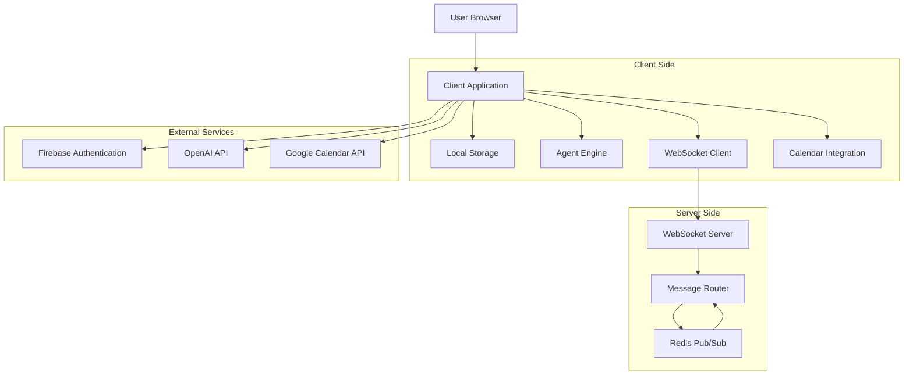
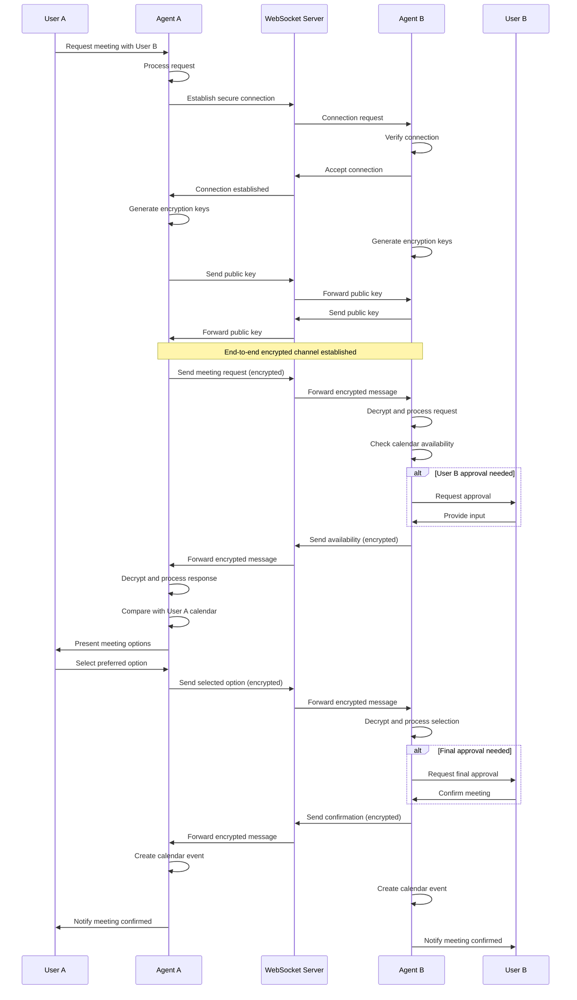
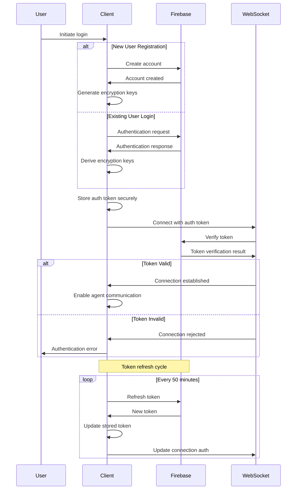
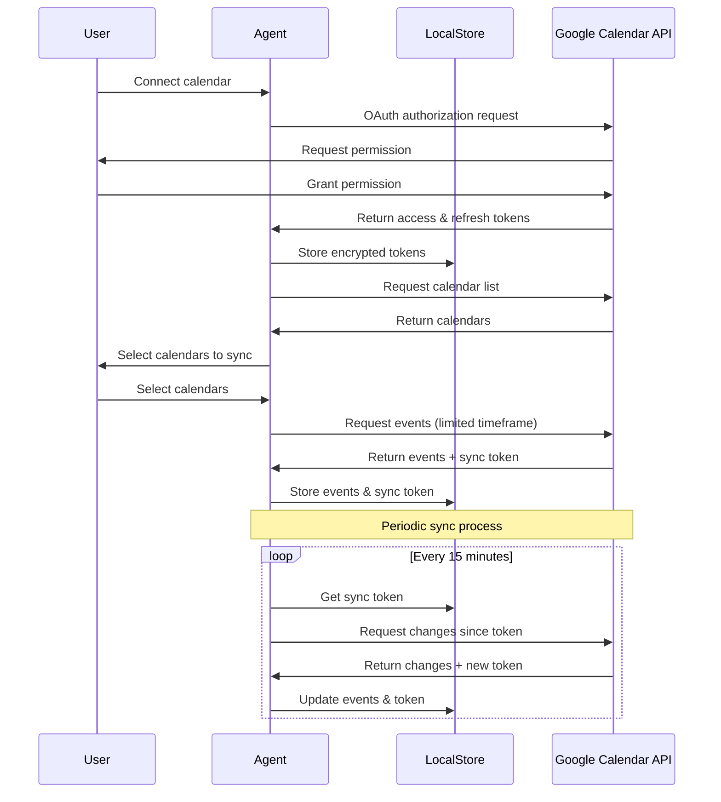

# Data Flow Architecture

## Introduction

This document provides a comprehensive overview of the data flow architecture in the AI Agent Network, a privacy-focused platform that enables users to create personalized AI assistants capable of communicating with each other to automate scheduling and coordination tasks. The data flow architecture is designed to prioritize user privacy by keeping personal data on the user's device while enabling secure agent-to-agent communication.

### Purpose

The purpose of this document is to detail how data moves through the system, including:

- Local storage of user data and preferences
- End-to-end encrypted agent-to-agent communication
- Secure integration with external services like Google Calendar
- Authentication flows and token management
- Data synchronization and conflict resolution

### Scope

This document covers the data flow across all major components of the AI Agent Network, including:

- Client-side storage and encryption
- WebSocket communication protocol
- External API integrations
- Authentication and authorization flows
- Data synchronization mechanisms

### Audience

This document is intended for software developers, system architects, technical leads, and other stakeholders involved in the development, maintenance, and evolution of the AI Agent Network.

## Data Flow Principles

The AI Agent Network follows several key principles that guide its data flow architecture:

### Privacy-First Design

- User data remains on the client device whenever possible
- Minimal data transmission to external services
- End-to-end encryption for all agent-to-agent communication
- Transparent data handling with user visibility and control

### Local-First Architecture

- Primary data storage in browser's IndexedDB and SQLite (via sql.js)
- Local processing of user commands and preferences
- Offline-capable core functionality
- Synchronization with external services only when necessary

### Minimal Server Footprint

- WebSocket server acts only as a message router
- No storage of message content on the server
- No centralized user data repository
- Server components limited to authentication verification and message routing

### Secure Communication

- End-to-end encryption for all agent-to-agent messages
- TLS for all external API communications
- Secure token storage for authentication
- Key rotation and perfect forward secrecy

## High-Level Data Flow

The following diagram illustrates the high-level data flow in the AI Agent Network:

The data flow follows these primary paths:

1. **User Data Flow**: User data remains on the client device in local storage
2. **Agent Communication Flow**: End-to-end encrypted messages between agents via WebSocket
3. **Authentication Flow**: Secure authentication via Firebase with local token storage
4. **Calendar Integration Flow**: Direct integration with Google Calendar API from the client
5. **AI Processing Flow**: Natural language processing via OpenAI API

## System Components Overview

The AI Agent Network consists of several key components that participate in the data flow:

1. **Client Application**: A Next.js-based web application that runs in the user's browser, providing the user interface and implementing the client-side logic.

2. **Local Storage**: Client-side storage mechanisms (IndexedDB, SQLite via sql.js) that securely store user data, preferences, and agent configurations on the user's device.

3. **Agent Engine**: Client-side processing engine that uses OpenAI's GPT-4o for natural language understanding and agent behavior.

4. **WebSocket Client**: Client-side communication module that establishes secure WebSocket connections for agent-to-agent communication.

5. **WebSocket Server**: Lightweight server that routes messages between agents without accessing message content.

6. **Firebase Authentication**: External service used for secure user identity management.

7. **Google Calendar API**: External service used for calendar integration and scheduling functionality.

8. **OpenAI API**: External service used for natural language processing and agent intelligence.

This component architecture ensures that sensitive operations and data storage happen on the client device, while the server components are limited to essential functions like message routing and authentication verification.

## Local Storage Architecture

The local storage architecture is central to the privacy-first approach of the AI Agent Network. All user data, preferences, and agent configurations are stored locally on the user's device.

### Storage Technologies

The system uses the following browser-based storage technologies:

- **IndexedDB**: Primary storage for structured data with support for indexes
- **SQLite** (via sql.js): Used for conversation history with SQL query capabilities
- **localStorage**: Used for small configuration items and encrypted tokens

These technologies provide a robust, persistent storage solution that keeps user data on their device rather than in the cloud.

### Data Schema

The local database is organized into several object stores:

- **Users**: User profile information and preferences
- **Agents**: Agent configurations and personalization settings
- **Conversations**: Metadata about agent-to-agent conversations
- **Messages**: Individual messages within conversations
- **Calendar Events**: Cached calendar data from Google Calendar
- **Connections**: Information about connected agents

Each object store has a defined schema with appropriate indexes for efficient querying.

### Data Encryption

Sensitive data stored locally is encrypted using AES-256-GCM encryption:

- Encryption keys are derived from user credentials using PBKDF2
- Different encryption keys are used for different data categories
- Initialization vectors (IVs) are generated randomly for each encryption operation
- Encrypted data includes the IV but not the encryption key

This ensures that even if the local storage is compromised, sensitive data remains protected.

### Storage Operations

The storage layer provides a comprehensive API for data operations:

- **Create**: Add new items to object stores
- **Read**: Retrieve items by key or query
- **Update**: Modify existing items
- **Delete**: Remove items from storage
- **Query**: Search for items based on indexes and filters
- **Transaction**: Execute multiple operations atomically

All operations that involve sensitive data automatically handle encryption and decryption.

### Backup and Recovery

The system includes mechanisms for data backup and recovery:

- User-initiated export of data to encrypted JSON files
- Import functionality to restore from backups
- Automatic recovery from corrupted data when possible
- Data integrity validation on application startup

These mechanisms ensure data durability while maintaining the privacy-first approach.

## Agent-to-Agent Communication Flow

Agent-to-agent communication is a core feature of the AI Agent Network, enabling agents to coordinate and negotiate on behalf of their users. This communication is implemented using a secure WebSocket protocol with end-to-end encryption.

### WebSocket Protocol

The WebSocket protocol enables real-time, bidirectional communication between agents:

- Socket.io is used for reliable WebSocket connections with fallback options
- Connections are established through a central WebSocket server
- The server acts only as a message router without accessing message content
- Connection state is managed with heartbeats and automatic reconnection

This approach enables real-time communication while maintaining the privacy-first design.

### Message Encryption

All agent-to-agent messages are end-to-end encrypted:

- X25519 key exchange is used to establish shared secrets between agents
- XChaCha20-Poly1305 is used for message encryption
- Ed25519 is used for message signing and verification
- Perfect forward secrecy is implemented through key rotation

This ensures that only the intended recipient can read message content, and the WebSocket server cannot access the plaintext messages.

### Message Flow

The message flow between agents follows this sequence:

This sequence ensures secure, transparent communication between agents while keeping users in control of the process.

### Message Types

The agent communication protocol defines several message types:

- **HANDSHAKE**: Establish secure connection and exchange public keys
- **QUERY**: Request information from another agent
- **RESPONSE**: Reply to a query with requested information
- **PROPOSAL**: Suggest meeting details or other arrangements
- **CONFIRMATION**: Accept a proposal
- **REJECTION**: Decline a proposal
- **HEARTBEAT**: Maintain connection status

Each message type has a defined structure and expected response pattern.

### Delivery Guarantees

The communication protocol includes mechanisms to ensure reliable message delivery:

- Message acknowledgements to confirm receipt
- Automatic retries for failed deliveries
- Message queuing for offline recipients
- Delivery status tracking and reporting

These mechanisms ensure that agent communications are reliable even in challenging network conditions.

## Authentication and Authorization Flow

The AI Agent Network uses Firebase Authentication for secure user identity management while maintaining the privacy-first approach.

### Authentication Flow

The authentication flow follows this sequence:

This approach ensures secure authentication while keeping token management on the client side.

### Token Management

Authentication tokens are managed securely:

- JWT tokens are used for authentication with Firebase and WebSocket server
- Tokens are stored in encrypted localStorage
- Automatic token refresh before expiration
- Token revocation on logout

This approach minimizes the risk of token theft while maintaining a seamless user experience.

### Authorization Model

The authorization model is primarily user-centric:

- Each user has full control over their own data
- Agent-to-agent communication requires explicit user approval
- External service access is limited to the minimum necessary permissions
- All authorization decisions are made on the client side

This model ensures that users maintain control over their data and agent actions.

### OAuth Integration

For external services like Google Calendar, OAuth 2.0 is used:

- OAuth flow is initiated from the client application
- Minimal scopes are requested (e.g., calendar.readonly when possible)
- OAuth tokens are stored in encrypted localStorage
- Automatic token refresh and secure token management

This approach ensures secure access to external services while maintaining user privacy.

## Calendar Integration Flow

The AI Agent Network integrates with Google Calendar to enable scheduling functionality while maintaining the privacy-first approach.

### OAuth Authentication

Calendar integration begins with OAuth authentication:

- User initiates calendar connection from the application
- OAuth 2.0 flow is initiated with Google
- User grants permission with minimal required scopes
- Access and refresh tokens are securely stored locally

This approach ensures secure access to calendar data with user consent.

### Calendar Synchronization

Calendar data is synchronized to local storage:

This approach minimizes API calls while keeping calendar data up-to-date.

### Incremental Synchronization

The calendar synchronization uses an incremental approach:

- Initial sync retrieves all events in a specified time range
- Subsequent syncs use a sync token to retrieve only changes
- Deleted events are tracked and removed from local storage
- Sync tokens are stored locally for efficient synchronization

This approach minimizes data transfer and API usage while maintaining data consistency.

### Conflict Resolution

When conflicts occur between local and remote calendar data:

- Timestamp-based resolution is used as the default strategy
- User-created events take precedence over agent-created events
- Conflicts are presented to the user when automatic resolution is not possible
- Resolution decisions are stored to inform future conflict handling

This approach ensures data consistency while respecting user intentions.

### Event Creation Flow

When creating calendar events:

- Events are first created in local storage
- Events are then synchronized to Google Calendar
- The Google Calendar event ID is stored with the local event
- Subsequent updates use the stored event ID for synchronization

This approach ensures that events are available locally even before they are synchronized to Google Calendar.

### Availability Checking

For scheduling purposes, availability is checked using:

- Local calendar data for the user's own availability
- Google Calendar API's freebusy endpoint for efficient availability checking
- Time slot generation based on user preferences
- Conflict detection with existing events

This approach provides efficient availability checking while respecting user privacy.

## AI Processing Flow

The AI Agent Network uses OpenAI's GPT-4o for natural language processing while maintaining the privacy-first approach.

### Command Processing

When a user issues a command:

- The command is processed locally to extract intent and parameters
- Minimal necessary context is sent to the OpenAI API
- The response is processed locally to extract structured information
- No user identification information is sent to the API

This approach minimizes data sharing while enabling powerful natural language processing.

### Context Management

Conversation context is managed carefully:

- Context is stored locally in the browser
- Context is summarized to minimize token usage
- Personal information is redacted from API requests when possible
- Context window is managed to stay within API limits

This approach balances the need for context-aware responses with privacy considerations.

### Prompt Engineering

Prompts are designed to minimize data exposure:

- Generic prompts that don't include personal information
- Structured output formats for consistent parsing
- Clear instructions to avoid generating sensitive content
- Minimal context inclusion in prompts

This approach ensures effective AI processing while protecting user privacy.

### Response Processing

AI responses are processed locally:

- Responses are parsed to extract structured information
- Actions are executed locally based on the parsed response
- Responses are cached locally to reduce API calls for similar requests
- Error handling and fallback mechanisms are implemented locally

This approach ensures that the application remains functional even with limited API access.

## Data Synchronization Patterns

While the AI Agent Network primarily uses a local-first approach, certain synchronization patterns are implemented for specific use cases.

### Calendar Synchronization

Calendar data is synchronized with Google Calendar:

- Bidirectional sync between local storage and Google Calendar
- Incremental sync using sync tokens for efficiency
- Conflict resolution with timestamp-based strategy
- Periodic background sync (every 15 minutes by default)

This synchronization is essential for the scheduling functionality of the application.

### User Preferences

User preferences are primarily local but can be exported:

- Preferences are stored locally in IndexedDB
- Users can export preferences as encrypted JSON
- Exported preferences can be imported on other devices
- No automatic synchronization of preferences

This approach gives users control over their preference data while enabling multi-device use.

### Agent Configurations

Agent configurations follow the same pattern as user preferences:

- Configurations are stored locally in IndexedDB
- Export/import functionality for multi-device use
- No automatic synchronization
- Device-specific adaptations when necessary

This approach maintains the privacy-first design while supporting multiple devices.

### Conversation History

Conversation history is device-specific:

- History is stored locally in SQLite (via sql.js)
- No synchronization between devices
- Optional export/import for backup purposes
- Automatic pruning of old conversations to manage storage

This approach treats conversation history as device-specific context rather than synchronized data.

## Error Handling and Recovery

The AI Agent Network implements robust error handling and recovery mechanisms to ensure data integrity and system reliability.

### Network Failures

When network failures occur:

- WebSocket connections attempt automatic reconnection with exponential backoff
- API requests are retried with appropriate backoff strategies
- Operations are queued for later execution when possible
- Users are notified of connectivity issues with clear status indicators

This approach ensures that the application remains functional even with intermittent connectivity.

### Data Corruption

In case of data corruption:

- Data integrity checks are performed on application startup
- Corrupted data is identified and isolated
- Recovery from backups is attempted when available
- Fallback to default values when recovery is not possible

This approach minimizes the impact of data corruption on the user experience.

### Synchronization Failures

When synchronization fails:

- The system tracks the last successful sync point
- Incremental sync is attempted from that point
- Conflict resolution is applied when inconsistencies are detected
- Manual sync options are provided for user intervention

This approach ensures data consistency even when synchronization encounters issues.

### API Limitations

To handle API limitations:

- Rate limiting is implemented for all external API calls
- Caching is used to reduce API usage
- Graceful degradation when API quotas are reached
- Background operations are prioritized to maximize foreground performance

This approach ensures that the application remains functional even with API constraints.

## Privacy Considerations

The data flow architecture of the AI Agent Network is designed with privacy as a fundamental principle.

### Data Minimization

The system implements data minimization principles:

- Only necessary data is collected and stored
- Data is stored locally whenever possible
- Minimal data is transmitted to external services
- Data is automatically pruned when no longer needed

This approach reduces privacy risks by minimizing the data footprint.

### User Control

Users maintain control over their data:

- Explicit consent for all data collection and sharing
- Clear visibility into agent-to-agent communications
- Ability to export, delete, or modify all stored data
- Granular permission controls for external services

This approach ensures that users understand and control how their data is used.

### Data Isolation

Data is isolated to prevent unauthorized access:

- User data is stored only on their own devices
- End-to-end encryption for all communications
- No central database of user information
- Separate encryption contexts for different data categories

This approach minimizes the risk of data breaches or unauthorized access.

### Transparency

The system provides transparency in data handling:

- Clear documentation of data flows and storage
- Visible agent-to-agent communications
- Explicit notification of external service usage
- Audit logs of data access and modifications

This approach builds trust by making data handling practices visible to users.

## Performance Optimization

The data flow architecture includes several performance optimizations to ensure a responsive user experience.

### Caching Strategies

The system implements multiple caching layers:

- In-memory cache for frequently accessed data
- IndexedDB cache for persistent data
- API response caching to reduce external calls
- Computed value caching for expensive operations

These caching strategies improve performance while reducing external API usage.

### Lazy Loading

Data is loaded lazily to optimize startup time:

- Essential data is loaded immediately
- Non-essential data is loaded on demand
- Background loading of likely-to-be-needed data
- Progressive enhancement of functionality

This approach ensures that the application is responsive from the start while loading additional data as needed.

### Batch Processing

Operations are batched when possible:

- Database operations are grouped into transactions
- API requests are batched to reduce overhead
- UI updates are batched to minimize rendering
- Background tasks are grouped for efficiency

This approach reduces overhead and improves overall system performance.

### Incremental Updates

Data is updated incrementally:

- Partial updates instead of full refreshes
- Differential synchronization with external services
- Progressive rendering of large datasets
- Optimistic UI updates with background confirmation

This approach improves perceived performance and reduces data transfer requirements.

## Conclusion

The data flow architecture of the AI Agent Network demonstrates how a privacy-first, local-first approach can be implemented while still providing powerful functionality. By keeping user data on their devices, using end-to-end encryption for communications, and minimizing server-side processing, the system provides strong privacy guarantees without compromising on features.

## References

- [Security Architecture](security.md): Detailed security mechanisms and protocols
- [WebSocket Protocol Documentation](../development/websocket-protocol.md): Detailed specification of the WebSocket protocol
- [Google Calendar API Documentation](https://developers.google.com/calendar/api/guides/overview): Official documentation for the Google Calendar API