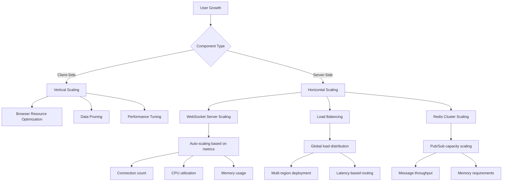
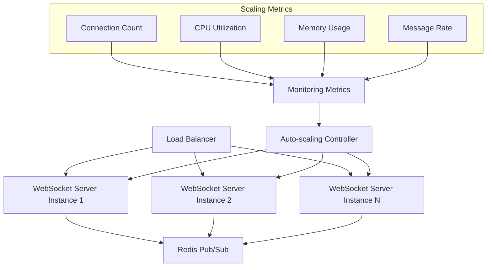
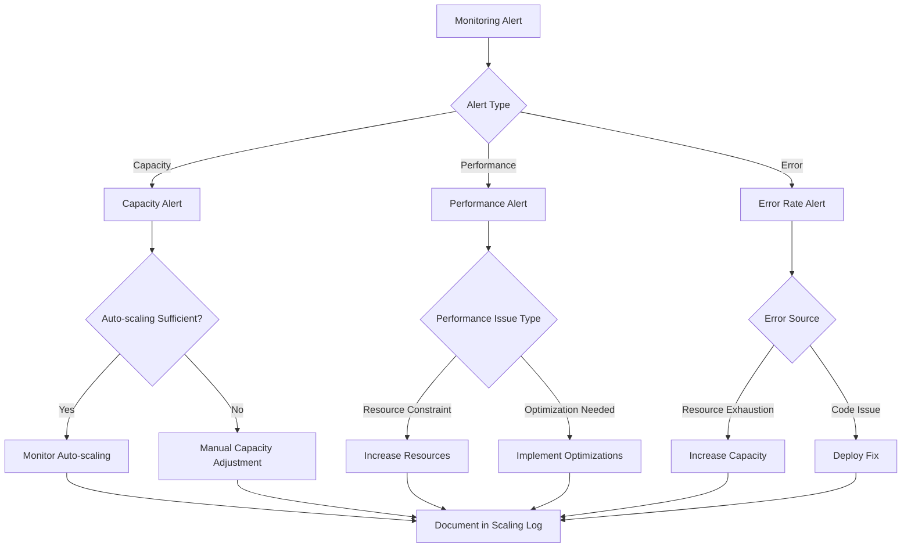

# AI Agent Network Scaling Architecture

## Introduction

This document provides a comprehensive overview of the scaling architecture for the AI Agent Network platform. It details the strategies, configurations, and best practices for ensuring the system can handle growing user loads while maintaining performance, reliability, and the privacy-first principles that are core to the platform's design.

### Purpose

The purpose of this document is to provide a detailed understanding of how the AI Agent Network scales to accommodate user growth, increased message volume, and varying load patterns. It serves as a reference for developers, system administrators, and operations teams responsible for maintaining and scaling the platform.

### Scope

This document covers the scaling architecture for all components of the AI Agent Network, with particular focus on the WebSocket server that enables agent-to-agent communication. It includes auto-scaling configurations, capacity planning guidelines, performance considerations, and monitoring strategies for scaling decisions.

### Audience

This document is intended for software developers, system architects, DevOps engineers, and operations staff involved in the deployment, maintenance, and scaling of the AI Agent Network platform.

## Scaling Architecture Overview

The AI Agent Network implements a hybrid scaling architecture that balances the privacy-first, local-first approach with the need for reliable agent-to-agent communication. The system consists of client-side components that scale vertically within browser constraints and server-side components that scale horizontally to handle increasing communication loads.

### Architectural Principles

The scaling architecture is guided by several key principles:

1. **Privacy Preservation**: Scaling decisions must maintain the privacy-first approach, keeping user data on client devices.
2. **Minimal Server Footprint**: Server components are limited to essential communication functions to minimize centralized infrastructure.
3. **Horizontal Scalability**: Server components are designed for horizontal scaling to handle growing user loads.
4. **Geographic Distribution**: Multi-region deployment ensures low latency for global users.
5. **Resource Efficiency**: Scaling is optimized to minimize resource usage and costs while maintaining performance.
6. **Graceful Degradation**: The system maintains core functionality even under extreme load conditions.

### Scaling Model

The AI Agent Network employs a hybrid scaling model:

This model allows the system to scale efficiently while maintaining the privacy-first architecture.

### Component Scaling Approaches

Different components of the system scale in different ways:

| Component | Scaling Approach | Scaling Trigger | Scaling Limit |
| --- | --- | --- | --- |
| Frontend Application | CDN distribution | User traffic | CDN capacity |
| Local Storage | Vertical (browser limits) | Data volume | Browser quota |
| Agent Engine | Optimized resource usage | Processing complexity | Client device capability |
| WebSocket Server | Horizontal (instance count) | Connection count, CPU usage | Cloud provider limits |
| Redis Pub/Sub | Horizontal (cluster size) | Message throughput | Cloud provider limits |

## Client-Side Scaling

The client-side components of the AI Agent Network run in the user's browser and scale vertically within the constraints of the browser environment. This section details the approaches used to optimize client-side performance and resource usage as user data and activity grow.

### Local Storage Optimization

As user data grows over time, the local storage can become a bottleneck. The following strategies are implemented to manage this growth:

1. **Data Pruning**: Automatic pruning of conversation history based on age and relevance
2. **Indexed Queries**: Optimized database queries using appropriate indexes
3. **Compression**: Compression of historical data to reduce storage requirements
4. **Storage Quotas**: Proactive management of browser storage quotas with user notifications
5. **Export/Import**: User-controlled data export and import for backup and storage management

### UI Performance Scaling

The user interface is optimized to maintain performance regardless of data volume:

1. **Code Splitting**: Dynamic loading of components to reduce initial load time
2. **Virtualized Lists**: Efficient rendering of large datasets using virtualization
3. **Memoization**: Caching of expensive computations and renders
4. **Lazy Loading**: On-demand loading of non-critical resources
5. **Progressive Enhancement**: Core functionality available on all devices with enhanced features on more capable devices

### Agent Processing Optimization

The Agent Engine's resource usage is optimized to handle increasing complexity:

1. **Context Management**: Efficient handling of conversation context to minimize token usage
2. **Batched Processing**: Grouping of similar operations for efficiency
3. **Caching**: Caching of AI responses for similar queries
4. **Background Processing**: Non-critical tasks executed during idle periods
5. **Adaptive Complexity**: Adjusting processing complexity based on device capabilities

### WebSocket Client Scaling

The WebSocket client is optimized for reliable communication:

1. **Connection Management**: Efficient handling of connection state
2. **Reconnection Strategy**: Exponential backoff for reconnection attempts
3. **Message Batching**: Grouping of messages when appropriate
4. **Binary Protocol**: Compact message format to reduce bandwidth
5. **Heartbeat Optimization**: Adaptive heartbeat intervals based on connection quality

## Server-Side Scaling

The server-side components of the AI Agent Network are designed for horizontal scaling to handle increasing user loads. This section details the scaling architecture for the WebSocket server and associated components.

### WebSocket Server Scaling

The WebSocket server is the primary server-side component and is designed for horizontal scaling:

The WebSocket server scales horizontally based on several metrics, with instances added or removed automatically as demand changes.

### Auto-scaling Configuration

The WebSocket server uses Cloud Run's auto-scaling capabilities with the following configuration:

| Metric | Threshold | Min Instances | Max Instances |
| --- | --- | --- | --- |
| Concurrent Connections | >200 per instance | 2 | 20 |
| CPU Utilization | >70% | 2 | 20 |
| Memory Utilization | >80% | 2 | 20 |

Key auto-scaling parameters include:

- **Minimum Instances**: 2 instances are maintained at all times for high availability
- **Maximum Instances**: Up to 20 instances can be provisioned during peak loads
- **Scale-Up Rate**: New instances are added within 30 seconds when thresholds are exceeded
- **Scale-Down Rate**: Instances are removed after 5 minutes of reduced load
- **CPU Throttling**: Disabled for consistent WebSocket performance
- **Startup CPU Boost**: Enabled for faster instance startup

### Load Balancing Strategy

Load balancing for the WebSocket server is implemented using Google Cloud Load Balancing:

1. **Global Load Balancer**: Distributes traffic across regions based on latency
2. **WebSocket Protocol Support**: Configured for WebSocket traffic with appropriate timeouts
3. **Session Affinity**: Maintains connection to the same instance for session duration
4. **Health Checks**: Regular health checks to detect and replace unhealthy instances
5. **Traffic Distribution**: Even distribution of new connections across healthy instances

### Redis Pub/Sub Scaling

Redis is used for cross-instance communication and scales as follows:

1. **Memory Allocation**: Configured with appropriate memory based on expected message volume
2. **Connection Pooling**: Efficient management of connections from WebSocket instances
3. **Monitoring**: Memory usage and operation rate monitoring for scaling decisions
4. **Cluster Mode**: For high-scale deployments, Redis can be configured in cluster mode
5. **Backup Strategy**: Regular snapshots for data durability

### Multi-Region Deployment

The WebSocket server is deployed across multiple geographic regions to ensure low latency for global users:

1. **Regional Instances**: WebSocket server instances deployed in multiple regions
2. **Global Routing**: Traffic routed to the nearest region based on user location
3. **Cross-Region Communication**: Messages between regions routed through Redis Pub/Sub
4. **Regional Failover**: Automatic failover to alternate regions in case of regional outage
5. **Consistent Configuration**: Standardized configuration across all regions

## Capacity Planning

Effective capacity planning ensures the AI Agent Network can handle expected user loads while maintaining performance and cost efficiency. This section provides guidelines for capacity planning based on user metrics and usage patterns.

### Capacity Metrics

Key metrics used for capacity planning include:

| Metric | Base Capacity | Scaling Increment | Maximum Capacity |
| --- | --- | --- | --- |
| Concurrent Users | 1,000 | +1,000 users = +1 instance | 100,000+ |
| WebSocket Connections | 2,000 | +1,000 connections = +1 instance | 200,000+ |
| Messages per Second | 200 | +100 msg/sec = +1 instance | 20,000+ |
| Data Storage per User | 50MB | N/A (client-side) | Browser limit |

These metrics guide infrastructure provisioning and scaling decisions.

### Resource Sizing Guidelines

Resource allocation is based on expected user load:

| Component | Small Deployment | Medium Deployment | Large Deployment |
| --- | --- | --- | --- |
| WebSocket Instances | 2-3 (2 vCPU, 2GB) | 5-10 (2 vCPU, 4GB) | 10+ (4 vCPU, 8GB) |
| Redis Cluster | 1 node (2GB) | 3 nodes (4GB each) | 5+ nodes (8GB each) |
| Load Balancer | Standard tier | Standard tier | Premium tier |
| Monitoring | Basic metrics | Enhanced metrics | Custom metrics + logging |

These guidelines provide a starting point for resource allocation based on expected user base size.

### Scaling Triggers and Procedures

Specific triggers initiate scaling actions:

| Trigger | Metric | Threshold | Action |
| --- | --- | --- | --- |
| User Growth | Monthly active users | >80% of current capacity | Increase base instance count |
| Peak Load | Concurrent connections | >70% of instance capacity | Adjust auto-scaling parameters |
| Message Volume | Messages per second | >60% of processing capacity | Optimize message handling |

When these thresholds are reached, the operations team should follow the scaling procedure documented in the operations manual.

### Cost Optimization

Scaling is balanced with cost considerations:

1. **Auto-scaling to Zero**: WebSocket server scales to minimum instances during low-usage periods
2. **Resource Right-sizing**: Regular review of instance sizes based on actual usage
3. **Regional Optimization**: Deployment focused on regions with highest user concentration
4. **Caching Strategies**: Reduced API calls through effective caching
5. **Monitoring-Based Optimization**: Regular review of metrics to identify optimization opportunities

## Performance Considerations

Maintaining performance while scaling is critical to user experience. This section details performance considerations and optimizations implemented in the scaling architecture.

### Performance Metrics

Key performance metrics monitored during scaling include:

| Metric | Target | Critical Threshold | Measurement Method |
| --- | --- | --- | --- |
| WebSocket Message Latency | <200ms | >1000ms | p95 latency measurement |
| API Response Time | <1s | >3s | p95 response time |
| Client Rendering Time | <2s | >5s | Core Web Vitals |
| Agent Processing Time | <3s | >8s | End-to-end timing |

These metrics are continuously monitored to ensure performance remains within acceptable limits as the system scales.

### Connection Optimization

WebSocket connections are optimized for performance at scale:

1. **Connection Pooling**: Efficient management of connections to backend services
2. **Timeout Configuration**: Appropriate timeout settings to balance resource usage and user experience
3. **Heartbeat Mechanism**: Optimized heartbeat intervals to maintain connections
4. **Backpressure Handling**: Flow control to prevent overwhelming busy instances
5. **Graceful Degradation**: Reduced functionality during extreme load conditions

### Message Optimization

Message handling is optimized for efficiency at scale:

1. **Binary Protocol**: Compact message format to reduce bandwidth and processing overhead
2. **Message Batching**: Grouping of related messages when appropriate
3. **Prioritization**: Critical messages processed before non-critical ones
4. **Compression**: Compression of large messages
5. **Schema Optimization**: Efficient message schema design

### Database Performance

Local database performance is optimized for scaling data volume:

1. **Indexing Strategy**: Appropriate indexes for common query patterns
2. **Query Optimization**: Efficient query design to minimize processing time
3. **Connection Management**: Proper handling of database connections
4. **Transaction Scoping**: Minimized transaction scope to reduce contention
5. **Data Partitioning**: Logical separation of data for query efficiency

## Monitoring and Scaling Decisions

Effective monitoring is essential for making informed scaling decisions. This section details the monitoring approach and how metrics inform scaling actions.

### Key Scaling Metrics

The following metrics are critical for scaling decisions:

1. **Connection Count**: Number of active WebSocket connections
2. **CPU Utilization**: CPU usage across WebSocket server instances
3. **Memory Usage**: Memory consumption of WebSocket server instances
4. **Message Rate**: Messages processed per second
5. **Error Rate**: Percentage of failed operations
6. **Latency**: Message delivery and processing time

These metrics are collected and analyzed to trigger automatic scaling and inform manual capacity adjustments.

### Monitoring Dashboard

A comprehensive monitoring dashboard provides visibility into scaling metrics:

1. **Real-time Metrics**: Current values of key scaling indicators
2. **Historical Trends**: Patterns over time to identify growth trends
3. **Capacity Indicators**: Visual representation of capacity utilization
4. **Alert Status**: Current alert conditions related to scaling
5. **Regional Distribution**: Metrics broken down by geographic region

The dashboard is accessible to operations staff and provides the information needed for scaling decisions.

### Alerting Thresholds

Alerts are configured to notify operations staff of potential scaling needs:

| Metric | Warning Threshold | Critical Threshold | Response |
| --- | --- | --- | --- |
| Connection Count | >70% capacity | >90% capacity | Review auto-scaling settings |
| CPU Utilization | >70% | >90% | Increase instance size or count |
| Memory Usage | >70% | >90% | Investigate memory usage patterns |
| Error Rate | >2% | >5% | Investigate and address errors |
| Message Latency | >500ms | >1000ms | Optimize message handling or add capacity |

These alerts provide early warning of scaling needs before user experience is impacted.

### Scaling Decision Framework

A structured framework guides scaling decisions:

This framework ensures consistent and appropriate responses to scaling-related alerts.

## Scaling Limitations and Constraints

While the AI Agent Network is designed for scalability, certain limitations and constraints affect scaling decisions. This section identifies these factors and provides strategies for addressing them.

### Client-Side Limitations

Browser environments impose certain limitations:

1. **Storage Quotas**: Browsers limit local storage capacity (typically 5-10% of available disk space)
2. **Connection Limits**: Browsers limit concurrent connections (typically 6-8 per domain)
3. **Processing Power**: Varies widely across devices, affecting agent performance
4. **Memory Constraints**: Browser tabs have limited memory allocation
5. **Battery Considerations**: Mobile devices require power-efficient operation

These limitations are addressed through efficient resource usage, data pruning, and graceful degradation on less capable devices.

### Server-Side Constraints

Server infrastructure has its own constraints:

1. **API Rate Limits**: External APIs (OpenAI, Google Calendar) have usage quotas
2. **Cost Scaling**: Infrastructure costs increase with scale
3. **Regional Availability**: Some regions may have limited service availability
4. **WebSocket Limitations**: WebSocket protocol has inherent limitations
5. **Redis Memory Limits**: Redis instances have maximum memory capacity

These constraints are managed through quota monitoring, cost optimization, multi-region deployment, and efficient protocol design.

### Scaling Bottlenecks

Potential bottlenecks that may limit scaling include:

1. **Redis Pub/Sub**: Can become a bottleneck at very high message volumes
2. **WebSocket Connection Establishment**: Can be resource-intensive during traffic spikes
3. **Database Operations**: Complex queries on large datasets can impact performance
4. **Authentication Service**: Firebase Authentication has its own scaling characteristics
5. **External API Dependencies**: Third-party services may have different scaling properties

These bottlenecks are monitored and addressed through architecture refinements, caching strategies, and service optimizations.

### Mitigation Strategies

Strategies to address scaling limitations include:

1. **Progressive Enhancement**: Core functionality works on all devices with enhanced features on more capable ones
2. **Graceful Degradation**: Reduced functionality during extreme load conditions
3. **Asynchronous Processing**: Non-critical operations deferred during peak loads
4. **Caching Strategies**: Reduced dependency on external services through caching
5. **User Education**: Clear communication about storage management and limitations

## Disaster Recovery and Resilience

The scaling architecture includes provisions for disaster recovery and resilience to ensure system availability even during unexpected events or extreme scaling conditions.

### Resilience Patterns

The following resilience patterns are implemented:

1. **Circuit Breakers**: Prevent cascading failures during service disruptions
2. **Bulkheads**: Isolate components to contain failures
3. **Timeouts**: Prevent resource exhaustion from slow responses
4. **Retry with Backoff**: Graceful handling of transient failures
5. **Fallbacks**: Alternative functionality when primary services are unavailable

These patterns ensure the system remains operational even when components fail or are under extreme load.

### Regional Failover

Multi-region deployment enables regional failover:

1. **Active-Active Deployment**: All regions actively serve traffic
2. **Health Monitoring**: Continuous monitoring of regional health
3. **Traffic Shifting**: Automatic redirection of traffic from unhealthy regions
4. **Data Synchronization**: Minimal cross-region state maintained through Redis
5. **Independent Scaling**: Each region scales independently based on local demand

### Load Shedding

During extreme conditions, load shedding preserves core functionality:

1. **Critical Path Identification**: Essential functions preserved during overload
2. **Non-critical Deferral**: Less important operations temporarily disabled
3. **Throttling**: Rate limiting applied to preserve system stability
4. **Degraded Service Modes**: Reduced functionality modes for extreme conditions
5. **User Communication**: Clear messaging about temporary limitations

### Recovery Procedures

Documented procedures ensure rapid recovery from scaling-related incidents:

1. **Scaling Incident Response**: Immediate actions for scaling emergencies
2. **Capacity Restoration**: Steps to restore normal capacity after incidents
3. **Post-Incident Analysis**: Process for learning from scaling incidents
4. **Preventive Measures**: Implementation of lessons learned
5. **Testing and Validation**: Regular testing of recovery procedures

## Future Scaling Considerations

As the AI Agent Network evolves, additional scaling considerations will need to be addressed. This section outlines future scaling directions and preparations.

### Advanced Scaling Techniques

Future scaling enhancements may include:

1. **Predictive Scaling**: Using AI to predict and prepare for usage spikes
2. **Serverless WebSockets**: Exploring fully serverless WebSocket implementations
3. **Edge Computing**: Moving certain processing closer to users
4. **Custom Load Balancing**: More sophisticated load distribution algorithms
5. **Adaptive Resource Allocation**: Dynamic resource adjustment based on workload characteristics

### Enterprise Scaling

Supporting enterprise deployments will require:

1. **Multi-tenant Architecture**: Efficient resource sharing across enterprise users
2. **Isolated Deployments**: Option for dedicated infrastructure for large enterprises
3. **Enhanced Security Scaling**: Additional security measures at enterprise scale
4. **Administrative Controls**: Tools for enterprise-wide management
5. **Integration Scaling**: Handling enterprise integration volume

### Mobile Application Considerations

Future mobile applications will introduce new scaling factors:

1. **Push Notification Scale**: Managing high-volume notification delivery
2. **Offline Synchronization**: Efficient data sync for intermittent connectivity
3. **Battery Optimization**: Scaling while preserving battery life
4. **Cross-Device Synchronization**: Managing user data across multiple devices
5. **Native Performance**: Optimizing for native app performance characteristics

### Global Expansion

Expanding to a truly global user base will require:

1. **Additional Regions**: Deployment in more geographic regions
2. **Localization Scaling**: Managing multiple languages and regional preferences
3. **Compliance Variations**: Adapting to regional regulatory requirements
4. **Network Optimization**: Addressing varying network conditions globally
5. **Cultural Adaptations**: Scaling personalization across cultural contexts

## Conclusion

The scaling architecture of the AI Agent Network balances the privacy-first, local-first approach with the need for reliable, performant operation at scale. By implementing a hybrid scaling model—vertical scaling for client-side components and horizontal scaling for server-side components—the system can accommodate growing user loads while maintaining its core privacy principles.

The WebSocket server's auto-scaling configuration, multi-region deployment, and comprehensive monitoring ensure reliable agent-to-agent communication regardless of user load. Meanwhile, client-side optimizations ensure efficient operation within browser constraints.

By following the capacity planning guidelines and monitoring the key scaling metrics, operations teams can ensure the AI Agent Network delivers a consistent, high-quality user experience as it grows from small deployments to large-scale implementations serving hundreds of thousands of users.

## References

- **System Architecture**: For information about the overall system architecture of the AI Agent Network
- **Infrastructure Terraform**: Production environment configuration in [infrastructure/terraform/environments/production/main.tf](../../infrastructure/terraform/environments/production/main.tf)
- [WebSocket Server Configuration](../../infrastructure/cloud-run/websocket-service.yaml): Cloud Run service configuration for the WebSocket server
- [Monitoring Dashboard](../../infrastructure/monitoring/dashboards/websocket-metrics.json): WebSocket server monitoring dashboard configuration
- [Google Cloud Run Documentation](https://cloud.google.com/run/docs/configuring/autoscaling): Official documentation on Cloud Run auto-scaling
- [Vercel Documentation](https://vercel.com/docs/concepts/edge-network/overview): Vercel edge network and scaling capabilities