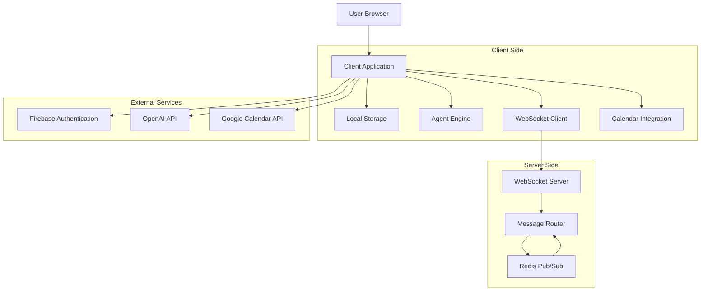

# AI Agent Network System Architecture Overview

## Introduction

This document provides a comprehensive overview of the AI Agent Network system architecture, a lightweight, privacy-focused platform that enables users to create personalized AI assistants capable of communicating with each other to automate scheduling and coordination tasks.

### Purpose

The purpose of this document is to provide a high-level understanding of the AI Agent Network's architecture, components, and design principles. It serves as an entry point to more detailed architectural documentation and provides context for developers, architects, and other stakeholders.

### Scope

This document covers the overall system architecture, key components, their interactions, and the fundamental design principles that guide the implementation. It references more detailed documentation for specific aspects such as data flow, security, and scaling.

### Audience

This document is intended for software developers, system architects, technical leads, and other stakeholders involved in the development, maintenance, and evolution of the AI Agent Network.

## Architectural Principles

The AI Agent Network is built on several key architectural principles that guide its design and implementation:

### Privacy-First Design

The system prioritizes user privacy by keeping personal data on the user's device rather than in the cloud. This local-first approach ensures users maintain complete control over their data while still enabling powerful AI assistant capabilities.

### Local-First Architecture

User data, preferences, and agent configurations are stored locally on the user's device using browser storage technologies (IndexedDB, SQLite via sql.js). This minimizes the need for central data storage and reduces privacy risks.

### Minimal Server Footprint

The server component is limited to a WebSocket relay service that routes encrypted messages between agents without accessing message content. This maintains the privacy-first approach while enabling agent-to-agent communication.

### End-to-End Encryption

All communication between agents is end-to-end encrypted, ensuring that even the WebSocket relay server cannot read message contents. This provides strong privacy guarantees for user interactions.

### Transparent Operation

Agent-to-agent communications are displayed to users in a human-readable format, ensuring transparency and building trust in the automated processes.

### Progressive Enhancement

The system is designed to provide core functionality across different devices and browsers, with enhanced capabilities available on more capable platforms.

## System Overview

The AI Agent Network consists of several key components that work together to provide a secure, privacy-focused platform for AI assistants:

### High-Level Architecture

The architecture follows a client-heavy approach with minimal server-side processing, keeping user data on the client device while enabling secure communication between agents.

### Key Components

The system consists of the following key components:

1. **Client Application**: A Next.js/React web application that runs in the user's browser
2. **Local Storage**: Client-side storage using IndexedDB and SQLite (via sql.js) for user data
3. **Agent Engine**: Processes natural language and manages agent behavior
4. **WebSocket Client**: Enables secure communication with other agents
5. **Calendar Integration**: Connects with Google Calendar for scheduling
6. **WebSocket Server**: Routes encrypted messages between agents
7. **Authentication Service**: Firebase Authentication for user identity
8. **AI Processing**: OpenAI GPT-4o for natural language understanding

### Component Interactions

The components interact in the following ways:

1. Users interact with the Client Application through a web browser
2. The Client Application stores user data in Local Storage
3. The Agent Engine processes user commands and generates responses
4. When coordination is needed, the WebSocket Client establishes secure connections
5. The WebSocket Server routes encrypted messages between agents
6. The Calendar Integration syncs with Google Calendar for scheduling
7. Firebase Authentication manages user identity and security
8. OpenAI GPT-4o provides natural language processing capabilities

### Deployment Model

The system employs a hybrid deployment model:

1. **Client Application**: Deployed on Vercel with global CDN distribution
2. **WebSocket Server**: Deployed on Google Cloud Run with multi-region availability
3. **Authentication**: Managed Firebase Authentication service
4. **Local Storage**: Runs entirely in the user's browser
5. **External APIs**: Accessed directly from the client application

## Client-Side Architecture

The client-side architecture is the core of the AI Agent Network, implementing most of the system's functionality while maintaining the privacy-first approach:

### Frontend Framework

The client application is built using Next.js 14+ and React 18+, providing a modern, component-based architecture with excellent performance and developer experience. Key aspects include:

- Server-side rendering capabilities for improved initial load performance
- Client-side routing for smooth navigation
- API routes for backend functionality
- TypeScript for type safety and improved developer experience

### State Management

State management is implemented using Zustand, a lightweight state management library that provides:

- Global state stores for authentication, agent configuration, calendar data, etc.
- Persistent state with local storage integration
- Efficient updates with minimal re-renders
- TypeScript integration for type-safe state

### Local Storage Architecture

The local storage architecture is central to the privacy-first approach:

- **IndexedDB**: Primary storage for structured data with support for indexes
- **SQLite** (via sql.js): Used for conversation history with SQL query capabilities
- **localStorage**: Used for small configuration items and encrypted tokens
- **Encryption**: AES-256-GCM encryption for sensitive stored data

### Agent Engine

The Agent Engine processes user commands and manages agent behavior:

- Natural language processing using OpenAI GPT-4o
- Context management for conversation history
- Task execution for scheduling and coordination
- Decision-making based on user preferences and calendar data

### WebSocket Client

The WebSocket Client enables secure communication with other agents:

- Socket.io client for reliable WebSocket connections
- End-to-end encryption for message security
- Connection management with automatic reconnection
- Message delivery guarantees with acknowledgements

### Calendar Integration

The Calendar Integration connects with Google Calendar:

- OAuth 2.0 authentication for secure access
- Local caching of calendar data for privacy
- Incremental synchronization for efficiency
- Event creation and management

## Server-Side Architecture

The server-side architecture is intentionally minimal, focusing primarily on enabling secure agent-to-agent communication without accessing message content:

### WebSocket Server

The WebSocket Server is the primary server-side component:

- Built with Node.js and Socket.io
- Deployed on Google Cloud Run for scalability
- Stateless design for horizontal scaling
- Redis adapter for message routing across instances

### Authentication Integration

The server integrates with Firebase Authentication:

- JWT validation for secure connections
- User identity verification
- Connection authorization
- Session management

### Message Routing

The server routes messages between agents without accessing content:

- Binary message format for efficiency
- No message content storage
- Delivery acknowledgements
- Connection status tracking

### Scaling Architecture

The server is designed for horizontal scaling:

- Multiple instances behind a load balancer
- Redis Pub/Sub for cross-instance communication
- Auto-scaling based on connection count and CPU utilization
- Multi-region deployment for global availability

## Data Architecture

The data architecture emphasizes local storage and minimal data transmission to maintain privacy:

### Data Storage Model

The system uses a local-first data storage model:

- User profiles and preferences stored in IndexedDB
- Agent configurations stored in IndexedDB
- Conversation history stored in SQLite (via sql.js)
- Calendar data cached locally in IndexedDB
- Authentication tokens stored in encrypted localStorage

### Data Schema

The local database is organized into several object stores:

- **Users**: User profile information and preferences
- **Agents**: Agent configurations and personalization settings
- **Conversations**: Metadata about agent-to-agent conversations
- **Messages**: Individual messages within conversations
- **Calendar Events**: Cached calendar data from Google Calendar
- **Connections**: Information about connected agents

### Data Flow

The data flow architecture maintains privacy while enabling functionality:

- User data remains on the client device
- Agent-to-agent communication is end-to-end encrypted
- Calendar data is synced directly between client and Google Calendar
- Authentication uses standard OAuth flows
- AI processing sends minimal data to OpenAI API

### Data Security

Data security is implemented at multiple levels:

- AES-256-GCM encryption for local storage
- End-to-end encryption for agent communication
- TLS for all external API calls
- Secure token storage
- Minimal data collection and transmission

## Security Architecture

The security architecture implements multiple layers of protection to ensure user privacy and data security:

### Authentication Framework

The authentication framework uses Firebase Authentication:

- Email/password and Google sign-in options
- JWT tokens for secure sessions
- Token refresh mechanism
- Optional multi-factor authentication

### End-to-End Encryption

Agent-to-agent communication uses strong encryption:

- X25519 key exchange for shared secrets
- XChaCha20-Poly1305 for message encryption
- Ed25519 for message signing
- Perfect forward secrecy with key rotation

### Local Data Protection

Local data is protected with encryption:

- AES-256-GCM for sensitive stored data
- Key derivation from user credentials
- Hierarchical key structure for compartmentalization
- Secure key storage

### API Security

External API calls implement security best practices:

- TLS 1.3 for all communications
- API key security for OpenAI
- OAuth 2.0 with minimal scopes for Google Calendar
- JWT validation for WebSocket connections

## Integration Architecture

The system integrates with several external services while maintaining privacy and security:

### Firebase Authentication

Integration with Firebase Authentication provides secure user identity management:

- User registration and login
- Session management
- JWT token generation and validation
- OAuth integration for Google sign-in

### OpenAI GPT-4o

Integration with OpenAI GPT-4o provides natural language processing capabilities:

- Command interpretation
- Response generation
- Context management
- Minimal data transmission with privacy focus

### Google Calendar

Integration with Google Calendar enables scheduling functionality:

- OAuth 2.0 authentication
- Calendar event retrieval and creation
- Availability checking
- Local caching for privacy

### WebSocket Communication

The WebSocket integration enables agent-to-agent communication:

- Socket.io for reliable connections
- Binary message format for efficiency
- End-to-end encryption for privacy
- Connection management with reconnection

## Deployment Architecture

The deployment architecture leverages cloud services while maintaining the privacy-first approach:

### Frontend Deployment

The frontend is deployed on Vercel:

- Global CDN for low-latency access
- Automatic scaling for traffic spikes
- Serverless functions for API routes
- Continuous deployment from GitHub

### WebSocket Server Deployment

The WebSocket server is deployed on Google Cloud Run:

- Containerized deployment with Docker
- Auto-scaling based on demand
- Multi-region deployment for global availability
- Load balancing for traffic distribution

### Infrastructure as Code

Infrastructure is managed using Terraform:

- Declarative infrastructure definition
- Version-controlled configuration
- Environment-specific settings
- Automated deployment through CI/CD

### Monitoring and Observability

The system implements comprehensive monitoring:

- Cloud Monitoring for server metrics
- Custom metrics for WebSocket performance
- Client-side error tracking
- Privacy-respecting analytics

## Scaling Architecture

The scaling architecture ensures the system can handle growing user loads while maintaining performance and reliability:

### Client-Side Scaling

Client-side components scale vertically within browser constraints:

- Efficient resource usage
- Data pruning for storage management
- Performance optimizations for UI rendering
- Background processing for non-critical tasks

### WebSocket Server Scaling

The WebSocket server scales horizontally to handle increasing connections:

- Multiple instances behind a load balancer
- Redis Pub/Sub for cross-instance communication
- Auto-scaling based on connection count and CPU utilization
- Connection pooling for efficient resource usage

### Multi-Region Deployment

Geographic distribution ensures low latency for global users:

- Deployment across multiple regions
- Global load balancing with latency-based routing
- Regional redundancy for fault tolerance
- Cross-region message routing

### Resource Optimization

Resource usage is optimized for efficiency and cost-effectiveness:

- Stateless server design for easy scaling
- Efficient message format to reduce bandwidth
- Caching strategies to reduce API calls
- Automatic scaling to match demand

## Development Architecture

The development architecture supports efficient development, testing, and deployment:

### Project Structure

The codebase is organized into logical components:

- `src/web`: Frontend application code
- `src/backend`: WebSocket server code
- `infrastructure`: Terraform and deployment configuration
- `docs`: Architecture and development documentation

### Development Environment

The development environment is standardized:

- Node.js 18+ LTS
- npm/yarn for package management
- Docker for containerized development
- VS Code with standardized extensions

### Testing Strategy

Comprehensive testing ensures quality and reliability:

- Jest for unit testing
- React Testing Library for component testing
- Playwright for end-to-end testing
- Load testing for WebSocket performance

### CI/CD Pipeline

Automated pipelines streamline development and deployment:

- GitHub Actions for CI/CD
- Automated testing on pull requests
- Deployment to staging and production environments
- Security scanning and dependency checks

## Future Architecture Considerations

Several areas are identified for future architectural evolution:

### Mobile Applications

Native mobile applications could extend the platform:

- React Native for cross-platform development
- Native WebSocket implementations
- Mobile-optimized storage
- Push notification integration

### Enterprise Features

Enterprise-focused features could be added:

- Team management and sharing
- Enterprise SSO integration
- Advanced compliance features
- Custom deployment options

### Advanced AI Capabilities

AI capabilities could be enhanced:

- Multi-agent coordination
- Domain-specific training
- Voice and image processing
- Contextual learning from user behavior

### Expanded Integrations

Additional integrations could broaden functionality:

- Microsoft 365 calendar integration
- CRM system integration
- Project management tool integration
- Communication platform integration

## Conclusion

The AI Agent Network architecture demonstrates how a privacy-first, local-first approach can be implemented while still providing powerful functionality. By keeping user data on their devices, using end-to-end encryption for communications, and minimizing server-side processing, the system provides strong privacy guarantees without compromising on features.

## References

- [Data Flow Architecture](data-flow.md): Detailed explanation of data flows within the system
- [Security Architecture](security.md): Comprehensive documentation of security mechanisms
- [Scaling Architecture](scaling.md): Details on how the system scales to accommodate growth