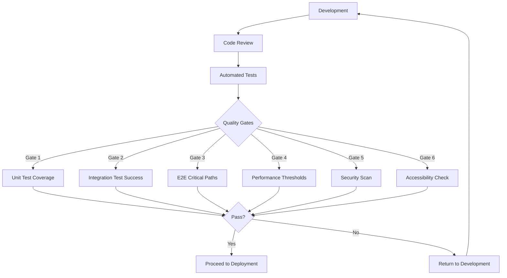

## Introduction

This document outlines the comprehensive testing strategy for the AI Agent Network, a privacy-focused platform for seamless scheduling and communication. The testing approach is designed to ensure the reliability, security, and performance of the system while maintaining its privacy-first principles. The document covers unit testing, integration testing, end-to-end testing, and specialized testing approaches, as well as test automation and quality metrics.

## Testing Approach

The AI Agent Network employs a multi-layered testing strategy to ensure comprehensive coverage across all system components. This approach balances thorough testing with development efficiency, focusing on critical paths and privacy-related functionality.

### Unit Testing

Unit tests verify the functionality of individual components in isolation, using mocks for dependencies. The project uses Jest // package_name: jest, version: 29.0+ as the primary testing framework, with React Testing Library // package_name: @testing-library/react, version: 14.0+ for component testing.

```typescript
import { render, screen, fireEvent } from '@testing-library/react';
import { LoginForm } from '../components/auth/LoginForm';

describe('LoginForm Component', () => {
  test('should render login form with all required fields', () => {
    render(<LoginForm />);
    expect(screen.getByLabelText(/email/i)).toBeInTheDocument();
    expect(screen.getByLabelText(/password/i)).toBeInTheDocument();
    expect(screen.getByRole('button', { name: /sign in/i })).toBeInTheDocument();
  });

  test('should validate email format', () => {
    render(<LoginForm />);
    const emailInput = screen.getByLabelText(/email/i);
    fireEvent.change(emailInput, { target: { value: 'invalid-email' } });
    fireEvent.blur(emailInput);
    expect(screen.getByText(/valid email/i)).toBeInTheDocument();
  });
});
```

```typescript
import { StorageService } from '../../services/storage.service';
import { EncryptionService } from '../../services/encryption.service';
import { StorageType, StorageEncryptionLevel } from '../../lib/types/storage.types';

describe('StorageService', () => {
  let storageService: StorageService;
  let mockEncryptionService: jest.Mocked<EncryptionService>;

  beforeEach(() => {
    mockEncryptionService = {
      initialize: jest.fn().mockResolvedValue(true),
      isInitialized: jest.fn().mockReturnValue(true),
      encryptObject: jest.fn().mockImplementation(obj => JSON.stringify(obj)),
      decryptObject: jest.fn().mockImplementation(str => JSON.parse(str)),
      getEncryptionLevel: jest.fn().mockReturnValue(StorageEncryptionLevel.STANDARD)
    } as any;

    storageService = new StorageService(mockEncryptionService);
  });

  test('should initialize with default options', async () => {
    await storageService.initialize();
    expect(storageService.isInitialized()).toBe(true);
    expect(storageService.getStorageType()).toBe(StorageType.INDEXED_DB);
  });
});
```

| Tool | Purpose |
| --- | --- |
| Jest | Primary testing framework for running unit tests |
| React Testing Library | Testing React components with a user-centric approach |
| jest-dom | Custom matchers for DOM testing |
| MSW (Mock Service Worker) | API mocking for unit tests |

Best Practices:

*   Co-locate tests with source files in `__tests__` directories
*   Use descriptive test names that explain the expected behavior
*   Mock external dependencies to isolate the unit under test
*   Test both success and failure paths
*   Verify component rendering, user interactions, and state changes
*   Use data-testid attributes sparingly, prefer accessible roles and labels

### Integration Testing

Integration tests verify that multiple components work together correctly. These tests focus on the interactions between components, services, and external APIs, with controlled test environments.

```typescript
import { createRequest, createResponse } from 'node-mocks-http';
import { authController } from '../controllers/auth.controller';
import { authService } from '../services/auth.service';

describe('Auth Controller Integration', () => {
  test('should authenticate user with valid credentials', async () => {
    // Setup
    const req = createRequest({
      method: 'POST',
      body: {
        email: 'test@example.com',
        password: 'password123'
      }
    });
    const res = createResponse();
    
    // Execute
    await authController.login(req, res);
    
    // Verify
    expect(res.statusCode).toBe(200);
    expect(res._getJSONData()).toHaveProperty('token');
    expect(res._getJSONData()).toHaveProperty('user');
  });
});
```

```typescript
import { createServer } from 'http';
import { Server } from 'socket.io';
import { io as ioc } from 'socket.io-client';
import { setupWebSocketServer } from '../services/websocket.service';

describe('WebSocket Service Integration', () => {
  let httpServer;
  let serverSocket;
  let clientSocket;

  beforeAll((done) => {
    httpServer = createServer();
    serverSocket = new Server(httpServer);
    setupWebSocketServer(serverSocket);
    httpServer.listen(() => {
      const port = httpServer.address().port;
      clientSocket = ioc(`http://localhost:${port}`);
      clientSocket.on('connect', done);
    });
  });

  afterAll(() => {
    serverSocket.close();
    clientSocket.close();
    httpServer.close();
  });

  test('should establish connection and exchange messages', (done) => {
    clientSocket.emit('message', {
      type: 'HANDSHAKE',
      agentId: 'test-agent',
      publicKey: 'mock-public-key'
    });

    clientSocket.on('message', (data) => {
      expect(data).toHaveProperty('type', 'HANDSHAKE_ACK');
      done();
    });
  });
});
```

| Tool | Purpose |
| --- | --- |
| Jest | Running integration tests |
| Supertest | Testing HTTP endpoints |
| Socket.io-client | Testing WebSocket communication |
| node-mocks-http | Mocking HTTP requests and responses |
| fake-indexeddb | In-memory implementation of IndexedDB for testing |

Best Practices:

*   Use controlled test environments with predictable state
*   Test the full request/response cycle for API endpoints
*   Verify data persistence and retrieval across components
*   Test error handling and edge cases
*   Use realistic test data that mimics production scenarios
*   Clean up test data and connections after tests

### End-to-End Testing

End-to-end (E2E) tests verify the entire application workflow from the user's perspective. These tests simulate real user interactions across multiple pages and features, ensuring that the complete system works correctly.

```typescript
import { test, expect } from '@playwright/test';

test.describe('User Authentication Flow', () => {
  test('should allow user to register and login', async ({ page }) => {
    // Registration
    await page.goto('/auth/register');
    await page.fill('input[name="email"]', 'test@example.com');
    await page.fill('input[name="password"]', 'Password123!');
    await page.fill('input[name="confirmPassword"]', 'Password123!');
    await page.click('button[type="submit"]');
    
    // Verify registration success
    await expect(page).toHaveURL('/dashboard');
    
    // Logout
    await page.click('button[aria-label="User menu"]');
    await page.click('text=Logout');
    
    // Login
    await page.goto('/auth/login');
    await page.fill('input[name="email"]', 'test@example.com');
    await page.fill('input[name="password"]', 'Password123!');
    await page.click('button[type="submit"]');
    
    // Verify login success
    await expect(page).toHaveURL('/dashboard');
    await expect(page.locator('h1')).toContainText('Dashboard');
  });
});
```

```typescript
import { test, expect } from '@playwright/test';

test.describe('Agent Chat and Scheduling', () => {
  test.beforeEach(async ({ page }) => {
    // Login and navigate to agent chat
    await page.goto('/auth/login');
    await page.fill('input[name="email"]', 'test@example.com');
    await page.fill('input[name="password"]', 'Password123!');
    await page.click('button[type="submit"]');
    await page.click('a[href="/agent"]');
  });

  test('should process scheduling command and show agent response', async ({ page }) => {
    // Type scheduling command
    await page.fill('input[placeholder="Type your message..."]', 'Schedule a meeting with John tomorrow at 2pm');
    await page.click('button[aria-label="Send message"]');
    
    // Verify agent response
    await expect(page.locator('.agent-message')).toContainText('I\'ll help you schedule a meeting with John');
    
    // Verify agent-to-agent conversation appears
    await expect(page.locator('.agent-conversation')).toBeVisible();
    await expect(page.locator('.agent-conversation')).toContainText('Your Agent: Hello John\'s agent');
    
    // Verify approval request
    await expect(page.locator('.approval-request')).toBeVisible();
    await page.click('button:has-text("Approve")');
    
    // Verify confirmation
    await expect(page.locator('.agent-message')).toContainText('Meeting confirmed');
  });
});
```

| Tool | Purpose |
| --- | --- |
| Playwright // package_name: @playwright/test, version: 1.30+ | Browser automation for E2E testing |
| Lighthouse CI | Performance testing in E2E workflows |
| axe-core | Accessibility testing in E2E workflows |
| Percy | Visual regression testing |

Best Practices:

*   Focus on critical user journeys and high-value features
*   Use realistic test data and environments
*   Test across multiple browsers (Chrome, Firefox, Safari)
*   Include mobile viewport testing
*   Implement test isolation to prevent test interdependence
*   Use explicit waiting for UI elements and network requests
*   Capture screenshots and videos for failed tests
*   Implement retry logic for flaky tests

### Specialized Testing

Specialized testing focuses on specific aspects of the application such as security, accessibility, performance, and compatibility. These tests ensure that the application meets non-functional requirements and provides a high-quality user experience.

#### Security Testing

Security testing verifies that the application protects user data and prevents unauthorized access. This includes testing authentication, authorization, encryption, and protection against common vulnerabilities.

| Tool | Purpose |
| --- | --- |
| OWASP ZAP | Automated security scanning |
| Snyk | Dependency vulnerability scanning |
| ESLint security plugins | Static code analysis for security issues |
| npm audit | Dependency vulnerability checking |

Test Scenarios:

*   Authentication bypass attempts
*   JWT token manipulation
*   WebSocket message tampering
*   End-to-end encryption verification
*   Local storage security
*   API rate limiting and protection
*   Cross-site scripting (XSS) prevention
*   Cross-site request forgery (CSRF) prevention

#### Accessibility Testing

Accessibility testing ensures that the application is usable by people with disabilities. This includes testing keyboard navigation, screen reader compatibility, color contrast, and other accessibility features.

| Tool | Purpose |
| --- | --- |
| axe-core | Automated accessibility testing |
| Lighthouse | Accessibility auditing |
| NVDA | Screen reader testing |
| VoiceOver | Screen reader testing on macOS/iOS |

Test Scenarios:

*   Keyboard navigation through all interactive elements
*   Screen reader announcement of dynamic content
*   Color contrast compliance (WCAG AA)
*   Text resizing up to 200%
*   Form field labeling and error messages
*   Focus management and visible focus indicators
*   Alternative text for images and icons
*   Semantic HTML structure

#### Performance Testing

Performance testing measures the responsiveness, stability, and resource usage of the application under various conditions. This includes load testing, stress testing, and monitoring of key performance metrics.

| Tool | Purpose |
| --- | --- |
| Lighthouse | Performance metrics measurement |
| Web Vitals | Core Web Vitals monitoring |
| k6 | Load testing for WebSocket server |
| Chrome DevTools | Performance profiling |

Test Scenarios:

*   Page load performance (First Contentful Paint < 1.5s)
*   Time to Interactive (< 3.0s)
*   WebSocket message round-trip time (< 200ms)
*   API response time (< 1.0s)
*   Local storage operations performance
*   Concurrent WebSocket connections handling
*   Memory usage monitoring
*   CPU utilization during intensive operations

#### Compatibility Testing

Compatibility testing verifies that the application works correctly across different browsers, devices, and network conditions. This ensures a consistent user experience regardless of the user's environment.

| Tool | Purpose |
| --- | --- |
| Playwright | Cross-browser testing |
| BrowserStack | Testing on real devices |
| Chrome DevTools | Network throttling simulation |
| Responsive Design Mode | Testing different viewport sizes |

Test Scenarios:

*   Browser compatibility (Chrome, Firefox, Safari, Edge)
*   Mobile browser testing (Chrome for Android, Safari iOS)
*   Responsive design across viewport sizes
*   Network conditions (3G, 4G, offline capability)
*   Storage limitations handling
*   WebSocket fallback mechanisms
*   Font rendering across platforms
*   Touch input on mobile devices

## Test Automation

Test automation is a critical part of the development workflow, ensuring that tests are run consistently and efficiently. The AI Agent Network uses GitHub Actions for continuous integration and automated testing.

### CI/CD Integration

Tests are integrated into the CI/CD pipeline using GitHub Actions. This ensures that all tests are run automatically on code changes, providing rapid feedback to developers.

| Name | Description | Triggers | Steps |
| --- | --- | --- | --- |
| Frontend CI | Runs tests for the frontend application | Push to main branch, Pull requests targeting main branch | Checkout code, Set up Node.js environment, Install dependencies, Run ESLint and type checking, Run unit tests with coverage, Run E2E tests with Playwright, Run security scans, Build application, Deploy to staging (on main branch) |
| Backend CI | Runs tests for the backend WebSocket server | Push to main branch, Pull requests targeting main branch | Checkout code, Set up Node.js environment, Install dependencies, Run ESLint and type checking, Run unit tests with coverage, Run integration tests, Run security scans, Build Docker image, Deploy to staging (on main branch) |

### Test Execution Strategy

Tests are executed in a specific order to provide fast feedback on critical issues. Unit tests run first, followed by integration tests, and finally E2E tests.

| Stage | Tools | Purpose |
| --- | --- | --- |
| Static Analysis | ESLint, TypeScript compiler | Catch syntax errors, type errors, and code style issues |
| Unit Tests | Jest | Verify individual component functionality |
| Integration Tests | Jest, Supertest | Verify component interactions |
| E2E Tests | Playwright | Verify complete user workflows |
| Security Scans | npm audit, Snyk | Identify security vulnerabilities |
| Performance Tests | Lighthouse CI | Verify performance metrics |
| Accessibility Tests | axe-core | Verify accessibility compliance |

### Parallel Test Execution

Tests are executed in parallel to reduce the overall execution time. This is achieved through test sharding and parallel job execution in GitHub Actions.

| Test Type | Parallelization | Workers |
| --- | --- | --- |
| Unit Tests | File-based sharding | 50% of available CPU cores |
| Integration Tests | Service-based grouping | 3 parallel jobs |
| E2E Tests | Scenario-based sharding | 3 parallel jobs with different browsers |

### Test Reporting

Test results are collected and reported in a standardized format. This includes test status, execution time, code coverage, and failure details.

| Name | Format | Content | Integration |
| --- | --- | --- | --- |
| Test Results | JUnit XML | Test status, execution time, error messages | GitHub Actions summary |
| Code Coverage | LCOV | Line, branch, and function coverage | GitHub PR comments via codecov |
| E2E Test Artifacts | Screenshots, videos, traces | Visual evidence of test execution | GitHub Actions artifacts |
| Performance Reports | HTML, JSON | Core Web Vitals, custom metrics | GitHub Actions artifacts |

## Quality Metrics

Quality metrics provide objective measures of code quality and test effectiveness. These metrics are tracked over time to ensure continuous improvement.

### Code Coverage Targets

Code coverage measures the percentage of code that is executed during tests. The AI Agent Network has specific coverage targets for different types of code.

| Component | Line Coverage | Branch Coverage | Function Coverage |
| --- | --- | --- | --- |
| Core Services | 90% | 85% | 95% |
| UI Components | 80% | 75% | 90% |
| API Clients | 85% | 80% | 90% |
| Utility Functions | 95% | 90% | 100% |

### Test Success Rate Requirements

Test success rate measures the percentage of tests that pass consistently. The AI Agent Network has strict requirements for test stability.

| Test Type | Required Success Rate | Stability Requirement | Measurement Period |
| --- | --- | --- | --- |
| Unit Tests | 100% | No flakiness allowed | All runs |
| Integration Tests | 100% | <1% flakiness | Rolling 7-day window |
| E2E Tests | 98% | <2% flakiness | Rolling 7-day window |
| Performance Tests | 95% | <5% variation | Rolling 7-day window |

### Performance Test Thresholds

Performance test thresholds define the acceptable performance levels for the application. These thresholds are enforced in the CI/CD pipeline.

| Metric | Target | Warning Threshold | Critical Threshold |
| --- | --- | --- | --- |
| First Contentful Paint | <1.5s | >1.8s | >2.5s |
| Time to Interactive | <3.0s | >3.5s | >4.5s |
| WebSocket Message RTT | <200ms | >300ms | >500ms |
| API Response Time | <1.0s | >1.5s | >2.5s |

### Quality Gates

Quality gates are checkpoints in the development process that ensure code meets quality standards before proceeding to the next stage.



## Test Environments

Test environments provide controlled settings for running tests. The AI Agent Network uses multiple environments for different testing purposes.

### Local Development Environment

Developers use local environments for writing and running tests during development. This environment is set up using the same tools and configurations as the CI environment.

Setup Instructions:

*   Install Node.js 18+ and npm
*   Clone the repository
*   Run `npm install` in both src/web and src/backend directories
*   Set up environment variables using .env.test.local
*   Run tests using npm scripts: `npm test`, `npm run test:e2e`

Available Scripts:

*   `npm test`: Run unit tests with Jest
*   `npm run test:watch`: Run tests in watch mode during development
*   `npm run test:coverage`: Run tests with coverage reporting
*   `npm run test:e2e`: Run E2E tests with Playwright
*   `npm run test:e2e:ui`: Run E2E tests with Playwright UI mode

### CI Environment

The CI environment runs tests automatically on code changes. This environment is configured in GitHub Actions workflows.

Configuration:

*   Node.js: 18 LTS (Runtime environment for tests)
*   Operating System: Ubuntu Latest (Base OS for running tests)
*   Browsers: Chrome, Firefox, WebKit (Browsers for E2E testing)
*   Environment Variables: GitHub Secrets (Secure storage of test configuration)

### Staging Environment

The staging environment is a production-like environment used for final validation before deployment. This environment uses the same infrastructure as production but with isolated resources.

Characteristics:

*   Deployed on the same cloud infrastructure as production
*   Uses separate databases and resources
*   Configured with test data that mimics production
*   Accessible only to development team and automated tests
*   Runs the complete application stack including WebSocket server

### Test Data Management

Test data is managed to ensure consistent and realistic test scenarios. This includes test data generation, seeding, and cleanup.

| Strategy | Purpose | Implementation |
| --- | --- | --- |
| Factory Functions | Generate test data programmatically | TypeScript functions that create test objects with default values |
| Fixtures | Provide static test data | JSON files in __fixtures__ directories |
| Database Seeding | Populate test databases | Seed scripts that run before tests |
| Data Cleanup | Remove test data after tests | afterEach/afterAll hooks that clean up data |

## Testing WebSocket Communication

WebSocket communication is a critical component of the AI Agent Network. Testing this functionality requires specialized approaches to verify real-time communication, encryption, and message handling.

### Unit Testing WebSocket Components

Unit tests for WebSocket components focus on the client and server implementations in isolation, using mocks for the actual WebSocket connections.

| Component | Testing Approach | Key Assertions |
| --- | --- | --- |
| WebSocket Client | Mock Socket.io client with jest.fn() | Event handlers are registered correctly, Messages are formatted according to protocol, Encryption is applied to messages, Reconnection logic works as expected, Error handling behaves correctly |
| WebSocket Server | Mock Socket.io server with in-memory event emitter | Authentication middleware validates tokens, Message routing works correctly, Rate limiting prevents abuse, Connection tracking maintains state, Error handling returns appropriate responses |
| Message Handlers | Direct function testing with mock messages | Message validation rejects invalid formats, Message processing extracts correct data, Response generation creates valid messages, Error handling produces appropriate error responses |

### Integration Testing WebSocket Communication

Integration tests for WebSocket communication verify that the client and server components work together correctly, using in-memory Socket.io instances.

| Scenario | Steps |
| --- | --- |
| Connection Establishment | Create in-memory HTTP server, Initialize Socket.io server with WebSocket service, Connect Socket.io client, Verify connection event is emitted, Verify authentication flow completes, Verify handshake messages are exchanged |
| Message Exchange | Establish connection between client and server, Send message from client to server, Verify message is received by server, Verify server processes message correctly, Verify server sends response, Verify client receives and processes response |
| Encryption Verification | Generate key pairs for two clients, Establish connections for both clients, Exchange public keys via handshake, Derive shared secrets, Send encrypted message from client A to client B, Verify client B can decrypt the message, Verify server cannot read message content |

### E2E Testing WebSocket Communication

E2E tests for WebSocket communication verify the complete communication flow in a browser environment, including UI interactions and real WebSocket connections.

| Scenario | Steps |
| --- | --- |
| Agent-to-Agent Communication | Log in as user A, Navigate to agent chat, Send scheduling command, Verify agent initiates communication, Log in as user B in another browser context, Verify user B receives communication request, Verify negotiation messages are displayed, Verify approval workflow completes, Verify calendar events are created for both users |
| Connection Resilience | Establish agent communication, Simulate network interruption, Verify reconnection attempts, Verify communication resumes after reconnection, Verify no data loss during interruption |

### Load Testing WebSocket Server

Load testing verifies that the WebSocket server can handle the expected number of concurrent connections and message throughput.

| Scenario | Description | Metrics |
| --- | --- | --- |
| Connection Scaling | Verify server can handle increasing number of connections | Maximum concurrent connections, Connection establishment time, CPU and memory usage per connection, Connection error rate |
| Message Throughput | Verify server can handle high message volume | Messages per second, Message delivery latency, Message error rate, CPU and memory usage under load |
| Long-Running Connections | Verify server stability with long-lived connections | Connection stability over time, Memory usage growth, Heartbeat reliability, Reconnection success rate |

## Testing Privacy Features

Privacy is a core principle of the AI Agent Network. Testing privacy features ensures that user data remains secure and under user control.

### Local Storage Testing

Tests verify that user data is stored locally and encrypted appropriately.

| Scenario | Assertions |
| --- | --- |
| Data Persistence | Verify data is stored locally and persists between sessions, User preferences are saved to IndexedDB, Agent configurations are stored locally, Conversation history is preserved, Data is available after page reload |
| Data Encryption | Verify sensitive data is encrypted before storage, User preferences are encrypted with AES-256, Agent configurations are encrypted, Stored data cannot be read without decryption, Encryption keys are properly managed |
| Data Export/Import | Verify users can export and import their data, Data export produces valid JSON, Exported data includes all user information, Data import restores user state, Import validates data integrity |

### End-to-End Encryption Testing

Tests verify that agent-to-agent communication is properly encrypted and cannot be read by the server.

| Scenario | Assertions |
| --- | --- |
| Key Exchange | Verify secure key exchange between agents, Public keys are exchanged during handshake, Shared secrets are derived correctly, Key exchange is resistant to MITM attacks, Keys are rotated appropriately |
| Message Encryption | Verify messages are encrypted end-to-end, Messages are encrypted before transmission, Server receives only encrypted content, Recipient can decrypt messages, Non-recipients cannot decrypt messages |
| Message Integrity | Verify message integrity and authenticity, Messages are signed by sender, Signatures are verified by recipient, Modified messages are rejected, Replay attacks are prevented |

### Data Minimization Testing

Tests verify that only necessary data is collected and transmitted.

| Scenario | Assertions |
| --- | --- |
| API Requests | Verify minimal data in API requests, OpenAI requests include only necessary context, Google Calendar requests use minimal scopes, No personal identifiers in analytics, Network requests contain minimal metadata |
| Server Logging | Verify server logs contain minimal personal data, Logs do not contain message content, User identifiers are anonymized, Connection metadata is minimized, Error logs exclude personal data |

## Test Documentation

Test documentation ensures that tests are understandable, maintainable, and provide value beyond code verification. The AI Agent Network follows specific documentation standards for tests.

### Test Naming Conventions

Test names should clearly describe the expected behavior and conditions.

| Pattern | Example |
| --- | --- |
| should \[expected behavior] when \[condition] | should display error message when authentication fails |
| should \[expected behavior] if \[condition] | should redirect to dashboard if user is authenticated |
| should not \[unexpected behavior] when \[condition] | should not submit form when validation fails |

### Test Structure

Tests should follow a consistent structure with clear setup, execution, and verification phases.

| Phase | Purpose | Example |
| --- | --- | --- |
| Setup | Prepare the test environment and data | `const mockUser = { id: 'user-123', email: 'test@example.com' };\nconst mockAuthService = { login: jest.fn().mockResolvedValue(mockUser) };` |
| Execution | Perform the action being tested | `render(<LoginForm authService={mockAuthService} />);\nfireEvent.change(screen.getByLabelText(/email/i), { target: { value: 'test@example.com' } });\nfireEvent.change(screen.getByLabelText(/password/i), { target: { value: 'password123' } });\nfireEvent.click(screen.getByRole('button', { name: /sign in/i }));` |
| Verification | Assert the expected outcomes | `expect(mockAuthService.login).toHaveBeenCalledWith('test@example.com', 'password123');\nexpect(screen.getByText(/welcome/i)).toBeInTheDocument();` |

### Test Comments

Comments should explain complex test scenarios, mocking strategies, and non-obvious assertions.

| Scenario | Comment |
| --- | --- |
| Complex Setup | `// Mock the encryption service to return predictable values\n// This allows testing the storage service without real encryption` |
| Async Testing | `// Use waitFor to handle the async nature of the WebSocket connection\n// This ensures we don't assert before the connection is established` |
| Test Data Explanation | `// Using specific values to test edge cases:\n// - Zero values for testing boundary conditions\n// - Very large values for testing overflow handling\n// - Special characters for testing encoding` |

### Test Coverage Documentation

Documentation should explain the test coverage strategy and any intentional coverage gaps.

| Component | Coverage Strategy | Intentional Gaps |
| --- | --- | --- |
| WebSocket Service | Focus on message handling, encryption, and reconnection logic | Performance optimization code is excluded from coverage requirements as it's heavily environment-dependent |
| UI Components | Test user interactions and state changes, not styling | Pure styling components have lower coverage requirements |
| Third-party Integrations | Focus on integration points and error handling | Internal implementation of third-party libraries is not tested |

## Troubleshooting Tests

This section provides guidance for troubleshooting common test issues in the AI Agent Network.

### Common Issues and Solutions

| Issue | Symptoms | Solutions |
| --- | --- | --- |
| Flaky Tests | Tests pass sometimes and fail other times, Tests fail in CI but pass locally, Tests fail with timeout errors | Use explicit waiting instead of arbitrary timeouts, Ensure test isolation with proper setup and teardown, Mock time-dependent functions, Add retry logic for network-dependent tests, Ensure deterministic test data |
| WebSocket Testing Issues | Connection failures in tests, Message delivery timeouts, Encryption/decryption errors | Use in-memory Socket.io server for testing, Mock WebSocket connections for unit tests, Ensure proper cleanup of connections after tests, Use deterministic encryption keys for testing, Add explicit waiting for connection establishment |
| IndexedDB Testing Issues | Database connection failures, Transaction timeouts, Inconsistent data state | Use fake-indexeddb for testing, Ensure database is closed properly after tests, Clear database between tests, Use unique database names for parallel tests, Mock IndexedDB for unit tests |

### Debugging Techniques

| Technique | Description | Example |
| --- | --- | --- |
| Jest --verbose Flag | Run tests with detailed output | `npm test -- --verbose` |
| Jest --testNamePattern Flag | Run specific tests by name pattern | `npm test -- --testNamePattern="should display error"` |
| Console Logging | Add temporary console.log statements | `console.log('Current state:', component.state);` |
| React Testing Library Debug | Use screen.debug() to view component output | `screen.debug();` |
| Playwright Tracing | Enable tracing for E2E tests | `npx playwright test --trace on` |
| Playwright UI Mode | Run tests with visual debugging | `npx playwright test --ui` |

### Test Maintenance

| Guideline | Description | Implementation |
| --- | --- | --- |
| Regular Test Runs | Run tests regularly to catch issues early | Configure pre-commit hooks to run relevant tests |
| Test Refactoring | Refactor tests when refactoring code | Update tests in the same PR as code changes |
| Flaky Test Management | Identify and fix flaky tests promptly | Tag flaky tests and prioritize fixing them |
| Test Performance | Monitor and optimize test execution time | Use Jest's --detectOpenHandles flag to find resource leaks |

## Resources

Additional resources for testing the AI Agent Network.

| Name | URL | Description |
| --- | --- | --- |
| Jest Documentation | https://jestjs.io/docs/getting-started | Official documentation for Jest testing framework |
| React Testing Library | https://testing-library.com/docs/react-testing-library/intro/ | Documentation for testing React components |
| Playwright Documentation | https://playwright.dev/docs/intro | Official documentation for Playwright E2E testing |
| Testing WebSockets | https://socket.io/docs/v4/testing/ | Guide for testing Socket.io applications |
| Testing IndexedDB | https://github.com/dumbmatter/fakeIndexedDB | Documentation for fake-indexeddb library |