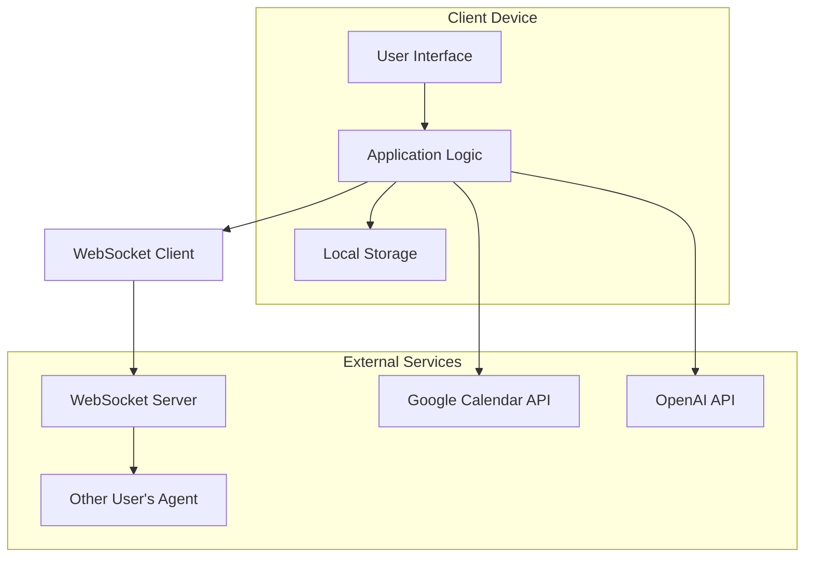

# AI Agent Network - Web Frontend

The AI Agent Network Web Frontend is a privacy-focused application that enables users to create personalized AI assistants capable of communicating with each other to automate scheduling and coordination tasks. This frontend component implements a local-first architecture that keeps all user data on their devices, ensuring maximum privacy and data control.

## Features

- **User Authentication**: Secure login and registration via Firebase Authentication
- **Agent Creation & Configuration**: Create and personalize AI agents with custom preferences
- **Agent-to-Agent Communication**: Transparent, human-readable agent negotiations
- **Calendar Integration**: Seamless integration with Google Calendar for scheduling
- **Local Data Storage**: All user data stored locally with encryption
- **Privacy Controls**: Complete user control over personal data sharing
- **Responsive Design**: Mobile-first interface that works across devices
- **Real-time Updates**: WebSocket-based communication for instant agent interactions

## Architecture

The AI Agent Network frontend implements a **local-first, privacy-centric architecture** with the following key principles:

- **Local-First Data Storage**: All user data, preferences, and agent configurations are stored locally on the user's device using IndexedDB or SQLite with encryption, ensuring maximum privacy.
- **Minimal Server Dependence**: The only server component is a lightweight WebSocket relay for agent-to-agent communication.
- **End-to-End Encryption**: All communication between agents is encrypted end-to-end, ensuring the server cannot read message content.
- **Component-Based UI**: The React-based interface is built with reusable components for consistency and maintainability.
- **State Management**: Zustand provides lightweight global state management with Redux-like patterns.
- **API Integration**: External services (Google Calendar, OpenAI) are accessed directly from the client with appropriate authentication.

## Technology Stack

| Technology | Version | Purpose |
|------------|---------|---------|
| Next.js | 14.0+ | Frontend framework with server-side rendering capabilities |
| React | 18.0+ | UI library for component-based development |
| TypeScript | 5.0+ | Type-safe JavaScript for improved developer experience |
| TailwindCSS | 3.3+ | Utility-first CSS framework for styling |
| Zustand | 4.4+ | State management library |
| React Query | 5.0+ | Data fetching and caching |
| Socket.io-client | 4.7+ | WebSocket client for agent communication |
| IndexedDB | Browser API | Primary local storage for structured data |
| SQLite (via sql.js) | Latest | Local relational database for complex data |
| crypto-js | Latest | Client-side encryption library |
| Firebase JS SDK | 10.0+ | Authentication and security |
| Jest | 29.0+ | Testing framework |
| Playwright | Latest | End-to-end testing |

## Getting Started

### Prerequisites

- Node.js 18.x or higher
- npm 9.x or higher
- Git

### Installation

```bash
# Clone the repository
git clone https://github.com/your-org/ai-agent-network.git
cd ai-agent-network/src/web

# Install dependencies
npm install

# Set up environment variables
cp .env.example .env.local
# Edit .env.local with your configuration

# Start the development server
npm run dev
```

### Environment Variables

Create a `.env.local` file with the following variables:

```env
# Firebase Configuration
NEXT_PUBLIC_FIREBASE_API_KEY=your_firebase_api_key
NEXT_PUBLIC_FIREBASE_AUTH_DOMAIN=your_firebase_auth_domain
NEXT_PUBLIC_FIREBASE_PROJECT_ID=your_firebase_project_id

# Google Calendar API
NEXT_PUBLIC_GOOGLE_CLIENT_ID=your_google_client_id
NEXT_PUBLIC_GOOGLE_API_KEY=your_google_api_key

# OpenAI API
NEXT_PUBLIC_OPENAI_API_KEY=your_openai_api_key

# WebSocket Configuration
NEXT_PUBLIC_WEBSOCKET_URL=your_websocket_server_url
NEXT_PUBLIC_WEBSOCKET_PROTOCOL=wss
```

## Development Workflow

### Project Structure

```text
src/
├── app/                # Next.js app router pages
├── components/         # React components
│   ├── agent/         # Agent-related components
│   ├── auth/          # Authentication components
│   ├── calendar/      # Calendar components
│   ├── common/        # Common UI components
│   ├── connect/       # Agent connection components
│   ├── dashboard/     # Dashboard components
│   └── layout/        # Layout components
├── hooks/             # Custom React hooks
├── lib/               # Utility libraries
│   ├── api/           # API clients
│   ├── calendar/      # Calendar integration
│   ├── constants/     # Application constants
│   ├── storage/       # Local storage implementation
│   ├── types/         # TypeScript type definitions
│   ├── utils/         # Utility functions
│   └── websocket/     # WebSocket implementation
├── services/          # Service layer
├── store/             # Zustand state management
└── styles/            # Global styles
```

### Coding Standards

- Use TypeScript for all new code
- Follow the ESLint configuration for code style
- Write unit tests for all new components and utilities
- Use functional components with hooks instead of class components
- Follow the [React best practices](https://reactjs.org/docs/thinking-in-react.html)

### State Management

The application uses Zustand for global state management:

- `userStore`: Authentication state and user profile
- `agentStore`: Agent configuration and state
- `calendarStore`: Calendar events and availability
- `connectionStore`: Agent connection state
- `preferenceStore`: User preferences and settings

### Git Workflow

1. Create a feature branch from `main`: `git checkout -b feature/your-feature-name`
2. Make your changes and commit with meaningful messages
3. Push your branch and create a pull request
4. Ensure all tests pass and code meets quality standards
5. Request review from team members
6. Merge to `main` after approval

## Key Components

### Agent Chat Interface

The Agent Chat component provides the primary interface for users to interact with their agents. It displays:

- User-to-agent conversation history
- Agent-to-agent communication logs for transparency
- Action buttons for approving, modifying, or declining proposals
- Input field for natural language commands

### WebSocket Communication

The WebSocket client handles agent-to-agent communication:

- Establishes secure WebSocket connections
- Implements end-to-end encryption for messages
- Handles connection errors and reconnection
- Provides message delivery guarantees

### Local Storage

The application implements a comprehensive local storage solution:

- IndexedDB for structured data storage
- SQLite (via sql.js) for complex querying needs
- Encryption of sensitive data with AES-256
- Data schema with versioning and migration support

### Calendar Integration

The Calendar integration provides:

- OAuth-based authentication with Google Calendar
- Local caching of calendar events
- Availability calculation for scheduling
- Event creation and management

## Testing

### Unit Testing

Run unit tests with Jest:

```bash
# Run all unit tests
npm test

# Run tests in watch mode
npm test -- --watch

# Run tests with coverage
npm test -- --coverage
```

### End-to-End Testing

Run end-to-end tests with Playwright:

```bash
# Install Playwright browsers
npx playwright install

# Run all E2E tests
npm run test:e2e

# Run E2E tests in UI mode
npm run test:e2e -- --ui
```

## Building and Deployment

### Build for Production

```bash
# Build the application
npm run build

# Test the production build locally
npm run start
```

### Deployment Options

The frontend can be deployed to:

- **Vercel**: Recommended for Next.js applications
- **Netlify**: Alternative with similar capabilities
- **Self-hosted**: Using Docker or traditional web hosting

## Privacy and Security

The AI Agent Network implements privacy and security by design:

### Data Privacy

- All user data is stored locally on the user's device
- No data is transmitted to servers except when explicitly needed for external service integration
- Users maintain complete control over their data with export/import capabilities

### Security Measures

- End-to-end encryption for all agent-to-agent communication
- AES-256 encryption for sensitive local data
- JWT-based secure authentication
- OAuth with minimal scopes for external services
- Regular security audits and dependency updates

### Data Flow



## Contributing

Contributions to the AI Agent Network are welcome! Please follow these steps:

1. Check the [issues](https://github.com/your-org/ai-agent-network/issues) for open tasks or create a new issue
2. Fork the repository and create a feature branch
3. Make your changes, following the coding standards
4. Add tests for your changes
5. Submit a pull request with a clear description of your changes

Before submitting, please ensure:
- All tests pass
- Code follows the project's style guidelines
- Documentation is updated as needed
- Commit messages are clear and descriptive

## License

This project is licensed under the MIT License - see the LICENSE file for details.

## References

- [Next.js Documentation](https://nextjs.org/docs)
- [React Documentation](https://reactjs.org/docs)
- [TailwindCSS Documentation](https://tailwindcss.com/docs)
- [Firebase Documentation](https://firebase.google.com/docs)
- [Socket.io Documentation](https://socket.io/docs)
- [Google Calendar API](https://developers.google.com/calendar)
- [OpenAI API](https://platform.openai.com/docs)